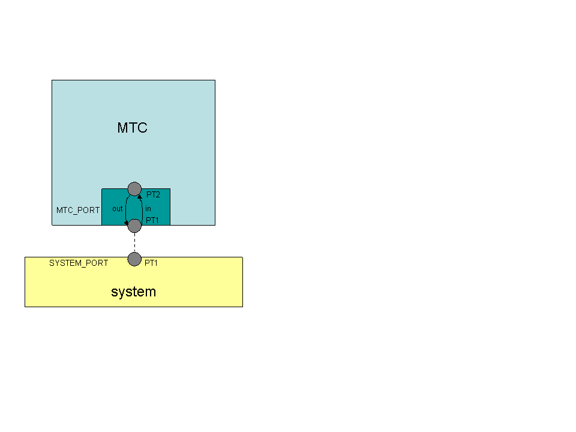

[[ttcn-3-language-extensions]]
= TTCN–3 Language Extensions
:toc:
:table-number: 3

The Test Executor supports the following non-standard additions to TTCN–3 Core Language in order to improve its usability or provide backward compatibility with older versions.

== Syntax Extensions

The compiler does not report an error or warning if the semi-colon is missing at the end of a TTCN–3 definition although the definition does not end with a closing bracket.

The statement block is optional after the guard operations of `altsteps`, `alt` and `interleave` constructs and in the response and exception handling part of `call` statements. A missing statement block has the same meaning as an empty statement block. If the statement block is omitted, a terminating semi-colon must be present after the guard statement.

The standard escape sequences of C/C++ programming languages are recognized and accepted in TTCN–3 character string values, that is, in literal values of `charstring` and `universal` `charstring` types, as well as in the arguments of built-in operations `log()` and `action()`.

NOTE: As a consequence of the extended escape sequences and in contrast with the TTCN–3 standard, the backslash character itself has to be always duplicated within character string values.

The following table summarizes all supported escape sequences of TTCN–3 character string values:

.Character string escape sequences
[cols=",,",options="header",]
|===
|*Escape sequence* |*Character code (decimal)* |*Meaning*
| |7 |bell
| |8 |backspace
| |12 |new page
| |10 |line feed
| |13 |carriage return
| |9 |horizontal tabulator
| 11 |vertical tabulator |
|\ |92 |backslash
|&quot; |34 |quotation mark
|’ |39 |apostrophe
|? |63 |question mark
| <newline> |nothing |line continuation
| |NNN |octal notation (NNN is the character code in at most 3 octal digits)
| |NN |hexadecimal notation (NN is the character code in at most 2 hexadecimal digits)
|"" |34 |quotation mark (standard notation of TTCN–3 )
|===

NOTE: Only the standardized escape sequences are recognized in matching patterns of character string templates because they have special meaning there. For example, inside string patterns `\n` denotes a set of characters rather than a single character.

Although the standard requires that characters of TTCN–3 `charstring` values must be between 0 and 127, TITAN allows characters between 0 and 255. The printable representation of characters with code 128 to 255 is undefined.

The compiler implements an ASN.1-like scoping for TTCN–3 enumerated types, which means it allows the re-use of the enumerated values as identifiers of other definitions. The enumerated values are recognized only in contexts where enumerated values are expected; otherwise the identifiers are treated as simple references. However, using identifiers this way may cause misleading error messages and complicated debugging.

The compiler allows the local definitions (constants, variables, timers) to be placed in the middle of statement blocks, that is, after other behavior statements. The scope of such definitions extends from the statement following the definition to the end of the statement block. Forward-referencing of local definitions and jumping forward across them using `goto` statements are not allowed.

The compiler accepts in-line compound values in the operands of TTCN–3 expressions although the BNF of the standard allows only single values. The only meaningful use of the compound operands is with the comparison operators, that is, == and !=. Two in-line compound values cannot be compared with each other because their types are unknown; at least one operand of the comparison must be a referenced value. This feature has a limitation: In the places where in-line compound templates are otherwise accepted by the syntax (e.g. in the right-hand side of a variable assignment or in the actual parameter of a function call) the referenced value shall be used as the left operand of the comparison. Otherwise the parser gets confused when seeing the comparison operator after the compound value.

Examples:
[source]
----
// invalid since neither of the operands is of known type
if ({ 1, 2 } == { 2, 1 }) { }

// both are valid
while (v_myRecord == { 1, omit }) { }
if ({ f1 :=1, f2 := omit } != v_mySet) {}

// rejected because cannot be parsed
v_myBooleanFlag := { 1, 2, 3 } == v_myRecordOf;
f_myFunctionTakingBoolean({ 1, 2, 3 } != v_mySetOf);

// in reverse order these are allowed
v_myBooleanFlag := v_myRecordOf == { 1, 2, 3 };
f_myFunctionTakingBoolean(v_mySetOf != { 1, 2, 3 });
----

[[visibility-modifiers]]
== Visibility Modifiers

TITAN defines 3 visibility modifiers for module level definitions, and component member definitions: public, private, friend (8.2.5 in <<13-references.adoc#_1, [1]>>).

On module level definitions they mean the following:

* The public modifier means that the definition is visible in every module importing its module.
* The private modifier means that the definition is only visible within the same module.
* The friend modifier means that the definition is only visible within modules that the actual module declared as a friend module.

If no visibility modifier is provided, the default is the public modifier.

In component member definitions they mean the followings:

* The public modifier means that any function/testcase/altstep running on that component can access the member definition directly.
* The private modifier means that only those functions/testcases/altsteps can access the definition which runs on the component type directly. If they run on a component type extending the one containing the definition, it will not be directly visible.

The friend modifier is not available within component types.

Example:
[source]
----
module module1
{
import from module2 all;
import from module3 all;
import from module4 all;

const module2Type akarmi1 := 1; //OK, type is implicitly public
const module2TypePublic akarmi2 := 2; //OK, type is explicitly public
const module2TypeFriend akarmi3 := 3; //OK, module1 is friend of module2
const module2TypePrivate akarmi4 := 4; //NOK, module2TypePrivate is private to module2

const module3Type akarmi5 := 5; //OK, type is implicitly public
const module3TypePublic akarmi6 := 6; //OK, type is explicitly public
const module3TypeFriend akarmi7 := 7; //NOK, module1 is NOT a friend of module3
const module3TypePrivate akarmi8 := 8; //NOK, module2TypePrivate is private to module2

type component User_CT extends Lib4_CT {};
function f_set3_Lib4_1() runs on User_CT { v_Lib4_1 := 0 } //OK
function f_set3_Lib4_2() runs on User_CT { v_Lib4_2 := 0 } //OK
function f_set3_Lib4_3() runs on User_CT { v_Lib4_3 := 0 } //NOK, v_Lib4_3 is private
}

module module2
{

friend module module1;

type integer module2Type;
public type integer module2TypePublic;
friend type integer module2TypeFriend;
private type integer module2TypePrivate;
} // end of module

module module3
{
type integer module3Type;
public type integer module3TypePublic;
friend type integer module3TypeFriend;
private type integer module3TypePrivate;
} // end of module

module module4 {
type component Lib4_CT {
var integer v_Lib4_1;
public var integer v_Lib4_2;
private var integer v_Lib4_3;
}
----

== The `anytype`

The special TTCN-3 type `anytype` is defined as shorthand for the union of all known data types and the address type (if defined) in a TTCN-3 module. This would result in a large amount of code having to be generated for the `anytype`, even if it is not actually used. For performance reasons, Titan only generates this code if a variable of `anytype` is declared or used, and does not create fields in the `anytype` for all data types. Instead, the user has to specify which types are needed as `anytype` fields with an extension attribute at module scope.

Examples:

[source]
----
module elsewhere {
  type float money;
  type charstring greeting;
  }
  module local {
    import from elsewhere all;
    type integer money;
type record MyRec {
  integer i,
  float f
}

control {
  var anytype v_any;
  v_any.integer := 3;
  // ischosen(v_any.integer) == true

 v_any.charstring := "three";
 // ischosen(v_any.charstring) == true

 v_any.greeting := "hello";
 // ischosen(v_any.charstring) == false
 // ischosen(v_any.greeting) == true

 v_any.MyRec := { i := 42, f := 0.5 }
 // ischosen(v_any.MyRec) == true

 v_any.integer := v_any.MyRec.i – 2;
 // back to ischosen(v_any.integer) == true v_any.money := 0;
 // local money i.e. integer
 // not elsewhere.money (float)
 // ischosen(v_any.integer) == false
 // ischosen(v_any.money) == true

 // error: no such field (not added explicitly)
 // v_any.float := 3.1;

 // error: v_any.elsewhere.money
 }
}

with {

extension "anytype integer, charstring" // adds two fields
extension "anytype MyRec" // adds a third field
extension "anytype money" // adds the local money type
//not allowed: extension "anytype elsewhere.money"
extension "anytype greeting" // adds the imported type}
----

In the above example, the `anytype` behaves as a union with five fields named "integer", "charstring", "MyRec", "money" and "greeting". The anytype extension attributes are cumulative; the effect is the same as if a single extension attribute contained all five types.

NOTE: Field "greeting" of type charstring is distinct from the field "charstring" even though they have the same type (same for "integer" and "money").

Types imported from another module (elsewhere) can be added to the anytype of the importing module (local) if the type can be accessed with its unqualified name, which requires that it does not clash with any local type. In the example, the imported type "greeting" can be added to the anytype of module local, but "money" (a float) clashes with the local type "money" (an integer). To use the imported "money", it has to be qualified with its module name, for example a variable of type elsewhere.money can be declared, but elsewhere.money can not be used as an anytype field.

== Ports and Test Configurations

If all instances of a TTCN–3 port type are intended to be used for internal communication only (i.e. between two TTCN–3 test components) the generation and linking of an empty Test Port skeleton can be avoided. If the attribute `with { extension "internal" }` is appended to the port type definition, all C++ code that is needed for this port will be included in the output modules.<<13-references.adoc#_9, [9]>>

If the user wants to use `address` values in `to` and `from` clause and sender redirect of TTCN–3 port operations the `with { extension "address" }` attribute shall be used in the corresponding port type definition(s) to generate proper C++ code.

NOTE: When address is used in port operations the corresponding port must have an active mapping to a port of the test system interface, otherwise the operation will fail at runtime. Using of address values in to and from clauses implicitly means system as component reference. (See section "Support of address type" in <<13-references.adoc#_16, [16]>> for more details).<<13-references.adoc#_10, [10]>>

Unlike the latest TTCN–3 standard, our run time environment allows to connect a TTCN–3 port to more than one ports of the same remote test component. When these connections persist (usually in transient states), only receiving is allowed from that remote test component, because the destination cannot be specified unambiguously in the `to` clause of the `send` operation. Similarly, it is allowed to map a TTCN–3 port to more than one ports of the system, although it is not possible to send messages to the SUT.

[[parameters-of-create-operation]]
== Parameters of create Operation

The built-in TTCN–3 `create` operation can take a second, optional argument in the parentheses. The first argument, which is the part of the standard, can assign a name to the newly created test component. The optional, non-standard second argument specifies the location of the component. Also the second argument is a value or expression of type `charstring`.

According to the standard the component name is a user-defined attribute for a test component, which can be an arbitrary string value containing any kind of characters including whitespace. It is not necessary to assign a unique name for each test component; several active test components can have the same name at the same time. The component name is not an identifier; it cannot be used to address test components in configuration operations as component references can. The name can be assigned only at component creation and it cannot be changed later.

Component name is useful for the following purposes:

* it appears in the printout when logging the corresponding component reference;
* it can be incorporated in the name of the log file (see the metacharacter `%n`);
* it can be used to identify the test component in the configuration file (when specifying test port parameters (see section <<7-the_run-time_configuration_file.adoc#logging, `[LOGGING]`>>), component location constraints (see section <<7-the_run-time_configuration_file.adoc#components-parallel-mode, [COMPONENTS] (Parallel mode)>>) and logging options (see sections <<7-the_run-time_configuration_file.adoc#filemask, `FileMask`>> and <<7-the_run-time_configuration_file.adoc#consolemask, `ConsoleMask`>>).

Specifying the component location is useful when performing distributed test execution. The value used as location must be a host name, a fully qualified domain name, an IP address or the name of a host group defined in the configuration file (see section <<7-the_run-time_configuration_file.adoc#groups-parallel-mode, [GROUPS] (Parallel mode)>>). The explicit specification of the location overrides the location constraints given in the configuration file (see section <<7-the_run-time_configuration_file.adoc#components-parallel-mode, [COMPONENTS] (Parallel mode)>> for detailed description). If no suitable and available host is found the `create` operation fails with a dynamic test case error.

If only the component name is to be specified, the second argument may be omitted. If only the component location is specified a `NotUsedSymbol` shall be given in the place of the component name.

Examples:

[source]
----
//create operation without arguments
var MyCompType v_myCompRef := MyCompType.create;

// component name is assigned
v_myCompRef := MyCompType.create("myCompName");

// component name is calculated dynamically
v_myCompArray[i] := MyCompType.create("myName" & int2str(i));

// both name and location are specified (non-standard notation)
v_myCompRef := MyCompType.create("myName", "heintel");

// only the location is specified (non-standard notation)
v_myCompRef := MyCompType.create(-, "159.107.198.97") alive;
----

== Altsteps and Defaults

According to the TTCN–3 standard an `altstep` can be activated as `default` only if all of its value parameters are `in` parameters. However, our compiler and run-time environment allows the activation of altsteps with `out` or `inout` value or template parameters as well. In this case the actual parameters of the activated `default` shall be the references of variables or template variables that are defined in the respective component type. This restriction is in accordance with the rules of the standard about timer parameters of activated defaults.

NOTE: Passing local variables or timers to defaults is forbidden because the lifespan of local definitions might be shorter than the `default` itself, which might lead to unpredictable behavior if the `default` is called after leaving the statement block that the local variable is defined in. Since ports can be defined only in component types, there is no restriction about the `port` parameters of `altsteps`. These restrictions are not applicable to direct invocations of `altsteps` (e.g. in `alt` constructs).

The compiler allows using a statement block after `altstep` instances within `alt` statements. The statement block is executed if the corresponding `altstep` instance was chosen during the evaluation of the alt statement and the `altstep` has finished without reaching a `repeat` or `stop` statement. This language feature makes the conversion of TTCN–2 test suites easier.

NOTE: This construct is valid according to the TTCN–3 BNF syntax, but its semantics are not mentioned anywhere in the standard text.

The compiler accepts `altsteps` containing only an `[else]` branch. This is not allowed by the BNF as every `altstep` must have at least one regular branch (which can be either a guard statement or an `altstep` instance). This construct is practically useful if the corresponding `altstep` is instantiated as the last branch of the alternative.

== Interleave Statements

The compiler realizes TTCN–3 `interleave` statements using a different approach than it is described in section 7.5 of <<13-references.adoc#_1, [1]>>. The externally visible behavior of the generated code is equivalent to that of the canonical mapping, but our algorithm has the following advantages:

* Loop constructs `for`, `while` and `do-whil`e loops are accepted and supported without any restriction in `interleave` statements. The transformation of statements is done in a lower level than the TTCN–3 language, which does not restrict the embedded loops.
* Statements `activate`, `deactivate` and `stop` can also be used within `interleave`. The execution of these statements is atomic so we did not see the reason why the standard forbids them.
* The size of our generated code is linear in contrast to the exponential code growth of the canonical algorithm. In other words, the C++ equivalent of every embedded statement appears exactly once in the output.
* The run-time realization does not require any extra operating system resources, such as multi-threading.

== Logging Disambiguation

The TTCN–3 log statement provides the means to write logging information to a file or display on console (standard error). Options <<7-the_run-time_configuration_file.adoc#filemask, `FileMask`>> and <<7-the_run-time_configuration_file.adoc#consolemask, `ConsoleMask`>> determine which events will appear in the file and on the console, respectively. The generated logging messages are of type `USER_UNQUALIFIED`.

The `log` statement accepts among others fixed character strings TTCN–3 constants, variables, timers, functions, templates and expressions; for a complete list please refer to the table 18 in <<13-references.adoc#_1, [1]>>. It is allowed to pass multiple arguments to a single `log` statement, separated by commas.

The TTCN-3 standard does not specify how logging information should be presented. The following sections describe how TITAN implemented logging.

The arguments of the TTCN-3 statement `action` are handled according to the same rules as `log`.

=== Literal Free Text String

Strings entered between quotation marks (") <<13-references.adoc#_11, [11]>> and the results of special macros given in section <<ttcn3-macros, TTCN-3 Macros>> in the argument of the `log` statement are verbatim copied to the log. The escape sequences given in Table 4 are interpreted and the resulting non-printable characters (such as newlines, tabulators, etc.) will influence the printout.

Example:

[source]
----
log("foo");//The log printout will look like this:
 12:34:56.123456 foo
 bar
----

=== TTCN-3 Values and Templates

Literal values, referenced values or templates, wildcards, compound values, in-line (modified) templates, etc. (as long as the type of the expression is unambiguous) are discussed in this section.

These values are printed into the log using TTCN-3 Core Language syntax so that the printout can be simply copied into a TTCN-3 module to initialize an appropriate constant/variable/template, etc.

In case of (`universal`) `charstring` values the delimiter quotation marks ("") are printed and the embedded non-printable characters are substituted with the escape sequences in the first 9 rows of Table 4. All other non-printable characters are displayed in the TTCN-3 quadruple notation.

If the argument refers to a constant of type `charstring`, the actual value is not substituted to yield a literal string.

Example:

[source]
----
const charstring c_string := "foo\000";
log(c_string);
//The log printout will look like this:
12:34:56.123456 "foo" & char(0, 0, 0, 0)
----

=== Built-in Function match()

For the built-in `match()` function the printout will contain the detailed matching process field-by-field (similarly to the failed `receive` statements) instead of the Boolean result.

This rule is applied only if the` match()` operation is the top-level expression to be logged, see the example below:

[source]
----
 // this will print the detailed matching process
log(match(v_myvalue, t_template));
 // this will print only a Boolean value (true or false)
log(not not match(v_myvalue, t_template));
----
All the other predefined and user-defined functions with actual arguments will print the return value of the function into the log according to the TTCN-3 standard.

=== Special TTCN-3 Objects

If the argument refers to a TTCN-3 `port`, `timer` or array (slice) of the above, then the actual properties of the TTCN-3 object is printed into the log.

For ports the name and the state of the port is printed.

In case of timers the name of the timer, the default duration, the current state (`inactive`, `started` or `expired`), the actual duration and the elapsed time (if applicable) is printed in a structured form.

== Value Returning done

The compiler allows starting TTCN–3 functions having return type on PTCs. Those functions must have the appropriate `runs on` clause. If such a function terminates normally on the PTC, the returned value can be matched and retrieved in a `done` operation.

According to the TTCN-3 standard, the value redirect in a `done` operation can only be used to store the local verdict on the PTC that executed the behavior function. In TITAN the value redirect can also be used to store the behavior function’s return value with the help of an optional template argument.

If this template argument is present, then the compiler treats it as a value returning done operation, otherwise it is treated as a verdict returning `done`.

The following rules apply to the optional template argument and the value redirect:

* The syntax of the template and value redirect is identical with that of the `receive` operation.
* If the template is present, then the type of the template and the variable used in the value redirect shall be identical. If the template is not present, then the type of the value redirect must be `verdicttype`.
* In case of a value returning done the return type shall be a TTCN–3 type marked with the following attribute: `with { extension "done" }`. It is allowed to mark and use several types in done statements within one test suite. If the type to be used is defined in ASN.1 then a type alias shall be added to one of the TTCN–3 modules with the above attribute.
* In case of a value returning done the type of the template or variable must be visible from the module where the `done` statement is used.
* Only those done statements can have a template or a value redirect that refer to a specific PTC component reference. That is, it is not allowed to use this construct with `any component.done` or `all component.done`.

A value returning `done` statement is successful if all the conditions below are fulfilled:

* The corresponding PTC has terminated.
* The function that was started on the PTC has terminated normally. That is, the PTC was stopped neither by itself nor by other component and no dynamic test case error occurred.
* The return type of the function that was started on the PTC is identical to the type of the template used in the `done` statement.
* The value returned by the function on the PTC matches the given template.

If the `done` operation was successful and the value redirect is present the value returned by the PTC (if there was a matching template), or the local verdict on the PTC (if there was no matching template) is stored in the given variable or variable field.

The returned value can be retrieved from `alive` PTCs, too. In this case the `done` operation always refers to the return value of the lastly started behavior function of the PTC. Starting a new function on the PTC discards the return value of the previous function automatically (i.e. it cannot be retrieved or matched after the start component operation anymore).

Example:

[source]
----
type integer MyReturnType with { extension "done" };

function ptcBehavior() runs on MyCompType return MyReturnType
{
  setverdict(inconc);
  return 123;
}

// value returning ‘done’
testcase myTestCase() runs on AnotherCompType
{
  var MyReturnType myVar;
  var MyCompType ptc := MyCompType.create;
  ptc.start(ptcBehavior());
  ptc.done(MyReturnType : ?) -> value myVar;
  // myVar will contain 123
}

// verdict returning ‘done’
testcase myTestCase2() runs on AnotherCompType
{
  var verdicttype myVar;
  var MyCompType ptc := MyCompType.create;
  ptc.start(ptcBehavior());
  ptc.done -> value myVar;
  // myVar will contain inconc
}
----

== Dynamic Templates

Dynamic templates (template variables, functions returning templates and passing template variables by reference) are now parts of the TTCN–3 Core Language standard (<<13-references.adoc#_1, [1]>>). These constructs have been added to the standard with the same syntax and semantics as they were supported in this Test Executor. Thus dynamic templates are not considered language extensions anymore.

However, there is one extension compared to the supported version of Core Language. Unlike the standard, the compiler and the run-time environment allow the external functions to return templates.

Example:

[source]
----
// this is not valid according to the standard
external function MyExtFunction() return template octetstring;
----

== Template Module Parameters

The compiler accepts template module parameters by inserting an optional "template" keyword into the standard modulepar syntax construct between the modulepar keyword and the type reference. The extended BNF rule:

[source,subs="+quotes"]
ModuleParDef ::= "modulepar" (ModulePar | (“{“MultiTypedModuleParList "}"))ModulePar ::= *["template"]* Type ModuleParList

Example:

[source]
----
modulepar template charstring mp_tstr1 := ( "a" .. "f") ifpresent
modulepar template integer mp_tint := complement (1,2,3)
----

== Predefined Functions

The built-in predefined functions `ispresent`, `ischosen`, `lengthof` and `sizeof` are applicable not only to value-like language elements (constants, variables, etc.), but template-like entities (templates, template variables, template parameters) as well. If the function is allowed to be called on a value of a given type it is also allowed to be called on a template of that type with the meaning described in the following subchapters.

NOTE: "dynamic test case error" does not necessarily denote here an error situation: it may well be a regular outcome of the function.

=== `sizeof`

The function `sizeof` is applicable to templates of `record`, `set`, `record` of, `set` `of` and `objid` types. The function is applicable only if the `sizeof` function gives the same result on all values that match the template.<<13-references.adoc#_12, [12]>> In case of `record of` and `set of` types the length restrictions are also considered. Dynamic test case error occurs if the template can match values with different sizes or the length restriction contradicts the number of elements in the template body.

Examples:

[source]
----
type record of integer R;
type set S { integer f1, bitstring f2 optional, charstring f3 optional }
template R tr_1 := { 1, permutation(2, 3), ? }
template R tr_2 := {1, *, (2, 3) }
template R tr_3 := { 1, *, 10 } length(5)
template R tr_4 := { 1, 2, 3, * } length(1..2)
template S tr_5 := { f1 := (0..99), f2 := omit, f3 := ? }
template S tr_6 := { f3 := *, f1 := 1, f2 := ’00’B ifpresent }
template S tr_7 := ({ f1 := 1, f2 := omit, f3 := "ABC" },
                  { f1 := 2, f3 := omit, f2 := ’1’B })
template S tr_8 := ?

//sizeof(tr_1) → 4
//sizeof(tr_2) → error
//sizeof(tr_3) → 5
//sizeof(tr_4) → error
//sizeof(tr_5) → 2
//sizeof(tr_6) → error
//sizeof(tr_7) → 2
//sizeof(tr_8) → error
----

=== `ispresent`

The predefined function `ispresent` has been extended; its parameter can now be any valid TemplateInstance. It is working according to the following ETSI CRs: http://forge.etsi.org/mantis/view.php?id=5934 and http://forge.etsi.org/mantis/view.php?id=5936.

=== `oct2unichar`

The function `oct2unichar` (`in octetstring invalue`, `in charstring string_encoding := "UTF-8"`) `return universal charstring` converts an octetstring `invalue` to a universal charstring by use of the given `string_encoding`. The octets are interpreted as mandated by the standardized mapping associated with the given `string_encoding` and the resulting characters are appended to the returned value. If the optional `string_encoding` parameter is omitted, the default value "UTF-8".

The following values are allowed as `string_encoding` actual parameters: `UTF8`, `UTF-16`, `UTF-16BE`, `UTF-16LE`, `UTF-32`, `UTF-32BE`, `UTF-32LE`.

DTE occurs if the `invalue` does not conform to UTF standards. The `oct2unichar` checks if the Byte Order Mark (BOM) is present. If not a warning will be appended to the log file. `oct2unichar` will `decode` the invalue even in absence of the BOM.

Any code unit greater than 0x10FFFF is ill-formed.

UTF-32 code units in the range of 0x0000D800 – 0x0000DFFF are ill-formed.

UTF-16 code units in the range of 0xD800 – 0xDFFF are ill-formed.

UTF-8 code units in the range of 0xD800 – 0xDFFF are ill-formed.

Example:
----
oct2unichar('C384C396C39CC3A4C3B6C3BC'O)="ÄÖÜäöü";oct2unichar('00C400D600DC00E400F600FC'O,"UTF-16LE") = "ÄÖÜäöü";
----

=== `unichar2oct`

The function `unichar2oct` (`in universal charstring invalue, in charstring string_encoding := "UTF-8"`) `return octetstring` converts a universal charstring `invalue` to an octetstring. Each octet of the octetstring will contain the octets mandated by mapping the characters of `invalue` using the standardized mapping associated with the given `string_encoding` in the same order as the characters appear in inpar. If the optional `string_encoding` parameter is omitted, the default encoding is "UTF-8".

The following values are allowed as `string_encoding` actual parameters: UTF-8, UTF-8 BOM, UTF-16, UTF-16BE, UTF-16LE, UTF-32, UTF-32BE, UTF-32LE.

The function `unichar2oct` adds the Byte Order Mark (BOM) to the beginning of the `octetstring` in case of `UTF-16` and `UTF-32` encodings. The `remove_bom` function helps to remove it, if it is not needed. The presence of the BOM is expected at the inverse function `oct2unichar` because the coding type (without the BOM) can be detected only in case of `UTF-8` encoded `octetstring`. By default UTF-8 encoding does not add the BOM to the `octetstring`, however `UTF-8` `BOM` encoding can be used to add it.

DTE occurs if the `invalue` does not conform to UTF standards.

Any code unit greater than 0x10FFFF is ill-formed.

Example:

[source]
----
unichar2oct("ÄÖÜäöü") = 'EFBBBFC384C396C39CC3A4C3B6C3BC'O;
unichar2oct("ÄÖÜäöü","UTF-16LE") = 'FFFE00C400D600DC00E400F600FC'O;
----

[[get-stringencoding]]
=== `get_stringencoding`

The function `get_stringencoding (in octetstring encoded_value) return charstring` identifies the encoding of the `encoded_value`. The following return values are allowed as charstring: ASCII, UTF-8, UTF-16BE, UTF-16LE, UTF-32BE, UTF-32LE.

If the type of encoding could not been identified, it returns the value: <unknown>

Example:

[source]
----
var octetstring invalue := 'EFBBBFC384C396C39CC3A4C3B6C3BC'O;
var charstring codingtype := get_stringencoding(invalue);
the resulting codingtype is "UTF-8"
----

[[remove-bom]]
=== `remove_bom`

The function `remove_bom (in octetstring encoded_value) return octetstring` strips the BOM if it is present and returns the original octetstring otherwise.

Example:

[source]
----
var octetstring invalue := 'EFBBBFC384C396C39CC3A4C3B6C3BC'O;
var octetstring nobom := remove_bom(invalue);
the resulting nobom contains: 'C384C396C39CC3A4C3B6C3BC'O;
----

== Additional Predefined Functions

In addition to standardized TTCN–3 predefined functions given in Annex C of <<13-references.adoc#_1, [1]>> and Annex B of <<13-references.adoc#_3, [3]>> the following built-in conversion functions are supported by our compiler and run-time environment:

=== `str2bit`

The function `str2bit (charstring value) return bitstring` converts a `charstring` value to a `bitstring`, where each character represents the value of one bit in the resulting bitstring. Its argument may contain the characters "0" or "1" only, otherwise the result is a dynamic test case error.

NOTE: This function is the reverse of the standardized `bit2str`.

Example:

[source]
str2bit ("1011011100") = ’1011011100’B

=== `str2hex`

The function `str2hex (charstring value)` `return hexstring` converts a `charstring` value to a `hexstring`, where each character in the character string represents the value of one hexadecimal digit in the resulting `hexstring`. The incoming character string may contain any number of characters. A dynamic test case error occurs if one or more characters of the charstring are outside the ranges "0" .. "9", "A" .. "F" and "a" .. "f".

NOTE: This function is the reverse of the standardized `hex2str`.

Example:

[source]
----
str2hex ("1D7") = ’1D7’H
----

=== float2str

The function `float2str (float value) return charstring` converts a `float` value to a `charstring`. If the input is zero or its absolute value is between 10^-4^ and 10^10^, the decimal dot notation is used in the output with 6 digits in the fraction part. Otherwise the exponential notation is used with automatic (at most 6) digits precision in the mantissa.

Example:

[source]
----
float2str (3.14) = "3.140000"
----

=== unichar2char

The function `unichar2char (universal charstring value) return charstring` converts a` universal charstring` value to a `charstring`. The elements of the input string are converted one by one. The function only converts universal characters when the conversion result lies between 0 end 127 (that is, the result is an ISO 646 character).

NOTE: The inverse conversion is implicit, that is, the `charstring` values are converted to `universal charstring` values automatically, without the need for a conversion function.

Example:

[source]
----
unichar2char(char(0,0,0,64)) = "@"
----

=== `log2str`

The function `log2str` can be used to log into `charstring` instead of the log file.

Syntax:

[source]
log2str (…) return charstring

This function can be parameterized in the same way as the `log` function, it returns a charstring value which contains the log string for all the provided parameters, but it does not contain the timestamp, severity and call stack information, thus the output does not depend on the runtime configuration file. The parameters are interpreted the same way as they are in the log function: their string values are identical to what the log statement writes to the log file. The extra information (timestamp, severity, call stack) not included in the output can be obtained by writing external functions which use the runtime’s Logger class to obtain the required data.

=== `testcasename`

The function `testcasename` returns the unqualified name of the actually executing test case. When it is called from the control part and no test case is being executed, it returns the empty string.

Syntax:

[source]
testcasename () return charstring

=== `isbound`

The function `isbound` behaves identically to the `isvalue` function with the following exception: it returns true for a record-of value which contains both initialized and uninitialized elements.

[source]
----
type record of integer rint;
var rint r_u; // uninitialized
isvalue(r_u); // returns false
isbound(r_u); // returns false also
//lengthof(r_u) would cause a dynamic testcase error

var rint r_0 := {} // zero length
isvalue(r_3); // returns true
isbound(r_3); // returns true
lengthof(r_3); // returns 0

var rint r_3 := { 0, -, 2 } // has a "hole"
isvalue(r_3); // returns false
isbound(r_3); // returns true
lengthof(r_3); // returns 3

var rint r_3full := { 0, 1, 2 }
isvalue(r_3full); // returns true
isbound(r_3full); // returns true
lengthof(r_3full); // returns 3
----

The introduction of `isbound` permits TTCN-3 code to distinguish between r_u and r_3; `isvalue` alone cannot do this (it returns false for both).

Syntax:
[source]
isbound (in template any_type i) return boolean;

=== `ttcn2string`

Syntax:
[source]
ttcn2string(in <TemplateInstance> ti) return charstring

This predefined function returns its parameter’s value in a string which is in TTCN-3 syntax. The returned string has legal ttcn-3 with a few exceptions such as unbound values. Unbound values are returned as “-“, which can be used only as fields of assignment or value list notations, but not as top level assignments (e.g. `x:=- is illegal`). Differences between the output format of `ttcn2string()` and `log2str()`:

[cols=",,",options="header",]
|===
|Value/template |`log2str()` |`ttcn2string()`
|Unbound value |`"<unbound>"` |“-“
|Uninitialized template |`"<uninitialized template>"` |“-“
|Enumerated value |`name (number)` |name
|===

=== `string2ttcn`

Syntax:

[source]
string2ttcn(in charstring ttcn_str, inout <reference> ref)

This predefined function does not have a return value, thus it is a statement. Any error in the input string will cause an exception that can be caught using @try - @catch blocks. The message string of the exception contains the exact cause of the error. There might be syntax and semantic errors. This function uses the module parameter parser of the TITAN runtime, it accepts the same syntax as the module parameters of the configuration file. Check the documentation chapters for the module parameters section. There are differences between the ttcn-3 syntax and the configuration file module parameters syntax, these are described in the documentation chapter of the module parameters. The second parameter must be a reference to a value or template variable.

Example code:

[source]
----
type record MyRecord { integer a, boolean b }
…
var template MyRecord my_rec
@try {
  string2ttcn("complement ({1,?},{(1,2,3),false}) ifpresent", my_rec)
  log(my_rec)
  }
  @catch (err_str) {
    log(“string2ttcn() failed: “, err_str)
  }

The log output will look like this:
complement ({ a := 1, b := ? }, { a := (1, 2, 3), b := false }) ifpresent
----

[[encode-base64]]
=== `encode_base64`

Syntax:

[source]
----
encode_base64(in octetstring ostr, in boolean
  use_linebreaks := false) return charstring
----

The function `encode_base64 (in octetstring ostr, in boolean use_linebreaks := false) return charstring `converts an octetstring `ostr` to a charstring. The charstring will contain the Base64 representation of `ostr`. The `use_linebreaks` parameter adds newlines after every 76 output characters, according to the MIME specs, if it is omitted, the default value is false.

Example:

[source]
----
encode_base64('42617365363420656E636F64696E6720736368656D65'O) ==
"QmFzZTY0IGVuY29kaW5nIHNjaGVtZQ=="
----

[[decode-base64]]
=== `decode_base64`

Syntax:

[source]
----
decode_base64(in charstring str) return octetstring
----

The function `decode_base64 (in charstring str) return octetstring` converts a chartstring `str` encoded in Base64 to an octetrstring. The octetstring will contain the decoded Base64 string of `str`.

Example:

[source]
----
decode_base64("QmFzZTY0IGVuY29kaW5nIHNjaGVtZQ==") ==
'42617365363420656E636F64696E6720736368656D65'O
----

=== `json2cbor`

Syntax:

[source]
----
json2cbor(in universal charstring us) return octetstring
----

The function `json2cbor(in universal charstring us) return octetstring` converts a TITAN encoded json document into the binary representation of that json document using a binary coding called CBOR. The encoding follows the recommendations written in the CBOR standard <<13-references.adoc#_22, [22]>> section 4.2.

Example:

[source]
----
json2cbor("{"a":1,"b":2}") == ‘A2616101616202’O
----

=== `cbor2json`

Syntax:
[source]
----
cbor2json(in octetstring os) return universal charstring
----

The function `cbor2json(in octetstring os) return universal charstring` converts a CBOR encoded bytestream into a json document which can be decoded using the built in JSON decoder. The decoding follows the recommendations written in the CBOR standard <<13-references.adoc#_22, [22]>> section 4.1 except that the indefinite-length items are not made definite before conversion and the decoding of indefinite-length items is not supported.

Example:
[source]
----
cbor2json(‘A2616101616202’O) == "{"a":1,"b":2}"
----

=== `json2bson`

Syntax:
[source]
----
json2bson(in universal charstring us) return octetstring
----

The function `json2bson(in universal charstring us) return octetstring` converts a TITAN encoded json document into the binary representation of that json document using a binary coding called BSON. Only top level json objects and arrays can be encoded. (Note that an encoded top level json array will be decoded as a json object) The encoding follows the rules written in the BSON standard <<13-references.adoc#_23, [23]>>. The encoding handles the extension rules written in the MongoDB Extended JSON document <<13-references.adoc#_24, [24]>>. The encoding of 128-bit float values is not supported.

Example:
[source]
----
json2bson("{"a":1,"b":2}") == ‘13000000106100010000001062000200000000’O
----

=== `bson2json`

Syntax:
[source]
----
bson2json(in octetstring os) return universal charstring
----

The function `bson2json(in octetstring os) return universal charstring` converts a BSON encoded bytestream into a json document which can be decoded using the built in JSON decoder. The decoding follows the extension rules written in the BSON standard <<13-references.adoc#_23, [23]>>. The decoding handles the rules written in the MongoDB Extended JSON document <<13-references.adoc#_24, [24]>>. The decoding of 128-bit float values is not supported.

Example:
[source]
----
bson2json(‘13000000106100010000001062000200000000’O) == "{"a":1,"b":2}"
----

== Exclusive Boundaries in Range Subtypes

The boundary values used to specify range subtypes can be preceded by an exclamation mark. By using the exclamation mark the boundary value itself can be excluded from the specified range. For example integer range (!0..!10) is equivalent to range (1..9). In case of float type open intervals can be specified by using excluded boundaries, for example (0.0..!1.0) is an interval which contains 0.0 but does not contain 1.0.

[[special-float-values-infinity-and-not-a-number]]
== Special Float Values Infinity and not_a_number

The keyword infinity (which is also used to specify value range and size limits) can be used to specify the special float values –infinity and +infinity, these are equivalent to MINUS-INFINITY and PLUS-INFINITY used in ASN.1. A new keyword not_a_number has been introduced which is equivalent to NOT-A-NUMBER used in ASN.1. The -infinity and +infinity and not_a_number special values can be used in arithmetic operations. If an arithmetic operation’s operand is not_a_number then the result of the operation will also be not_a_number. The special value not_a_number cannot be used in a float range subtype because it’s an unordered value, but can be added as a single value, for example subtype (0.0 .. infinity, not_a_number) contains all positive float values and the not_a_number value.

[[ttcn-3-preprocessing]]
== TTCN–3 Preprocessing

Preprocessing of the TTCN-3 files with a C preprocessor is supported by the compiler. External preprocessing is used: the Makefile Generator generates a `Makefile` which will invoke the C preprocessor to preprocess the TTCN-3 files with the suffix `."ttcnpp`. The output of the C preprocessor will be generated to an intermediate file with the suffix `."ttcn`. The intermediate files contain the TTCN-3 source code and line markers. The compiler can process these line markers along with TTCN-3. If the preprocessing is done with the `-P` option <<13-references.adoc#_13, [13]>>, the resulting code will not contain line markers; it will be compatible with any standard TTCN-3 compiler. The compiler will use the line markers to give almost <<13-references.adoc#_14, [14]>> correct error or warning messages, which will point to the original locations in the `.ttcnpp` file. The C preprocessor directive `#"include` can be used in .ttcnpp files; the Makefile Generator will treat all files with suffix `."ttcnin` as TTCN-3 include files. The `."ttcnin` files will be added to the Makefile as special TTCN-3 include files which will not be translated by the compiler, but will be checked for modification when building the test suite.

Extract from the file:
[source]
----
Example.ttcnpp:
module Example {
function func()
{
#ifdef DEBUG
log("Example: DEBUG");
#else
log("Example: RELEASE");
#endif

}

…
----

The output is a preprocessed intermediate file `Example.ttcn`. The resulting output from the above code:
[source]
----
…
# 1 "Example.ttcnpp"
module Example {
function func()
{
log("Example: RELEASE");
}
----

The line marker (`# 1 "Example.ttcnpp"`) tells the compiler what the origin of the succeeding code is.

== Parameter List Extensions

In addition to standardized TTCN-3 parameter handling described in 5.4.2 of <<13-references.adoc#_1, [1]>> TITAN also supports the mixing of list notation and assignment notation in an actual parameter list.

=== Missing Named and Unnamed Actual Parameters

To facilitate handling of long actual parameter lists in the TITAN implementation, the actual parameter list consists of two optional parts: an unnamed part followed by a named part, in this order. In the actual parameter list a value must be assigned to every mandatory formal parameter either in the named part or in the unnamed part. (Mandatory parameter is one without default value assigned in the formal parameter list.) Consequently, the unnamed part, the named part or both may be omitted from the actual parameter list. Omitting the named part from the actual parameter lists provides backward compatibility with the standard notation.

The named and unnamed parts are separated by a comma as are the elements within both lists. It is not allowed to assign value to a given formal parameter in both the named and the unnamed part of the actual parameter list.

There can be at most one unnamed part, followed by at most one named part. Consequently, an unnamed actual parameter may not follow a named parameter.

Named actual parameters must follow the same relative order as the formal parameters. It is not allowed to specify named actual parameters in an arbitrary order.

Examples

The resulting parameter values are indicated in brackets in the comments:

[source]
----
function myFunction(integer p_par1, boolean p_par2 := true) { … }
control {
*// the actual parameter list is syntactically correct below:*
myFunction(1, p_par2 := false); // (1, false)
myFunction(2); // (2, true)
myFunction(p_par1 := 3, p_par2 := false); // (3, false)
*// the actual parameter list is syntactically erroneous below:*
myFunction(0, true, -); // too many parameters
myFunction(1, p_par1 := 1); // p_par1 is given twice
myFunction(); // no value is assigned to mandatory p_par1
myFunction(p_par2 := false, p_par1 := 3); // out of order
myFunction(p_par2 := false, 1); // unnamed part cannot follow
// named part
}
----

== `function`, `altstep` and `testcase` References

Although TITAN supports the behaviour type package (<<13-references.adoc#_5, [5]>>) of the TTCN-3 standard, but this feature was included in the standard with a different syntax.

It is allowed to create TTCN–3 types of `functions`, `altsteps` and `testcases`. Values, for example variables, of such types can carry references to the respective TTCN–3 definitions. To facilitate reference using, three new operations (`refers`, `derefers` and `apply`) were introduced. This new language feature allows to create generic algorithms inTTCN–3 with late binding, (i.e. code in which the function to be executed is specified only at runtime).

[[function-types-with-a-runson-self-clause]]
== Function Types with a RunsOn_self Clause

A function type or an altstep type, defined with a standard `runs on` clause, can use all constants, variables, timers and ports given in the component type definition referenced by the `runs on` clause (see chapter 16 of <<13-references.adoc#_1, [1]>>).

A function type or an altstep type, defined with the TITAN-introduced `runs on self` clause, similarly, makes use of the resources of a component type; however, the component type in question is not given in advance. When an altstep or a function is called via a function variable, that is, a reference, using the `apply` operation, it can use the resources defined by the component type indicated in the `runs on` clause of the actually referenced function or altstep.

The "runs on self" construct is permitted only for `function` and `altstep` types. Any actual function or altstep must refer to a given component type name in their `runs on` clause.

A variable with type of function type is called a *function variable*. Such variables can contain references to functions or altsteps. At function variable assignment, component type compatibility checking is performed with respect to the component context of the assignment statement and the "runs on" clause of the assigned function or altstep. When the `apply()` operator is applied to a function variable, no compatibility checking is performed.

The rationale for this distinction is the following: due to type compatibility checking at the time of value assignment to the function variable, the TTCN-3 environment can be sure that any non-`null` value of the variable is a function reference that is component-type-compatible with that component that is actually executing the code using the `apply()` operator.

As a consequence of this, it is forbidden to use values of function variables as arguments to the TTCN-3 operators `start()` or `send()`.

Example of using the clause `runs on self` in a library

A component type may be defined as an extension of another component type (using the standard `extends` keyword mentioned in chapter 6.2.10.2 of <<13-references.adoc#_1, [1]>>). The effect of this definition is that the extended component type will implicitly contain all constant, variable, port and timer definitions from the parent type as well. In the example below, the component type `User_CT` aggregates its own constant, variable, port and timer definitions (resources) with those defined in the component type `Library_CT` (see line a).

The library developer writes a set of library functions that have a `runs on Library_CT` clause (see line h). Such library functions may offer optional references to other functions that are supposed to be specified by the user of the library (see line e). We say in this case that the library function may call user-provided *callback functions* via function variables. These function variables must have a type specified; optionally with a runs on clause. If this `runs on` clause refers to an actual component type name, then this actual type name must be known at the time of writing the library.

Library functions that runs on `Library_CT` can run on other component types as well, provided that the actual component type is compatible with `Library_CT` (see chapter 6.3.3 of <<13-references.adoc#_1, [1]>>). An obvious design goal for the library writer is to permit references to any callback function that has a component-type-compatible `runs on` clause. However, the cardinality of compatible component types is infinitely large; therefore, they *cannot* be explicitly referenced by the function type definitions of the library.

The "runs on self" concept provides a remedy for this contradiction and allows conceiving library components prepared to take up user-written "plug-ins".

In the code excerpt below, function `f_LibraryFunction` (which has the clause `runs on Library_CT`) uses the function reference variable `v_callBackRef_self` (defined in `Library_CT`).The function `f_MyCallbackFunction` (see line b) has a `runs on User_CT` clause. `User_CT` (see line a) extends `Library_CT`, therefore it is suitable for running library function with runs on `Library_CT` clause, for example.

When the assignment to the function variable `v_CallbackRef_self` is performed (see line c) inside `f_MyUserFunction` (that is, inside the context `User_CT`), then compatibility checking is performed. Since `User_CT` is compatible with `Library_CT`, the assignment is allowed.

Direct call to `f_MyCallbackFunction()` with `runs on User_CT` from a `runs on Library_CT` context (see line g) would cause semantic error according to the TTCN3 language. However, calling the function via `v_CallBackRef_self` is allowed (see line d).

[source]
----
module RunsOn_Self
{
//=========================================================================
// Function Types
//=========================================================================

//---- line f)
type function CallbackFunctionRefRunsonSelf_FT () runs on self;

//=========================================================================
//Component Types
//=========================================================================
type component Library_CT
{
//---- line e)
  var CallbackFunctionRefRunsonSelf_FT v_CallbackRef_self := null;
  var integer v_Lib;
}
//---- line a)
type component User_CT extends Library_CT
{
  var integer v_User;
}

//---- line h)
function f_LibraryFunction () runs on Library_CT
{
//---- line g)
  // Direct call of the callback function would cause semantic ERROR
//f_MyCallbackFunction();

  if (v_CallbackRef_self != null)
  {
    // Calling a function via reference that has a "runs on self" in its header
    // is always allowed with the exception of functions/altsteps without runs
    // on clause
//---- line d)
    v_CallbackRef_self.apply();
  }
}// end f_LibraryFunction

function f_MyUserFunction () runs on User_CT
{
  // This is allowed as f_MyCallbackFunction has runs on clause compatible
  // with the runs on clause of this function (f_MyUserFunction)
  // The use of function/altstep references with "runs on self" in their
  // headers is limited to call them on the given component instance; i.e.
  // allowed: assignments, parameterization and activate (the actual function's
  //          runs on is compared to the runs on of the function in which
  //          the operation is executed)
  // not allowed: start, sending and receiving
  // no check is needed for apply!
//---- line c)
  v_CallbackRef_self := refers (f_MyCallbackFunction);

  // This is allowed as Library_CT is a parent of User_CT
  // Pls. note, as the function is executing on a User_CT
  // instance, it shall never cause a problem of calling
  // a callback function with "runs on User_CT" from it.
  f_LibraryFunction();

}//end f_MyUserFunction

//---- line b)
function f_MyCallbackFunction () runs on User_CT
{/*application/dependent behaviour*/}

} // end of module RunsOn_Self
----

[[ttcn3-macros]]
== TTCN–3 Macros

The compiler and the run-time environment support the following non-standard macro notation in TTCN–3 modules. All TTCN–3 macros consist of a percent (%) character followed by the macro identifier. Macro identifiers are case sensitive. The table below summarizes the available macros and their meaning. Macro identifiers not listed here are reserved for future extension.

.TTCN-3 macros
[cols=",",options="header",]
|===
|Macro |Meaning
|`%moduleId` |name of the TTCN–3 module
|`%definitionId` |name of the top-level TTCN–3 definition
|`%testcaseId` |name of the test case that is currently being executed
|`%fileName` |name of the TTCN–3 source file
|`%lineNumber` |number of line in the source file
|===

The following rules apply to macros:

* All macros are substituted with a value of type `charstring`. They can be used as operands of complex expressions (concatenation, comparison, etc.).
* All macros except `%testcaseId` are evaluated during compilation and they can be used anywhere in the TTCN–3 module.
* Macro `%testcaseId` is evaluated at runtime. It can be used only within functions and altsteps that are being run on test components (on the MTC or PTCs) and within testcases. It is not allowed to use macro `%testcaseId` in the module control part. If a function or altstep that contains macro `%testcaseId` is called directly from the control part the evaluation of the macro results in a dynamic test case error.
* The result of macro `%testcaseId` is not a constant thus it cannot be used in the value of TTCN–3 constants. It is allowed only in those contexts where TTCN–3 variable references are permitted.
* Macro `%definitionId` is always substituted with the name of the top-level module definition that it is used in. <<13-references.adoc#_15, [15]>> For instance, if the macro appears in a constant that is defined within a function then the macro will be substituted with the function’s name rather than the one of the constant. When used within the control part macro `%definitionId` is substituted with the word "`control`".
* Macro `%fileName` is substituted with the name of the source file in the same form as it was passed to the compiler. This can be a simple file name, a relative or an absolute path name.
* The result of macro `%lineNumber` is always a string that contains the current line number as a decimal number. Numbering of lines starts from 1. All lines of the input file (including comments and empty lines) are counted. When it needs to be used in an integer expression a conversion is necessary: `str2int(%lineNumber)`. The above expression is evaluated during compilation without any runtime performance penalty.
* Source line markers are considered when evaluating macros `%fileName` and `%lineNumber`. In preprocessed TTCN–3 modules the macros are substituted with the original file name and line number that the macro comes from provided that the preprocessor supports it.
* When macros are used in `log()` statements, they are treated like literal strings rather than charstring value references. That is, quotation marks around the strings are not used and special characters within them are not escaped in the log file.
* For compatibility with the C preprocessor the compiler also recognizes the following C style macros: \\__FILE__ is identical to `%fileName` and \\__LINE__ is identical to `str2int(%lineNumber)`.
* Macros are not substituted within quotation marks (i.e. within string literals and attributes).
* The full power of TTCN–3 macros can be exploited in combination with the C preprocessor.

Example:
[source]
----
module M {
// the value of c_MyConst will be "M"
const charstring c_MyConst := %moduleId;
// MyTemplate will contain 28
template integer t_MyTemplateWithVeryLongName := lengthof(%definitionId);
function f_MyFunction() {
// the value of c_MyLocalConst1 will be "f_MyFunction"
const charstring c_MyLocalConst1 := %definitionId;
// the value of c_MyLocalConst2 will be "%definitionId"
const charstring c_MyLocalConst2 := "%definitionId";
// the value of c_MyLocalConst3 will be "12"
const charstring c_MyLocalConst3 := %lineNumber; //This is line 12
// the value of c_MyLocalConst4 will be 14
const integer c_MyLocalConst4 := str2int(%lineNumber);//This is line 14
// the line below is invalid because %testcaseId is not a constant
const charstring c_MyInvalidConst := %testcaseId;
// this is valid, of course
var charstring v_MyLocalVar := %testcaseId;
// the two log commands below give different output in the log file
log("function:", %definitionId, " testcase: “, %testcaseId);
// printout: function: f_MyFunction testcase: tc_MyTestcase
log("function:", c_MyLocalConst1, " testcase: “, v_MyLocalVar);
// printout: function: "f_MyFunction" testcase: "tc_MyTestcase"
}
}
----

== Component Type Compatibility

The ETSI standard defines type compatibility of component types for component reference values and for functions with "`runs on`" clause. In order to be compatible, both component types are required to have identical definitions (cf. <<13-references.adoc#_1, [1]>>, chapter 6.3.3).

NOTE: Compatibility is an asymmetric relation, if component type B is compatible with component type A, the opposite is not necessarily true. (E.g., component type B may contain definitions absent in component type A.)

All definitions from the parent type are implicitly contained when the keyword `extends` appears in the type definition (cf. <<13-references.adoc#_1, [1]>>, chapter 6.2.10.2) and so the required identity of the type definitions is ensured. The compiler considers component type B to be compatible with A if B has an `extends` clause, which contains A or a component type that is compatible with A.

Example:
[source]
----
type component A { var integer i; }
type component B extends A {
// extra definitions may be added here
}
----

In order to provide support for existing TTCN–3 code (e.g. standardized test suites) it is allowed to explicitly signal the compatibility relation between component types using a special `extension` attribute. Using such attributes shall be avoided in newly written TTCN–3 modules. Combining component type inheritance and the attribute `extension` is possible, but not recommended.

Thus, the compiler considers component type B to be compatible with A if B has an `extension` attribute that points to A as base component type and all definitions of A are present and identical in B.

[source]
----
type component A { var integer i; }
type component B {
var integer i; // definitions of A must be repeated
var octetstring o; // new definitions may be added
} with {
extension "extends A"
}
----

=== Implementation Restrictions

The list of definitions shared with different compatible component types shall be distinct. If component type Z is compatible with both X and Y and neither X is compatible with Y nor Y is compatible with X then X and Y shall not have definitions with identical names but different origin. If both X and Y are compatible with component type C then all definitions in X and Y which are originated from C are inherited by Z on two paths.

Example: According to the standard component type Z should be compatible with both X and Y, but the compatibility relation cannot be established because X and Y have a definition with the same name.

[source]
----
type component X { timer T1, T2; }
type component Y { timer T1, T3; }
type component Z { timer T1, T2, T3; }
with { extension "extends X, Y" }
// invalid because the origin of T1 is ambiguous
----

The situation can be resolved by introducing common ancestor C for X and Y, which holds the shared definition.

[source]
----
type component C { timer T1; }
type component X { timer T1, T2; } with { extension "extends C" }
type component Y { timer T1, T3; } with { extension "extends C" }
type component Z {
timer T1, // origin is C
T2, // origin is X
T3; // origin is Y
} with { extension "extends X, Y" }
----

Circular compatibility chains between component types are not allowed. If two component types need to be defined as identical, type aliasing must be used instead of compatibility.

The following code is invalid:

[source]
----
type component A {
…
// the same definitions as in B
} with { extension "extends B" }
type component B {
…
// the same definitions as in A
} with { extension "extends A" }
----

When using the non-standard extension attribute the initial values of the corresponding definitions of compatible components should be identical. The compiler does not enforce this for all cases; however, in the case of different initial values the resulting run-time behavior is undefined. If the initial values cannot be determined at compile time (module parameters) the compiler will remain silent. In other situations the compiler may report an error or a warning.

All component types are compatible with each empty component type. Empty components are components which have neither own nor inherited definitions.

== Implicit Message Encoding

The TTCN–3 standard <<13-references.adoc#_1, [1]>> does not specify a standard way of data encoding/decoding. TITAN has a common C\++ API for encoding/decoding; to use this API external functions are usually needed. The common solution is to define a TTCN–3 external function and write the C++ code containing the API calls. In most cases the C++ code explicitly written to an auxiliary C++ file contains only simple code patterns which call the encoding/decoding API functions on the specified data. In TITAN there is a TTCN–3 language extension which automatically generates such external functions.

Based on this automatic encoding/decoding mechanism, dual-faced ports are introduced. Dual-faced ports have an external and an internal interface and can automatically transform messages passed through them based on mapping rules defined in TTCN–3 source files. These dual-faced ports eliminate the need for simple port mapping components and thus simplify the test configuration.

[[dual-faced-ports]]
=== Dual-faced Ports

In the TTCN–3 standard (<<13-references.adoc#_1, [1]>>), a port type is defined by listing the allowed incoming and outgoing message types. Dual-faced ports have on the other hand two different message lists: one for the external and one for the internal interface. External and internal interfaces are given in two distinct port type definitions. The dual-faced concept is applicable to message based ports and the message based part of mixed ports.

Dual-faced port types must have `user` attribute to designate its external interface. The internal interface is given by the port type itself. A port type can be the external interface of several different dual-faced port types.

The internal interface is involved in communication operations (`send`, `receive`, etc.) and the external interface is used when transferring messages to/from other test components or the system under test. The operations `connect` and `map` applied on dual-faced ports will consider the external port type when checking the consistency of the connection or mapping.<<13-references.adoc#_16, [16]>>

==== Dual-faced Ports between Test Components

Dual-faced ports used for internal communication must have the attributes `internal` in addition to `user` (see section <<visibility-modifiers, Visibility Modifiers>>). The referenced port type describing the external interface may have any attributes.

==== Dual-faced Ports between Test Components and the SUT

The port type used as external interface must have the attribute `provider`. These dual-faced port types do not have their own test port; instead, they use the test port belonging to the external interface when communicating to SUT. Using the attribute `provider` implies changes in the Test Port API of the external interface. For details see the section "Provider port types" in <<13-references.adoc#_16, [16]>>.

If there are several entities within the SUT to be addressed, the dual-faced port type must have the attribute `address` in addition to `user`. In this case the external interface must have the attribute `address` too. For more details see section <<visibility-modifiers, Visibility Modifiers>>.

=== Type Mapping

Mapping is required between the internal and external interfaces of the dual-faced ports because the two faces are specified in different port type definitions, thus, enabling different sets of messages.

Messages passing through dual-faced ports will be transformed based on the mapping rules. Mapping rules must be specified for the outgoing and incoming directions separately. These rules are defined in the attribute `user` of the dual-faced port type.

An outgoing mapping is applied when a `send` operation is performed on the dual-faced port. The outcome of the mapping will be transmitted to the destination test component or SUT. The outgoing mappings transform each outgoing message of the internal interface to the outgoing messages of the external interface.

An incoming mapping is applied when a message arrives on a dual-faced port from a test component or the SUT. The outcome of the mapping will be inserted into the port queue and it will be extracted by the `receive` operation. The incoming mappings transform each incoming messages of the external interface to the incoming message of the internal interface.

==== Mapping Rules

A mapping rule is an elementary transformation step applied on a message type (source type) resulting in another message type (target type). Source type and target type are not necessarily different.

Mapping rules are applied locally in both directions, thus, an error caused by a mapping rule affects the test component owning the dual-faced port, not its communication partner.

Mappings are given for each source type separately. Several mapping targets may belong to the same source type; if this is the case, all targets must be listed immediately after each other (without repeating the source type).

The following transformation rules may apply to the automatic conversion between the messages of the external and internal interfaces of a dual-faced port:

* No conversion. Applicable to any message type, this is a type preserving mapping, no value conversion is performed. Source and target types must be identical. This mapping does not have any options. For example, control or status indication massages may transparently be conveyed between the external and the internal interfaces.Keyword used in attribute `user` of port type definition: `simple`.
* Message discarding. This rule means that messages of the given source type will not be forwarded to the opposite interface. Thus, there is no destination type, which must be indicated by the not used symbol (-). This mapping does not have any options. For example, incoming status indication massages of the external interface may be omitted on the internal interface. Keyword used in attribute `user` of port type definition: `discard`.
* Conversion using the built-in codecs. Here, a corresponding encoding or decoding subroutine of the built-in codecs (for example RAW, TEXT or BER) is invoked. The conversion and error handling options are specified with the same syntax as used for the encoding/decoding functions, see section <<attribute-syntax, Attribute Syntax>>. Here, source type corresponds to input type and target type corresponds to output type of the encoding. Keyword used in attribute `user` of port type definition: `encode` or `decode`; either followed by an optional `errorbehavior`.
* Function or external function. The transformation rule may be described by an (external) function referenced by the mapping. The function must have the attribute `extension` specifying one of the prototypes given in section <<encoder-decoder-function-prototypes, Encoder/decoder Function Prototypes>>. The incoming and the outgoing type of the function must be equal to the source and target type of the mapping, respectively. The function may be written in TTCN-3, C++ or generated automatically by the compiler. This mapping does not have any options. Keyword used in attribute `user` of port type definition: `function`.

==== Mapping with One Target

Generally speaking, a source type may have one or more targets. Every mapping target can be used alone. However, only one target can be designated with the following rules if

* no conversion takes place (keyword `simple`);
* encoding a structured message (keyword `encode`) <<13-references.adoc#_17, [17]>>;
* an (external) function with prototype `convert` or `fast` is invoked

==== Mapping with More Targets

On the other hand, more than one target is needed, when the type of an encoded message must be reconstructed. An octetstring, for example, can be decoded to a value of more than one structured PDU type. It is not necessary to specify mutually exclusive decoder rules. It is possible and useful to define a catch-all rule at the end to handle invalid messages.

The following rules may be used with more than one target if

* an (external) function with prototype `backtrack` is invoked;
* decoding a structured message (keyword `decode`);
* (as a last alternative) the source message is `discarded`

The conversion rules are tried in the same order as given in the attribute until one of them succeeds, that is, the function returns `0 OK` or decoding is completed without any error. The outcome of the successful conversion will be the mapped result of the source message. If all conversion rules fail and the last alternative is `discard`, then the source message is discarded. Otherwise dynamic test case error occurs.

==== Mapping from Sliding Buffer

Using sliding buffers is necessary for example, if a stream-based transport, like TCP, is carrying the messages. A stream-based transport is destroying message boundaries: a message may be torn apart or subsequent messages may stick together.

The following rules may be used with more than one target when there is a sliding buffer on the source side if

* an (external) function with prototype `sliding` is invoked;
* decoding a structured message (keyword `decode`)

Above rules imply that the source type of this mapping be either `octetstring` or `charstring`. The run-time environment maintains a separate buffer for each connection of the dual-faced port. Whenever data arrives to the buffer, the conversion rules are applied on the buffer in the same order as given in the attribute. If one of the rules succeeds (that is, the function returns `0` or decoding is completed without any error) the outcome of the conversion will appear on the destination side. If the buffer still contains data after successful decoding, the conversion is attempted again to get the next message.If one of the rules indicates that the data in the buffer is insufficient to get an entire message (the function returns `2 INCOMPLETE_MESSAGE` or decoding fails with error code `ET_INCOMPL_MSG`), then the decoding is interrupted until the next fragment arrives in the buffer.If all conversion rules fail (the function returns `1 NOT_MY_TYPE` or decoding fails with any other error code than `ET_INCOMPL_MSG`), dynamic test case error occurs.

[[encoder-decoder-function-prototypes]]
=== Encoder/decoder Function Prototypes

Encoder/decoder functions are used to convert between different data (message) structures. We can consider e.g. an octet string received from the remote system that should be passed to the upper layer as a TCP message.

Prototypes are attributes governing data input/output rules and conversion result indication. In other words, prototypes are setting the data interface types. The compiler will verify that the parameters and return value correspond to the given prototype. Any TTCN–3 function (even external ones) may be defined with a prototype. There are four prototypes defined as follows:

* prototype `convert`
+
Functions of this prototype have one parameter (i.e. the data to be converted), which shall be an `in` value parameter, and the result is obtained in the return value of the function.
+
Example:
[source]
----
external function f_convert(in A param_ex) return B
with { extension "prototype(convert)" }
----
+
The input data received in the parameter `param_ex` of type A is converted. The result returned is of type B.

* prototype `fast`
+
Functions of this prototype have one input parameter (the same as above) but the result is obtained in an `out` value parameter rather than in return value. Hence, a faster operation is possible as there is no need to copy the result if the target variable is passed to the function. The order of the parameters is fixed: the first one is always the input parameter and the last one is the output parameter.
+
Example:
[source]
----
external function f_fast(in A param_1, out B param_2)
with { extension "prototype(fast)" }
----
+
The input data received in the parameter `param_1` of type A is converted. The resulting data of type B is contained in the output parameter `param_2` of type B.

* prototype `backtrack`
+
Functions of this prototype have the same data input/output structure as of prototype `fast`, but there is an additional integer value returned to indicate success or failure of the conversion process. In case of conversion failure the contents of the output parameter is undefined. These functions can only be used for decoding. The following return values are defined to indicate the outcome of the decoding operation:
+
--
** 0 (`OK`). Decoding was successful; the result is stored in the out parameter.

** 1 (`NOT_MY_TYPE`). Decoding was unsuccessful because the input parameter does not contain a valid message of type `B`. The content of the out parameter is undefined.
--
+
Example:
[source]
----
external function f_backtrack(in A param_1, out B param_2) return integer
with { extension "prototype(backtrack)" }
----

The input data received in the parameter `param_1` of type A is converted. The resulting data of type B is contained in the output parameter `param_2` of type B. The function return value (an integer) indicates success or failure of the conversion process.

* prototype `sliding`
+
Functions of this prototype have the same behavior as the one of prototype backtrack, consequently, these functions can only be used for decoding. The difference is that there is no need for the input parameter to contain exactly one message: it may contain a fragment of a message or several concatenated messages stored in a FIFO buffer. The first parameter of the function is an `inout` value parameter, which is a reference to a buffer of type `octetstring` or `charstring`. The function attempts to recognize an entire message. It if succeeds, the message is removed from the beginning of the FIFO buffer, hence the name of this prototype: sliding (buffer). In case of failure the contents of the buffer remains unchanged. The return value indicates success or failure of the conversion process or insufficiency of input data as follows:
+
--
** 0 (`OK`). Decoding was successful; the result is stored in the out parameter. The decoded message was removed from the beginning of the inout parameter which is used as a sliding buffer.

** 1 (`NOT_MY_TYPE`). Decoding was unsuccessful because the input parameter does not contain or start with a valid message of type B. The buffer (`inout` parameter) remains unchanged. The content of out parameter is undefined.

** 2 (`INCOMPLETE_MESSAGE`). Decoding was unsuccessful because the input stream does not contain a complete message (i.e. the end of the message is missing). The input buffer (inout parameter) remains unchanged. The content of out parameter is undefined.
--
+
Example:
[source]
----
external function f_sliding(inout A param_1, out B param_2) return integer
with { extension "prototype(sliding)" }
----
+
The first portion of the input data received in the parameter `param_1` of type `A` is converted. The resulting data of type B is contained in the output parameter `param_2` of type `B`. The return value indicates the outcome of the conversion process.

[[automatic-generation-of-encoder-decoder-functions]]
=== Automatic Generation of Encoder/decoder Functions

Encoding and decoding is performed by C++ external functions using the built-in codecs. These functions can be generated automatically by the complier. The present section deals with attributes governing the function generation.

==== Input and Output Types

Automatically generated encoder/decoder functions must have an attribute `prototype` assigned. If the encoder/decoder function has been written manually, only the attribute `prototype` may be given. Automatically generated encoder/decoder functions must have either the attribute `encode` or the attribute `decode`. In the case of encoding, the input type of the function must be the (structured) type to be encoded, which in turn must have the appropriate encoding attributes needed for the specified encoding method. The output type of the encoding procedure must be `octetstring` (BER, RAW, XER and JSON coding) or `charstring` (TEXT coding). In case of decoding the functions work the other way around: the input type is `octetstring` or `charstring` and the output type can be any (structured) type with appropriate encoding attributes.

[[attribute-syntax]]
==== Attribute Syntax

The syntax of the `encode` and `decode` attributes is the following:

[source]
----
("encode"|"decode") "("("RAW"|"BER"|"TEXT"|"XER"|"JSON") [":" <codec_options>] ")"
----

BER encoding can be applied only for ASN.1 types.

The <`codec_options`> part specifies extra options for the particular codec. Currently it is applicable only in case of BER and XML encoding/decoding. The `codec_options` are copied transparently to the parameter list of the C++ encoder/decoder function call in the generated function body without checking the existence or correctness of the referenced symbols.

Example of prototype `convert`, BER encoding and decoding (the PDU is an ASN.1 type):
[source]
----
external function encode_PDU(in PDU pdu) return octetstring
with { extension "prototype(convert) encode(BER:BER_ENCODE_DER)" }
external function decode_PDU(in octetstring os) return PDU
with { extension "prototype(convert) decode(BER:BER_ACCEPT_ALL)" }
----

Example of prototype `convert`, XML encoding and decoding (the PDU is a TTCN-3 type):
[source]
----
external function encode_PDU(in PDU pdu) return octetstring
with { extension "prototype(convert) encode(XER:XER_EXTENDED)" }
external function decode_PDU(in octetstring os) return PDU
with { extension "prototype(convert) decode(XER:XER_EXTENDED)" }
----

[[codec-error-handling]]
==== Codec Error Handling

The TITAN codec API has some well defined function calls that control the behavior of the codecs in various error situations during encoding and decoding. An error handling method is set for each possible error type. The default error handling method can be overridden by specifying the `errorbehavior` attribute:

[source]
----
"errorbehavior" "(" <error_type> ":" <error_handling>
{ "," <error_type> ":" <error_handling> } ")"
----

Possible error types and error handlings are defined in <<13-references.adoc#\_16, [16]>>, section "The common API". The value of `<error_type>` shall be a value of type `error_type_t` without the prefix `ET_`. The value of `<error_handling>` shall be a value of type `error_behavior_t` without the prefix `EB_`.

The TTCN–3 attribute `errorbehavior(INCOMPL_ANY:ERROR)`, for example, will be mapped to the following C++ statement:
[source]
----
TTCN_EncDec::set_error_behavior(TTCN_EncDec::ET_INCOMPL_ANY,
  TTCN_EncDec::EB_ERROR);
----

When using the `backtrack` or `sliding` decoding functions, the default error behavior has to be changed in order to avoid a runtime error if the `in` or `inout` parameter does not contain a type we could decode. With this change an integer value is returned carrying the fault code. Without this change a dynamic test case error is generated. Example:

[source]
----
external function decode_PDU(in octetstring os, out PDU pdu) return integer
with {
extension "prototype(backtrack)"
extension "decode(BER:BER_ACCEPT_LONG|BER_ACCEPT_INDEFINITE)"
extension "errorbehavior(ALL:WARNING)"
}
----

=== Handling of encode and variant attributes

The TITAN compiler offers two different ways of handling encoding-related attributes:

* the new (standard compliant) handling method, and
* the legacy handling method, for backward compatibility.

==== New codec handling

This method of handling `encode` and `variant` attributes is active by default. It supports many of the newer encoding-related features added to the TTCN-3 standard.

Differences from the legacy method:

* `encode` and `variant` attributes can be defined for types as described in the TTCN-3 standard (although the type restrictions for built-in codecs still apply);
* a type can have multiple `encode` attributes (this provides the option to choose from multiple codecs, even user-defined ones, when encoding values of that type);
* ASN.1 types automatically have `BER`, `JSON`, `PER` (see section <<PER-encoding, PER encoding and decoding through user defined functions>>), and XML (if the compiler option `-a` is set) encoding (they are treated as if they had the corresponding `encode` attributes);
* encoding-specific `variant` attributes are supported(e.g.: `variant "XML"."untagged"`);
* the parameters `encoding_info/decoding_info` and `dynamic_encoding` of predefined functions `encvalue`, `decvalue`, `encvalue_unichar` and `decvalue_unichar` are supported (the `dynamic_encoding` parameter can be used for choosing the codec to use for values of types with multiple encodings; the `encoding_info`/`decoding_info` parameters are currently ignored);
* the `self.setencode` version of the `setencode` operation is supported (it can be used for choosing the codec to use for types with multiple encodings within the scope of the current component);
* the `@local` modifier is supported for `encode` attributes;
* a type’s the default codec (used by `decmatch` templates, the @decoded modifier, and the predefined functions `encvalue`, `decvalue`, `encvalue_unichar` and `decvalue_unichar` when no dynamic encoding parameter is given) is:
* its one defined codec, if it has exactly one codec defined; or
* unspecified, if it has multiple codecs defined (the mentioned methods of encoding/decoding can only be used in this case, if a codec was selected for the type using `self.setencode`).

Differences from the TTCN-3 standard:

* switching codecs during the encoding or decoding of a structure is currently not supported (the entire structure will be encoded or decoded using the codec used at top level);
* the port-specific versions of the `setencode` operation are not supported (since messages sent through ports are not automatically encoded; see also dual-faced ports in section <<dual-faced-ports, Dual-faced Ports>>);
* the `@local` modifier only affects encode attributes, it does not affect the other attribute types;
* `encode` and `variant` attributes do not affect `constants`, `templates`, `variables`, `template` `variables` or `import` statements (these are accepted, but ignored by the compiler);
* references to multiple definitions in attribute qualifiers is not supported(e.g.: `encode` (`template all except` (`t1`)) "`RAW`");
* retrieving attribute values is not supported (e.g.: `var universal charstring x := MyType.encode`).

[[legacy-codec-handling]]
==== Legacy codec handling

This is the method of handling encode and variant attributes that was used before version 6.3.0 (/6 R3A). It can be activated through the compiler command line option `-e`.

Differences from the new method:

* each codec has its own rules for defining `encode` and `variant` attributes;
* a type can only have one `encode` attribute (if more than one is defined, then only the last one is considered), however, it can have `variant` attributes that belong to other codecs (this can make determining the default codec tricky);
* ASN.1 types automatically have `BER`, `JSON`, `PER` (see section <<PER-encoding, PER encoding and decoding through user defined functions>>), and `XML` (if the compiler option -a is set) encoding, however the method of setting a default codec (for the predefined functions `encvalue`, `decvalue`, encvalue_unichar, `decvalue_unichar`, for `decmatch` templates, and for the `@decoded` modifier) is different (see section <<setting-the-default-codec-for-asn-1-types, Setting the default codec for ASN.1 types>>);
* encoding-specific `variant` attributes are not supported(e.g.: `variant "XML"."untagged"`);
* the parameters `encoding_info/decoding_info` and `dynamic_encoding` of predefined functions `encvalue`, `decvalue`, `encvalue_unichar` and `decvalue_unichar` are ignored;
* the `setencode` operation is not supported;
* the  @local` modifier is not supported.

The differences from the TTCN-3 standard listed in the previous section also apply to the legacy method.

[[setting-the-default-codec-for-asn-1-types]]
===== Setting the default codec for ASN.1 types

Since ASN.1 types cannot have `encode` or `variant` attributes, the compiler determines their encoding type by checking external encoder or decoder functions (of built-in encoding types) declared for the type.

The TITAN runtime does not directly call these external functions, they simply indicate which encoding type to use when encoding or decoding the ASN.1 type in question through predefined functions `encvalue` and `decvalue`, decoded content matching (`decmatch` templates) and in value and parameter redirects with the `@decoded` modifier.

These external functions can be declared with any prototype, and with the regular stream type of either `octetstring` or `charstring` (even though `encvalue` and `decvalue` have `bitstring` streams).

The ASN.1 type cannot have several external encoder or decoded functions of different (built-in or PER) encoding types, as this way the compiler won’t know which encoding to use. Multiple encoder or decoder functions of the same encoding type can be declared for one type.

NOTE: These requirements are only checked if there is at least one `encvalue`, `decvalue`, `decmatch` template or decoded parameter or value redirect in the compiled modules. They are also checked separately for encoding and decoding (meaning that, for example, multiple encoder functions do not cause an error if only `decvalues` are used in the modules and no `encvalues`). +
The compiler searches all modules when attempting to find the coder functions needed for a type (including those that are not imported to the module where the encvalue, decvalue, decmatch or @decoded is located).

Example:
[source]
----
external function f_enc_seq(in MyAsnSequenceType x) return octetstring
with { extension "prototype(convert) encode(JSON)" }

external function f_dec_seq(in octetstring x, out MyAsnSequenceType y)
with { extension "prototype(fast) decode(JSON)" }

…

var MyAsnSequenceType v_seq := { num := 10, str := "abc" };
var bitstring v_enc := encvalue(v_seq); // uses the JSON encoder

var MyAsnSequenceType v_seq2;
var integer v_result := decvalue(v_enc, v_seq2); // uses the JSON decoder
----

[[calling-user-defined-encoding-functions-with-encvalue-and-decvalue]]
=== Calling user defined encoding functions with encvalue and decvalue

The predefined functions `encvalue` and `decvalue` can be used to encode and decode values with user defined external functions (custom encoding and decoding functions).

These functions must have the `encode`/`decode` and `prototype` extension attributes, similarly to built-in encoder and decoder functions, except the name of the encoding (the string specified in the `encode` or `decode` extension attribute) must not be equal to any of the built-in encoding names (e.g. BER, TEXT, XER, etc.).

The compiler generates calls to these functions whenever `encvalue` or `decvalue` is called, or whenever a matching operation is performed on a `decmatch` template, or whenever a redirected value or parameter is decoded (with the `@decoded` modifier), if the value’s type has the same encoding as the encoder or decoder function (the string specified in the type’s `encode` attribute is equivalent to the string in the external function’s `encode` or `decode` extension attribute).

Restrictions:

* only one custom encoding and one custom decoding function can be declared per user-defined codec (only checked if `encvalue`, `decvalue`, `decmatch` or `@decoded` are used at least once on the type)
* the prototype of custom encoding functions must be `convert`
* the prototype of custom decoding functions must be `sliding`
* the stream type of custom encoding and decoding functions is `bitstring`

NOTE: Although theoretically variant attributes can be added for custom encoding types, their coding functions would not receive any information about them, so they would essentially be regarded as comments. If custom variant attributes are used, the variant attribute parser’s error level must be lowered to warnings with the compiler option `-E`. +
The compiler searches all modules when attempting to find the coder functions needed for a type (including those that are not imported to the module where the `encvalue`, `decvalue`, `decmatch` or `@decoded` is located; if this is the case, then an extra include statement is added in the generated C++ code to the header generated for the coder function’s module).

Example:
[source]
----
type union Value {
  integer intVal,
  octetstring byteVal,
  charstring strVal
  }
with {
  encode "abc";
}

external function f_enc_value(in Value x) return bitstring
 with { extension "prototype(convert) encode(abc)" }

external function f_dec_value(inout bitstring b, out Value x) return integer
with { extension "prototype(sliding) decode(abc)" }

…

var Value x := { intVal := 3 };
var bitstring bs := encvalue(x); // equivalent to f_enc_value(x)

var integer res := decvalue(bs, x); // equivalent to f_dec_value(bs, x)
----

[[PER-encoding]]
=== PER encoding and decoding through user defined functions

TITAN does not have a built-in PER codec, but it does provide the means to call user defined PER encoder and decoder external functions when using `encvalue`, `decvalue`, `decmatch` templates, and value and parameter redirects with the `@decoded` modifier.

This can be achieved the same way as the custom encoder and decoder functions described in section <<calling-user-defined-encoding-functions-with-encvalue-and-decvalue, Calling user defined encoding functions with encvalue and decvalue>>, except the name of the encoding (the string specified in the encode or decode extension attribute) must be PER.

This can only be done for ASN.1 types, and has the same restrictions as the custom encoder and decoder functions. There is one extra restriction when using legacy codec handling (see section <<setting-the-default-codec-for-asn-1-types, Setting the default codec for ASN.1 types>>): an ASN.1 type cannot have both a PER encoder/decoder function and an encoder/decoder function of a built-in type set (this is checked separately for encoding and decoding).

NOTE: The compiler searches all modules when attempting to find the coder functions needed for a type (including those that are not imported to the module where the `encvalue`, `decvalue`, `decmatch` or `@decoded` is located; if this is the case, then an extra include statement is added in the generated C++ code to the header generated for the coder function’s module).

Example:
[source]
----
external function f_enc_per(in MyAsnSequenceType x) return bitstring
with { extension "prototype(convert) encode(PER)" }

external function f_dec_per(in bitstring x, out MyAsnSequenceType y)
with { extension "prototype(fast) decode(PER)" }

…

var MyAsnSequenceType x := { num := 10, str := "abc" };
var bitstring bs := encvalue(x); // equivalent to f_enc_per(x)

var MyAsnSequenceType y;
var integer res := decvalue(bs, y); // equivalent to f_dec_per(bs, y);
----

=== Common Syntax of Attributes

All information related to implicit message encoding shall be given as `extension` attributes of the relevant TTCN–3 definitions. The attributes have a common basic syntax, which is applicable to all attributes given in this section:

* Whitespace characters (spaces, tabulators, newlines, etc.) and TTCN–3 comments are allowed anywhere in the attribute text. Attributes containing only comments, whitespace or both are simply ignored +
Example: +
`with { extension “/* this is a comment */" }`
* When a definition has multiple attributes, the attributes can be given either in one attribute text separated by whitespace or in separate TTCN–3 attributes. +
Example: +
`with { extension "address provider" }` means exactly the same as +
`with { extension "address"; extension "provider" }`
* Settings for a single attribute, however, cannot be split in several TTCN–3 attributes. +
Example of an invalid attribute: +
`with { extension "prototype("; extension "convert)" }`
* Each kind of attribute can be given at most once for a definition. +
Example of an invalid attribute: +
`with { extension "internal internal" }`
* The order of attributes is not relevant. +
Example: +
`with { extension "prototype(fast) encode(RAW)" }` means exactly the same as +
`with { extension "encode(RAW) prototype(fast)" }`
* The keywords introduced in this section, which are not TTCN–3 keywords, are not reserved words. The compiler will recognize the word properly if it has a different meaning (e.g. the name of a type) in the given context. +
Example: the attribute +
`with { extension "user provider in(internal -> simple: function(prototype))" }` can be a valid if there is a port type named `provider`; `internal` and `simple` are message types and `prototype` is the name of a function.

=== API describing External Interfaces

Since the default class hierarchy of test ports does not allow sharing of C++ code with other port types, an alternate internal API is introduced for port types describing external interfaces. This alternate internal API is selected by giving the appropriate TTCN–3 extension attribute to the port. The following extension attributes or attribute combinations can be used:

.Port extension attributes
[cols=",,,,,",options="header",]
|===
|*Attribute(s)* |*Test Port* |*Communication with SUT allowed* |*Using of SUT addresses allowed* |*External interface* |*Notes*
|nothing |normal |yes |no |own |
|internal |none |no |no |own |
|address |see <<13-references.adoc#_16, [16]>> "Support of address type" |yes |yes |own |
|provider |see <<13-references.adoc#_16, [16]>> "Provider port types" |yes |no |own |
|internal provider |none |no |no |own |means the same as internal
|address provider |see <<13-references.adoc#_16, [16]>> "Support of address type" and "Provider port types" |yes |yes |own |
|user PT … |none |yes |depends on PT |PT |PT must have attribute provider
|internal user PT … |none |no |no |PT |PT can have any attributes
|address user PT … |none |yes |yes |PT |PT must have attributes address and provider
|===

=== BNF Syntax of Attributes

[source]
----
FunctionAttributes ::= {FunctionAttribute}
FunctionAttribute ::= PrototypeAttribute | TransparentAttribute

ExternalFunctionAttributes ::= {ExternalFunctionAttribute}
ExternalFunctionAttribute ::= PrototypeAttribute | EncodeAttribute | DecodeAttribute | ErrorBehaviorAttribute

PortTypeAttributes ::= {PortTypeAttribute}
PortTypeAttribute ::= InternalAttribute | AddressAttribute | ProviderAttribute | UserAttribute

PrototypeAttribute ::= "prototype" "(" PrototypeSetting ")"
PrototypeSetting ::= "convert" | "fast" | "backtrack" | "sliding"

TransparentAttribute ::= "transparent"

EncodeAttribute ::= "encode" "(" EncodingType [":" EncodingOptions] ")"
EncodingType ::= "BER" | "RAW" | "TEXT"| "XER" | "JSON"
EncodingOptions ::= {ExtendedAlphaNum}

DecodeAttribute ::= "decode" "(" EncodingType [":" EncodingOptions] ")"

ErrorBehaviorAttribute ::= "errorbehavior" "(" ErrorBehaviorSetting {"," ErrorBehaviorSetting} ")"
ErrorBehaviorSetting ::= ErrorType ":" ErrorHandling
ErrorType ::= ErrorTypeIdentifier | "ALL"
ErrorHandling ::= "DEFAULT" | "ERROR" | "WARNING" | "IGNORE"

InternalAttribute ::= "internal"

AddressAttribute ::= "address"

ProviderAttribute ::= "provider"

UserAttribute ::= "user" PortTypeReference {InOutTypeMapping}
PortTypeReference ::= [ModuleIdentifier "."] PortTypeIdentifier
InOutTypeMapping ::= ("in" | "out") "(" TypeMapping {";" TypeMapping} ")"
TypeMapping ::= MessageType "->" TypeMappingTarget {"," TypeMappingTarget}
TypeMappingTarget ::= (MessageType ":" (SimpleMapping | FunctionMapping | EncodeMapping | DecodeMapping)) | ("-" ":" DiscardMapping)

MessageType ::= PredefinedType | ReferencedMessageType
ReferencedMessageType ::= [ModuleIdentifier "."] (StructTypeIdentifier | EnumTypeIdentifier | SubTypeIdentifier | ComponentTypeIdentifier)

SimpleMapping ::= "simple"

FunctionMapping ::= "function" "(" FunctionReference ")"
FunctionReference ::= [ModuleIdentifier "."] (FunctionIdentifier | ExtFunctionIdentifier)

EncodeMapping ::= EncodeAttribute [ErrorBehaviorAttribute]

DecodeMapping ::= DecodeAttribute [ErrorBehaviorAttribute]

DiscardMapping ::= "discard"
----

Non-terminal symbols in bold are references to the BNF of the TTCN-3 Core Language (Annex A, <<13-references.adoc#_1, [1]>>)

Example:
[source]
----
type record ControlRequest { }
type record ControlResponse { }
type record PDUType1 { }
type record PDUType2 { }
// the encoder/decoder functions are written in C++
external function enc_PDUType1(in PDUType1 par) return octetstring
with { extension "prototype(convert)" }
external function dec_PDUType1(in octetstring stream,
out PDUType1 result) return integer
with { extension "prototype(backtrack)" }

// port type PT1 is the external interface of the dual-faced port
// with its own Test Port. See section "The purpose of Test Ports" in the API guide.

type port PT1 message {
out ControlRequest;
in ControlResponse;
inout octetstring;
} with { extension "provider" }

// port type PT2 is the internal interface of the dual-faced port
// This port is communicating directly with the SUT using the Test Port of PT1.

type port PT2 message {
out ControlRequest;
inout PDUType1, PDUType2;
} with { extension “user PT1

out(ControlRequest -> ControlRequest: simple;
PDUType1 -> octetstring: function(enc_PDUType1);
PDUType2 -> octetstring: encode(RAW))
in(ControlResponse -> - : discard;
octetstring -> PDUType1: function(dec_PDUType1),

PDUType2: decode(RAW),
* : discard)"
}

type component MTC_CT {
port PT2 MTC_PORT;
}

type component SYSTEM_SCT {
port PT1 SYSTEM_PORT;
}
testcase tc_DUALFACED () runs on MTC_CT system SYSTEM_SCT

{
map(mtc:MTC_PORT, system:SYSTEM_PORT);
MTC_PORT.send(PDUType1:{…});
MTC_PORT.receive(PDUType1:?);
}
----

The external face of the dual-faced port (defined by `PT1`) sends and receives the protocol massages as octetstrings. On the internal face of the same dual-faced port (defined by `PT2`) the octetstring is converted to two message types (`PDUType1`, `PDUType2`). The conversion happens both when sending and when receiving messages.

When sending messages, messages of type `PDUType1` will be converted as defined by the function `enc_PDUType1`; whereas messages of type `PDUType2` will be converted using the built-in conversion rules RAW.

When a piece of octetstring is received, decoding will first be attempted using the function `dec_PDUType1`; in successful case the resulting structured type has `PDUType1`. When decoding using the function `dec_PDUType1` is unsuccessful, the octetstring is decoded using the built-in conversion rules RAW; the resulting message is of type `PDUType2`. When none of the above conversion succeeds, the octetstring will be discarded.

`ControlRequest` and `ControlResponse` will not be affected by a conversion in either direction.

== RAW Encoder and Decoder

The RAW encoder and decoder are general purpose functionalities developed originally for handling legacy protocols.

The encoder converts abstract TTCN-3 structures (or types) into a bitstream suitable for serial transmission.

The decoder, on the contrary, converts the received bitstream into values of abstract TTCN-3 structures.

This section covers the <<general-rules-and-restrictions, coding rules in general>>, the <<attributes, attributes controlling them>> and the <<ttcn-3-types-and-their-attributes, attributes allowed for a particular type>>.

You can use the encoding rules defined in this section to encode and decode the following TTCN–3 types:

* bitstring
* boolean
* charstring
* enumerated
* float
* hexstring
* integer
* octetstring
* record
* record of, set of
* set
* union
* universal charstring

The compiler will produce code capable of RAW encoding/decoding if

. The module has attribute 'encode "RAW", in other words at the end of the module there is a text +
`with { encode "RAW" }`

. Compound types have at least one `variant` attribute. When a compound type is only used internally or it is never RAW encoded/decoded then the attribute `variant` has to be omitted.

[NOTE]
====
When a type can be RAW encoded/decoded but with default specification then the empty variant specification can be used: variant "". +
In order to reduce the code size the TITAN compiler only add the RAW encoding if

a. Either the type has a RAW variant attribute OR +
b. The type is used by an upper level type definition with RAW variant attribute.
====

Example: In this minimal introductory example there are two types to be RAW encoded: OCT2 and CX_Frame but only the one of them has RAW variant attribute.
[source]
----
module Frame {
external function enc_CX_frame( in CX_Frame cx_message ) return octetstring
with { extension "prototype(convert) encode(RAW)" }

external function dec_CX_frame( in octetstring stream ) return CX_Frame
with { extension "prototype(convert) decode(RAW)" }

type octetstring OCT2 length(2);
type record CX_Frame

{
OCT2 data_length,
octetstring data_stream
} with { variant "" }
} with { encode "RAW" }
----

[[general-rules-and-restrictions]]
=== General Rules and Restrictions

The TTCN-3 standard defines a mechanism using `attributes` to define, among others, encoding variants (see <<13-references.adoc#_1, [1]>>, chapter 27 "Specifying attributes"). However, the `attributes` to be defined are implementation specific. This and the following chapters describe each `attribute` available in TITAN.

==== General Rules

If an `attribute` can be assigned to a given type, it can also almost always be assigned to the same type of fields in a `record`, set or `union`. Attributes belonging to a `record` or `set` field overwrites the effect of the same attributes specified for the type of the field.

The location of an attribute is evaluated before the attribute itself. This means that if an attribute is overwritten thanks to its qualification or the overwriting rules, or both, its validity at the given location will not be checked.

It is not recommended to use the attributes `LENGTHTO`, `LENGTHINDEX`, `TAG`, `CROSSTAG`, `PRESENCE`, `UNIT`, `POINTERTO`, `PTROFFSET` with dotted qualifiers as it may lead to confusion.

Octetstrings and records with extension bit shall be octet aligned. That is, they should start and end in octet boundary.

Error encountered during the encoding or decoding process are handled as defined in section "Setting error behavior" in <<13-references.adoc#_16, [16]>>.

=== Rules Concerning the Encoder

The encoder doesn’t modify the data to be encoded; instead, it substitutes the value of calculated fields (`length`, `pointer`, `tag`, `crosstag` and `presence` fields) with the calculated value in the encoded bitfield if necessary.

The value of the `pointer` and `length` fields are calculated during encoding and the resulting value will be used in sending operations. During decoding, the decoder uses the received length and pointer information to determine the length and the place of the fields.

During encoding, the encoder sets the value of the `presence`, `tag` and `crosstag` fields according to the presence of the `optional` and `union` fields.

=== Rule Concerning the Decoder

The decoder determines the presence of the optional fields on the basis of the value of the `tag`, `crosstag` and `presence` fields.

[[attributes]]
=== Attributes

An `attribute` determines coding and encoding rules. In this section the `attributes` are grouped according to their function.

==== Attributes Governing Conversion of TTCN-3 Types into Bitfields

This section defines the attributes describing how a TTCN-3 type is converted to a bitfield.

*BITORDERINFIELD*

Attribute syntax: `BITORDERINFIELD(<parameter>)`

Parameters allowed: `msb`, `lsb`

Default value: `lsb`

Can be used with: stand-alone types, or a field of a `record` or `set`.

Description: This attribute specifies the order of the bits within a field. When set to `msb`, the first bit sent will be the most significant bit of the original field. When set to `lsb`, the first bit sent will be the least significant bit of the original field.

Comment: The effect of `BITORDERINFIELD(msb)` is equal to the effect of `BITORDER(msb) BYTORDER(last)`.

Example:
[source]
----
type bitstring BITn
with {
variant "BITORDERINFIELD(lsb)"
}

const BITn c_bits := ’10010110’B
//Encoding of c_bits gives the following result: 10010110

type bitstring BITnreverse
with {
variant "BITORDERINFIELD(msb)"
}

const BITnreverse c_bitsrev := ’10010110’B
//Encoding of c_bitsrev gives the following result: 01101001
----

*COMP*

Attribute syntax: `COMP(<parameter>)`

Parameters allowed: `nosign`, `2scompl`, `signbit`

Default value: `nosign`

Can be used with: stand-alone types or the field of a `record` or `set`.

Description: This attribute specifies the type of encoding of negative integer numbers as follows: +
`nosign`: negative numbers are not allowed; +
`2scompl`: 2’s complement encoding; +
`signbit`: sign bit and the absolute value is coded. (Only with integer and enumerated types.)

Examples:
[source]
----
//Example number 1): coding with sign bit
type integer INT1
with {
variant "COMP(signbit)";
variant "FIELDLENGTH(8)"
}

const INT1 c_i := -1
//Encoded c_i: 10000001 ’81’O
// sign bitˆ
//Example number 2): two's complement coding
type integer INT2 with {variant "COMP(2scompl)";
variant "FIELDLENGTH(8)"
}

const INT2 c_i2 := -1
//Encoded c_i2: 11111111 ’FF’O
----

*FIELDLENGTH*

Attribute syntax: `FIELDLENGTH(<parameter>)`

Parameters allowed: `variable`, `null_terminated` (for `charstrin` and universal `charstring` types only) positive integer

Default value: `variable`, 8 (for `integer` type only)

Can be used with:

* `integer`;
* `enumerated`;
* `octetstring`;
* `charstring`;
* `bitstring`;
* `hexstring`;
* `universal charstring`;
* `record` fields;
* `set` fields;
* `record of` types;
* `set of` types.

Description: `FIELDLENGTH` specifies the length of the encoded type. The units of the parameter value for specific types are the following:

* `integer, enumerated, bitstring:` bits;
* `octetstring, universal charstring:` octets;
* `charstring:` characters;
* `hexstring:` hex digits;
* `set of/record of:` elements.

The value 0 means variable length or, in case of the enumerated type, the minimum number of bits required to display the maximum `enumerated` value. `Integer` cannot be coded with variable length.

NOTE: If `FIELDLENGTH` is not specified, but a TTCN–3 length restriction with a fixed length is, then the restricted length will be used as `FIELDLENGTH`.

Examples:
[source]
----
//Example number 1): variable length octetstring
type octetstring OCTn
with {
variant "FIELDLENGTH(variable)"
}

//Example number 2): 22 bit length bitstrings
type bitstring BIT22
with {
variant "FIELDLENGTH(22)"
}

type record SomeRecord {
bitstring field
}

with {
variant (field) "FIELDLENGTH(22)"
}

// Null terminated strings
type charstring null_str with {variant "FIELDLENGTH(null_terminated)"}
type universal charstring null_ustr with { variant "FIELDLENGTH(null_terminated)"}
----

*N bit / unsigned N bit*

Attribute syntax: `[unsigned] <parameter> bit`

Parameters allowed: positive integer

Default value: -

Can be used with:

* `integer`;
* `enumerated`;
* `octetstring`;
* `charstring`;
* `bitstring`;
* `hexstring`;
* `record` fields;
* `set` fields.

Description: This attribute sets the `FIELDLENGTH`, `BYTEORDER` and `COMP` attributes to the following values:

* `BYTEORDER` is set to `last`.
* `N bit` sets `COMP` to `signbit`, while `unsigned` `N` `bit` sets `COMP` to `nosign` (its default value).
* Depending on the encoded value’s type `FIELDLENGTH` is set to: +
`integer, enumerated, bitstring, boolean:` N; +
`octetstring, charstring:` N / 8; +
`hexstring:` N / 4.

NOTE: If `FIELDLENGTH` is not specified, but a TTCN–3 length restriction with a fixed length is, then the restricted length will be used as `FIELDLENGTH`.

The `[unsigned] <parameter> bits` syntax is also supported but the usage of `bit` keyword is preferred.

Examples:
[source]
----
//Example number 1): integer types
type integer Short (-32768 .. 32767)
with { variant "16 bit" };

// is equal to:
type integer ShortEq (-32768 .. 32767)
with { variant "FIELDLENGTH(16), COMP(signbit), BYTEORDER(last)" };

type integer UnsignedLong (0 .. 4294967295)
with { variant "unsigned 32 bit" };

// is equal to:
type integer UnsignedLongEq (0 .. 4294967295)
with { variant "FIELDLENGTH(32), COMP(nosign), BYTEORDER(last)" };

//Example number 2): string types
type hexstring HStr20
with { variant "unsigned 20 bit" };

// 20 bits = 5 hex nibbles, `unsigned' is ignored
type hexstring HStr20Eq
with { variant "FIELDLENGTH(5), BYTEORDER(last)" };

type octetstring OStr32
with { variant "32 bit" };

// 32 bits = 4 octets
type octetstring OStr32Eq
with { variant "FIELDLENGTH(4), BYTEORDER(last)" };

type charstring CStr64 with
{ variant "64 bit" };

// 64 bits = 8 characters
type charstring CStr64Eq
with { variant "FIELDLENGTH(8), BYTEORDER(last)" };
----

*FORMAT*

Attribute syntax: `FORMAT(<parameter>)`

Parameters allowed: `IEEE754 double`, `IEEE754 float`

Default value: `IEEE754 double`

Can be used with: `float` type.

Description: `FORMAT` specifies the encoding format of `float` values. +
`IEEE754 double:` The `float` value is encoded as specified in standard IEEE754 using 1 sign bit, 11 exponent bits and 52 bits for mantissa. +
`IEEE754 float:` The `float` value is encoded as specified in standard IEEE754 using 1 sign bit, 8 exponent bits and 23 bits for mantissa.

Examples:
[source]
----
//Example number 1): single precision float
type float Single_float
with {
variant "FORMAT(IEEE754 float)"
}

//Example number 2): double precision float
type float Double_float
with {
variant "FORMAT(IEEE754 double)"
}
----

==== Attributes Controlling Conversion of Bitfields into a Bitstream

This section defines the attributes describing how bits and octets are put into the buffer.

*BITORDER*

Attribute syntax: `BITORDER(<parameter>)`

Parameters allowed: `msb`, `lsb`

Default value: `lsb`

Can be used with: stand-alone types or the field of a `record` or `set`.

Description: This attribute specifies the order of the bits within an octet. When set to `lsb`, the first bit sent will be the least significant bit of the original byte. When set to `msb`, the first bit sent will be the most significant bit of the original byte. When applied to an `octetstring` using the extension bit mechanism, only the least significant 7 bits are reversed, the 8th bit is reserved for the extension bit.

Examples:
[source]
----
// Example number 1)
type octetstring OCT
with {
variant "BITORDER(lsb)"
}

const OCT c_oct := ’123456’O

//The encoded bitfield: 01010110 00110100 00010010
// last octet^ ^first octet
// The buffer will have the following content:
// 00010010
// 00110100
// 01010110

//The encoding result in the octetstring ’123456’O

//Example number 2)
type octetstring OCTrev
with {
variant "BITORDER(msb)"
}

const OCTrev c_octr := ’123456’O

//The encoded bitfield: 01010110 00110100 00010010

// last octet^ ^first octet

//The buffer will have the following content:
// 01001000
// 00101100
// 01101010

//The encoding results in the octetstring ’482C6A’O

//Example number 3)

type bitstring BIT12 with {
variant "BITORDER(lsb), FIELDLENGTH(12)"
}

const BIT12 c_bits:=’101101101010’B
//The encoded bitfield: 1011 01101010

// last octet^ ^first octet

The buffer will have the following content:
// 01101010
// ….1011
// ^ next field

//The encoding will result in the octetstring ’6A.9’O

//Example number 4)
type bitstring BIT12rev with {
variant "BITORDER(msb), FIELDLENGTH(12)"
}

const BIT12 c_BIT12rev:=’101101101010’B
//The encoded bitfield: 1011 01101010
// last octet^ ^first octet
//The buffer will have the following content:
// 01010110
// ….1101
// ^ next field
//The encoding will result in the octetstring ’56.D’O
----

*BYTEORDER*

Attribute syntax: `BYTEORDER(<parameter>)`

Parameters allowed: `first`, `last`

Default value: `first`

Can be used with: stand-alone types or the field of a `record` or `set`.

Description: The attribute determines the order of the bytes in the encoded data.

* `first`: The first octet placed first into the buffer.
* `last`: The last octet placed first into the buffer.

Comment: The attribute has no effect on a single octet field.

NOTE: The attribute works differently for `octetstring` and `integer` types. The ordering of bytes is counted from left-to-right (starting from the MSB) in an `octetstring` but right-to-left (starting from the LSB) in an `integer`. Thus, the attribute `BYTEORDER(first)` for an `octetstring` results the same encoded value than `BYTEORDER(last)` for an `integer` having the same value.

Examples:
[source]
----
//Example number 1)
type octetstring OCT
with {
variant "BYTEORDER(first)"
}

const OCT c_oct := ’123456’O
//The encoded bitfield: 01010110 00110100 00010010
// last octet^ ^first octet

The buffer will have the following content:
// 00010010
// 00110100
// 01010110

//The encoding will result in the octetstring ’123456’O

//Example number 2)
type octetstring OCTrev
with {variant "BYTEORDER(last)"
}

const OCTrev c_octr := ’123456’O
//The encoded bitfield: 01010110 00110100 00010010
// last octet^ ^first octet

//The buffer will have the following content:

// 01010110

// 00110100

// 00010010

The encoding will result in the octetstring ’563412’O
//Example number 3)
type bitstring BIT12 with {
variant "BYTEORDER(first), FIELDLENGTH(12)"
}

const BIT12 c_bits:=’100101101010’B
//The encoded bitfield: 1001 01101010
// last octet^ ^first octet
The buffer will have the following content:
// 01101010
// ….1001
// ^ next field

//The encoding will result in the octetstring ’6A.9’O
//Example number 4)
type bitstring BIT12rev with {
variant "BYTEORDER(last), FIELDLENGTH(12)"
}

const BIT12rev c_bits:=’100101101010’B
//The encoded bitfield: 1001 01101010
// last octet^ ^first octet
//The buffer will have the following content:
// 10010110
// ….1010
// ^ next field
//The encoding will result in the octetstring ’96.A’O

----

*FIELDORDER*

Attribute syntax: `FIELDORDER(<parameter>)`

Parameters allowed: `msb`, `lsb`

Default value: `lsb`

Can be used with: `record` or `set` types. It can also be assigned to a group of fields of a `record`.

Description: The attribute specifies the order in which consecutive fields of a structured type are placed into octets.
* `msb:` coded bitfields are concatenated within an octet starting from MSB, when a field stretches the octet boundary, it continues at the MSB of next the octet.
* `lsb:` coded bitfields are concatenated within an octet starting from LSB, when a field stretches the octet boundary, it continues at the LSB of next the octet.

Comment: Fields within an octet must be coded with the same `FIELDORDER`. +
Fields are always concatenated in increasing octet number direction. +
`FIELDORDER` has a slightly different effect than order attributes. While the `FIELDORDER` shifts the location of coded bitfields inside octets, the order attributes describes the order of the bits within a bitfield. +
There is NO connection between the effect of the `FIELDORDER` and the effects of the other order attributes.

Examples:
[source]
----
//Example number 1)
type record MyRec_lsb {
BIT1 field1,
BIT2 field2,
BIT3 field3,
BIT4 field4,
BIT6 field5
}

with { variant "FIELDORDER(lsb)" }
const MyRec_lsb c_pdu := {
field1:=’1’B // bits of field1: a
field2:=’00’B // bits of field2: b
field3:=’111’B // bits of field3: c
field4:=’0000’B // bits of field4: d
field5:=’111111’B // bits of field5: e
}

//Encoding of c_pdu will result in:
// 00111001 ddcccbba
// 11111100 eeeeeedd
//Example number 2)

type record MyRec_msb {
BIT1 field1,
BIT2 field2,
BIT3 field3,
BIT4 field4,
BIT6 field5
}

with { variant "FIELDORDER(msb)" }
const MyRec_msb c_pdu2 := {
field1:=’1’B // bits of field1: a
field2:=’00’B // bits of field2: b
field3:=’111’B // bits of field3: c
field4:=’0000’B // bits of field4: d
field5:=’111111’B // bits of field5: e
}

//Encoding of c_pdu2 will result in:
// 10011100 abbcccdd
// 00111111 ddeeeeee
----

*HEXORDER*

Attribute syntax: `HEXORDER(<parameter>)`

Parameters allowed: `low`, `high`

Default value: `low`

Can be used with: `hexstring` or `octetstring` type.

Description: Order of the hexs in the encoded data.
* `low:` The hex digit in the lower nibble of the octet is put in the lower nibble of the octet in the buffer.
* `high:` The hex digit in the higher nibble of the octet is put in the lower nibble of the octet in the buffer. (The value is swapped)

NOTE: Only the whole octet is swapped if necessary. For more details see the example.

Examples:
[source]
----
//Example number 1)
type hexstring HEX_high
with {variant "HEXORDER(high)"}

const HEX_high c_hexs := ’12345’H
//The encoded bitfield: 0101 00110100 00010010
// last octet^ ^first octet

//The buffer will have the following content:
// 00010010 12
// 00110100 34
// ….0101 .5
// ^ next field
//The encoding will result in the octetstring ’1234.5’O

//Example number 2)
type hexstring HEX_low
with {variant "HEXORDER(low)"}
const HEX_low c_hexl := ’12345’H

//The encoded bitfield: 0101 00110100 00010010
// last octet^ ^first octet
//The buffer will have the following content:
// 00100001 21
// 01000011 43
// ….0101 .5 ←not twisted!
// ^ next field
//The encoding will result in the octetstring ’2143.5’O

//Example number 3)
type octetstring OCT
with {variant "HEXORDER(high)"}

const OCT c_hocts := ’1234’O
//The encoded bitfield: 00110100 00010010
// last octet^ ^first octet
//The buffer will have the following content:
// 00100001 21
// 01000011 43
//The encoding will result in the octetstring ’2143’O
----

==== Extension Bit Setting Attributes

This section defines the attributes describing the extension bit mechanism.

The extension bit mechanism allows the size of an Information Element (IE) to be increased by using the most significant bit (MSB, bit 7) of an octet as an extension bit. When an octet within an IE has bit 7 defined as an extension bit, then the value `0' in that bit position indicates that the following octet is an extension of the current octet. When the value is `1', the octet is not continued.

*EXTENSION_BIT*

Attribute syntax: `EXTENSION_BIT(<parameter>)`

Parameters allowed: `no`, `yes`, `reverse`

Default value: none

Can be used with:

* `octetstring`,
* (fields of a) `record`,
* `set`,
* `record of`,
* `set of`.

Description: When `EXTENSION_BIT` is set to `yes`, then each MSB is set to 0 except the last one which is set to 1. When `EXTENSION_BIT` is set to `reverse`, then each MSB is set to 1 and the MSB of the last octet is set to 0 to indicate the end of the Information Element. When `EXTENSION_BIT` is set to `no`, then no changes are made to the MSBs.

NOTE: In case of the types `record` of and `set of` the last bit of the element of the structured type will be used as `EXTENSION_BIT`. The data in the MSBs will be overwritten during the encoding. When `EXTENSION_BIT` belongs to a record, the field containing the `EXTENSION_BIT` must explicitly be declared in the type definition. Also the last bit of the element of `record of` and `set of` type shall be reserved for `EXTENSION_BIT` in the type definition.

Examples:
[source]
----
//Example number 1)
octetstring OCTn
with {variant "EXTENSION_BIT(reverse)"}
const OCTn c_octs:=’586211’O

//The encoding will have the following result:
// 11011000
// 11100010
// 00010001
// ˆ the overwritten EXTENSION_BITs

//The encoding will result in the octetstring ’D8E211’O
//Example number 2)

type record Rec3 {
BIT7 field1,
BIT1 extbit1,
BIT7 field2 optional,
BIT1 extbit2 optional
}

with { variant "EXTENSION_BIT(yes)" }
const Rec3 c_MyRec{
field1:=’1000001’B,
extbit1:=’1’B,
field2:=’1011101’B,
extbit2:=’0’B
}

//The encoding will have the following result:
// 01000001
// 11011101
// ˆ the overwritten EXTENSION_BITs

The encoding will result in the octetstring ’41DD’O

//Example number 3)
type record Rec4{
BIT11 field1,
BIT1 extbit
}

type record of Rec4 RecList
with { variant "EXTENSION_BIT(yes)"}
const RecList c_recs{
{ field1:=’10010011011’B, extbit:=’1’B}
{ field1:=’11010111010’B, extbit:=’0’B}
}

//The encoding will have the following result:
// 10011011
// 10100100
// 11101011
// ˆ the overwritten EXTENSION_BITs

//The encoding will result in the octetstring ’9BA4EB’O
----

*EXTENSION_BIT_GROUP*

Attribute syntax: `EXTENSION_BIT_GROUP(<param1, param2, param3>)`

Parameters allowed: `param1: no, yes, reverse` +
                    `param2: first_field_name`, +
                    `param3: last_field_name`

Default value: none

Can be used with: a group of `record` fields

Description: The `EXTENSION_BIT_GROUP` limits the extension bit mechanism to a group of the fields of a `record` instead of the whole `record`. +
`first_field_name`: the name of the first field in the +
`grouplast_field_name`: the name of the last field in the group

NOTE: Multiple group definition is allowed to define more groups within one `record`. Every group must be octet aligned and the groups must not overlap.

Example:
[source]
----
type record MyPDU{
OCT1 header,
BIT7 octet2info,
BIT1 extbit1,
BIT7 octet2ainfo optional,
BIT1 extbit2 optional,
OCT1 octet3,
BIT7 octet4info,
BIT1 extbit3,
BIT7 octet4ainfo optional,
BIT1 extbit4 optional,
} with {
variant "EXTENSION_BIT_GROUP(yes,octet2info,extbit2)";
variant "EXTENSION_BIT_GROUP(yes,octet4info,extbit4)"
}

const MyPDU c_pdu:={
header:=’0F’O,
octet2info:=’1011011’B,
extbit1:= ’0’B,
octet2ainfo:= omit,
extbit2:= omit,
octet3:=’00’O,
octet4info:=’0110001’B,
extbit3:=’1’B,
octet4ainfo:=’0011100’B,
extbit4:=’0’B,
}

//The encoding will have the following result:
// 00001111
// **1**1011011
// 00000000
// **0**0110001
// **1**0011100
// ˆ the overwritten extension bits
//The encoding will result in the octetstring: ’0FDB00319C’O
----

==== Attributes Controlling Padding

This section defines the attributes that describe the padding of fields.

*ALIGN*

Attribute syntax: `ALIGN(<parameter>)`

Parameters allowed: `left`, `right`

Default value: `right`

Can be used with: stand-alone types or the field of a `record` or `set`.

Description: This attribute has meaning when the length of the actual value can be determined and is less than the specified `FIELDLENGTH`. In such cases the remaining bits/bytes will be padded with zeros. The attribute `ALIGN` specifies the sequence of the actual value and the padding within the encoded bitfield. +
`right`: The LSB of the actual value is aligned to the LSB of coded bitfield +
`left`: The MSB of the actual value is aligned to the MSB of coded bitfield

NOTE: It has no meaning during decoding except if the length of the actual value can be determined from the length restriction of the type. In this case the `ALIGN` also specifies the order of the actual value and the padding within the encoded bitfield.

Examples:
[source]
----
//Example number 1)
type octetstring OCT10
with {
variant "ALIGN(left)";
variant "FIELDLENGTH(10)"
}

const OCT10 c_oct := ’0102030405’O
//Encoded value: ’01020304050000000000’O
//The decoded value: ’01020304050000000000’O
//Example number 2)
type octetstring OCT10length5 length(5)
with {
variant "ALIGN(left)";
variant "FIELDLENGTH(10)"
}

const OCT10length5 c_oct5 := ’0102030405’O
//Encoded value: ’01020304050000000000’O
//The decoded value: ’0102030405’O
----

*PADDING*

Attribute syntax: `PADDING(<parameter>)`

Parameters allowed:

* `no`
* `yes`
* `octet`
* `nibble`
* `word16`
* `dword32`
* integer to specify the padding unit and allow padding.

Default value: none

Can be used with: This attribute can belong to any types.

Description: This attribute specifies that an encoded type shall *end* at a boundary fixed by a multiple of `padding` unit bits counted from the beginning of the message. The default padding unit is 8 bits. If `PADDING` is set to `yes`, then unused bits of the last octets of the encoded type will be filled with padding pattern. If `PADDING` is set to `no`, the next field will use the remaining bits of the last octet. If padding unit is specified, then the unused bits between the end of the field and the next padding position will be filled with padding pattern.

NOTE: It is possible to use different padding for every field of structured types. The padding unit defined by `PADDING` and `PREPADDING` attributes can be different for the same type.

Examples:
[source]
----
//Example number 1)
type BIT5 Bit5padded with { variant "PADDING(yes)"}

const Bit5padded c_bits:=’10011’B

//The encoding will have the following result:
// 00010011
// ˆ the padding bits
//The encoding will result in the octetstring ’13’O

//Example number 2)
type record Paddedrec{
BIT3 field1,
BIT7 field2
} with { variant "PADDING(yes)"}

const Paddedrec c_myrec:={
field1:=’101’B,
field2:=’0110100’B
}

//The encoding will have the following result:
// 10100101
// 00000001
// ˆ the padding bits

//The encoding will result in the octetstring ’A501’O

//Example number 3): padding to 32 bits
type BIT5 Bit5padded_dw with { variant "PADDING(dword32)"}
const Bit5padded_dw c_dword:=’10011’B
//The encoding will have the following result:
// 00010011
// 00000000
// 00000000
// 00000000
// ˆ the padding bits

The encoding will result in the octetstring ’13000000’O

//Example number 4)
type record Paddedrec_dw{
BIT3 field1,
BIT7 field2
} with { variant "PADDING(dword32)"}
const Paddedrec_dw c_dwords:={
field1:=’101’B,
field2:=’0110100’B
}

//The encoding will have the following result:
// 10100101
// 00000001
// 00000000
// 00000000
// ˆ the padding bits
The encoding will result in the octetstring ’A5010000’O
----

*PADDING_PATTERN*

Attribute syntax: `PADDING_PATTERN(<parameter>)`

Parameters allowed: bitstring

Default value: `’0’B`

Can be used with: any type with attributes `PADDING` or `PREPADDING`.

Description: This attribute specifies padding pattern used by padding mechanism. The default padding pattern is ’0’B.If the specified padding pattern is shorter than the padding space, then the padding pattern is repeated.

Comment: For a particular field or type only one padding pattern can be specified for `PADDING` and `PREPADDING`.

Examples:
[source]
----
//Example number 1)
type BIT8 Bit8padded with {
variant "PREPADDING(yes), PADDING_PATTERN(’1’B)"
}

type record PDU {
BIT3 field1,
Bit8padded field2
} with {variant ""}

const PDU c_myPDU:={
field1:=’101’B,
field2:=’10010011’B
}

//The encoding will have the following result:
// 11111101
// 10010011
//the padding bits are indicated in bold
//The encoding will result in the octetstring ’FD93’O
//Example number 2): padding to 32 bits

type BIT8 Bit8pdd with {
variant "PREPADDING(dword32), PADDING_PATTERN(’10’B)"
}

type record PDU{
BIT3 field1,
Bit8pdd field2
} with {variant ""}
const PDU c_myPDUplus:={
field1:=’101’B,
field2:=’10010011’B
}

//The encoding will have the following result:
// 01010101
// 01010101
// 01010101
// 01010101
// 10010011
//The padding bits are indicated in bold

//The encoding will result in the octetstring ’5555555593’O
----

*PADDALL*

Attribute syntax: PADDALL(<parameter>)

Can be used with: `record` or `set`.

Description: If `PADDALL` is specified, the padding parameter specified for a whole `record` or `set` will be valid for every field of the structured type in question.

NOTE: If a different padding parameter is specified for any fields it won’t be overridden by the padding parameter specified for the record.

Examples:
[source]
----
//Example number 1)
type record Paddedrec{
BIT3 field1,
BIT7 field2
} with { variant "PADDING(yes)"}
const Paddedrec c_myrec:={
field1:=’101’B,
field2:=’0110100’B
}

//The encoding will have the following result:
// 10100101
// 00000001
// ˆ the padding bits
//The encoding will result in the octetstring ’A501’O

//Example number 2)

type record Padddd{
BIT3 field1,
BIT7 field2
} with { variant "PADDING(yes), PADDALL"}

const Padddd c_myrec:={
field1:=’101’B,
field2:=’0110100’B
}

//The encoding will have the following result:
// 00000101
// 00110100
// ˆ the padding bits

//The encoding will result in the octetstring ’0534’O

//Example number 3)

type record Padded{
BIT3 field1,
BIT5 field2,
BIT7 field3
} with { variant "PADDING(yes), PADDALL"}

const Padded c_ourrec:={
field1:=’101’B,
field2:=’10011’B,
field3:=’0110100’B
}

//The encoding will have the following result:
// 00000101
// 00010011
// 00110100
// ˆ the padding bits

//The encoding will result in the octetstring ’051334’O

//Example number 4): field1 shouldn’t be padded

type record Paddd{
BIT3 field1,
BIT5 field2,
BIT7 field3
} with { variant "PADDING(yes), PADDALL";
variant (field1) "PADDING(no)" }
const Paddd c_myrec:={
field1:=’101’B,
field2:=’10011’B,
field3:=’0110100’B
}

//The encoding will have the following result:
// 10011101 < field1 is not padded!!!
// 00110100
// ˆ the padding bit
//The encoding will result in the octetstring ’9D34’O
----

*PREPADDING*

Attribute syntax: `PREPADDING(<parameter>)`

Parameters allowed:

* `no`
* `yes`
* `octet`
* `nibble`
* `word16`
* `dword32`
* integer to specify the padding unit and allow padding.

Default value: none

Can be used with: any type.

Description: This attribute specifies that an encoded type shall *start* at a boundary fixed by a multiple of padding unit bits counted from the beginning of the message. The default padding unit is 8 bits. If `PREPADDING` is set to `yes`, then unused bits of the last octets of the previous encoded type will be filled with padding pattern and the actual field starts at octet boundary. If `PREPADDING` is set to `no`, the remaining bits of the last octet will be used by the field. If padding unit specified, then the unused bits between the end of the last field and the next padding position will be filled with padding pattern and the actual field starts at from this point.

NOTE: It is possible to use different padding for every field of structured types. The padding unit defined by `PADDING` and `PREPADDING` attributes can be different for the same type.

Examples:
[source]
----
//Example number 1)

type BIT8 bit8padded with { variant "PREPADDING(yes)"}
type record PDU{
BIT3 field1,
bit8padded field2
} with {variant ""}
const PDU c_myPDU:={
field1:=’101’B,
field2:=’10010011’B
}

//The encoding will have the following result:
// 00000101
// 10010011
//The padding bits are indicated in bold
//The encoding will result in the octetstring ’0593’O
//Example number 2): padding to 32 bits

type BIT8 bit8padded_dw with { variant "PREPADDING(dword32)"}
type record PDU{
BIT3 field1,
bit8padded_dw field2
} with {variant ""}
const PDU myPDU:={
field1:=’101’B,
field2:=’10010011’B
}

//The encoding will have the following result:
// 00000101
// 00000000
// 00000000
// 00000000
// 10010011

//The padding bits are indicated in bold

//The encoding will result in the octetstring ’0500000093’O
----

==== Attributes of Length and Pointer Field

This section describes the coding attributes of fields containing length information or serving as pointer within a `record`.

The length and pointer fields must be of TTCN–3 `integer` type and must have fixed length.

The attributes described in this section are applicable to fields of a `record`.

*LENGTHTO*

Attribute syntax: `LENGTHTO(<parameter>) [ (`+' | `-') <offset> ]`

Parameters allowed: list of TTCN–3 field identifiers

Parameter value: any field name

Offset value: positive integer

Default value: none

Can be used with: fields of a `record`.

Description: The encoder is able to calculate the encoded length of one or several fields and put the result in another field of the same record. Consider a record with the fields `lengthField`, `field1`, `field2` and `field3`. Here `lengthField` may contain the encoded length of either one field (for example, `field2`), or sum of the lengths of multiple fields ((for example, that of `field2` + `field3`). The parameter is the field identifier (or list of field identifiers) of the `record` to be encoded.

If the offset is present, it is added to or subtracted from (the operation specified in the attribute is performed) the calculated length during encoding. During decoding, the offset is subtracted from or added to (the opposite operation to the one specified in the attribute is performed) the decoded value of the length field.

NOTE: The length is expressed in units defined by the attribute UNIT The default unit is octet. The length field should be a TTCN–3 `integer` or `union` type. Special union containing only integer fields can be used for variable length field. It must not be used with `LENGTHINDEX`. The length field can be included in to the sum of the lengths of multiple fields (e.g.` lengthField` + `field2` + `field3`). The `union` field is NOT selected by the encoder. So the suitable field must be selected before encoding! The fields included in the length computing need not be continuous.

Examples:
[source]
----
//Example number 1)
type record Rec {
INT1 len,
OCT3 field1,
octetstring field2
}

with {
variant (len) “LENGTHTO(field1);
variant (len) "UNIT(bits)"
}

//Example number 2)

type record Rec2 {
INT1 len,
OCT3 field1,
octetstring field2
}

with {
variant (len) “LENGTHTO(len, field1, field2)
}

//Example number 3)

type record Rec3 {
INT1 len,
OCT3 field1,
OCT1 field2
octetstring field3
}

with {
variant (len) “LENGTHTO(field1, field3)
// field2 is excluded!
}

//Example number 4): using union as length field
type union length_union{
integer short_length_field,
integer long_length_field
} with {
variant (short_length_field) "FIELDLENGTH(7)";
variant (long_length_field) "FIELDLENGTH(15)";
}

type record Rec4{
BIT1 flag,
length_union length_field,
octetstring data
} with {
variant (length_field)
“CROSSTAG(short_length_field, flag = ’0’B
long_length_field, flag = ’1’B)“;
variant (length_field) "LENGTHTO(data)"
}

//Const for short data. Data is shorter than 127 octets:

const Rec4(octetstring oc):={
flag :=’0’B,
length_field:={short_length_field:=0},
data := oc
}

//Const for long data. Data is longer than 126 octets:

const Rec4(octetstring oc):={
flag :=’1’B,
length_field:={long_length_field:=0},
data := oc
}

//Example number 5): with offset
type record Rec5 {
integer len,
octetstring field
}

with {
variant (len) "LENGTHTO(field) + 1"
}

// { len := 0, field := '12345678'O } would be encoded into '0512345678'O
// (1 is added to the length of `field')
// and '0512345678'O would be decoded into { len := 4, field := '12345678'O }
// (1 is subtracted from the decoded value of `len')

//Example number 6): with offset

type record Rec6 {
integer len,
octetstring field
}

with {
variant (len) "LENGTHTO(field) - 2"
}

// { len := 0, field := '12345678'O } would be encoded into '0212345678'O
// (1 is added to the length of `field')
// and '0212345678'O would be decoded into { len := 4, field := '12345678'O }
// (1 is subtracted from the decoded value of `len')
----

*LENGTHINDEX*

Attribute syntax: `LENGTHINDEX(<parameter>)`

Parameters allowed: TTCN–3 field identifier

Allowed values: any nested field name

Default value: none

Can be used with: fields of a `record`.

Description: This attribute extends the `LENGTHTO` attribute with the identification of the nested field containing the length value within the field of the corresponding `LENGTHTO` attribute.

Comment: See also the description of the `LENGTHTO` attribute.
NOTE: The field named by `LENGTHINDEX` attribute should be a TTCN–3 integer type.

Example (see also example of `LENGTHTO` attribute).
[source]
----
type integer INT1
with {
variant "FIELDLENGTH(8)"
}

type record InnerRec {
INT1 length
}

with { variant "" }
type record OuterRec {
InnerRec lengthRec,
octetstring field
}

with {
variant (lengthRec) "LENGTHTO(field)";
variant (lengthRec) "LENGTHINDEX(length)"
}
----

*POINTERTO*

Attribute syntax: `POINTERTO(<parameter>)`

Parameters allowed: TTCN–3 field identifier

Default value: none

Can be used with: fields of a `record`.

Description: Some record fields contain the distance to another encoded field. Records can be encoded in the form of: `ptr1`, `ptr2`, `ptr3`, `field1`, `field2`, `field3`, where the position of fieldN within the encoded stream can be determined from the value and position of field ptrN. The distance of the pointed field from the base field will be `ptrN` * `UNIT` + `PTROFFSET`. The default base field is the pointer itself. The base field can be set by the PTROFFSET attribute. When the pointed field is optional, the pointer value 0 indicates the absence of the pointed field.

Comment: See also the description of `UNIT` (0) and `PTROFFSET` (0) attributes.
NOTE: Pointer fields should be TTCN–3 `integer` type.

Examples:
[source]
----
type record Rec {
INT1 ptr1,
INT1 ptr2,
INT1 ptr3,
OCT3 field1,
OCT3 field2,
OCT3 field3
}

with {
variant (ptr1) "POINTERTO(field1)";
variant (ptr2) "POINTERTO(field2)";
variant (ptr3) "POINTERTO(field3)"
}

const Rec c_rec := {
ptr1 := <any value>,
ptr2 := <any value>,
ptr3 := <any value>,
field1 := ’010203’O,
field2 := ’040506’O,
field3 := ’070809’O
}

//Encoded c_rec: ’030507010203040506070809’O//The value of ptr1: 03
//PTROFFSET and UNIT are not set, so the default (0) is being //using.
//The starting position of ptr1: 0th bit
//The starting position of field1= 3 * 8 + 0 = 24th bit.
----

*PTROFFSET*

Attribute syntax: `PTROFFSET(<parameter>)`

Parameters allowed: `integer`, TTCN–3 field identifier

Default value: 0

Can be used with: fields of a `record`.

Description: This attribute specifies where the pointed field area starts and the base field of pointer calculating. The distance of the pointed field from the base field will equal `ptr_field * UNIT + PTROFFSET`.

Comment: It can be specified a base field and pointer offset for one field. See also the description of the attributes `POINTERTO` (0) and `UNIT` (0).

Examples:
[source]
----
type record Rec {
INT2 ptr1,
INT2 ptr2
OCT3 field1,
OCT3 field2
}

with {
variant (ptr1) "POINTERTO(field1)";
variant (ptr1) "PTROFFSET(ptr2)";
variant (ptr2) "POINTERTO(field2)";
variant (ptr2) "PTROFFSET(field1)"
}

//In the example abovethe distance will not include//the pointer itself.
----

*UNIT*

Attribute syntax: `UNIT(<parameter>)`

Parameters allowed:

* bits
* octets
* nibble
* word16
* dword32
* elements
* integer

Default value: octets

Can be used with: fields of a `record`.

Description: `UNIT` attribute is used in conjunction with the `LENGTHTO` (0) or `POINTERTO` (0) attributes. Length indicator fields may contain length expressed in indicated number of bits.

Comment: See also description of the `LENGTHTO` and `POINTERTO` attributes. The elements can be used with `LENGTHTO` only if the length field counts the number of elements in a `record`/`set` of field.

Examples:
[source]
----
//Example number 1): measuring length in 32 bit long units
type record Rec {
INT1 length,
octetstring field
}

with {
variant (length) "LENGTHTO(field)";
variant (length) "UNIT(dword32)"
}

//Example number 2): measuring length in 2 bit long units
type record Rec {
INT1 length,
octetstring field
}

with {
variant (length) "LENGTHTO(field)";
variant (length) "UNIT(2)"
}

//Example number 3): counting the number of elements of record of field
type record of BIT8 Bitrec
type record Rec{
integer length,
Bitrec data
}

with{
variant (length) "LENGTHTO(data)";
variant (length) "UNIT(elements)"
}
----

==== Attributes to Identify Fields in Structured Data Types

This section describes the coding attributes which during decoding identifies the fields within structured data types such as record, set or union.

*PRESENCE*

Attribute syntax: `PRESENCE(<parameter>)`

Parameters allowed: a `presence_indicator` expression (see Description)

Default value: none

Can be used with: `optional` fields of a `record` or `set`.

Description: Within records some fields may indicate the presence of another optional field. The attribute `PRESENCE` is used to describe these cases. Each optional field can have a `PRESENCE` definition. The syntax of the `PRESENCE` attribute is the following: a `PRESENCE` definition is a presence_indicator expression. `Presence_indicators` are of form `<key> = <constant> or {<key1> = <constant1>, <key2> = <constant2>, … <keyN> = <constantN>}` where each key is a field(.nestedField) of the `record`, `set` or `union` and each constant is a TTCN–3 constant expression (for example, `22`, `’25’O` or `’1001101’B`).

NOTE: The PRESENCE attribute can identify the presence of the whole record. In that case the field reference must be omitted.

Examples:
[source]
----
type record Rec {
BIT1 presence,
OCT3 field optional
}

with {
variant (field) "PRESENCE(presence = ’1’B)"
}

type record R2{
OCT1 header,
OCT1 data
} with {variant "PRESENCE(header=’11’O)"}
----

*TAG*

Attribute syntax: `TAG(<parameter>)`

Parameters allowed: list of `field_identifications` (see Description)

Default value: none

Can be used with: `record` or `set`.

Description: The purpose of the attribute `TAG` is to identify specific values in certain fields of the `set`, `record` elements or `union` choices. When the `TAG` is specified to a `record` or a `set`, the presence of the given element can be identified at decoding. When the `TAG` belongs to a `union`, the union member can be identified at decoding. The attribute is a list of `field_identifications`. Each `field_identification` consists of a record, set or union field name and a `presence_indicator` expression separated by a comma (,). `Presence_indicators` are of form `<key> = <constant>` or `{ <key1> = <constant1>, <key2> = <constant2>, … <keyN> = <constantN> }` where each key is a field(.nestedField) of the `record`, `set` or `union` and each constant is a TTCN–3 constant expression (e.g.` 22`, `’25’O` or `’1001101’B`).There is a special presence_indicator: `OTHERWISE`. This indicates the default union member in a union when the TAG belongs to union.

NOTE: `TAG` works on non-optional fields of a record as well.It is recommended to use the attributes `CROSSTAG` or `PRESENCE` leading to more effective decoding.

Examples:
[source]
----
//Example number 1): set
type record InnerRec {
INT1 tag,
OCT3 field
}

with { variant "" }
type set SomeSet {
InnerRec field1 optional,
InnerRec field2 optional,
InnerRec field3 optional
}

with {
variant “TAG(field1, tag = 1;
field2, tag = 2;
field3, tag = 3)"
}

//Example number 2): union
type union SomeUnion {
InnerRec field1,
InnerRec field2,
InnerRec field3
}

with {
variant “TAG(field1, tag = 1;
field2, tag = 2;
field3, OTHERWISE)"
}

If neither tag=1 in field1 nor tag=2 in field2 are matched, field3 is selected.

//Example number 3): record
type record MyRec{
OCT1 header,
InnerRec field1 optional
}

with{
variant (field1) "TAG(field1, tag = 1)"
}

//field1 is present when in field1 tag equals 1.
----

*CROSSTAG*

Attribute syntax: `CROSSTAG(<parameter>)`

Parameters allowed: list of union "field_identifications" (see Description)

Default value: none

Can be used with: `union` fields of `records`.

Description: When one field of a `record` specifies the union member of another field of a record, CROSSTAG definition is used. The syntax of the CROSSTAG attribute is the following. Each union field can have a `CROSSTAG` definition. A `CROSSTAG` definition is a list of union `field_identifications`. Each `field_identification` consists of a union field name and a `presence_indicator` expression separated by a comma (,). `Presence_indicators` are of form `<key> = <constant>` or `{<key1> = <constant1>`, `<key2> = <constant2>`, `… <keyN> = <constantN>}` where each key is a field(.nestedField) of the `record`, `set` or `union` and each constant is a TTCN–3 constant expression (for example, `22`, `’25’O` or `’1001101’B`).There is a special `presence_indicator`: `OTHERWISE`. This indicates the default union member in union.

NOTE: The difference between the `TAG` and `CROSSTAG` concept is that in case of `TAG` the field identifier is inside the field to be identified. In case of `CROSSTAG` the field identifier can either precede or succeed the union field it refers to. If the field identifier succeeds the union, they must be in the same record, the union field must be mandatory and all of its embedded types must have the same fixed size.

Examples:
[source]
----
type union AnyPdu {
PduType1 type1,
PduType2 type2,
PduType3 type3
}

with { variant "" }
type record PduWithId {
INT1 protocolId,
AnyPdu pdu
}

with {
variant (pdu) “CROSSTAG( type1, { protocolId = 1,
protocolId = 11 };
type2, protocolId = 2;
type3, protocolId = 3)"
}
----

*REPEATABLE*

Attribute syntax: `REPEATABLE(<parameter>)`

Parameters allowed: `yes`, `no`

Default value: none

Can be used with: `record/set` of type fields of a `set`.

Description: The element of the set can be in any order. The `REPEATABLE` attribute controls whether the element of the `record` or `set` `of` can be mixed with other elements of the `set` or they are grouped together.

NOTE: It has no effect during encoding.

Examples:
[source]
----
// Three records and a set are defined as follows:

type record R1{
OCT1 header,
OCT1 data
} with {variant "PRESENCE(header=’AA’O)"}

type record of R1 R1list;

type record R2{
OCT1 header,
OCT1 data
} with {variant "PRESENCE(header=’11’O)"}

type record R3{
OCT1 header,
OCT1 data
} with {variant "PRESENCE(header=’22’O)"}

type set S1 {
R2 field1,
R3 field2,
R1list field3
}

with {variant (field3) "REPEATABLE(yes)"}

//The following encoded values have equal meaning:
// (The value of R1 is indicated in bold.)
//example1: 1145**AA01AA02AA03**2267
//example2: 114**5AA01**2267**AA02AA03**
//example3: **AA01**2267**AA02**1145*AA03*

The decoded value of S1 type:

{
field1:={
header:=’11’O,
data:=’45’O
},

field2:={
header:=’22’O,
data:=’67’O
},

field3:={
{header:=’AA’O,data:=’01’O},
{header:=’AA’O,data:=’02’O},
{header:=’AA’O,data:=’03’O}
}
}

type set S2 {
R2 field1,
R3 field2,
R1list field3
}

with {variant (field3) "REPEATABLE(no)"}

//Only the example1 is a valid encoded value for S2, because
//the elements of the field3 must be groupped together.
----

*FORCEOMIT*

Attribute syntax: `FORCEOMIT(<parameter>)`

Parameters allowed: list of TTCN-3 field identifiers (can also be nested)

Default value: none

Can be used with: fields of a `record`/`set`.

Description: Forces the lower-level optional field(s) specified by the parameters to always be omitted.

NOTE: It has no effect during encoding. It only affects the specified fields (which are probably in a different type definition) if they are decoded as part of the type this instruction is applied to.

Examples:
[source]
----
type record InnerRec {
  integer opt1 optional,
  integer opt2 optional,
  integer opt3 optional,
  integer mand
}

// Note: decoding a value of type InnerRec alone does not force any of the
// fields mentioned in the variants below to be omitted 

type record OuterRec1 {
  integer f1,
  InnerRec f2,
  integer f3
}
with {
  variant (f2) "FORCEOMIT(opt1)"
}

// Decoding ‘0102030405’O into a value of type OuterRec1 results in:
// {
//   f1 := 1,
//   f2 := { opt1 := omit, opt2 := 2, opt3 := 3, mand := 4 },
//   f3 := 5
// }

type record OuterRec2 {
  OuterRec1 f
}
with {
  variant (f) "FORCEOMIT(f2.opt2)"
}

// Decoding ‘01020304’O into a value of type OuterRec2 results in:
// {
//   f := {
//     f1 := 1,
//     f2 := { opt1 := omit, opt2 := omit, opt3 := 2, mand := 3 },
//     f3 := 4
//   }
// }

type record OuterRec3 {
  OuterRec1 f1,
  OuterRec1 f2
}
with {
  variant (f1) "FORCEOMIT(f2.opt2, f2.opt3)"
  variant (f2) "FORCEOMIT(f2.opt2), FORCEOMIT(f2.opt3)"
}

// Decoding ‘010203040506’O into a value of type OuterRec3 results in:
// {
//   f1 := {
//     f1 := 1,
//     f2 := { opt1 := omit, opt2 := omit, opt3 := omit, mand := 2 },
//     f3 := 3
//   },
//   f2 := {
//     f1 := 4,
//     f2 := { opt1 := omit, opt2 := omit, opt3 := omit, mand := 5 },
//     f3 := 6
//   }
// }
----

==== Type-specific attributes

*IntX*

Attribute syntax: `IntX`

Default value: none

Can be used with: `integer` types

Description: Encodes an integer value as the IntX type in the ETSI Common Library (defined in ETSI TS 103 097).

This is a variable length encoding for integers. Its length depends on the encoded value (but is always a multiple of 8 bits).

The data starts with a series of ones followed by a zero. This represents the length of the encoded value: the number of ones is equal to the number of additional octets needed to encode the value besides those used (partially) to encode the length. The following bits contain the encoding of the integer value (as it would otherwise be encoded).

Comment: Since the length of the encoding is variable, attribute `FIELDLENGTH` is ignored. Furthermore, `IntX` also sets `BITORDER` and `BITORDERINFIELD` to `msb`, and `BYTEORDER` to first, overwriting any manual settings of these attributes.

Only attribute `COMP` can be used together with `IntX` (if it’s set to `signbit`, then the sign bit will be the first bit after the length).

Restrictions: Using `IntX` in a `record` or `set` with `FIELDORDER` set to `lsb` is only supported if the `IntX` field starts at the beginning of a new octet. A compiler error is displayed otherwise. The `IntX` field may start anywhere if the parent `record`/`set’s` `FIELDORDER` is set to `msb`.

Examples:
[source]
----
// Example 1: Standalone IntX integer type with no sign bit:
type integer IntX_unsigned with { variant "IntX" }

// Encoding integer 10:
// 00001010
// ^ length bit (there are no ones as no additional octets are needed)

// Encoding integer 2184:
// 10001000 10001000
// ^^ length bits (one extra octet is needed after the partial length octet)

// Example 2: Standalone IntX integer type with sign bit:
type integer IntX_signed with { variant "IntX, COMP(signbit)" }
// Encoding integer -2184:
// 10101000 10001000
// length bits ^^
// ^ sign bit

// Example 3: Standalone IntX integer type with 2’s complement:
type integer IntX_compl with { variant "IntX, COMP(2scompl)" }
// Encoding integer -2184:
// 10110111 01111000
// ^^ length bits

// Example 4: IntX integer record field (starting in a partial octet):
type record RecIntXPartial {
integer i,
integer ix,
bitstring bs
}

with {
variant "FIELDORDER(msb)";
variant (i) "FIELDLENGTH(12), BITORDER(msb)";
variant (i) "BYTEORDER(first), BITORDERINFIELD(msb)";
variant (ix) "IntX";
variant (bs) "FIELDLENGTH(8)";
}

// Encoding record value { i := 716, ix := 716, bs := ‘10101010’B }:
// 00101100 11001000 00101100 11001010 10100000
// ^^^^^^^^ ^^^^ field `i' (same encoding as `ix', but with no length bits)
// field `ix' ^^^^ ^^^^^^^^ ^^^^ (the first 2 bits are the length bits)
// field `bs' ^^^^ ^^^^
// Note: setting the record’s FIELDORDER to `lsb' in this case is not supported
// and would cause the mentioned compiler error.
----

==== Obsolete Attributes

This section describes the obsolete attributes. These attributes are kept for compatibility reason. The usage of the obsolete attributes is not recommended in new developments.

*BITORDERINOCTET*

The attribute has the same meaning and syntax as `BITORDER`. In new developments only the attribute `BITORDER` may be used.

*TOPLEVEL BITORDER*

Attribute syntax: `TOPLEVEL( BITORDER(<parameter>))`

Parameters allowed: `msb`, `lsb`

Default value: `msb`

Can be used with: a toplevel type.

Description: This attribute specifies the order of the bits within an octet. When set to `lsb`, the first bit sent will be the least significant bit of the original byte.

Comment:

Example:
[source]
----
type record WholePDU {
Field1 field1,
Field2 field2
}

with { variant "TOPLEVEL( BITORDER(lsb) )" }
const WholePDU c_pdu := {
’12’O,
’12’O
}

//Encoding of c_pdu will result in ’4848’O.
----

[[ttcn-3-types-and-their-attributes]]
=== TTCN-3 Types and Their Attributes

This section lists the TTCN-3 types along with the attributes allowed to be used with the types.

*BITSTRING*

Coding: The `bitstring` is represented by its binary value. The LSB of the binary form of a bitstring is concatenated to the LSB of the bitfield. If the length of the `bitstring` is shorter than the specified `FIELDLENGTH`, aligning is governed by the attribute `ALIGN. The FIELDLENGTH` default value for `bitstring` type is `variable`.

Attributes allowed:

* `ALIGN (0)`,
* `BITORDER (0)`,
* `BITORDERINFIELD (0)`,
* `BYTEORDER (0)`,
* `FIELDLENGTH (0)`,
* `N bit / unsigned N bit` (0).

Example:
[source]
----
*//Example number 1): variable length bitstring*
const bitstring c_mystring:=’1011000101’B
//The resulting bitfield: 1011000101
//The encoding will have the following result:
// 11000101
// ……10

*//Example number 2): fixed length bitstring*
type bitstring BIT7 with { variant "FIELDLENGTH(7)" }
const BIT7 c_ourstring:=’0101’B
//The resulting bitfield: 0000101

*//Example number 3): left aligned bitstring*
type bitstring BIT7align with {
variant "FIELDLENGTH(7), ALIGN(left)" }
const BIT7align c_yourstring:=’0101’B
//The resulting bitfield: 0101000
----

*BOOLEAN*

Coding: The `boolean` value `true` coded as ’1’B,the `boolean` value `false` coded as ’0’B.If `FIELDLENGTH` is specified, the given number of ones (`true`) or zeros (`false`) is coded. If the decoded bitfield is zero the decoded value will be false otherwise true.The default `FIELDLENGTH` for `boolean` type is 1.

Attributes allowed: `FIELDLENGTH (0)`, `N bit` (0).

Examples:
[source]
----
*//Example number 1): boolean coded with default length*
const boolean c_myvar:=true
//The resulting bitfield: 1
*//Example number 2): boolean coded with fixed length*
type boolean Mybool with { variant "FIELDLENGTH(8)"}
const Mybool c_ourvar:=true
//The resulting bitfield: 11111111
----

*CHARSTRING*

Coding: The characters are represented by their ASCII binary value. The first character is put into the first octet of the bitfield. The second character is put into the second octet of the bitfield and so on. Thus, the first character is put first into the buffer. If the actual value of `charstring` is shorter than the specified `FIELDLENGTH`, aligning is governed by the attribute `ALIGN`. The default `FIELDLENGTH` for bitstring type is variable. The `FIELDLENGTH` is measured in chars.

Attributes allowed:

* `ALIGN (0)`,
* `BITORDER (0)`,
* `BITORDERINFIELD (0)`,
* `BYTEORDER (0)`,
* `FIELDLENGTH (0)`,
* `N bit (0)`

Examples:
[source]
----
*//Example number 1): variable length charstring*
const charstring c_mystring:="Hello"
//The resulting bitfield: 01101111 01101100 01101100
// 01100101 01001000
//The encoding will have the following result:
// 01001000 "H"
// 01100101 "e"
// 01101100 "l"
// 01101100 "l"
// 01101111 "o"

*//Example number 2): fixed length charstring*
type charstring CHR6 with { variant "FIELDLENGTH(6)" }
const CHR6 c_yourstring:="Hello"
//The resulting bitfield: 00000000 01101111 01101100 01101100
// 01100101 01001000

//The encoding will have the following result:
// 01001000 "H"
// 01100101 "e"
// 01101100 "l"
// 01101100 "l"
// 01101111 "o"
// 00000000 " "

*//Example number 3): left aligned charstring*
type charstring CHR6align with {
variant "FIELDLENGTH(6), ALIGN(left)" }
const CHR6align c_string:="Hello"

//The resulting bitfield: 01101111 01101100 01101100 01100101
// 01001000 00000000
//The encoding will have the following result:
// 00000000 " "
// 01001000 "H"
// 01100101 "e"
// 01101100 "l"
// 01101100 "l"
// 01101111 "o"
----

*ENUMERATED*

Coding: The `enumerated` type is coded as an integer value. This numerical value is used during encoding. The default `FIELDLENGTH` for `enumerated` type is the minimum number of bits required to display the highest `enumerated` value.

Attributes allowed:

* `BITORDER (0)`,
* `BITORDERINFIELD (0)`,
* `BYTEORDER (0)`,
* `COMP (0)`,
* `FIELDLENGTH (0)`,
* `N bit / unsigned N bit` (0).

Example:
[source]
----
type enumerated Enumm {zero, one, two, three, four, five}

const Enumm myenum:=two

//The maximum enumerated value: 5 (five)
//Minimum 3 to represent 5.
//The FIELDLENGTH will be 3
//The resulting bitfield: 010

type enumerated Enum { zero(2), one(23), two(4), three(1), four(0), five(5) }
const Enum c_myenum:=two

//The maximum enumerated value: 23 (one)
//Minimum 5 bits are needed to represent 23.
//The FIELDLENGTH will be 5
//The resulting bitfield: 00010
----

*FLOAT*

Coding: The `float` value is represented according to IEEE 754 standard. The `FORMAT` attribute specifies the number of the bits used in exponent and mantissa. `IEEE754 double`: The float value is encoded as specified in IEEE754 standard using 1 sign bit, 11 exponent bits and 52 bits for mantissa. `IEEE754 float`: The float value is encoded as specified in IEEE754 standard using 1 sign bit, 8 exponent bits and 23 bits for mantissa. The default `FORMAT` for float is IEEE754 double.

Attributes allowed:

* `BITORDER (0)`,
* `BITORDERINFIELD (0)`,
* `BYTEORDER (0)`,
* `FORMAT (0)`

Example:
[source]
----
//S - sign bit
//E - exponent bits
//M - mantissa bits

*//Example number 1): single precision float*
type float SingleFloat
with {
variant "FORMAT(IEEE754 float)"
}

const SingleFloat c_float:=1432432.125
//The resulting bitfield: 10000001 11011011 10101110 01001001
// MMMMMMMM MMMMMMMM EMMMMMMM SEEEEEEE

//The encoding will have the following result:
// 01001001 SEEEEEEE
// 10101110 EMMMMMMM
// 11011011 MMMMMMMM
// 10000001 MMMMMMMM

//The encoding will result in the octetstring ’49AEDB81’O

*//Example number 2): double precision float*
type float DoubleFloat
with {
variant "FORMAT(IEEE754 double)"
}

const DoubleFloat c_floatd:=1432432.112232

//The resulting bitfield:
//82 3c bb 1c70 db 35 41
//10000010 00111100 10111011 00011100
//01110000 11011011 00110101 01000001
//MMMMMMMM MMMMMMMM MMMMMMMM MMMMMMMM
//MMMMMMMM MMMMMMMM EEEEMMMM SEEEEEEE

//The encoding will have the following result:

// 01000001 SEEEEEEE
// 00110101 EEEEMMMM
// 11011011 MMMMMMMM
// 01110000 MMMMMMMM
// 00011100 MMMMMMMM
// 10111011 MMMMMMMM
// 00111100 MMMMMMMM
// 10000010 MMMMMMMM

//The encoding will result in the octetstring

// ’4135DB701CBB3C82’O
----

*HEXSTRING*

Coding: The hexadecimal digit is represented by its binary value. The first hexadecimal digit is put into the lower nibble of first octet of the bitfield. The second hexadecimal digit is put into the higher nibble of first octet of the bitfield. The 3^rd^ hexadecimal digit is put into the lower nibble of second octet of bitfield and so on. Thus, the first hexadecimal digit is put first into the buffer. Is the actual length of hexstring shorter than the specified by `FIELDLENGTH`, aligning is governed by the attribute `ALIGN`. The default `FIELDLENGTH` value for `hexstring` type is `variable`. In this case, `FIELDLENGTH` is measured in hexdigits.

Attributes allowed:

* `ALIGN (0)`,
* `BITORDER (0)`,
* `BITORDERINFIELD (0)`,
* `BYTEORDER (0)`,
* `FIELDLENGTH (0)`,
* `N bit (0)`.

Example:
[source]
----
*//Example number 1): variable length hexstring*
const hexstring c_mystring:=’5AF’H

//The resulting bitfield: 1111 10100101
//The encoding will have the following result:
// 10100101 A5
// ….1111 .F

*//Example number 2): fixed length hexstring*
type hexstring HEX4 with { variant "FIELDLENGTH(4)" }
const HEX4 c_yourstring:=’5AF’H
//The resulting bitfield: 00001111 10100101
//The encoding will have the following result:
// 10100101 A5
// 00001111 0F

*//Example number 3): left aligned hexstring*
type hexstring HEX4align with {
variant "FIELDLENGTH(4), ALIGN(left)" }
const HEX4align c_ourstring:=’5AF’H

//The resulting bitfield: 11111010 01010000
//The encoding will have the following result:
// 01010000 50
// 11111010 FA
----

*INTEGER*

Coding: The LSB of the binary form of an `integer` is concatenated to the LSB of the bitfield. The value of the attribute `COMP` determines how the value of an `integer` type will be coded to binary form. The integer is always of fixed length and fills the space specified by `FIELDLENGTH`. The default value of `FIELDLENGTH` for integer is 8 bit. The `ALIGN` attribute has no meaning for `integer`.

Attributes allowed:

* `BITORDER (0)`,
* `BITORDERINFIELD (0)`,
* `BYTEORDER (0)`,
* `COMP (0)`,
* `FIELDLENGTH (0)`,
* `IntX (0)`,
* `N bit / unsigned N bit (0)`.

Example:
[source]
----
*//Example number 1)*

type integer Int12
with{ variant "FIELDLENGTH(12)"}
const Int12 c_myint:=1052

//The resulting bitfield is 010000011100
//The encoding will have the following result:
// 00011100
// ….0100

//The same result represented as octetstring: ’1C.4’O

*//Example number 2)*

type integer Int12sg
with{ variant "FIELDLENGTH(12), COMP(signbit)"}
const Int12sg c_mysignedint:=-1052

//The resulting bitfield: 110000011100
//The encoding will have the following result:
// 00011100
// ….1100
//The same result represented as octetstring: ’1C.C’O

*//Example number 3)*

type integer Int12c
with{ variant "FIELDLENGTH(12), COMP(2scompl)"}
const int12c c_hisint:=-1052
//The resulted bitfield: 101111100111
//The encoding will have the following result:
// 11100111
// ….1011
//The same result represented as octetstring: ’E7.B’O
----

*OCTETSTRING*

Coding: The octets are represented by their binary value. The first octet is put into first octet of bitfield. The second octet is put second octet of bitfield and so on. Thus, the first octet is put first into the buffer. If the length of the `octetstring` is shorter than the specified `FIELDLENGTH`, aligning is governed by the attribute `ALIGN`. The default `FIELDLENGTH` value for `octetstring` type is `variable`. In this case, `FIELDLENGTH` is measured in octets.

Attributes allowed:

* `ALIGN` (0),
* `BITORDER` (0),
* `BITORDERINFIELD` (0),
* `BYTEORDER` (0),
* `FIELDLENGTH` (0),
* `N bit` (0).

Example:
[source]
----
*//Example number 1): variable length octetstring*
const octetstring c_mystring:=’25AF’O

//The resulting bitfield: 10101111 00100101
//The encoding will have the following result:
// 00100101 25
// 10101111 AF

*//Example number 2): fixed length octetstring*

type octetstring OCT3 with { variant "FIELDLENGTH(3)" }
const OCT3 c_yourstring:=’25AF’H
//The resulting bitfield: 00000000 10101111 00100101
//The encoding will have the following result:
// 00100101 25
// 10101111 AF
// 00000000 00

*//Example number 3): left aligned octetstring*
type octetstring OCT3align with {
variant "FIELDLENGTH(3), ALIGN(left)" }
const OCT3align c_string:=’25AF’H

//The resulting bitfield: 10101111 00100101 00000000
//The encoding will have the following result:
// 00000000 00
// 00100101 25
// 10101111 AF
----

*SET*

Encoding: During encoding the fields present are encoded one by one. If `TAG` is specified for one field, the value of the key field is checked for a valid value. If a valid value is not found, the value of the key field will be substituted with a valid key value.

Decoding: The fields can be received in any order. If `TAG` is specified, the value of the key field identifies the fields. If `TAG` is not specified for any field, the decoder tries to decode a field. If the decoding is successful, the decoder assumes that the field was received. The matching algorithm is the following: First try to identify the received fields by `TAGs`; if it fails, try to decode the fields; if it fails and `OTHERWISE` is specified in `TAG`, try that field; if it fails: unknown field is received. If all mandatory fields have already been decoded, then the set is successfully decoded, else the decoding of set has failed.

*RECORD*

Encoding: The fields present are encoded one by one. The value of length and pointer fields are calculated and substituted. If `TAG`, `CROSSTAG` or `PRESENCE` are specified for one field, the value of the key field is checked for a valid value. If a valid value is not found, the value of key field will be substituted with a valid key value. Finally, the extension bits are set.

Decoding: Fields are decoded one by one. The presence of optional fields is determined by the attributes `TAG`, `PRESENCE`, by extension bits and by the value of the length field. The chosen field of union is determined by `CROSSTAG`, if present. The value of pointer field is used to determine the beginning of the pointed field. Have all of the mandatory fields been received and successfully decoded, the decoding of the record is successful.

*RECORD OF, SET OF*

Encoding: The elements of `record` of or `set of` are encoded one by one. Finally, the extension bits are set, if needed.

Decoding: The items of `record` of or `set of` are decoded one by one. The number of items is determined by the attribute `FIELDLENGTH`, by extension bits or the number of available bits in buffer. The decoding of `record of` or `set of` is successful if at least one item has been decoded.

*UNION*

Encoding: The chosen field will be encoded according to its own encoding rules. If `TAG` is specified for this field, the value of the key field is checked for a valid value. If a valid value is not found, the value of the key field will be substituted with a valid key value.

Decoding: The decoder tries to identify the received union field. If `TAG` is present, the decoder uses the value of the key fields to identify the fields. If `TAG` is not present, the decoder tries to decode the fields and if it succeeds, the decoder assumes that field is received. If the decoding of field is not successful, the decoder checks the next field. The decoding of the union will be unsuccessful if none of the fields can be decoded.

Examples:
[source]
----
type record Rec{
OCT1 key,
OCT1 values
}

type union MyUnion{
Rec field1,
Rec field2,
Rec field3
} with { variant "TAG( field1,{key = ’56’O, key=’7A’}; field2, key = ’FF’; field3,{key = ’A4’O, key = ’99’O})"
}

*//Example number 1): successful encoding*
const MyUnion c_PDU:={
field1:={ key:=’7A’O, values:=’B2’O}
}

//Chosen field: field1
//Value of key field: ’7A’O; valid
//No substitution will take place.
//The encoding will have the following result:
// 01111010 7A
// 10110010 B2

*//Example number 2): key field substituted*

const MyUnion c_PDU2:={
field1:={ key:=’00’O, values:=’B2’O}
}

//Chosen field: field1
//Value of key field: ’00’O not valid
//The value of key field will be substituted with:’56’O
//The encoding will have the following result:
// 01010110 56
// 10110010 B2
----

*UNIVERSAL CHARSTRING*

Coding: The characters are first converted to UTF-8 format, and the resulting octets are encoded as if they were an `octetstring`. That is, the octets are represented by their binary value. The first octet is put into the first octet of the bit field. The second octet is put into the second octet of the bit field, and so on. Thus, the first octet is put first into the buffer.

The RAW encoding of a `universal` `charstring` value with no non-ASCII characters is equal to the RAW encoding of a `charstring` containing the same characters (with the same attributes).

If the length of the UTF-8 encoded `universal` `charstring` is shorter than the specified `FIELDLENGTH`, aligning is governed by the attribute `ALIGN`.The default `FIELDLENGTH` for the `universal` `charstring` type is `variable`. The `FIELDLENGTH` is measured in UTF-8 octets.

Attributes allowed:

* `ALIGN` (0),
* `BITORDER` (0),
* `BITORDERINFIELD` (0),
* `BYTEORDER` (0),
* `FIELDLENGTH` (0),
* `N bit` (0).

Examples:
[source]
----
*//Example number 1): variable length universal charstring*

const universal charstring c_mystring := "sepr" & char(0, 0, 1, 113);

//The encoding will have the following result:
// 01110011 "s"
// 01100101 "e"
// 01110000 "p"
// 01110010 "r"
// 11000101 C5
// 10110001 B1 C5B1 is the UTF-8 encoding of char(0, 0, 1, 113)

*//Example number 2): fixed length universal charstring*
type universal charstring USTR8 with { variant "FIELDLENGTH(8)" }
const USTR8 c_yourstring := "sepr" & char(0, 0, 1, 113);

//The encoding will have the following result:
// 01110011 "s"
// 01100101 "e"
// 01110000 "p"
// 01110010 "r"
// 11000101 C5
// 10110001 B1 C5B1 is the UTF-8 encoding of char(0, 0, 1, 113)
// 00000000 " "
// 00000000 " "

*//Example number 3): left aligned universal charstring*
type universal charstring USTR8align with {
variant "FIELDLENGTH(8), ALIGN(left)" }
const USTR8align c_string := "sepr" & char(0, 0, 1, 113);
//The encoding will have the following result:
// 00000000 " "
// 00000000 " "
// 01110011 "s"
// 01100101 "e"
// 01110000 "p"
// 01110010 "r"
// 11000101 C5
// 10110001 B1 C5B1 is the UTF-8 encoding of char(0, 0, 1, 113)
----

== TEXT Encoder and Decoder

The TEXT encoder and decoder are general purpose functionalities developed originally for handling verbose and tokenized protocols.

The encoder converts abstract TTCN-3 structures (or types) into a bitstream suitable for serial transmission. The decoder, on the contrary, converts the received bitstream into values of abstract TTCN-3 structures.

TITAN provides a special encoding scheme for coding elements into a textual representation. This is called TEXT and is used like `encoding "TEXT"`.

This section covers the attributes controlling the <<general-rules-and-restrictions-0, coding process>> and <<bnf-of-the-attributes, BNF specification of the attributes>>.

Error encountered during the encoding or decoding process are handled as defined in section "Setting error behavior" in <<13-references.adoc#_16, [16]>>.

[[attributes-0]]
=== Attributes

An `attribute` determines coding and encoding rules.

NOTE: the section 27.5 of the TTCN–3 standard (<<13-references.adoc#_1, [1]>>) states that an `attribute` is used to refine the current encoding scheme defined with the keyword `encode`. Because of backward compatibility the presence of the `encode` attribute is not required, but might result in a compile time warning (which in the future might turn into an error).

*BEGIN*

Role: The `BEGIN` attribute defines the leading token of the type.

Format: `BEGIN(token_to_encode, <matching_exp>,<modifier>)`

Description: The attribute defines the leading token of the type. This token defines the beginning of the value of the type and will be written into the encoded string before the value of the type is encoded. `BEGIN` can be used with any type.

Parameters: `token_to_encode` +
The token is used during encoding. +

`Mandatory.matching_exp` +
This TTCN–3 character pattern is used during decoding to identify the leading token of the type. The format of the parameter is described in clause B.1.5 of the TTCN–3 standard (<<13-references.adoc#_1, [1]>>). This parameter is optional; when omitted, the parameter token_to_encode will be used as the matching pattern. +

`modifier` +
Modifies the behavior of the matching algorithm. Optional parameter. When omitted the default value will be used. The available modifiers: +
* `case_sensitive` The matching is case sensitive. Default value. +
* `case_insensitive` The matching is case insensitive.

Example:
[source]
----
//SIP header Subject header:

type record Subject{
charstring subject_value
}

with { variant “BEGIN(’Subject: ’,’
(Subject[ ]#(,):[ ]#(,))|"
“(s[ ]#(,):[ ]#(,))’,
case_insensitive)"
}

var Subject v_subj:= "the_subject";
//The encoded string will be: "Subject: the subject"
//The decoder will accept the long (Subject: the subject)
//and the short (s: the subject) format regardless
//of the case of the character of the header.
----

*END*

Role: The `END` attribute defines the closing token of the type.

Format: `END(token_to_encode, <matching exp>,<modifier>)`

Description: The attribute defines the closing token of the type. This token defines the end of the value of the type and will be written into the encoded string after the encoded value of the type. `END` can be used with any type.

Parameters: `token_to_encode` +
The token used during encoding. Mandatory.

`matching_exp` +
This TTCN–3 character pattern is used during decoding to identify the leading token of the type. The format of the parameter is described in clause B.1.5 of the TTCN–3 standard (<<13-references.adoc#_1, [1]>>). This parameter is optional; when omitted, the `token_to_encode` will be used as matching pattern.

`modifier` +
Modifies the behavior of the matching algorithm. Optional parameter. When omitted, the default value will be used. The available modifiers: +
* `case_sensitive`: The matching is case sensitive. Default value. +
* `case_insensitive`: The matching is case insensitive.

Example:
[source]
----
//SIP header Subject header:

type record Subject{
charstring subject_value
}

with { variant “BEGIN(’Subject: ’,’
(Subject[ ]#(,):[ ]#(,))|"
“(s[ ]#(,):[ ]#(,))’,
case_insensitive)“;
variant "END(’’,’([])|([])’)"
}

var Subject v_subj:= "the_subject";
//The encoded string will be: "Subject: the_subject"
//The decoder will accept both "Subject: the_subject" and //"Subject: the_subject" format.
----

*SEPARATOR*

Role: The attribute `SEPARATOR` defines the field separator token of the type.

Format: `SEPARATOR(token to encode, <matching exp>,<modifier>)`

Description: The attribute defines the field separator token of the type. This token separates the value of fields and will be written into the encoded string between the fields of the type. `SEPARATOR` can be used with any type.

Parameters: `token_to_encode` +
The token used during encoding. Mandatory.

`matching_exp` +
This TTCN–3 character pattern is used during decoding to identify the leading token of the type. The format of the parameter is described in clause B.1.5 of the TTCN–3 standard (<<13-references.adoc#_1, [1]>>). Optional parameter. When omitted, the token to encode will be used as matching pattern.

`modifier` +
Modifies the behavior of the matching algorithm. Optional parameter. When omitted, the default value will be used. The available modifiers: +
* `case_sensitive` The matching is case sensitive. Default value. +
* `case_insensitive` The matching is case insensitive.

Example:
[source]
----
type record Rec_1{
charstring field_1,
charstring field_2
}

with {
variant "BEGIN(’Header: ’)"
variant "SEPARATOR(’;’)"
}

var Rec_1 v_rec:={field1:="value_field1",
field2:="value_field2"}
//The encoded will result in the string:
//"Header: value_field1; value_field2"
----

*TEXT_CODING*

Role: The attribute TEXT_CODING defines the encoding and decoding rules of the value

Format: `TEXT_CODING(encoding_rule,<decoding_rule>,<matching_exp>,<modifier>)`

Description: The attribute controls the encoding and the decoding of the values.

Parameters: `encoding_rule` +
Controls the encoding of the value. For syntax see the two tables below.

`decoding_rule` +
Controls the decoding of the value. For syntax see the two tables below.

`matching_exp` +
TTCN–3 character pattern, used during decoding to identify the value of the type. The format of the parameter is described in clause B.1.5 of the TTCN–3 standard (<<13-references.adoc#_1, [1]>>). Optional parameter.

`modifier` +
Modifies the behavior of the matching algorithm. Optional parameter. When omitted, the default value will be used. The available modifiers: +
* `case_sensitive` The matching is case sensitive. Default value. +
* `case_insensitive` The matching is case insensitive.

.Format of `encoding_rule` and `decoding_rule`
[cols=",,",options="header",]
|===
|*Type* |*encoding_rule* |*decoding_rule*
|`charstring` |The format of encoding_rule: `attr=value[;attr=value]` +
Usable attributes: `length`, `convert`, `just`
 |The format of decoding_rule: `attr=value[;attr=value]` +
Usable attributes: `length`, `convert`

|`integer` |The format of the encoding rule: +
`attr=value[;attr=value]` +
Usable attributes: `length`, `leading0`
 |The format of the decoding rule: +
 `attr=value[;attr=value]` +
Usable attribute: `length`
|`boolean` |The encoded value of `true` and `false` value: +
`true:’token’[;false:’token’]` +
The default encoded value of `true` is ’true’; the default encoded value of `false` is ’false’
|The matching pattern of the value true and false: +
`true:{’pattern’[,modifier]}[;false:{’pattern’[,modifier]}]` +
The default decoding method is case sensitive
|`enumerated` |The encoded value of enumeration: +
`value:’token’[;value:’token’]` +
The default encoded value of enumerations is the TTCN–3 identifier of the enumerations.
 |The matching pattern of enumerations: +
`value:{’pattern’[,modifier]}[;value:{’pattern’[,modifier]}]`
The default decoding method is case sensitive.
|`set` `ofrecord` `of` |Not applicable |The format of the decoding rule: +
`attr=value[;attr=value]` +
Usable attribute: `repeatable`
|structured types |Not applicable |Not applicable
|===

.Attributes used with encoding_rule and decoding_rule
[cols=",,,",options="header",]
|===
|*attr* |*Description* |*Parameter* |*Default value*
|`length` |Determines the length of the coded value. |value |number of charactersof value
|`convert` |Converts string values to lower orupper case during encoding or decoding. |`lower_case`, `upper_case` |no conversion
|`just` |If the string is shorter than the value definedby the length attribute, just controls the justification of the value. |`left`, `right`, `center` |`left`
|`leading0` |Controls the presence of the leading zerosof the coded integer value. |`true`, `false` |`false`
|`repeatable` |The attribute repeatable controls whether the element of the record of or set of can be mixed with other elements of the set or they are grouped together. |`true`, `false` |`false`
|===

Example:
[source]
----
*//Example number 1): integer with leading zero*
type integer My_int with {
variant "TEXT_CODING(length=5;leading0=true)"
}

var My_int v_a:=4;
// The encoded value: ’00004’
*//Example number 2): integer without leading zero*
type integer My_int2 with {
variant "TEXT_CODING(length=5)"
}

var My_int2 v_aa:=4;
// The encoded value: ’ 4’
*//Example number 3): character string*
type charstring My_char with {
variant "TEXT_CODING(length=5)"
}

var My_char v_aaa:=’str’;
// The encoded value: ’ str’
*//Example number 4): centered character string*

type charstring My_char2 with {
variant "TEXT_CODING(length=5;just=center)"
}

var My_char2 v_aaaa:=’str’;
// The encoded value: ’ str ’
*//Example number 5): character string converted to upper case*
type charstring My_char3 with {
variant "TEXT_CODING(length=5;convert=upper_case)"
}

var my_char3 v_b:=’str’;

// The encoded value: ’ STR’
*//Example number 6): case converted character string*

type charstring My_char4 with {
variant "TEXT_CODING(convert=upper_case,convert=lower_case)"
}

var My_char4 v_bb:=’str’;
// The encoded value: ’STR’
// The decoded value: ’str’
*//Example number 6): boolean*
type boolean My_bool with {
variant "TEXT_CODING(true:’good’;false:’bad’)"
}

var my_bool v_bbb=false;
// The encoded value: ’bad’
----

[[bnf-of-the-attributes]]
=== BNF of the Attributes
[source]
----
COMMA = ","

SEMI = ";"

token = any valid character literal, "’" must be escaped

pattern = valid TTCN-3 character pattern, the reference is not supported

number = positive integer number

enumerated = the name of the enumerated value

attributes = attribute *(COMMA attribute)

attribute = begin-attr / end-attr / separator-attr / coding-attr

begin-attr = "BEGIN(" encode-token [ COMMA [ match-expr ] [COMMA modifier] ] ")"

end-attr = "END(" encode-token [ COMMA [ match-expr ] [COMMA modifier] ] ")"

separator-attr = "SEPARATOR(" encode-token [ COMMA [ match-expr ] [COMMA modifier] ] ")"

coding-attr = "TEXT_CODING(" [ [encoding-rules] [COMMA [decoding-rules] [ COMMA match-expr [COMMA modifier] ] ] ] ")"

encode-token = "’" token "’"

match-expr = "’" pattern "’"

modifier = "case_sensitive" / "case_insensitive"

encoding-rules = encoding-rule *(SEMI encoding-rule)

encoding-rule = attr-def / enc-enum / enc-bool

decoding-rules = decoding-rule *(SEMI decoding-rule)

decoding-rule = attr-def / dec-enum / dec-bool

attr-def = ("length=" number )/ ("convert=" ("lower_case" / "upper_case") )/ ("just=" ("left"/"right"/"center") )/ ("leading0=" ("true"/"false") )/ ("repeatable=" ("true"/"false") )

enc-enu = enumerated ":" encode-token

enc-bool = ("true:" encode-token) / ("true:" encode-token)

dec-enum = enumerated ":" "{" [match-expr] [COMMA modifier] "}"

dec-bool = (true ":" "{" [match-expr] [COMMA modifier] "}")/(false ":" "{" [match-expr] [COMMA modifier] "}")
----

== XML Encoder and Decoder

The XML encoder and decoder are handling XML-based protocols. The encoder converts abstract TTCN-3 structures (or types) into an XML representation. The decoder converts the XML data into values of abstract TTCN-3 structures.

[[general-rules-and-restrictions-0]]
=== General Rules and Restrictions

The TTCN-3 standard defines a mechanism using attributes to define encoding variants. The attributes concerning the XML encoding are standardized in <<13-references.adoc#_4, [4]>> (annex B of the standard lists the attributes and their effects).

Faults in the XML encoding/decoding process are set to error by default, but it can be modified with the `errorbehavior` TTCN–3 attribute. (<<codec-error-handling, Codec error handling>>)

[[attributes-1]]
=== Attributes

The following sections describe the TTCN-3 attributes that influence the XML coding.

*Abstract*

Attribute syntax: abstract

Applicable to (TTCN-3) Fields of unions

Description This attribute shall be generated for each field with the XSD attribute "abstract`' set to true (usually during type substitution or element substitution). It can be used to distinguish XML messages with valid type or element substitutions from XML documents containing invalid substitutions.

If the decoder finds an XML element or `xsi:type` attribute corresponding to an abstract union field, a coding error is displayed. The attribute has no effect on encoding.

*Any element*

Attribute syntax:
[source]
anyElement [ except ( 'freetext' | unqualified ) | from [unqualified ,] [ { 'freetext' , } 'freetext' ] ]

Applicable to (TTCN-3) Fields of structured types generated for the XSD _any_ element

Description One TTCN-3 attribute shall be generated for each field corresponding to an XSD any element. The freetext part(s) shall contain the URI(s) identified by the namespace attribute of the XSD any element. The namespace attribute may also contain wildcard. They shall be mapped as given in the following table:

.XSD namespace attributes
[cols=",,",options="header",]
|===
|_Value of the XSDnamespace attribute_ |*Except or from clause in the TTCN-3 attribute* |*Remark*
|*##any* |_<nor except neither from clause present>_ |
|*##local* |from unqualified |
|*##other* |except '_<target namespace of the ancestor schema element of the given any element>'_ |Also disallows unqualified elements, i.e. elements without a target namespace
|*##other* |except unqualified |In the case no target namespace is ancestor schema element of the given any element
|*##targetNamespace* |from '_<target namespace of the ancestor schema element of the given any element >'_ |
|*"http://www.w3.org/1999/xhtml ##targetNamespace"* |from `http://www.w3.org/1999/xhtml', '_<target namespace of the ancestor schema element of the given any element >'_ |
|===

The abstract value of the field will be encoded as an XML element in place of an XML element that would be generated for the field (ignoring the name of the field). During decoding, the abstract value of the field will contain the entire XML element.

Example:
[source]
----
type record AEProduct {
  charstring name,
  integer    price,
  universal charstring info
}
with {
  variant (info) "anyElement from 'http://www.example.com/A', "
  "'http://www.example.com/B', unqualified"
}
const AEProduct aep := {
  name  := "Trousers",
  price := 20,
  info  := "<xyz:color xmlns:xyz=""http://www.example.com/A"" available=""true"">red</xyz:color>"
}

/* XML encoding:
<AEProduct>
 <name>Trousers</name>
 <price>20</price>
 <xyz:color xmlns:xyz="http://www.example.com/A" available="true">red</xyz:color>
</AEProduct>
*/
----

*Any attributes*

Attribute syntax:

[source]
anyAttributes[ except 'freetext' | from [unqualified ,] { 'freetext', } 'freetext']

Applicable to (TTCN-3) Fields of structured types generated for the XSD _anyAttribute_ element

Description This TTCN-3 attribute can be applied to a field which is of type *`record of universal charstring`*. Each component shall contain a valid XML attribute (name/value pair), optionally preceded by a namespace identifier (URI). The encoder shall remove the URI and insert it as a namespace declaration into the enclosing XML element, followed by the content of the *`universal charstring`* as an XML attribute. The decoder should recover each attribute into a component of the *`record of`*, preceded by its namespace URI if applicable. The mapping of namespaces behaves in the same way as the anyElement TTCN-3 attribute.

Example:
[source]
----
type record of universal charstring AttrList;
type record AAProduct {
  AttrList   info,
  charstring name,
  integer    price
}
with {
  variant (info) "anyAttributes from 'http://www.example.com/A', "
  "'http://www.example.com/B', unqualified"
}

const AAProduct aap := {
  info := {
    "http://www.example.com/A size=""small""",
    "http://www.example.com/B color=""red""",
    "available=""yes"""},
  name := "Trousers",
  price:= 20
}

/* XML encoding:
<AAProduct
 xmlns:b0="http://www.example.com/A" b0:size="small"
 xmlns:b1="http://www.example.com/B" b1:color="red" available="yes">
 <name>Trousers</name>
 <price>20</price>
</AAProduct>
*/
----

*Attribute*

Attribute syntax: attribute

Applicable to (TTCN-3) Top-level type definitions and fields of structured types generated for XSD _attribute_ elements.

Description This encoding instruction causes the instances of the TTCN3 type or field to be encoded and decoded as attributes.

Comment Titan currently requires during decoding that attributes are present in the same order as they are declared in the enclosing record/set.

Example
[source]
----
type charstring Color
with {
  variant "attribute"
}
type record Product {
  Color      color,
  charstring material,
  charstring name,
  integer    price
}
with {
  variant (available) "attribute"
}

const Product shoes := {
  color := "blue",
  material := "suede",
  name := "Shoes",
  price:= 25
}
/* XML encoding
<Product color="blue" material="suede">
 <name>Shoes</name>
 <price>25</price>
</Product>
*/
----

*AttributeFormQualified*

Attribute syntax: `attributeFormQualified`

Applicable to (TTCN-3) Modules

Description This encoding instruction cause names of XML attributes that are instances of TTCN-3 definitions in the given module to be encoded as qualified names. At decoding time qualified names are expected as valid attribute names.

*Control namespace identification*

Attribute syntax: `controlNamespace` '__freetext__' `prefix` '__freetext__'

Applicable to (TTCN-3) Module

Description The control namespace is the namespace to be used for the type identification attributes and schema instances (e.g. in the special XML attribute value "xsi:nil". It shall be specified globally, with an encoding instruction attached to the TTCN-3 module.The first _freetext_ component identifies the namespace (normally `http://www.w3.org/2001/XMLSchema-instance' is used), the second _freetext_ component identifies the namespace prefix (normally `xsi' is used).

Please see the example for nillable elements, for example usage of `controlNamespace`.

*Block*

Attribute syntax: block

Applicable to (TTCN-3) Fields of unions

Description This attribute shall be generated for each field referred to by XSD `block` attributes (usually during type substitution or element substitution). It can be used to distinguish XML messages with valid type or element substitutions from XML documents containing invalid substitutions.

If the decoder finds an XML element or `xsi:type` attribute corresponding to a blocked union field, a coding error is displayed. The attribute has no effect on encoding.

*Default for empty*

Attribute syntax: defaultForEmpty as '__freetext__'

Applicable to (TTCN-3) TTCN-3 components generated for XSD _attribute_ or _element_ elements with a _fixed_ or _default_ attribute.

Description The '__freetext__' component shall designate a valid value of the type to which the encoding instruction is attached to. This encoding instruction has no effect on the encoding process and causes the decoder to insert the value specified by _freetext_ if the corresponding attribute or element is omitted in the received XML document.

Example
[source]
----
type record DFEProduct {
charstring color,
charstring name,
float price,
charstring currency
}

with {
variant (color) "attribute";
variant (currency) "defaultForEmpty as `US Dollars"';
}

const DFEProduct rval := {
color := "red",
name := "shirt",
price := 12.33,
currency := "US Dollars"
}

/* The following XML fragment will be decoded to the value of rval:

<DFEProduct color="red">
<name>shirt</name>
<price>12.33</price>
<currency/>
</DFEProduct>

*/
----

NOTE: TITAN allows the usage of constants and module parameters instead of the text value of the encoding instruction. The type of the field must be compatible with the type of the constant or module parameter. The form where constants and module parameters are allowed looks like this:

[source]
variant "defaultForEmpty as reference";

where reference is a constant or a module parameter. (Notice the missing apostrophe).

For example:
[source]
----
const integer c_int := 3;const charstring c_str := "abc";

type record MyRecord {
  integer i,
  charstring cs,
  float f
  }
  with {
    variant (i) "defaultForEmpty as c_int"; // allowed
    variant (cs) "defaultForEmpty as c_str"; // allowed
    variant (f) "defaultForEmpty as c_str"; // not allowed
    // incompatible types
  }
----

*Element*

Attribute syntax: element

Applicable to (TTCN-3): Top-level type definitions generated for XSD _element_ elements that are direct children of a _schema_ element.

Description: This encoding instruction causes the instances of the TTCN3 type to be encoded and decoded as XML elements.

Comment: This is the default behaviour. TTCN-3 types are encoded as elements unless altered by an encoding instruction. This encoding instruction can be used to cancel that effect.

*ElementFormQualified*

Attribute syntax: elementFormQualified

Applicable to (TTCN-3): Modules

Description: This encoding instruction causes tags of XML local elements and templates of XSD definitions in the given module to be encoded as qualified names, and inserts the namespace specification in the encoded XML. Tags of XML global elements are always encoded as qualified names, regardless of elementFormQualified. At decoding time only qualified names are accepted as valid element tag names.

*Embed values*

Attribute syntax: embedValues

Applicable to (TTCN-3): TTCN-3 record types generated for XSD _complexType_-s and _complexContent_-s with the value of the _mixed_ attribute "true".

Description: The encoder shall encode the record type to which this attribute is applied in a way that produces the same result as the following procedure: first a partial encoding of the record is produced, ignoring the `embed_values` field. The first string of the `embed_values` field (the first record of element) shall be inserted at the beginning of the partial encoding, before the start-tag of the first XML element (if any). Each subsequent string shall be inserted between the end-tag of the XML element and the start-tag of the next XML element (if any), until all strings are inserted. In the case the maximum allowed number of strings is present in the TTCN-3 value (the number of the XML elements in the partial encoding plus one) the last string will be inserted after end-tag of the last element (to the very end of the partial encoding). The following special cases apply:

. At decoding, strings before, in-between and following the XML elements shall be collected as individual components of the `embed_values` field.If no XML elements are present, and there is also a defaultForEmptyencoding instruction on the sequence type, and the encoding is empty, a decoder shall interpret it as an encoding for the _freetext_ part specified in the defaultForEmptyencoding instruction and assign this abstract value to the first (and only) component of the embed_values field.
. If the type also has the useNilencoding instruction and the optional component is absent, then the embedValues encoding instruction has no effect.
. If the type has a useNilencoding instruction and if a decoder determines, by the absence of a nil identification attribute (or its presence with the value false) that the optionalcomponent is present, then item a) above shall apply.

NOTE: Titan currently does not decode the values of the embed_values member. They will appear as empty strings.

Example
[source]
----
type record EmbProduct {
record of universal charstring embed_values,
universal charstring companyName,
universal charstring productColor,
universal charstring productName
}

with {
variant "embedValues"
}

const EmbProduct rval := {
embed_values := {"My Company", "produces", "", "which is very popular"},
ompanyName := "ABC",
productColor := "red",
productName := "shirt"
}

/* XML encoding

<EmbProduct>My Company<companyName>ABC</companyName>produces<productColor>red</productColor> <productName>shirt</productName>which is very popular</EmbProduct>

*/
----

*Form*

Attribute syntax: form as (qualified | unqualified)

Applicable to (TTCN-3): Top-level type definitions generated for XSD _attribute_ elements and fields of structured type definitions generated for XSD _attribute_ or _element_ elements.

Description: This encoding instruction designates that names of XML attributes or tags of XML local elements corresponding to instances of the TTCN-3 type or field of type to which the form encoding instruction is attached, shall be encoded as qualified or unqualified names respectively and at decoding qualified or unqualified names shall be expected respectively as valid attribute names or element tags.

*List*

Attribute syntax: list

Applicable to (TTCN-3): Record-of types mapped from XSD _simpleType_-s derived as a list type.

Description: This encoding instruction designates that the record of type shall be handled as an XSD list type, namely, record of elements of instances shall be combined into a single XML list value using a single SP(32) (space) character as separator between the list elements. At decoding the XML list value shall be mapped to a TTCN-3 record of value by separating the list into its itemType elements (the whitespaces between the itemType elements shall not be part of the TTCN-3 value).

Example
[source]
----
type record of integer Pi;
with {
variant "list"
}

const Pi digits := {
3, 14, 15, 9, 26
}

/* XML encoding
<S>3 14 15 9 26</S>
*/
----

*Name*

[[changeCase]]
Attribute syntax:
[source]
name (as ("freetext" | changeCase ) | all as changeCase ), wherechangeCase := ( capitalized | uncapitalized | lowercased | uppercased )

Applicable to (TTCN-3): Type or field of structured type. The form when _freetext_ is empty shall be applied to fields of union types with the "useUnion" encoding instruction only

Description: The name encoding instruction is used when the name of the XML element or attribute differs from the name of the TTCN3 definition or field. The name resulted from applying the name encoding attribute shall be used as the non-qualified part of the name of the corresponding XML attribute or element tag.

When the "name as `__freetext__"' form is used, _freetext_ shall be used as the attribute name or element tag, instead of the name of the related TTCN-3 definition (e.g. TTCN-3 type name or field name).

The "name as "" (i.e. freetext is empty) form designates that the TTCN-3 field corresponds to an XSD unnamed type, thus its name shall not be used when encoding and decoding XML documents.

The "name as capitalized" and "name as uncapitalized" forms identify that only the first character of the related TTCN3 type or field name shall be changed to lower case or upper case respectively.

The "name as lowercased“ and"name as uppercased" forms identify that each character of the related TTCN3 type or field name shall be changed to lower case or upper case respectively.

The "name all as capitalized", "name all as uncapitalized", "name as lowercased" and "name as uppercased" forms has effect on all direct fields of the TTCN-3 definition to which the encoding instruction is applied (e.g. in case of a structured type definition to the names of its fields in a non-recursive way but not to the name of the definition itself and not to the name of fields embedded to other fields).

Example
[source]
----
type record S {
charstring r,
charstring blue,
charstring black
}

with {
variant (r) "name as `Red"';
variant (blue) "name as uppercased";
variant (black) "name as capitalized";
}

const NM outfit := { r := "shirt", blue := "trousers", black := "shoes" }

/* XML encoding

<S>

<Red>shirt</Red>
<BLUE>trousers</BLUE>
<Black>shoes</Black>
</S>

*/
----

*Namespace identification*

Attribute syntax: namespace as '__freetext__' [prefix "freetext"]

Applicable to (TTCN-3): Modules; fields of record types generated for _attribute_s of _complexTypes_ taken in to _complexType_ definitions by referencing _attributeGroup_(s), defined in _schema_ elements with a different (but not absent) target namespace and imported into the _schema_ element which is the ancestor of the _complexType._

Description: The first _freetext_ component identifies the namespace to be used in qualified XML attribute names and element tags at encoding, and to be expected in received XML documents. The second _freetext_ component is optional and identifies the namespace prefix to be used at XML encoding. If the prefix is not specified, the encoder shall either identify the namespace as the default namespace (if all other namespaces involved in encoding the XML document have prefixes) or shall allocate a prefix to the namespace (if more than one namespace encoding instructions are missing the prefix part).

Example
[source]
----
type record S {
charstring firstName,
charstring lastName,
charstring middleInitial
}

with { variant "namespace as `http://www.example.org/test' prefix `tst"' }
const S jrh := { "John", "Doe", "M" }

/* XML encoding

<tst:S xmlns:tst="http://www.example.org/test">
<firstName>John</firstName>
<lastName>Doe</lastName>
<middleInitial>M</middleInitial>
</tst:S>

*/
----

*Nillable elements*

Attribute syntax: useNil

Applicable to (TTCN-3): Top-level record types or record fields generated for nillable XSD _element_ elements.

Description: The encoding instruction designates that the encoder, when the optional field of the record (corresponding to the nillable element) is omitted, shall produce the XML element with the xsi:nil="true" attribute and no value. When the nillable XML element is present in the received XML document and carries the xsi:nil="true" attribute, the optional field of the record in the corresponding TTCN-3 value shall be omitted. If the nillable XML element carries the xsi:nil="true" attribute and has children (either any character or element information item) at the same time, the decoder shall initiate a test case error.

Example
[source]
----
module UseNil {
type record Size {
  integer sizeval optional
}
with { variant "useNil" }

type record NilProduct {
  charstring name,
  ProductColor color,
  Size size
}

const NilProduct absent := {
  name  := "no shirt",
  color := red,
  size  := { omit }
}

const NilProduct present := {
  name  := "shirt",
  color := red,
  size  := { 10 }
}

}
with {
  encode "XML";
  variant "controlNamespace 'http://www.w3.org/2001/XMLSchema-instance' prefix 'xsi'"
}
/* XML encoding of absent:
<Product xmlns:xsi="http://www.w3.org/2001/XMLSchema-instance">
<name>no shirt</name>
 <color>red</color>
 <size xsi:nil="true"/>
</Product>

XML encoding of present:
<Product xmlns:xsi="http://www.w3.org/2001/XMLSchema-instance">
<name>shirt</name>
 <color>red</color>
 <size xsi:nil="false">10</size>
</Product>

Another possible XML encoding of present:
<Product xmlns:xsi="http://www.w3.org/2001/XMLSchema-instance">
<name>shirt</name>
 <color>red</color>
 <size>10</size>
</Product>
*/
----

*Text*

Attribute syntax:

[source]
text ("name" as ("freetext"|) | all as changeCase)

where `changeCase` has been defined as seen <<changeCase, here>>.

Applicable to (TTCN-3) Enumeration types generated for XSD enumeration facets where the enumeration base is a string type, and the name(s) of one or more TTCN-3 enumeration values are different from the related XSD enumeration item. Also applies to XSD.Boolean types, instances of XSD.Boolean types.

Description When _name_ is used, it shall be generated for the differing enumerated values only. The _name_ shall be the identifier of the TTCN-3 enumerated value the given instruction relates to. If the difference is that the first character of the XSD enumeration item value is a capital letter while the identifier of the related TTCN-3 enumeration value starts with a small letter, the "text `__name__' as capitalized" form shall be used. Otherwise, _freetext_ shall contain the value of the related XSD enumeration item.If the first characters of all XSD enumeration items are capital letters, while the names of all related TTCN-3 enumeration values are identical to them except the case of their first characters, the "text all as capitalized" form shall be used.The encoding instruction designates that the encoder shall use _freetext_ or the capitalized name(s) when encoding the TTCN-3 enumeration value(s) and vice versa.When the text encoding attribute is used with XSD.Boolean types, the decoder shall accept all four possible XSD boolean values and map the received value 1 to the TTCN-3 boolean value *true* and the received value 0 to the TTCN-3 boolean value *false*. When the text encoding attribute is used on the instances of the XSD.Boolean type, the encoder shall encode the TTCN3 values according to the encoding attribute (i.e. *true* as 1 and *false* as 0).

Comment For XSD.Boolean types, either of the forms "text 'true' as "1" and "text 'false' as '0' implies the other, i.e. Titan considers that both have been specified. Together, these two forms have the same effect as "text" (detailed in the last paragraph of Description).

Example
[source]
----
type enumerated ProductColor { red(0), light_green(1), blue(2) }
with {
variant "text `red' as uppercased";
variant "text `light_green' as `Light Green"'
variant "text `blue' as capitalized"
};

type boolean Availability
with {
variant "text"
}

type record T {
ProductColor color,
Availability available
}

const T prod := {
color := light_green,
available := true
}

/* XML encoding

<S>
<color>Light Green</color>
<available>1</available>
</S>

*/
----

*Untagged*

Attribute syntax: untagged

Applicable to (TCN-3): Type; or field of a record, set, union; or the embedded type of a record-of or set-of. This encoding instruction is ignored if applied to a type which is encoded as the top-level type, unless the top-level type is a union or anytype. It will take effect when a field of this type is encoded as a component of the enclosing structured type.

Description: The encoding instruction designates that the encoder shall omit the tag.

Example: "untagged" applied to a field.
[source]
----
*type* *record* Prod {
*charstring* name,
*float* price,
*charstring* description
}

*with* {
*variant* (description) "untagged"
}

*const* Prod prod := {
name := "Danish Blue",
price := 3.49,
description := "Soft blue cheese"
}

/* generated XML:
<Prod>
<name>Danish Blue</name>
<price>3.490000</price>
Soft blue cheese</Prod>
*/

Example: "untagged" applied to a union type.
*type* *union* ProdUnion {
*Prod* prod1,
*OtherProd* prod2
}

*with* {
*variant* "untagged"
}*const* ProdUnion produnion := { prod1 := {
name := "ProdName",
price := 66,
description := "The best product" }
}

/* generated XML:
<Prod>
<name>ProdName</name>
<price>66</price>
The best product</Prod>
*/
----

*Use number*

Attribute syntax: useNumber

Applicable to (TTCN-3) Enumeration types generated for XSD enumeration facets where the enumeration base is integer

Description The encoding instruction designates that the encoder shall use the integer values associated to the TTCN-3 enumeration values to produce the value of the corresponding XML attribute or element (as opposed to the names of the TTCN-3 enumeration values) and the decoder shall map the integer values in the received XML attribute or element to the appropriate TTCN-3 enumeration values.

Example
[source]
[source]
----
type enumerated ProductColor { red(0), green(1), blue(2) }
with {
variant "useNumber"
}

type record NrProduct {
charstring name,
ProductColor color,
integer size
}

const NrProduct rval := {
name := "shirt",
color := red,
size := { sizeval := 10 }
}

/* XML encoding:
<NrProduct>
<name>shirt</name>
<color>0</color>
<size>10</size>
</NrProduct>
*/
----

*Use order*

Attribute syntax: useOrder

Applicable to (TTCN-3) Record type definition, generated for XSD _complexType_-s with _all_ constructor

Description The encoding instruction designates that the encoder shall encode the values of the fields corresponding to the children elements of the _all_ constructor according to the order identified by the elements of the *order* field. At decoding, the received values of the XML elements shall be placed in their corresponding record fields and a new record of element shall be inserted into the *order* field for each XML element processed (the final order of the record of elements shall reflect the order of the XML elements in the encoded XML document).

Example
[source]
----
type record UOProduct {
record of enumerated { id, name, price, color } order,
integer id,
charstring name,
float price,
charstring color
}

with {
variant "useOrder";
}

const UOProduct rval := {
order := { id, color, price, name },
id := 100,
name := "shirt",
price := 12.23,
color := "red"
}

/* XML encoding:
<UOProduct>
<id>100</id>
<color>red</color>
<price>12.230000</price>
<name>shirt</name>
</UOProduct>
*/
----

*Use union*

Attribute syntax: useUnion

Applicable to (TTCN-3) unions (all alternatives of the union must be character-encodable)

Description The encoding instruction designates that the encoder shall not use the start-tag and the end-tag around the encoding of the selected alternative (field of the TTCN-3 union type). A type identification attribute (`xsi:type`, where `xsi` is the prefix of the control namespace) can be used to identify the selected alternative, or the encoding of the alternatives must be distinct enough that the decoder can determine the selected field based solely on its value. The decoder shall place the received XML value into the corresponding alternative of the TTCN-3 `union` type, based on the received value and the type identification attribute, if present. The encoder will always use the type identification `attribute` to identify the selected field whenever possible. If the union has the attribute or `untagged` encoding instructions, or is the component of a `record` `of` or set of with the `list` encoding instruction, then the insertion of the type identification attribute is not possible.

Comment There is no check implemented to ensure the fields are sufficiently distinct. If no type identification attribute is present, the first field (in the order of declaration) that manages to successfully decode the XML value will be the selected alternative.

Restrictions The use of the XSD type `QName` or other unions with the `useType` or `useUnion` coding instructions as alternatives are not supported. The `useType` or `useUnion` coding instructions cannot be applied to `anytype`.

Example 1
[source]
----
type union ProductId {
integer c1,
integer c2,
integer c3
}

with {
variant "useUnion"
}

const Product rval := {
id := { c2 := 100 },
price := 25.34,
color := "green"
}

/*
<Product xmlns:xsi="http://www.w3.org/2001/XMLSchema-instance">
<id xsi:type="c2">100</id>
<price>2.534E1</price>
<color>green</color>
</Product>

*/
Example 2
type union IntStr {
integer int,
charstring str
}

with {
variant "useUnion"
}

type record Data {
IntStr atr,
record of IntStr values
}

with {
variant(atr) "attribute";
variant(values) "list";
}

const Data d := {
atr := { int := 26 },
values := { { str := "abc" }, { str := "x" }, { int := -7 } }
}

/*

<Data xmlns:xsi=`http://www.w3.org/2001/XMLSchema-instance' atr=`26'>
<values>abc x -7</values>
</Data>
*/
----

*Use type*

Attribute syntax: useType

Applicable to (TTCN-3) unions

Description The encoding instruction designates that the encoder shall not use the start-tag and the end-tag around the encoding of the selected alternative (field of the TTCN-3 union type), a type identification attribute (`xsi:type`, where `xsi` is the prefix of the control namespace) will be used to identify the selected alternative. This attribute may be omitted in the case of the first alternative. The decoder shall place the received XML value into the corresponding alternative of the TTCN-3 `union` type, based on the received value and the type identification attribute. The first alternative will be selected if this attribute is not present. The encoder will never insert the type identification attribute for the first alternative. Any attributes the selected alternative might have will be inserted to the union’s XML tag instead (after the type identification attribute, if it exists).

The `useType` or `useUnion` coding instructions cannot be applied to anytype.

Example
[source]
----
type record Shirt {
charstring color,
charstring make,
integer size
}

type record Trousers {
boolean available,
charstring color,
charstring make
} with {
variant(available) "attribute"
}

type record Shoes {
boolean available,
string color,
integer size
} with {
variant(available) "attribute"
}

type union Product {
Shirt shirt,
Trousers trousers,
Shoes shoes
} with {
variant "useType"
}

const Product pr1 := {
shoes := {
available := false,
color := "red",
size := 9
}
}
/*

<Product xmlns:xsi=’http://www.w3.org/2001/XMLSchema-instance’ xsi:type=’shoes’ available=’false’>
<color>red</color>
<size>9</size>
</Product>

*/
const Product pr2 := {
shirt := {
color := "red",
make := "ABC Company",
size := 9
}
}

/*

<Product xmlns:xsi=’http://www.w3.org/2001/XMLSchema-instance’>
<color>red</color>
<make>ABC Company</make>
<size>9</size>
</Product>
*/
----

*Whitespace control*

Attribute syntax: whitespace (preserve|replace|collapse)

Applicable to (TTCN-3) String types or fields of structured types generated for XSD components with the _whitespace_ facet.

Description The encoding instruction designates that the encoder shall normalize the encoded XML values corresponding to the TTCN-3 construct with the whitespace encoding instruction, and the received XML value shall be normalized before decoding as below.

* preserve: no normalization shall be done, the value is not changed.
* replace: all occurrences of HT(9) (horizontal tabulation), LF(10) (line feed) and CR(13) (carriage return) shall be replaced with an SP(32) (space) character.
* collapse: after the processing implied by replace, contiguous sequences of SP(32) (space) characters are collapsed to a single SP(32) (space) character, and leading and trailing SP(32) (space) characters are removed.

Example 1
[source]
----
type charstring R
with {
variant "whiteSpace replace"
}

const R rval := "First Line Second Line";
/* The following is a possible XML encoding of `rval'. During decoding it will be normalized to the value of `rval'.
<R>First
Line
Second
Line</R>
*/
----

Example 2
[source]
----
type charstring C
with {
variant "whiteSpace collapse"
}

const C cval := "First Line Second Line";
/* The follwing is a possible XML encoding of `cval'. During decoding it will be normalized to the value of `cval'.
<C>
First Line
Second Line
</C>
*/
----

[[external-functions]]
=== External functions

XML encoder / decoder functions must have the "`encode(XER)`" / "`decode(XER)`" attribute set.

The following XML coding options can be specified: `XER_BASIC`, `XER_EXTENDED`, `XER_CANONICAL`. These can be used by writing for example: "`encode(XER:XER_EXTENDED)`" / "`decode(XER:XER_EXTENDED)`".

Faults in the XML encoding/decoding process produce errors by default, but this can be modified with the `errorbehavior` attribute. (link:#codec-error-handling[Codec error handling])

XML encoder functions can also have the "`printing(compact)`" or "`printing(pretty)`" attributes. This specifies whether the encoder should add extra white spaces to the XML code or not. This attribute cannot be set at module level.

If compact printing is selected no white spaces are added to the XML code, making it as short as possible, except at the end of the XML code there will always be a new-line character.

Pretty printing makes the code easier to read by adding spaces, new lines and indenting.

For example:
[source]
----
external function f_enc_MyRecord(in MyRecord par) return octetstring with { extension "prototype(convert) encode(XER:XER_EXTENDED) printing(pretty)" }

external function f_dec_MyRecord(in MyRecord par) return octetstring with { extension "prototype(convert) decode(XER:XER_EXTENDED) printing(pretty)" }
----

== JSON Encoder and Decoder

The JSON encoder and decoder handles JSON-based protocols. The encoder converts abstract TTCN-3 structures (or types) into a JSON representation (see RFC 7159). The decoder converts JSON data into values of abstract TTCN-3 structures.

This section covers the coding rules in general, the attributes controlling them and the encoder / decoder external functions.

[[general-rules-and-restrictions-1]]
=== General rules and restrictions

You can use the encoding rules defined in this section to encode and decode the following TTCN–3 types:
* anytype
* array
* bitstring
* boolean
* charstring
* enumerated
* float
* hexstring
* integer
* objid
* octetstring
* record, set
* record of, set of
* union
* universal charstring
* verdicttype

The rules also apply to the following ASN.1 types (if imported to a TTCN-3 module):

* ANY
* BIT STRING
* BOOLEAN
* BMPString
* CHOICE, open type (in instances of parameterized types)
* ENUMERATED
* GeneralString
* GraphicString
* IA5String
* INTEGER
* NULL
* NumericString
* OBJECT IDENTIFIER
* OCTET STRING
* PrintableString
* RELATIVE-OID
* SEQUENCE, SET
* SEQUENCE OF, SET OF
* TeletexString
* UniversalString
* UTF8String
* VideotexString
* VisibleString

JSON encoding and decoding is allowed for types with the attribute "encode` "`JSON`"'. The basic types specified in the list above support JSON encoding and decoding by default.

The attribute "encode` "`JSON`"' can also be set globally (at module level), allowing JSON coding for all types defined in that module.

Types imported from ASN.1 modules (from the list above) automatically have JSON coding allowed and cannot have JSON variant attributes.

When using <<legacy-codec-handling, legacy codec handling>> the encode attribute can be omitted if the type has at least one JSON variant attribute (see <<attributes-2, here>>).

Additional requirements for JSON encoding and decoding when using legacy codec handling:
* in case of records, sets, unions and ASN.1 open types every field must also support JSON coding;
* in case of array, record of and set of structures the element type must also support JSON coding.

[[basic-types]]
==== Basic types

The basic TTCN-3 types are encoded as JSON values.

All integer values and most float values are encoded as JSON numbers. The special float values `infinity`, `-infinity` and `not_a_number` are encoded as JSON strings.

Boolean values are encoded with the JSON literals `true` and `false`.

Bitstring, hexstring and octetstring values (and values of the ASN.1 ANY type) appear as JSON strings containing the bits or hex digits as characters.

Charstrings, universal charstrings and values of ASN.1 string types are encoded as JSON strings. Charstrings appear exactly like in TTCN-3. Universal charstrings will appear in UTF-8 encoding. JSON strings may contain the escaped character `\u` followed by 4 hex digit characters, the decoder will convert this into the character represented by the hex digits.

Object identifiers are encoded as JSON strings containing the components (in number form) separated by dots.

Verdicttype and enumerated types are encoded as JSON strings. The string contains the name of the verdict type or enumerated value.

The ASN.1 NULL value is encoded with the JSON literal `null`.

NOTE: the JSON decoder ignores all type restrictions and will successfully decode values that contradict them (e.g.: a `record of/set of` type with the `length (3..5)` restriction will successfully decode an array of 8 elements), with the exception of arrays. The restrictions of ASN.1 string types are ignored aswell (e.g.: `NumericStrings` can decode strings containing letters).

==== Structured types

Array, record of and set of structures are encoded as JSON arrays. Their elements will appear in the order they appear in TITAN.

Records and sets are encoded as JSON objects. The JSON object will contain the field name and value pairs of each field in the order they are declared in. Omitted optional fields will be skipped.

The decoder will accept the record / set field name and value pairs in any order, but every non-optional field must be present. Optional fields that do not appear in the JSON object will be omitted.

Unions, anytypes and ASN.1 open types are encoded as JSON objects. The object will contain one name-value pair: the name of the selected field and its value.

[[attributes-2]]
=== Attributes

The following sections describe the TTCN-3 attributes that influence JSON coding (only affects TTCN-3 types, ASN.1 types cannot have attributes that influence JSON coding).

All JSON attributes begin with the word `JSON' followed by a colon (`JSON:<attribute>`). Any number of white spaces (spaces and tabs only) can be added between each word or identifier in the attribute syntax, but at least one is necessary if the syntax does not specify a separator (a comma or a colon). The attribute can also start and end with white spaces.

Alternatively the syntaxes defined in <<13-references.adoc#_25, [25]>> can also be used, for the supported attributes (without the need for the `JSON`: prefix).

Example:
[source]
----
variant(field1) “JSON:omit as null”;			// ok
variant(field2) “ JSON : omit as null ”;			// ok (extra spaces)
variant(field3) “JSON	:	omit	as	null”;	// ok (with tabs)
variant(field4) “JSON:omitasnull”;			// not ok
----

*Omit as null*

Attribute syntax: omit as null

Applicable to (TTCN-3): Optional fields of records and sets

Description: If set, the value of the specified optional field will be encoded with the JSON literal `null` if the value is omitted. By default omitted fields (both their name and value) are skipped entirely. The decoder ignores this attribute and accepts both versions.

Example:
[source]
----
type record PhoneNumber {
  integer countryPrefix optional,
  integer networkPrefix,
  integer localNumber
} with {
  variant(countryPrefix) “JSON:omit as null”
}
var PhoneNumber pn := { omit, 20, 1234567 }
// JSON code with the attribute:
// {“countryPrefix”:null,”networkPrefix”:20, “localNumber”:1234567}
// JSON code without the attribute:
// {”networkPrefix”:20, “localNumber”:1234567}
----

*Name as …*

Attribute syntax: name as <alias>

Applicable to (TTCN-3): Fields of records, sets and unions

Description: Gives the specified field a different name in the JSON code. The encoder will use this alias instead of the field’s name in TTCN-3, and the decoder will look for this alias when decoding this field. The syntax of the alias is the same as the syntax of an identifier in TITAN (regex: [A-Za-z][A-Za-z0-9_]*).

Example:
[source]
----
type union PersionID {
  integer numericID,
  charstring email,
  charstring name
} with {
  variant(numericID) "JSON:name as ID";
  variant(email) "JSON:name as Email";
  variant(name) "JSON:name as Name";
}
type record of PersionID PersionIDs;
var persionIDs pids := { { numericID := 189249214 }, { email := “jdoe@mail.com” }, { name := “John Doe” } };
// JSON code:
// [{“ID”:189249214},{“Email”:“jdoe@mail.com”},{“Name”:“John Doe”}]

----

*As value*

Attribute syntax: as value

Applicable to (TTCN-3): Unions, the anytype, or records or sets with one field

Description: The union, record, set or anytype will be encoded as a JSON value instead of as a JSON object with one name-value pair (the name of the selected field in case of unions and the anytype, or the name of the one field in case of records and sets will be omitted, as well as the surrounding braces). This allows the creation of heterogenous arrays in the JSON document (e.g. ["text",10,true,null]).Since the field name no longer appears in the JSON document, the decoder will determine the selected field (in case of unions and the anytype) based on the type of the value. The first field (in the order of declaration) that can successfully decode the value will be the selected one.

This attribute can also be applied to fields of records, sets or unions, or to the element types of records of, sets of or arrays, if they meet the mentioned restrictions. In this case these fields or elements are encoded as JSON values when they are encoded as part of their larger structure (but the types of these fields or elements might be encoded as JSON objects when encoded alone, or as parts of other structures).

NOTE: Pay close attention to the order of the fields when using this attribute on unions and the anytype. It’s a good idea to declare more restrictive fields before less restrictive ones (e.g.: hexstring is more restrictive than universal charstring, because hexstring can only decode hex digits, whereas universal charstring can decode any character; see also examples below).

Examples:
[source]
----
// Example 1: unions
type union U1 { // good order of fields
  integer i,
  float f,
  octetstring os,
  charstring cs
} with {
  variant “JSON : as value”
}

type union U2 { // bad order of fields
  float f,
  integer i,
  charstring cs,
  octetstring os
} with {
  variant “JSON : as value”
}

type record of U1 RoU1;
type record of U2 RoU2;

var RoU1 v_rou1 := { { i := 10 }, { f := 6.4 }, { os := ‘1ED5’O }, { cs := “hello” } };
var RoU2 v_rou2 := { { i := 10 }, { f := 6.4 }, { os := ‘1ED5’O }, { cs := “hello” } };

// Both v_rou1 and v_rou2 will be encoded into:
// [10,6.4,“1ED5”,“hello”]
// This JSON document will be decoded into v_rou1, when decoding as type RoU1,
// however it will not be decoded into v_rou2, when decoding as RoU2, instead // the float field will decode both numbers and the charstring field will
// decode both strings: { { f := 10.0 }, { f := 6.4 }, { cs := “1ED5” },
// { cs := “hello” } };

// Example 2: record with one field
type record R {
  integer field
}
with {
  variant “JSON: as value”
}
type record of R RoR;
const RoR c_recs := { { field := 3 }, { field := 6 } };
// is encoded into: [3,6]

// Example 3: anytype (this can only be done as a field or element of a
// structure, since coding instructions cannot be defined for the anytype)
module MyModule {
type record AnyRec {
  anytype val
}
with {
  variant (val) “JSON: as value”;
  variant (val) “JSON: name as value”;
}
const AnyRec c_val := { val := { charstring := “abc” } };
// is encoded into: {“value”:“abc”}
...
} // end of module
with {
  extension “anytype integer, charstring”
}
----

*Default*

Attribute syntax: default(<value>)

Applicable to (TTCN-3): Fields of records and sets

Description: The decoder will set the given value to the field if it does not appear in the JSON document. The <value> can contain the JSON encoding of a value of the field’s type (only basic types are allowed). String types don’t need the starting and ending quotes. All JSON escaped characters can be used, plus the escape sequence ")" will add a ")" (right round bracket) character.

The only allowed structured value is the empty structure value `{}`, which can be set for `record of` and `set of` types, as well as empty `record` and `set` types.

Optional fields with a default value will be set to `omit` if the field is set to `null` in JSON code, and will use the default value if the field does not appear in the JSON document.

Example:
[source]
----
type record Product {
  charstring name,
  float price,
  octetstring id optional,
  charstring from
} with {
  variant(id) “JSON : default (FFFF)”
  variant(from) “JSON:default(Hungary)”
}

// { “name” : “Shoe”, “price” : 29.50 } will be decoded into:
// { name := “Shoe”, price := 29.5, id := ‘FFFF’O, from := “Hungary” }

// { “name” : “Shirt”, “price” : 12.99, “id” : null } will be decoded into:
// { name := “Shirt”, price := 12.99, id := omit, from := “Hungary” }
----

*Extend*

Attribute syntax: extend(<key>):(<value>)

Applicable to (TTCN-3): Any type

Description: Extends the JSON schema segment generated for this type with the specified key-value pair. The <value> is inserted as a string value.

Both <key> and <value> are strings that can contain any character of a JSON string, plus the escape sequence `)' can be used to add a `)' (right round bracket) character.

This attribute can be set multiple times for a type, each key-value pair is inserted as a field to the end of the type’s schema. Extending a schema with multiple fields with the same key produces a warning. Using one of the keywords used in the generated schema also produces a warning.

This attribute only influences schema generation. It has no effect on encoding or decoding values.

*Metainfo for unbound*

Attribute syntax metainfo for unbound

Applicable to (TTCN-3) Records, sets and fields of records and sets

Description Allows the encoding and decoding of unbound fields with the help of a meta info field. The attribute can be set to fields individually, or to the whole `record/set` (which is equal to setting the attribute for each of its fields).

The encoder sets the field’s value in JSON to `null` and inserts an extra (meta info) field into the JSON object. The meta info field’s name is `metainfo <fieldname>`, where <fieldname> is the name of the unbound field (or its alias, if the `name as …` attribute is set). Its value is `unbound` (as a JSON string).

The decoder accepts the meta info field regardless of its position in the JSON object (it can even appear before the field it refers to). If the meta info field’s value is not `unbound`, or it refers to a field that does not exist or does not have this attribute set, then an encoding error is displayed. The referenced field must either be `null` or a valid JSON value decodable by the field.

Example:
[source]
----
// Example 1: meta info for a single field
type record Rec {
  integer num,
  charstring str
}
with {
  variant(str) "JSON: metainfo for unbound";
}

// { num := 6, str := <unbound> } is encoded into:
// {“num”:6,”str”:null,”metainfo str”:”unbound”}

// Example 2: meta info for the whole set (with “name as” and optional field)
type set Set {
  integer num,
  charstring str,
  octetstring octets optional
}
with {
  variant " JSON : metainfo for unbound ";
  variant (num) " JSON : name as int ";
}

// { num := <unbound>, str := "abc", octets := <unbound> } is encoded into:
// {“int”:null,”metainfo int”:”unbound”,”str”:”abc”,”octets”:null,
// ”metainfo octets”:”unbound”}

// Example 3: other values accepted by the decoder
// (these cannot be produced by the encoder)

// { "int" : 3, "str" : "abc", "octets" : "1234", "metainfo int" : "unbound" }
// is decoded into: { num := <unbound>, str := “abc”, octets := ‘1234’O }

// {"metainfo int" : "unbound", "int" : null, "str" : "abc", "octets" : "1234"}
// is decoded into: { num := <unbound>, str := “abc”, octets := ‘1234’O }
----

*As number*

Attribute syntax: as number

Applicable to (TTCN-3): Enumerated types

Description: If set, the enumerated value’s numeric form will be encoded as a JSON number, instead of its name form as a JSON string.

Similarly, the decoder will only accept JSON numbers equal to an enumerated value, if this attribute is set.

Example:
[source]
----
type enumerated Length { Short (0), Medium, Long(10) }
with {
  variant “JSON: as number”
}
type record of Length Lengths;
const Lengths c_len := { Short, Medium, Long };
// is encoded into: [ 0, 1, 10 ]
----

*Chosen*

Attribute syntax: chosen (<parameters>)

Applicable to (TTCN-3): Union fields of records and sets

Description: This attribute indicates that the fields of the target `union` will be encoded without field names (as if the `union` had the attribute as `value`), and that the selected field in the `union` will be determined by the values of other fields in the parent `record`/`set`, as described by the rules in the attribute’s parameters.

The attribute’s parameters are a list of rules, separated by semicolons (;). Each rule consists of a field name from the `union` (or `omit`, if the `union` is an optional field in the parent `record`/`set`), and a condition (or list of conditions). If the condition is true, then the specified field will be selected (or the field will be omitted). If there are multiple conditions, then only one of them needs to be true for the specified field to be selected.

The rules have the following syntax:

_<field or omit>, <condition>;_

if there’s only one condition, *or*

_<field or omit>, { <condition1>, <condition2>, … };_

if there are multiple conditions.

The syntax of a condition is

_<field reference> = <value>_

or the keyword `otherwise` (which is true if all other conditions are false).

The <field reference> is a reference to a field within the record/set. It can contain multiple field names to indicate an embedded field, but it cannot contain array indexes.

The <value> can be any value of a built-in type.

The rules do not affect JSON encoding, only decoding (i.e. this attribute is equivalent to the attribute `as value`, when encoding).

Example:
[source]
----
type record PduWithId {
  integer protocolId,
  Choices field optional
}
with {
  variant (field) “chosen ( type1, { protocolId = 1, protocolId = 11 };
                            type2, protocolId = 2;
                            type3, protocolId = 3;
                            omit, otherwise)”;
  // variant (protocolId) “default (2)”;
}
type union Choices {
  StructType1 type1,
  StructType2 type2,
  StructType3 type3
}
// When decoding a value of type PduWithId, type1 will be selected if
// protocolId is 1 or 11, type2 if protocolId is 2, type3 if protocolId is 3,
// and the field will be omitted in all other cases.
// For example { “protocolId” : 2, “field” : { ... } } is decoded into:
// { protocolId := 2, field := { type2 := { ... } } }
// Note: the conditions in the attribute are evaluated when the decoder reaches
// the union field, so the protocolId field must precede the union field in the
// JSON document. Otherwise the decoder will use whatever value the protocolId
// field had before decoding began (likely <unbound>, which will cause a DTE).

// Note: If the protocolId field had the attribute ‘default’ (see commented
// line in the example), then the default value would be used to determine the
// selected field in the union, if the protocolId field is not decoded before
// the union field.

----

[[external-functions-0]]
=== External functions

JSON encoder / decoder functions must have the `encode(JSON)` / `decode(JSON)` attribute set.

Faults in the JSON encoding/decoding process produce errors by default, but this can be modified with the `errorbehavior` attribute. (link:#codec-error-handling[Codec error handling])

JSON encoder functions can also have the `printing(compact)` or `printing(pretty)` attributes. This specifies whether the encoder should add extra white spaces to the JSON code or not. This attribute cannot be set at module level.

If compact printing is selected (or if the printing attribute is not set) no white spaces are added to the JSON code, making it as short as possible.

Pretty printing makes the code easier to read by adding spaces, new lines and indenting.

Example:
[source]
----
type enumerated Day { Monday, Tuesday, Wednesday, Thursday, Friday, Saturday, Sunday };
type record Date {
  charstring month,
  integer dayIdx,
  Day dayName
}
type record of Date Dates;
type record PhoneNumber {
  integer countryPrefix optional,
  integer networkPrefix,
  integer localNumber
} with {
  variant(countryPrefix) “JSON:omit as null”
}
type record Profile {
  charstring name,
  PhoneNumber phoneNo,
  charstring emailAddr,
  Dates meetings
} with {
  variant(phoneNo) "JSON: name as phone";
  variant(emailAddr) "JSON: name as email";
}
external function f_enc_profile(in Profile par) return octetstring
  with { extension “prototype(convert) encode(JSON) printing(pretty)” }
…
var Profile prof := { "John Doe", { omit, 20, 1234567 }, "jdoe@mail.com", { { "December", 31, Saturday }, { "February", 7, Friday } } };
log(f_enc_profile(prof));
// JSON code:
// {
//     "name" : "John Doe",
//     "phone" : {
//         "countryPrefix" : null,
//         "networkPrefix" : 20,
//         "localNumber" : 1234567
//     },
//     "email" : "jdoe@mail.com",
//     "meetings" : [
//         {
//             "month" : "December",
//             "dayIdx" : 31,
//             "dayName" : "Saturday"
//         },
//         {
//             "month" : "February",
//             "dayIdx" : 7,
//             "dayName" : "Friday"
//         }
//     ]
// }

----

[[converting-ttcn-3-and-asn-1-types-to-a-json-schema]]
=== Converting TTCN-3 and ASN.1 types to a JSON schema

The TITAN compiler can convert type definitions in TTCN-3 and ASN.1 modules into a JSON schema that validates the JSON encoding of these types.

NOTE: the names of ASN.1 modules, types and fields will appear in TTCN-3 form (as if they were imported into a TTCN-3 module). E.g.: the ASN.1 names `Protocol-Elem` and `value` will appear as `Protocol_Elem` and `value_` respectively.

==== Usage

The compiler option `–-ttcn2json` shall be used for the conversion, followed by JSON schema generator specific options and the list of TTCN-3 and ASN.1 file names.

The option `–j` restricts the TTCN-3 types used in the conversion: only those that have JSON coding enabled will be converted. By default all TTCN-3 types that can be converted will be used. This option does not affect ASN.1 types, these will always be converted.

If option `–f` is set, then the schema will only validate types that have JSON encoding and/or decoding functions, otherwise all types it will validate all types included in the schema.

The options `-A` and `–T` can be used before each input file to specify its type (`-A` for ASN.1 files and `–T` for TTCN-3 files). If a file is not preceeded by either of these option, then the compiler will attempt to determine its type based on its contents.

The last parameter specifies the name of the JSON schema file if it is preceded by a dash (-). Otherwise the name of the schema will be created using the first input file name (its `.asn` or `.ttcn` extension will be replaced by `.json`, or, if it doesn’t have either of these extension, then `.json` will simply be appended to its end).

Usage examples:compiler –ttcn2json –T module1.ttcn –A module2.asn – schema.jsoncompiler –-ttcn2json –j module1.ttcn module2.asn

The first example will generate the `schema.json` JSON document containing the schema, the second one will generate `module1.json` (and only JSON-encodable types will be included). These documents will have the "pretty" printing format mentioned in 4.26.3.

[[top-level]]
==== Top level

On the top level the schema contains a JSON object with 2 properties.

The first property, "definitions", has the schema segments of the type definitions in the TTCN-3 and ASN.1 modules as its value. This value is a JSON object with one property (key-value pair) for each module. Each property has the module name as its key and an object containing the schema segments for the types definied in that module as its key. Similarly, each type definition’s key is the type name and its value is the type’s schema segment (these will be described in the next sections).

The second top level property is an "anyOf" structure, which contains references to the TTCN-3 and ASN.1 types’ schema segments under "definitions". The types listed here are the ones validated by the schema. If the compiler option `–f` is set, then only the schema segments of types that have either a JSON encoding or decoding function (or both) will be referenced (ASN.1 types can have JSON encoding/decoding functions declared in TTCN-3 modules that import them). Extra information related to the encoding/decoding function(s) is stored after each reference.

Example:
[source]
----
module MyModule {
  type enumerated Height { Short, Medium, Tall };
  type set Num {
    integer num
  }
  external function f_enc_h(in Height h) return octetstring
    with { extension “prototype(convert) encode(JSON)” }
  external function f_dec_n(in octetstring o) return Num
    with { extension “prototype(convert) decode(JSON)” }
} with {
  encode ”JSON”
}
// Generated JSON schema:
// {
//     “definitions” : {
//         “MyModule” : {
//             “Height” : {
//                 “enum” : [
//                     “Short”,
//                     “Medium”,
//                     “Tall”
//                 ],
//                 “numericValues” : [
//                     0,
//                     1,
//                     2
//                 ]
//             },
//             “Num” : {
//                 “type” : “object”,
//                 “subType” : “set”,
//                 “properties” : {
//                     “num” : {
//                         “type” : “integer”
//                     }
//                 },
//                 “additionalProperties” : false,
//                 “required” : [
//                     “num”
//                 ]
//             }
//         }
//     },
//     “anyOf” : [
//         {
//             “$ref” : “#/definitions/MyModule/Height”,
//             ”encoding” : {
//                 ”prototype” : [
//                     ”convert”,
//                     ”f_enc_h”,
//                     ”h”
//                 ]
//             }
//         },
//         {
//             “$ref” : “#/definitions/MyModule/Num”,
//             ”decoding” : {
//                 ”prototype” : [
//                     ”convert”,
//                     ”f_dec_n”,
//                     ”o”
//                 ]
//             }
//         }
//     ]
// }

----

==== Rules and extra keywords

The JSON schema will be generated according to the rules of the IETF draft v4 (see http://json-schema.org/documentation.html).

In addition to the "definitions" keyword specified above, the schema segments of the type definitions can use the following extra keywords:

* `"subType"`: distinguishes 2 or more types from each other, that otherwise have no other differences in their schema segments (such as: charstring and universal charstring; record and set; record of and set of)
* `"fieldOrder"`: stores the order of the fields of a record or set (value: an array containing the field names) – only needed if there are at least 2 fields
* `"originalName"`: stores the original name of a record/set field (see <<effect-of-coding-instructions-on-the-schema, here>>)
* `"unusedAlias"`: stores the alias of a record/set/union field name, if it doesn’t appear under a "properties" keyword (see <<effect-of-coding-instructions-on-the-schema, here>>)
* `"omitAsNull"`: specifies if the "omit as null" JSON encoding instruction is present for an optional field of a record or set (see <<schema-segments-for-records-and-sets, here>> and <<effect-of-coding-instructions-on-the-schema, here>>)
* `"numericValues"`: lists the numeric values of the enumerated items (in the same order as the items themselves)

A schema segment is generated for each type that has its own definition in TTCN-3. References to other types in TTCN-3 type definitions are converted into references in the JSON schema. Schema segments for embedded TTCN-3 type definitions are defined inside their parent type’s schema segment (see <<schema-segments-for-records-and-sets, here>> and <<schema-segments-for-records-of-sets-of-and-arrays, here>> for examples).

The examples in the following sections will only contain JSON schema segments, not complete schemas (generated for one or more TTCN-3/ASN.1 type definitions, not the whole module). These schema segments contain the type name and the schema that validates the type. In a complete JSON schema these segments would be directly under the module’s property, which is under "definitions" (for examples see section <<top-level, Top Level>>, types "Height" and "Num").

==== Schema segments for basic types

The JSON encoding of basic types is detailed in section <<basic-types, Basic Types>>. Here are their schema segments:
[source]
----
// integer(TTCN-3) and INTEGER(ANS.1):
// {
//     “type” : “integer”
// }
// float(TTCN-3) and REAL(ASN.1):
// {
//     “anyOf” : [
//         {
//             “type” : “number”
//         },
//         {
//             “enum” : [
//                 “not_a_number”,
//                 “infinity”,
//                 “-infinity”
//             ]
//         }
//     ]
// }
// boolean(TTCN-3) and BOOLEAN(ASN.1):
// {
//     “type” : “boolean”
// }
// charstring(TTCN-3), NumericString(ASN.1), PrintableString(ASN.1),
// IA5String(ASN.1) and VisibleString(ASN.1):
// {
//     “type” : “string”,
//     “subType” : “charstring”
// }
// universal charstring(TTCN-3), GeneralString(ASN.1), UTF8String(ASN.1),
// UniversalString(ASN.1), BMPString(ASN.1), GraphicString(ASN.1),
// TeletexString(ASN.1) and VideotexString(ASN.1):
// {
//     “type” : “string”,
//     “subType” : “universal charstring”
// }
// bitstring(TTCN-3) and BIT STRING(ASN.1):
// {
//     “type” : “string”,
//     “subType” : “bitstring”,
//     “pattern” : “^[01]*$”
// }
// hexstring(TTCN-3):
// {
//     “type” : “string”,
//     “subType” : “hexstring”,
//     “pattern” : “^[0-9A-Fa-f]*$”
// }
// octetstring(TTCN-3), OCTET STRING(ASN.1) and ANY(ASN.1):
// {
//     “type” : “string”,
//     “subType” : “octetstring”,
//     “pattern” : “^([0-9A-Fa-f][0-9A-Fa-f])*$”
// }
// NULL(ASN.1):
// {
//     “type” : “null”
// }
// objid(TTCN-3), OBJECT IDENTIFIER(ASN.1) and RELATIVE-OID(ASN.1):
// {
//     “type” : “string”,
//     “subType” : “objid”,
//     “pattern” : “^[0-2][.][1-3]?[0-9]([.][0-9]|([1-9][0-9]+))*$”
// }
// verdicttype:
// {
//     “enum” : [
//         “none”,
//         “pass”,
//         “inconc”,
//         “fail”,
//         “error”
//     ]
// }
// Enumerated types are converted the same way as the verdicttype with the
// addition of the numeric values. Example:
// TTCN-3:
type enumerated Season {
  spring (1), summer (2), fall (3), winter (4)
}
// ASN.1:
Season ::= ENUMERATED {
  spring (1), summer (2), fall (3), winter (4)
}
// JSON schema segment for type “Season”:
// “Season” : {
//     “enum” : [
//         “spring”,
//         “summer”,
//         “fall”,
//         “winter”
//     ],
//     “numericValues” : [
//         1,
//         2,
//         3,
//         4
// }
----

[[schema-segments-for-records-and-sets]]
==== Schema segments for records and sets

The JSON object type is used for records and sets. The "properties" keyword specifies the fields of the record (each property’s key is the field name, and the value is the field’s schema segment). Additional properties are not accepted ("additionalProperties" : false). The "required" keyword determines which fields are mandatory (the names of all non-optional fields are listed here).

Optional fields have an "anyOf" structure directly under "properties" (instead of the field’s schema segment). The "anyOf" structure contains the JSON null value and the field’s schema segment. The "omitAsNull" keyword is used to specify how omitted optional values are encoded (after the "anyOf" structure).

Examples:
[source]
----
// Example 1:
// TTCN-3:
type record Product {
  charstring name,
  float price,
  octetstring id optional,
  charstring from
}
// ASN.1:
Product ::= SEQUENCE {
  name VisibleString,
  price REAL,
  id OCTET STRING OPTIONAL,
  from VisibleString
}
// Schema segment for type “Product”:
// “Product” : {
//     “type” : “object”,
//     “subType” : “record”,
//     “properties” : {
//         “name” : {
//             “type” : “string”,
//             “subType” : “charstring”
//         },
//         “price” : {
//             “anyOf” : [
//                 {
//                     “type” : “number”
//                 },
//                 {
//                     “enum” : [
//                     “not_a_number”,
//                     “infinity”,
//                     “-infinity”
//                 }
//             ],
//         }
//         “id” : {
//             “anyOf” : [
//                 {
//                     “type” : “null”
//                 },
//                 {
//                     “type” : “string”,
//                     “subType” : “octetstring”,
//                     “pattern” : “^([0-9A-Fa-f][0-9A-Fa-f])*$”
//                 },
//             ],
//             “omitAsNull” : false
//         },
//         “from” : {
//             “type” : “string”,
//             “subType” : “charstring”
//         }
//     },
//     “additionalProperties” : false,
//     “fieldOrder” : [
//         “name”,
//         “price”,
//         “id”,
//         “from”
//     ],
//     “required” : [
//         “name”,
//         “price”,
//         “from”
//     ]
// }
// Example 2: embedded type definition
// TTCN-3:
type set Barrels {
  integer numBarrels,
  record {
    enumerated { Small, Medium, Large } size,
    boolean filled
  } barrelType
}
// ASN.1:
Barrels ::= SET {
  numBarrels INTEGER,
  barrelType SEQUENCE {
    size ENUMERATED { Small, Medium, Large },
    filled BOOLEAN
  }
}
// JSON schema segment for type “Barrels”:
// “Barrels” : {
//     “type” : “object”,
//     “subType” : “set”,
//     “properties” : {
//         “numBarrels” : {
//             “type” : “integer”
//         },
//         “barrelType” : {
//             “type” : “object”,
//             “subType” : “record”,
//             “properties” : {
//                 “size” : {
//                     “enum” : [
//                         “Small”,
//                         “Medium”,
//                         “Large”
//                     ],
//                     “numericValues” : [
//                         0,
//                         1,
//                         2
//                     ]
//                 },
//                 “filled” : {
//                     “type” : “boolean”
//                 }
//             },
//             “additionalProperties” : false,
//             “fieldOrder” : [
//                 “size”,
//                 “filled”
//             ],
//             “required” : [
//                 “size”,
//                 “filled”
//             ]
//         }
//     },
//     “additionalProperties” : false,
//     “fieldOrder” : [
//         “numBarrels”,
//         “barrelType”
//     ],
//     “required” : [
//         “numBarrels”,
//         “barrelType”
//     ]
// }
// Example 3: separate type definitions and references
// (the module name is “MyModule”)
// TTCN-3:
type enumerated Size { Small, Medium, Large };
type record BarrelType {
  Size size,
  boolean filled
}
type set Barrels {
  integer numBarrels,
  BarrelType barrelType
}
// ASN.1:
Size ::= ENUMERATED { Small, Medium, Large }
BarrelType ::= SEQUENCE {
  size Size,
  filled BOOLEAN
}
Barrels ::= SET {
  numBarrels INTEGER,
  barrelType BarrelType
}
// Schema segments for types “Size”, “BarrelType” and “Barrels”:
// ”Size” : {
//     ”enum” : [
//         ”Small”,
//         ”Medium”,
//         ”Large”
//     ],
//     “numericValues” : [
//         0,
//         1,
//         2
//     ]
// }
// “BarrelType” : {
//     “type” : “object”,
//     “subType” : “record”,
//     “properties” : {
//         “size” : {
//             “$ref” : “#/definitions/MyModule/Size”
//         },
//         “filled” : {
//             “type” : “boolean”
//         }
//     },
//     ”additionalProperties” : false,
//     ”fieldOrder” : [
//         ”size”,
//         ”filled”
//     ],
//     ”required” : [
//         ”size”,
//         ”filled”
//     ]
// },
// ”Barrels” : {
//     ”type” : ”object”,
//     ”subType” : ”set”,
//     ”properties” : {
//         ”numBarrels” : {
//             ”type” : ”integer”
//         },
//         ”barrelType” : {
//             ”$ref” : ”#/definitions/MyModule/BarrelType”
//         }
//     },
//     ”additionalProperties” : false,
//     ”fieldOrder” : [
//         ”numBarrels”,
//         ”barrelType”
//     ],
//     ”required” : [
//         ”numBarrels”,
//         ”barrelType”
//     ]
// }
----

[[schema-segments-for-records-of-sets-of-and-arrays]]
==== Schema segments for records of, sets of and arrays

The JSON array type is used for records of, sets of and arrays. The "items" keyword specifies the schema segment of the items. In case of arrays, the "minItems" and "maxItems" properties are set to the array length.

Arrays are distinguishable from records of and sets of by the "minItems" and "maxItems" keywords, so there is no need for them to have the "subType" property.

Examples:
[source]
----
// Example 1:
// TTCN-3:
type record of bitstring Bits;
// ASN.1:
Bits ::= SEQUENCE OF BIT STRING
// Schema segment for type “Bits”:
// “Bits” : {
//     “type” : “array”,
//     “subType” : “record of”,
//     “items” : {
//         “type” : “string”,
//         “subType” : “bitstring”,
//         “pattern” : “^[01]*$”
//     }
// }
// Example 2 (TTCN-3 only):
type integer Ints[4];
// Schema segment for type “Ints”:
// “Ints” : {
//     “type” : “array”,
//     “minItems” : 4,
//     “maxItems” : 4,
//     “items” : {
//         “type” : “integer”
//     }
// }
// Example 3:
// reference to record type Num defined in section Top Level.
// TTCN-3:
type set of Num Nums;
// ASN.1:
Nums ::= SET OF Num
// JSON schema segment for type “Nums”:
// “Nums” : {
//     “type” : “array”,
//     “subType” : “set of”,
//     “items” : {
//         “$ref” : “#/definitions/MyModule/Num”
//     }
// }
// Example 4:
// the same thing with Num as an embedded type
// TTCN-3:
type set of set { integer num } Nums;
// ASN.1:
Nums ::= SET OF SET { num INTEGER }
// JSON schema segment for type “Nums”:
// “Nums” : {
//     “type” : “array”,
//     “subType” : “set of”,
//     “items” : {
//         “type” : “object”,
//         “subType” : “set”,
//         “properties” : {
//             “num” : {
//                 “type” : “integer”
//             }
//         },
//         “additionalProperties” : false,
//         “required” : [
//             “num”
//         ]
//     }
// }
----

==== Schema segments for unions, anytype, selection type and open type

The "anyOf" structure is used for unions, open types and the anytype (if they have at least 2 fields). Each item in the "anyOf" structure represents one field of the union; they are each a JSON object with one key-value pair (one property). Same as with records, the "additionalProperties" keyword is set to false, and the one property is marked as required.

Examples:
[source]
----
// Example 1: union
// TTCN-3:
type union Thing {
  boolean b,
  integer i,
  charstring cs,
  record { integer num } rec
}
// ASN.1:
Thing ::= CHOICE {
  b BOOLEAN,
  i INTEGER,
  cs VisibleString,
  rec SEQUENCE { num INTEGER }
}
// Schema segment for type “Thing”:
// “Thing” : {
//     “anyOf” : [
//         {
//             “type” : “object”,
//             “properties” : {
//                 “b” : {
//                     “type” : “boolean”
//                 }
//             },
//             “additionalProperties” : false,
//             “required” : [
//                 “b”
//             ]
//         },
//         {
//             “type” : “object”,
//             “properties” : {
//                 “i” : {
//                     “type” : “integer”
//                 }
//             },
//             “additionalProperties” : false,
//             “required” : [
//                 “i”
//             ]
//         },
//         {
//             “type” : “object”,
//             “properties” : {
//                 “cs” : {
//                     “type” : “string”,
//                     “subType” : “charstring”
//                 }
//             },
//             “additionalProperties” : false,
//             “required” : [
//                 “cs”
//             ]
//         },
//         {
//             “type” : “object”,
//             “properties” : {
//                 “rec” : {
//                     “type” : “object”,
//                     “subType” : “record”,
//                     “properties” : {
//                         “num” : {
//                             “type” : “integer”
//                         }
//                     },
//                     “additionalProperties” : false,
//                     “required” : [
//                         “num”
//                     ]
//                 }
//             },
//             “additionalProperties” : false,
//             “required” : [
//                 “rec”
//             ]
//         }
//     ]
// }
// Example 2: anytype (TTCN-3 only)
module … {
  …
} with {
  extension “anytype integer,charstring”
  // the anytype must be referenced at least one,
  // otherwise its schema segment won’t be generated
}
// JSON schema segment for the anytype:
// “anytype” : {
//     “anyOf” : [
//         {
//             “type” : “object”,
//             “properties” : {
//                 “integer” : {
//                     “type” : “integer”
//                 }
//             },
//             “additionalProperties” : false,
//             “required” : [
//                 “integer”
//             ]
//         },
//         {
//             “type” : “object”,
//             “properties” : {
//                 “charstring” : {
//                     “type” : “string”,
//                     “subType” : “charstring”
//                 }
//             },
//             “additionalProperties” : false,
//             “required” : [
//                 “charstring”
//             ]
//         }
//     ]
// }
----

The ASN.1 selection type generates the same schema segment as the specified alternative of the CHOICE would.

Example:
[source]
----
// Continuing example 1 (ASN.1 only):
NumRec ::= rec < Thing
// JSON schema segment for type NumRec:
// “NumRec” : {
//     “type” : “object”,
//     “subType” : “record”,
//     “properties” : {
//         “num” : {
//             “type” : “integer”
//         }
//     },
//     “additionalProperties” : false,
//     “required” : [
//         “num”
//     ]
// }
----

[[effect-of-coding-instructions-on-the-schema]]
==== Effect of coding instructions on the schema

For the list of JSON coding instructions see <<attributes-1, here>>. As mentioned before, only TTCN-3 types can have coding instructions, ASN.1 types can’t.

* _omit as null_ – its presence is indicated by the "omitAsNull" keyword (true, if it’s present)
* _name as …_ - the alias is used under "properties" instead of the field’s name in TTCN-3; the original name is stored under the "originalName" key
* _as value_ – the union’s "anyOf" structure contains the fields’ schema segments instead of the JSON objects with one property; the field’s name is stored under the "originalName" key
* _default_ – specified by the "default" keyword
* _extend_ – adds a custom key-value pair to the type’s schema segment
* _as value_ + _name as …_ - the field name aliases are stored under the "unusedAlias" keyword, as there are no more JSON objects with one property to store them in (they are also ignored by both the schema and the encoder/decoder, and a compiler warning is displayed in this case)
* _metainfo for unbound_ – is ignored by the schema generator

Examples:
[source]
----
// Example 1: omit as null
type record Rec {
  integer num optional,
  universal charstring str optional
} with {
  variant(num) “JSON : omit as null”
}
// Schema segment for type “Rec”:
// “Rec” : {
//     “type” : “object”,
//     “subType” : “record”,
//     “properties” : {
//         “num” : {
//             “anyOf” : [
//                 {
//                     “type” : “null”
//                 },
//                 {
//                     “type” : “integer”
//                 }
//             ],
//             “omitAsNull” : true
//         },
//         “str” : {
//             “anyOf” : [
//                 {
//                     “type” : “null”
//                 },
//                 {
//                     “type” : “string”,
//                     “subType” : “universal charstring”
//                 }
//             ],
//             “omitAsNull” : false
//         }
//     },
//     “additionalProperties” : false,
//     “fieldOrder” : [
//         “num”,
//         “str”
//     ]
// }
// Example 2: name as ...
type set Num {
  integer num
} with {
    variant(num) ”JSON : name as number”
}
// Schema segment for type “Num”:
// ”Num” : {
//     ”type” : ”object”,
//     ”subType” : ”set”,
//     “properties” : {
//         “number” : {
//             “originalName” : “num”,
//             “type” : “integer”
//         }
//     },
//     “additionalProperties” : false,
//     “required” : [
//         “number”
//     ]
// }
// Example 3: as value and name as ...
type union Thing {
  boolean b,
  integer i,
  charstring cs,
  record { integer num } rec
} with {
  variant “JSON : as value”;
  variant(i) “JSON : name as int”;
  variant(cs) “JSON : name as str”;
}
// Schema segment for type “Thing”:
// “Thing” : {
//     “anyOf” : [
//         {
//             “originalName” : “b”,
//             “type” : “boolean”
//         },
//         {
//             “originalName” : “i”,
//             “unusedAlias” : “int”,
//             “type” : “integer”
//         },
//         {
//             “originalName” : “cs”,
//             “unusedAlias” : “str”,
//             “type” : “string”,
//             “subType” : “charstring”
//         },
//         {
//             “originalName” : “rec”,
//             “type” : “object”,
//             “subType” : “record”,
//             “properties” : {
//                 “num” : {
//                     “type” : “integer”
//                 }
//             },
//             “additionalProperties” : false,
//             “required” : [
//                 “num”
//             ]
//         }
//     ]
// }
// Example 4: default
type record Rec {
  integer num,
  universal charstring str
} with {
  variant(num) “JSON : default(0)”;
  variant(str) “JSON : default(empty)”;
}
// JSON schema segment for type “Rec”:
// “Rec” : {
//     “type” : “object”,
//     “subType” : “record”,
//     “properties” : {
//         “num” : {
//             “type” : “integer”,
//             “default” : 0
//         },
//         “str” : {
//             “type” : “string”,
//             “subType” : “universal charstring”,
//             “default” : “empty”
//         }
//     },
//     “additionalProperties” : false,
//     “fieldOrder” : [
//         “num”,
//         “str”
//     ],
//     “required” : [
//         “num”,
//         “str”
//     ]
// }
// Example 5: extend
type record Number {
  integer val
} with {
  variant “JSON:extend(comment):(first)”;
  variant “ JSON : extend (comment) : (second (todo: add more fields\)) ”;
  variant “JSON: extend(description):(a record housing an integer)”;
  variant(val) “JSON: extend(description):(an integer)”;
  variant(val) “JSON: extend(subType):(positive integer)”;
}

// Schema segment for type “Number”:
// "Number" : {
//     "type" : "object",
//     "subType" : "record",
//     "properties" : {
//         "val" : {
//             "type" : "integer",
//             "description" : "an integer",
//             "subType" : "positive integer"
//         }
//     },
//     "additionalProperties" : false,
//     "required" : [
//         "val"
//     ],
//     "comment" : "first",
//     "comment" : "second (todo: add more fields)",
//     "description" : "a record housing an integer"
// }

// Displayed warnings:
// warning: JSON schema keyword 'subType' should not be used as the key of
// attribute 'extend'
// warning: Key 'comment' is used multiple times in 'extend' attributes of type
// '@MyModule.Number'
// (The multiple uses of ‘description’ don’t generate a warning, since these
// belong to different types.)
----

==== External function properties in the schema

JSON encoding/decoding functions can only be declared in TTCN-3 modules, however they can be defined for both TTCN-3 types and imported ASN.1 types.

Information related to a type’s JSON encoding/decoding external function is stored after the reference to the type’s schema segment in the top level "anyOf" structure.

Extra JSON schema keywords for the external function properties:

* `"encoding"` and `"decoding"`: stores the specifics of the encoding or decoding function as properties (directly under the top level `"anyOf"`, after the reference to the type’s schema segment)
* `"prototype"`: an array containing the prototype of the encoding function (as a string), the function name, and the parameter names used in its declaration (directly under `"encoding"` or `"decoding"`)
* `"printing"`: stores the printing settings (values: `"compact"` or `"pretty"`; directly under `"encoding"`)
* `"errorBehavior"`: an object containing the error behavior modifications as its properties, each modification has the error type as key and the error handling as value (directly under `"encoding"` or `"decoding"`)

Example:
[source]
----
module Mod {
  type record Rec {
    integer num,
    boolean b
  }
  external function f_enc(in Rec x) return octetstring with {
    extension “prototype(convert) encode(JSON) printing(pretty)”
  }
  external function f_dec(in octetstring o, out Rec x) with {
    extension “prototype(fast) decode(JSON)”
    extension “errorbehavior(ALL:WARNING,INVAL_MSG:ERROR)”
  }

} with {
  encode “JSON”
}
// JSON schema:
// {
//     “definitions” : {
//         “Mod” : {
//             “Rec” : {
//                 “type” : “object”,
//                 “subType” : “record”,
//                 “properties” : {
//                     “num” : {
//                         “type” : “integer”
//                     },
//                     “b” : {
//                         “type” : “boolean”
//                     }
//                 },
//                 “additionalProperties” : false,
//                 “fieldOrder” : [
//                     “num”,
//                     “b”
//                 ],
//                 “required” : [
//                     “num”,
//                     “b”
//                 ]
//             }
//         }
//     },
//     “anyOf” : [
//         {
//             “$ref” : “#/definitions/Mod/Rec”,
//             “encoding” : {
//                 “prototype” : [
//                     “convert”,
//                     “f_enc”,
//                     “x”
//                 ],
//                 “printing” : “pretty”
//             },
//             “decoding” : {
//                 “prototype” : [
//                     “fast”,
//                     “f_dec”,
//                     “o”,
//                     “x”
//                 ],
//                 “errorBehavior” : {
//                     “ALL” : “WARNING”,
//                     “INVAL_MSG” : “ERROR”
//                 }
//             }
//         }
//     ]
// }
----

==== Schema segments for type restrictions

The compiler’s `–ttcn2json` option also generates schema segments for type restrictions (subtyping constraints), even though these are ignored by the JSON encoder and decoder. Only restrictions of TTCN-3 types are converted to JSON schema format, ASN.1 type restrictions are ignored.

The generated schema segments only contain basic JSON schema keywords, no extra keywords are needed.

.Converting TTCN-3 type constraints to JSON schema segments
[cols=",",options="header",]
|===
|TTCN-3 type restriction |JSON schema segment
|Length restrictions of string types |Keywords `minLength` and `maxLength` are used.
|Length restrictions of array types |Keywords `minItems` and `maxItems` are used.
|Single values |All single values (more specifically their JSON encodings) are gathered into one JSON `enum`. Keyword valueList is used to store single values of unions with the as value coding instruction (encoded as if they did not have this coding instruction).
|Value range restrictions of `integers` and `floats` |The keywords minimum and maximum are used to specify the range, and keywords `exclusiveMinimum` and `exclusiveMaximum` indicate whether the limits are exclusive or not. All value range and single value restrictions are placed in an `anyOf` structure, if there are at least two value ranges, or if there is one value range and at least one single value.
|Value range restrictions of charstrings and universal charstrings |All value range restrictions are gathered into a set expression in a JSON schema `pattern`.
|String pattern restrictions |The TTCN-3 pattern is converted into an extended regular expression and inserted into the schema as a JSON `pattern`. Since the pattern is a JSON string, it cannot contain control characters. These are replaced with the corresponding JSON escape sequences, if available, or with the escape sequence `\u`, followed by the character’s ASCII code in 4 hexadecimal digits. Furthermore all backslashes in the string are doubled.
|===

These schema elements are inserted after the type’s schema segment. If the type’s schema segment only contains a reference to another type (in case it’s a `record`/`set`/`union` field of a type with its own definition or it’s an alias to a type with its own definition), then an `allOf` structure is inserted, which contains the reference as its first element and the restrictions as its second element (since the referenced type may contain some of the schema elements used in this type’s restrictions).

If the value list restriction contains references to other subtypes, then the schema segments of their restrictions are inserted, too.

The JSON coding instructions `as` `value` (for unions) and `name as...` (for `records`, `sets` and `unions`) are taken into consideration when generating the schema elements for the single values.

All non-ASCII characters in `universal` `charstring` single values and patterns are inserted into the schema in UTF-8 encoding.

Special cases:

. The restrictions of `floats` are inserted at the end of the first element in the `anyOf` structure, except those that are related to the special values (`infinity`, `-infinity` and `not_a_number`). The `enum` containing the special values is changed, if any of the special values is not allowed by the type’s restrictions. If neither of the special values are allowed, then the `anyOf` structure is omitted, and the type’s schema only contains `type` : `number`, followed by the rest of the restrictions. Similarly, if only special values are allowed by the restrictions, then the type’s schema only contains the `enum` with the valid values.
. If a verdicttype is restricted (with single values), then only the `enum` containing the list of single values is generated (since it would conflict with the type’s schema segment, which is also an `enum`).
. If a single value restriction contains one or more `omit` values, then all possible JSON encodings of the single value are inserted into the `enum`. There are 2^N^ different encodings, where _N_ is the number of `omits` in the single value, since each omitted field can be encoded in 2 ways (by not adding the field to the JSON object, or by adding the field with a `null` value).
. Single value restrictions of unions with the `as value` coding instruction do not specify which alternative the value was encoded from. Thus, the single values are generated a second time, under the extra keyword `valueList`, as if they belonged to a union without `as value` (with alternative names). This second list does not contain all the combinations of omitted field encodings (mentioned in the previous point), only the one, where omitted fields are not added to their JSON objects.

Examples:
[source]
----
// Example 1: Type definition with value range restriction and its subtype
// with value list restriction
type integer PosInt (!0..infinity);
type PosInt PosIntValues (1, 5, 7, 10);

// Schema segment generated for type “PosInt”:
// “PosInt” : {
//     “type” : “integer”,
//     “minimum” : 0,
//     “exclusiveMinimum” : true
// }

// Schema segment generated for type “PosIntValues”:
// “PosIntValues” : {
//     “allOf” : [
//         {
//             “$ref” : “#/definitions/MyModule/PosInt”
//         },
//         {
//             “enum” : [
//                 1,
//                 5,
//                 7,
//                 10
//             ]
//         }
//     ]
// }

// Example 2: String type definitions with length, value range and pattern
// constraints
type charstring CapitalLetters (“A”..“Z”) length (1..6);
type charstring CharstringPattern
  (pattern “*ab?\*\?\(\+[0-9a-fA-F*?\n]#(2,4)\d\w\n\r\s\”x”\\d);

type universal charstring UnicodeStringRanges
  (“a”.. “z”, char(0, 0, 1, 81)..char(0, 0, 1, 113));
type universal charstring UnicodePattern
  (pattern “abc?\q{ 0, 0, 1, 113 }z\\q1\q{0,0,0,2}”);

// Schema segment generated for type “CapitalLetters”:
// “CapitalLetters” : {
//     “type” : “string”,
//     “subType” : “charstring”,
//     “minLength” : 1,
//     “maxLength” : 6,
//     “pattern” : “^[A-Z]*$”
// }

// Schema segment generated for type “CharstringPattern”:
// “CharstringPattern” : {
//     “type” : “string”,
//     “subType” : “charstring”,
//     “pattern” : “^.*ab.\\*\\?\\(\\+[\n-\r*0-9?A-Fa-f]{2,4}[0-9][0-9A-Za-z]
//[\n-\r]\r[\t-\r ]\”x\”\\\\d$”
// }

// Schema segment generated for type “UnicodeStringRanges”:
// “UnicodeStringRanges” : {
//     “type” : “string”,
//     “subType” : “universal charstring”,
//     “pattern” : “^[a-ző-ű]*$”
// }

// Schema segment generated for type “UnicodePattern”:
// “UnicodePattern” : {
//     “type” : “string”,
//     “subType” : “universal charstring”,
//     “pattern” : “^abc.űz\\\\q1\u0002$”
// }

// Example 3: Array type definitions with length restrictions and
// restrictions for the element type
type record length (3..infinity) of PosInt PosIntList;
type set length (2) of integer OnesAndTwos (1, 2);

// Schema segment generated for type “PosIntList”:
// “PosIntList” : {
//     “type” : “array”,
//     “subType” : “record of”,
//     “items” : {
//         “$ref” : “#/definitions/MyModule/PosInt”
//     },
//     “minItems” : 3
// }

// Schema segment generated for type “OnesAndTwos”:
// “OnesAndTwos” : {
//     “type” : “array”,
//     “subType” : “set of”,
//     “items” : {
//         “type” : “integer”,
//         “enum” : [
//             1,
//             2
//         ]
//     },
//     “minItems” : 2,
//     “maxItems” : 2
// }

// Example 4: Float type definitions with all kinds of restrictions
type float RestrictedFloat (-infinity..-1.0, 0.0, 0.5, 1.0, not_a_number);
type float NegativeFloat (!-infinity..!0.0);
type float InfiniteFloat (-infinity, infinity);

// Schema segment generated for type “RestrictedFloat”:
// “RestrictedFloat” : {
//     “anyOf” : [
//         {
//             “type” : “number”,
//             “anyOf” : [
//                 {
//                     “enum” : [
//                         0.000000,
//                         0.500000,
//                         1.000000,
//                     ]
//                 },
//                 {
//                     “maximum” : -1.000000,
//                     “exclusiveMaximum” : false
//                 }
//             ]
//         },
//         {
//             “enum” : [
//                 “not_a_number”,
//                 “-infinity”
//             ]
//         }
//     ]
// }

// Schema segment generated for type “NegativeFloat”:
// “NegativeFloat” : {
//     “type” : “number”,
//     “maximum” : 0.000000,
//     “exclusiveMaximum” : true
// }

// Schema segment generated for type “InfiniteFloat”:
// “InfiniteFloat” : {
//     “enum” : [
//         “infinity”,
//         “-infinity”
//     ]
// }

// Example 5: verdicttype definition with restrictions (single values)
type verdicttype SimpleVerdict (pass, fail, error);

// Schema segment generated for type “SimpleVerdict”:
// “SimpleVerdict” : {
//     “enum” : [
//         “pass”,
//         “fail”,
//         “error”
//     ]
// }

// Example 6: Union type definition with the “as value” coding instruction and
// its subtypes (one of which references the other)
type union AsValueUnion {
  integer i,
  charstring str
}
with {
  variant “JSON: as value”
}

type AsValueUnion AsValueUnionValues (
  { i := 3 },
  { str := “abc” }
);

type AsValueUnion MoreAsValueUnionValues (
  AsValueUnionValues,
  { i := 6 }
);

// Schema segment generated for type “AsValueUnion”:
// “AsValueUnion” : {
//     “anyOf” : [
//         {
//             “originalName” : “i”,
//             “type” : “integer”
//         },
//         {
//             “originalName” : “str”,
//             “type” : “string”,
//             “subType” : “charstring”
//         }
//     ]
// }

// Schema segment generated for type “AsValueUnionValues”:
// “AsValueUnionValues” : {
//     “allOf” : [
//         {
//             “$ref” : “#/definitions/MyModule/AsValueUnion”
//         },
//         {
//             “enum” : [
//                 3,
//                 “abc”
//             ],
//             “valueList” : [
//                 {
//                     “i” : 3
//                 },
//                 {
//                     “str” : “abc”
//                 }
//             ]
//         }
//     ]
// }

// Schema segment generated for type “MoreAsValueUnionValues”:
// “MoreAsValueUnionValues” : {
//     “allOf” : [
//         {
//             “$ref” : “#/definitions/MyModule/AsValueUnion”
//         },
//         {
//             “enum” : [
//                 3,
//                 “abc”,
//                 6
//             ],
//             “valueList” : [
//                 {
//                     “i” : 3
//                 },
//                 {
//                     “str” : “abc”
//                 },
//                 {
//                     “i” : 6
//                 }
//             ]
//         }
//     ]
// }

// Example 7: Record definition with field name aliases and extra restrictions
// to its fields, plus its subtype, which contains omit values
type record Rec {
  PosIntValues val optional,
  integer i (0..6-3),
  octetstring os (‘1010’O, ‘1001’O, ‘1100’O) optional
}
with {
  variant(val) “JSON: name as posInt”;
  variant(i) “JSON: name as int”;
}

type Rec RecValues (
  { 1, 0, ‘1010’O },
  { 5, 0, ‘1001’O },
  { 7, 2, omit },
  { omit, 1, omit }
);

// Schema segment generated for type “Rec”:
// “Rec” : {
//     “type” : “object”,
//     “subType” : “record”,
//     “properties” : {
//         “posInt” : {
//             “anyOf” : [
//                 {
//                     “type” : “null”
//                 },
//                     “originalName” : “val”,
//                     “#ref” : “#/definitions/MyModule/PosIntValues”
//                 }
//             ],
//             “omitAsNull” : false
//         },
//         “int” : {
//             “originalName” : “i”,
//             “type” : “integer”,
//             “minimum” : 0,
//             “exclusiveMinimum” : false,
//             “maximum” : 3,
//             “exclusiveMaximum” : false
//         },
//         “os” : {
//             “anyOf” : [
//                 {
//                     “type” : “null”,
//                 },
//                 {
//                     “type” : “string”,
//                     “subType” : “octetstring”,
//                     “pattern” : “^([0-9A-Fa-f][0-9A-Fa-f])*$”,
//                     “enum” : [
//                         “1010”,
//                         “1001”,
//                         “1100”
//                     ]
//                 }
//             ],
//             “omitAsNull” : false
//         }
//     },
//     “additionalProperties” : false,
//     “fieldOrder” : [
//         “posInt”,
//         “int”,
//         “os”
//     ],
//     “required” : [
//         “int”
//     ]
// }

// Schema segment for type “RecValues”:
// “RecValues” : {
//     “allOf” : [
//         {
//             “$ref” : “#/definitions/MyModule/Rec”
//         },
//         {
//             “enum” : [
//                 {
//                     “posInt” : 1,
//                     “int” : 0,
//                     “os” : “1010”
//                 },
//                 {
//                     “posInt” : 5,
//                     “int” : 0,
//                     “os” : “1001”
//                 },
//                 {
//                     “posInt” : 7,
//                     “int” : 2
//                 },
//                 {
//                     “posInt” : 7,
//                     “int” : 2,
//                     “os” : null
//                 },
//                 {
//                     “int” : 1,
//                 },
//                 {
//                     “posInt” : null,
//                     “int” : 1
//                 },
//                 {
//                     “int” : 1,
//                     “os” : null
//                 },
//                 {
//                     “posInt” : null,
//                     “int” : 1,
//                     “os” : null
//                 }
//             ]
//         }
//     ]
// }
----
=== Differences from the TTCN-3 standard

The JSON encoder and decoder work according to the rules defined in the JSON part of the TTCN-3 standard <<13-references.adoc#_25, [25]>> with the following differences:

* No wrapper JSON object is added around the JSON representation of the encoded value, i.e. all values are encoded as if they had the JSON variant attribute `noType` (from the standard). Similarly, the decoder expects the JSON document to only contain the value’s JSON representation (without the wrapper). If a wrapper object is desired, then the type in question should be placed in a `record`, `set` or `union`.
* The JSON encoder and decoder only accept the variant attributes listed <<top-level, here>>. Some of these have the same effect as variant attributes (with similar names) from the standard. The rest of the variant attributes from the standard are not supported. See <<external-functions, here>> regarding the variant attributes `normalize` and `errorbehavior` (from the standard).
* The syntax of the JSON encode attribute is `encode JSON`. The attribute `encode JSON RFC7159` is not supported.
* The decoder converts the JSON number `-0.0 `(in any form) to the TTCN-3 float `-0.0`, i.e. float values are decoded as if they had the JSON variant attribute `useMinus` (from the standard).The same is not true for integers, since there is no integer value `-0` in TITAN.

== OER Encoder and Decoder

The OER (Octet Encoding Rules) encoder and decoder handles OER-based protocols. The encoder converts abstract ASN.1 structures (or types) into an octetstring representation. The decoder converts octetstring data into values of abstract ASN.1 structures. The encoding and decoding rules of the structures can be found in the [20] standard.

This section covers the not supported parts of the standard and the encoder / decoder external functions.

=== Not supported parts of the standard

Generally, TITAN does not have full ASN.1 support, therefore some parts of the OER coding are not supported.

The following parts of the standard are not supported:

* In clause 12 (Encoding of real values) of the standard: the coding of real values, whether there are any constraints or not on a REAL ASN.1 type, is handled as it is declared in the clause 12.4 of the standard.
* Clause 23 and 24 are not supported.
* In clause 25 (Encoding of values of the embedded-pdv type): only the "general" case (sub clause 25.3) is supported. The "predefined" case (sub clause 25.2) will be handled as the "general" case.
* In clause 28 (Encoding of the unrestricted character string type): only the "general" case (sub clause 28.3) is supported. The "predefined" case (sub clause 28.2) will be handled as the "general" case.
* Clause 29 (Encoding of values of the time types) is not supported.
* Clause 31 (Canonical Octet Encoding Rules) is not fully supported, as currently there is no way to choose BASIC-OER or CANONICAL-OER coding.

[[external-functions-1]]
=== External functions

OER encoder / decoder functions must have the `encode(OER)` / `decode(OER)` attribute set.

Faults in the OER encoding/decoding process produce errors by default, but this can be modified with the `errorbehavior` attribute. (<<codec-error-handling, Codec error handling>>)

[[build-consistency-checks]]
== Build Consistency Checks

Executable test suites are typically put together from many sources, some of which (test ports, function libraries, etc.) are not written by the test writers themselves, but are developed independently. Sometimes, a test suite requires an external component with a certain feature or bug fix, or a certain minimum TITAN version. Building with a component which does not meet a requirement, or an old TITAN version, typically results in malfunction during execution or cryptic error messages during build. If version dependencies are specified explicitly, they can be checked during build and the mismatches can be reported.

=== Version Information in TTCN-3 Files

TITAN allows test writers to specify that a certain TTCN-3 module requires a minimum version of another TTCN-3 module or a minimum version of TITAN.

==== Format of Version Information

The format of the version information follows the format of Product Identity (Ericsson standard version information <<13-references.adoc#_19, [19]>>); a combination of letters and digits according to the template pruductNumber/suffix RmXnn, where

* Product number identifies the product. It is 3 characters representing the ABC class, 3 digits called the type number and 2 to 4 digits called the sequence number. This part is optional for backward compatibility reasons.
* Suffix indicates new major versions, which are not backward compatible with previous versions ("Revision suffix"). This part is optional for backward compatibility reasons.
* R is the literal character `R'
* m is a single digit ("Revision digit"). It changes when the product (module) functionality is extended with new features (switching to this version is possible, but switching back might not be).
* X is an uppercase letter of the English alphabet (between A and Z inclusive) which changes when the product (module) realization changes ("Revision letter"). The following letters are not allowed: IOPQRW. Versions of a product where only this letter changes can be switched without side effect.
* nn (optional) is a two-digit number ("Verification step") which specifies a prerelease, a version made available during development.

If the final digits are not present, the version is considered a full release, which is a higher version than any prerelease.

Example accepted formats: CRL 113 200/1 R9A; CRL 113 200 R9A; R9APlease note, that only these are supported from the Ericsson Naming Scheme.

Here is a possible progression of release numbers, in strictly ascending order:

R1A01, R1A02…, R1A (first full release), R1B01, R1B02…, R1B, R1C, R2A, R2B01, R2B02…, R2B, R2C, R3A, etc.

==== Required TITAN Version

A TTCN-3 module can specify the minimum required version of TITAN which can be used to compile it. The format of the extension attribute is"requiresTITAN <version>". For example, the following snippet:
[source]
----
module X {
  // …
}
with {
  extension “requiresTITAN R8C”;
}
----

specifies that module X has to be compiled with TITAN R8D (1.8.pl3) or later. Compiling the module with a TITAN which does not satisfy the requirement will cause a compilation error, stating that the version of the compiler is too low.

Compiling this module with TITAN R8B or below may result in a different compiler error, because the syntax of the attribute is not understood by earlier versions.

==== Specifying the Version of a TTCN-3 Module

A module’s own version information can be specified in an extension attribute. The format of the extension attribute is"version <version data>"that is, the literal string "version" followed by the version information (R-state).

Example:
[source]
----
module supplier {
  // …
}
with {
  extension “version R1A”;
}
----

The version of the module should be set to match the R-state of the product it belongs to.

For backward compatibility, the lack of version information (no extension attribute with "version" in the module’s "with" block) is equivalent to the highest possible version and satisfies any version requirement.

==== Required Version of an Imported Module

The minimum version of an imported module can be specified with an extension attribute. The format of the extension attribute is "requires <module name> <required version>" that is, the literal string "requires" followed by the actual module name and required version.

Example:
[source]
----
module importer {
  import from supplier all;
}
with {
  extension “requires supplier R2A”
}
----

The module name must be one that is imported into the module. Specifying a module which is not imported is flagged as an error.

In general, a module should require the full version of another module or TITAN (the R1A format). Depending on a prerelease version should be avoided whenever possible.

=== Consistency Check in the Generated Code

A number of checks are performed during the build to ensure consistency of the TITAN compiler, TITAN runtime, C++ compiler used during the build. The compiler generates checking code that verifies:

* The version of the TITAN compiler matches the version of the TITAN runtime
* The platform on which the build is being performed matches the platform of the TITAN compiler
* The compiler used to build the TITAN compiler matches the compiler used to build the TITAN runtime
* Some of this information (in form of C\++ preprocessor macros definitions and instructions) is available to test port writers to express dependency on a particular TITAN version. When a C++ file includes a header generated by the TITAN compiler, that header includes the definitions for the TITAN runtime, including version information. These macro dependencies can be used in user-written C++ code.
* TTCN3_VERSION is a C/C\++ macro defined by the TITAN runtime headers. It contains an aggregated value of the TITAN major version, minor version and patch level. So, to express that a certain C++ file must be compiled together with TITAN R8C, the following code can be used:
+
[source]
----
#if TTCN3_VERSION < 10802
#error This file requires TITAN 1.8.2
#endif
----
* There is a preprocessor macro defined in the makefile which identifies the platform (operating system). It can be one of SOLARIS (for Solaris 6), SOLARIS8 (for Solaris 8 and above), LINUX, WIN32. Platform-dependent code can be isolated using conditional compilation based on these macro definitions.
* If the TITAN runtime was compiled with the GNU Compiler Collection (GCC), the macro GCC_VERSION is defined by the TITAN runtime headers. Its value is 10000 * (GCC major version) + 100 * (GCC minor version). For example, for GCC 3.4.6, GCC_VERSION will be defined to the value 30400; for GCC 4.1.2 it will be 40100. The value of this macro is compared during C++ compilation to the version of the compiler that was used to build TITAN itself to ensure consistency of the build. The GCC patch level is ignored for this comparison; code generated by a compiler with the same major and minor version is considered compatible.User-written code can use this value if it requires a certain version of the compiler. Alternatively, the predefined macros of the GNU compiler (*GNUC* and *GNUC_MINOR*) can be used for this purpose.
* If the TITAN runtime was built with the SunPro compiler, the compiler itself defines the __SUNPRO_CC macro. Please consult the compiler documentation for the possible values.

== Negative Testing

=== Overview

As a TTCN-3 language extension Titan can generate invalid messages for the purpose of negative testing. The purpose is to generate wrong messages that do not conform to a given type that the SUT is expecting, and send them to the SUT and observe the SUT’s reaction. In Titan only the encoding is implemented, the decoding of wrong messages is not in the scope of this feature.

In protocol testing the term of abstract syntax and transport syntax can be distinguished. In TTCN-3 abstract syntaxes are the data type definitions, while transport syntax is defined using with attributes (encode, variant) that are attached to type definitions. The negative testing feature defines modifications in the transport syntax, thus it does not affect TTCN-3 type definitions. This means that the content of the values, which shall be called *erroneous values* and *erroneous templates*, will not be modified; only their encoding will be. This encoding (transport syntax) is determined by the with attributes attached to the type definition, in case of negative testing the encoding of a value is modified by attaching special with attributes to the value which is to be encoded. TTCN-3 with attributes can be attached only to module level constants and templates; this is a limitation of the TTCN-3 standard.

Values and templates of the following structured types can be made erroneous:

* record
* set
* record of
* set of
* union

The corresponding ASN.1 types can also be used when imported from an ASN.1 module.

The following *erroneous* behaviors can be defined for the encoding of an *erroneous value* or *template*:

* omit specified fields
* change the specified field’s value or both type and value
* omit all fields before or after the specified field
* insert a new field before or after the specified field

The inserted data can be either the value of a given constant or any "raw" binary data.

All encoding types (RAW, TEXT, BER, XER, JSON, OER) supported by TITAN can be used in negative testing.

=== Syntax

Erroneous attributes follow the syntax laid out in section A.1.6.6 (with statement) of the TTCN-3 standard with the following modifications:

[source]
AttribKeyword ::= EncodeKeyword | VariantKeyword | DisplayKeyword | ExtensionKeyword | OptionalKeyword |

[source]
ErroneousKeywordErroneousKeyword ::= "erroneous"

For an erroneous attribute the syntax of the AttribSpec, a free text within double quotes, is as follows:

[source]
AttribSpecForErroneous := IndicatorKeyword [ “(“ RawKeyword ")" ] ":=" TemplateInstance [ AllKeyword ]

[source]
IndicatorKeyword := "before" | "value" | "after"

[source]
RawKeyword := "raw"

Example (the meaning of this code will be explained in the next chapter):
[source]
----
type record MyRec {
  integer i,
  boolean b
}
const MyRec c_myrec := {i:=1,b:=true}
with {
  erroneous (i) “before := 123”
  erroneous (b) “value := omit”
}
----

=== Semantics

The TemplateInstance is defined in the TTCN-3 standard, however the compiler will accept only constant values that have no matching symbols. The reason for using the TemplateInstance syntax is that it can contain also a type reference, allowing to define both the value and its type.

For example:
[source]
----
template MyRec t_myrec := {i:=2,b:=false}
with {
  erroneous (i) “after := MyRec.i:123”
  erroneous (i) “before := MyInteger:123”
}
----

It is important to be able to specify the type of the inserted value because the encoding attributes are attached to the type. In the example above two integer values were inserted, both integers have the same value, however one has type MyRec.i and the other has type MyInteger, this will result in different encodings of the same value if the encoding attributes for the two types are different. In TTCN-3 the encoding attributes are specified using the with attribute syntax, in ASN.1 BER encoding the tagging specifies the encoding attributes. If no type is given then the compiler will use the default type if it can be determined.

For example:
[source]
----
erroneous (i) "value := 123"
----

NOTE: The compiler will use the integer type and NOT the MyRec.i type.

Both references to constant values and literal values can be used:
[source]
----
const MyRec c_myrec := {i:=3,b:=true}
template MyRec t_myrec := {i:=2,b:=false}
with {
  erroneous (i) “after := c_myrec” // type determined by the definition of c_myrec
  erroneous (i) “before := MyRec: {i:=4,b:=true}” // type must be specified
}
----
One or more field qualifiers must be used in the AttribQualifier part. If more than one field is specified, then the erroneous behavior will be attached to all specified fields, for example:
[source]
----
erroneous (i,b) "after := MyInteger:123"
----

In this case the value of 123 which has type MyInteger will be inserted both after field i and after field b.

The field qualifiers may reference any field at any depth inside a structured type that can have embedded other structured types. An example for ASN.1 types:
[source]
----
MyUnion ::= CHOICE { sof MySeqOf }
MySeqOf ::= SEQUENCE OF MySeq
MySeq ::= SEQUENCE { i INTEGER }
const MyUnion c_myunion := { … }
with { erroneous (sof[5].i) “value := 3.14” }
This also works in case of recursive types:
type record MyRRec { MyRRec r optional }
const MyRRec c_myrrec := { … }
with { erroneous (r.r.r.r.r) “value := omit” }
----

If the erroneous value does not contain a field which was referred by the erroneous qualifier then the erroneous behavior specified for that field will have no effect. For example:

[source]
----
type union MyUni { integer i, boolean b }
const MyUni c_myuni := { i:=11}
with {
  erroneous (i) “value := MyUni.i:22”
  erroneous (b) “value := MyUni.b:false” // this rule has no effect
}
----

The reason for allowing the second rule is that the erroneous information can be transferred by using assignment. By assigning an erroneous constant to a local variable in a testcase or function it can be used with variables too. For example:
[source]
----
function func() {
  var MyUni vl_myuni := c_myuni;
  vl_myuni.b := true;
  // now field b is selected in vl_myuni, therefore the erroneous rule on
  // field b will be active, the rule on field i will have no effect
}
----

The erroneous attribute data is attached to the defined constant or template and not to its fields. The fields of this erroneous constant or template do not contain any information on how they are erroneous; this information is attached to the top level. If a field is encoded on its own or is assigned to some other variable it will not contain any erroneous information. Example:
[source]
----
module Example1
{
type record R {
  integer i,
  R r optional
} with { encode "TEXT" variant "BEGIN('[BEGIN]')"; variant "END('[END]')"; variant "SEPARATOR('[*]')" }
external function encode_R( in R pdu) return charstring with { extension "prototype(convert) encode(TEXT)" }
const R r1 := { i:=1, r:={ i:=2, r:=omit } }
with { erroneous (r.i) "value:=3" }
control {
  log(encode_R(r1)); // output: "[BEGIN]1[*][BEGIN]3[END][END]"
  log(encode_R(r1.r)); // output: "[BEGIN]2[END]"
  // r1.r is not erroneous if used on its own!
}
}
----

Erroneous constants can be assigned to fields of other erroneous constants and templates, however if the original field or any field embedded in that field was made erroneous then the top level erroneous data will be used and the referenced constant’s erroneous data ignored. Erroneous data can be visualized as a tree that is a sub-tree of the tree of a type (in the examples the R type, which is recursive). If two erroneous sub-trees overlap then the one which was attached to the constant used as the value of that field where the overlapping happens will be ignored.

Example:
[source]
----
module Example2
{
type record R {
  integer i,
  R r optional
} with { encode "TEXT" variant "BEGIN('[BEGIN]')"; variant "END('[END]')"; variant "SEPARATOR('[*]')" }
external function encode_R( in R pdu) return charstring with { extension "prototype(convert) encode(TEXT)" }
const R r0 := { i:=0, r:=omit } with { erroneous (i) "value:=4" }
const R r1 := { i:=1, r:=r0 } with { erroneous (r.i) "value:=3" }
const R r2 := { i:=1, r:=r0 }
const R r3 := { i:=1, r:=r0 } with { erroneous (r.r) "value:=R:{i:=5,r:=omit}" }
control {
  log(encode_R(r0)); // output: "[BEGIN]4[END]"

  log(encode_R(r1)); // output: "[BEGIN]1[*][BEGIN]3[END][END]"
  // the value of r1.r.i is determined by the erroneous attribute of r1!

  log(encode_R(r2)); // output: "[BEGIN]1[*][BEGIN]4[END][END]"
  // the value of r2.r.i is determined by the erroneous attribute of r0

  log(encode_R(r3)); // output: "[BEGIN]1[*][BEGIN]0[*][BEGIN]5[END][END][END]"
  // the value of r3.r.i is 0, the erroneous attribute on r0.i was dropped because
  // when r0 is used as field r3.r then this r3.r field has embedded erroneous data
}
}
----

Meaning of IndicatorKeyword:

* `"before"`: the specified value will be inserted before the specified field(s)
* `"value"`: the specified value will be inserted instead of the value of the specified field(s)
* `"after"`: the specified value will be inserted after the specified field(s)

In case of unions only the "value" keyword can be used.

The optional "raw" keyword that can follow the IndicatorKeyword should be used when raw binary data has to be inserted instead of a value. The specified binary data will be inserted into the encoder’s output stream at the specified position. The specified data will not be checked in any way for correctness. For convenience this binary data can be specified using TTCN-3 constants as containers. For different encoding types the different containers are as follows:

[cols=",,,,,,,",options="header",]
|===
| |RAW |TEXT |XER |BER |JSON |PER (encoding not yet supported) |OER
|octetstring |X |X |X |X |X |X |X
|bitstring |X | | | | |X |
|charstring | |X |X | |X | |
|universal charstring | | |X | |X | |
|===

Bitstrings can be used for encoding types that support the insertion of not only whole octets but also bits. For example to insert one zero bit between two fields:

[source]
----
erroneous (i) "after(raw) := ‘0’B"
replace a field with bits 101:
erroneous (b) "value(raw) := ‘101’B"
----

Charstring types can be used in case of text based encodings. For example insert some XML string between two fields:
[source]
----
erroneous (i) "after(raw) := ""<ERROR>erroneous element</ERROR>"””
----

Notice that the double quotes surrounding the charstring must be doubled because it’s inside another string.

The optional "all" keyword after the TemplateInstance must be used when omitting all fields before or after a specified field, in all other cases it must not be used.

=== Typical Use Cases

Types used in the examples:
[source]
----
type record MyRec {
  integer i,
  boolean b,
  charstring s length (3),
  MyRec r optional
} with { encode “RAW” variant “ ….. “ }
type record of integer MyRecOf;
type MyRec.i MyInteger with { encode “RAW” variant “ ….. “ }
----

==== Discard Mandatory Fields

[source]
----
type record of integer IntList;
…
var IntList vl_myList := { 1, 2, 3 };
var IntList vl_emptyList := {};
replace(vl_myList, 1, 2, vl_emptyList); // returns { 1 }
replace(“abcdef”, 2, 1, “”); // returns “abdef”
replace(‘12FFF’H, 3, 2, ‘’H); // returns ‘12F’H
----

==== Insert New Fields

[source]
----
const MyRec c_myrec3 := { i:=1, b:=true, s:=”str”, r:=omit }
with {
  erroneous (i) “before := MyRec.i:3” // has same type as field i
  erroneous (b) “after := MyInteger:4”
}
const MyRecOf c_myrecof2 := { 1, 2, 3 }
with { erroneous ([1]) “after := MyRecOf[-]:99” }
----

==== Ignore Subtype Restrictions

[source]
----
const MyRec c_myrec4 := { i:=1, b:=true, s:=”str”, r:=omit }
with { erroneous (s) “value :=””too long string””” }
----

==== Change the Encoding of a Field

Here the TTCN-3 root type and value of field i are not changed but the encoding is changed:
[source]
----
const MyRec c_myrec5 := { i:=1, b:=true, s:=”str”, r:=omit }
with { erroneous (i) “value := MyInteger:1” }
----

==== Completely Change a Field to a Different Type and Value

The second field is changed from a boolean to an integer:
[source]
----
const MyRec c_myrec6 := { i:=1, b:=true, s:=”str”, r:=omit }
with { erroneous (b) “value := MyInteger:1” }
----

=== Summary

Main features of negative testing in TITAN:

* This feature is supported only by the Function Test runtime of TITAN; when doing negative testing this feature must be turned on using the *–R* switch to switch from the default Load Test runtime to the Function Test runtime

* Performance and functionality in case of positive testing is not affected by this feature

* Existing types can be used without modifications (both TTCN-3 and ASN.1 types)

* The erroneous attribute of a value or template does not modify its content, the erroneous feature of that value or template can be seen only when encoding or logging

* `ErroneousKeyword`, `IndicatorKeyword`, `RawKeyword` were not introduced as new keywords in TTCN-3, thus these can be used as identifiers, the compiler is backward compatible

* The erroneousness of a value is lost when sending it between components or using it as parameter of the start() function. In TTCN-3 sending and receiving of values is done by specifying the type of data, but the erroneous information is attached to a value and not the type, thus the receiving side cannot handle erroneous information.

=== Special Considerations for XML Encoding

There are a number of particularities related to negative testing of XML encoding.

* Inserted and replaced values are encoded using the normal XML encoding functions. These values are encoded as if they were top-level types: the name of the XML element is derived from the TTCN-3 or ASN.1 type name. For built-in types (e.g. integer, boolean, universal charstring) the XML name will be according to Table 4 at the end of clause 11.25 in X.680 (<<13-references.adoc#_6, [6]>>), usually the uppercased name of the type (e.g. INTEGER, BOOLEAN, UNIVERSAL_CHARSTRING). If a particular XML name is desired, an appropriate type alias can be defined.

For example, encoding the following value:

[source]
----
type record R { integer i }
const R c_r := { 42 } with { erroneous (i) “value := \“fourty-two\” ” }
----

will result in the following XML:

[source]
----
<R>
  <CHARSTRING>fourty-two</CHARSTRING>
</R>
----

To generate an XML element with a given name, e.g. "s", the following code can be used:

[source]
----
type record R { integer i }
type charstring s; // a type alias
const R c_r := { 42 } with { erroneous (i) “value := s : \“fourty-two\” ” }
----

The resulting XML will be (erroneous values highlighted in yellow):

[source,subs="+quotes"]
----
<R>
[yellow-background]#  <s>fourty-two</s>#
</R>
----

A `name as "…"` TTCN-3 attribute could also be used, but that also requires a separate type.

* By default, fields of ASN.1 SEQUENCE /TTCN-3 record are encoded as XML elements. Only those fields which have a `with { variant "attribute" }` TTCN-3 attribute applied are encoded as XML attributes. If a field having a `with { variant "attribute" }` has an erroneous value (`before/value/after`), this erroneous value will also be encoded amongst the XML attributes. However, by default the erroneous value will be encoded as an XML element; the resulting XML will not be well-formed:

[source,subs="+quotes"]
----
type record R2 {
  charstring at,
  charstring el
}
with { variant (at) “attribute” }

const R2 c_r2 := {
  at := “tack”, el := “le”
} with { erroneous (at) “before := 13 ” }
results in:

<R2[yellow-background]##<INTEGER>13</INTEGER>## at='tack'>
  <el>le</el>
</R2>
----

To ensure the erroneous value is encoded as an XML attribute, a TTCN-3 type alias can be created which also has a `with { variant "attribute" }` TTCN-3 attribute. The name of the XML attribute can also be controlled either with the name of the type or a name as `"…"` TTCN-3 attribute.

[source,subs="+quotes"]
----
// type record R2 as above
type integer newatt with { variant “attribute” } // type alias for integer

const R2 c_r2a := {
  at := “tack”, el := “le”
} with { erroneous (at) “before := newatt : 13 ” }

<R2 [yellow-background]##newatt='13'## at='tack'>
  <el>le</el>
</R2>
----

* One particularity of the Titan XML encoder is that the space before the name of an XML attribute "belongs" to that attribute (it is written together with the attribute name). If the field (encoded as an XML attribute) is omitted or replaced, the space will also be removed. If a well-formed XML output is desired, the loss of the space must be compensated when using raw erroneous values (non-raw erroneous values encoded as attributes will supply the space, as can be seen in the previous example).

[source,subs="+quotes"]
----
// type record R2 as above
const R2 c_r2r := {
  at := “tack”, el := “le”
} with { erroneous (at) “before(raw) := ""ax='xx'"" ” } // not compensated

<R2[yellow-background]##ax='xx'## at='tack'>
  <el>le</el>
</R2>
----

The resulting XML is not well formed.

[source,subs="+quotes"]
----
// type record R2 as above
const R2 c_r2r := {
  at := “tack”, el := “le”
} with { erroneous (at) “before(raw) := "" ax='xx'"" ” }
// compensated, note space here-----------^

<R2 [yellow-background]##ax='xx'# at='tack'>
  <el>le</el>
</R2>
----

Now the XML is well-formed.

* When using `"before := omit all"` or `"after := omit all"` on a member of a record which has a `with { variant "useOrder" }` TTCN-3 attribute, omit-before/omit-after refers to the order of the fields in the record, not the order in which they appear in the XML. In other words, useOrder has no effect on `omit-before/omit-after`.

[source]
----
type record UO {
  record of enumerated { id, name, price, color } order,

  integer    id,
  charstring name,
  float      price,
  charstring color
}
with {
  variant "element";
  variant "useOrder";
  variant "namespace as 'http://www.example.com' prefix 'exm'";
}

const UO c_uo_omit_after_price := {
  order := { id, name, color, price }, // color before price
  id    := 1,
  name  := "shoes",
  price :=  9.99,
  color := "brown"
}
with {
  erroneous (price) "after := omit all" // after price: that's just color
}
----

This will result in
[source]
----
<exm:UO xmlns:exm='http://www.example.com'>
		<id>1</id>
		<name>shoes</name>
		<!- color omitted here -->
		<price>9.990000</price>
</exm:UO>
----

In the XML, `color` comes before `price`. However, in record UO, `color` comes after `price`; therefore "omit all after price" does affect `color` even though `price` is the last element in the XML.

In a record type `with { variant "useOrder" }`, the first field (a record-of enumerated which controls the order of XML elements) does not appear in the generated XML. Therefore, omitting the first field has no effect.

=== Special considerations for RAW encoding

There are some RAW encoding attributes (e.g. `LENGTHTO, POINTERTO`) that can invalidate negative testing attributes of a given constant or template. These RAW encoding attributes instruct the RAW encoder to fill some specific fields of a given constant or template being encoded during the encoding process depending on some other specific fields of a given constant or template. In this case the RAW encoding attributes and the negative testing attributes can be in conflict. If a conflict is detected by the encoder its behavior is user defined. Depending on the `errorbehavior` attribute of the given encoder function (see 4.22.4.3) the encoder can give the user an error (`errorbehavior(NEGTEST_CONFL:ERROR)`), a warning (`errorbehavior(NEGTEST_CONFL:WARNING)`) or it can ignore it as its default behavior (`errorbehavior(NEGTEST_CONFL:IGNORE)`).

The affected RAW encoding attributes and their behaviors used together with negative testing attributes are described in the following list. For detailed information about these RAW encoding attributes please check <<attributes, here>>.

. `EXTENSION_BIT(<param>)`
+
It is applied even on fields added or modified by negative testing attributes.
+
[source]
----
type record extbitrec {
                      integer f1,
                      integer f2
                    } with { variant "EXTENSION_BIT(yes)" encode "RAW" }
                    const extbitrec cr := { 1, 2 } with
                    { erroneous(f1) "before := 1" erroneous(f2) "value := 1" }
                    // The result will be ‘010181’O.
----
. E`XTENSION_BIT_GROUP(<param1, param2, param3>)`
+
If a specific extension bit group is somehow affected by negative testing attributes (e.g. some of the elements of a given extension bit group were modified, new fields were added into it) a warning <<13-references.adoc#_10, [10]>> will be given and the extension bit group will be ignored.
+
[source]
----
type record extbitgrouprec {
  integer f1,
  integer f2,
  integer f3,
  integer f4,
  integer f5,
  integer f6
} with {
  variant "EXTENSION_BIT_GROUP(yes, f1, f3)"
  variant "EXTENSION_BIT_GROUP(yes, f5, f6)"
  encode "RAW"
}
const extbitgrouprec cr := { 1, 2, 3, 4, 5, 6 } with {
  erroneous(f1) "before := 1"
  erroneous(f4) "value := 1"
  erroneous(f6) "after := 1" }
// None of the extension bit groups are affected.
// The result will be ‘0101028301058601’O.
----
. `LENGTHTO(<param>)` and `LENGTHINDEX(<param>)`
+
If any of the fields the length is calculated from or the field the result is stored into are affected by negative testing attributes a warning will be given and the length calculation will be ignored. In this case the value of the field the result is stored into is undefined, but it’s possible to set its value using negative testing attributes.
+
[source]
----
type record lengthtorec1 {
                      integer f1
                    with { variant "" encode "RAW" }
                    type record lengthtorec2 {
                      integer f1 optional,
                      lengthtorec1 f2 optional,
                      charstring f3 optional,
                      charstring f4 optional
                    } with {
                      variant (f2) "LENGTHTO(f3, f4)"
                      variant (f2) "LENGTHINDEX(f1)"
                      encode "RAW"
                    }
                    const lengthtorec2 cr := { 1, { 2 }, "", "one" } with {
                      erroneous(f1) "before := 1" erroneous(f2) "after := 1" }
                    // No conflict, LENGTHTO is calculated normally.
                    // The result will be ‘010103016F6E65’O.
----
. `POINTERTO(<param>)`
+
If any of the fields between (and including) the pointer and the pointed fields are affected by negative testing attributes (e.g. new fields were added in-between) a warning will be given and the pointer calculation will be ignored. In this case the value of the pointer field will be undefined, but it’s possible to set its value using negative testing attributes.
+
[source]
----
type record pointertorec {
                      integer f1,
                      charstring f2,
                      charstring f3
                    } with { variant (f1) "POINTERTO(f3)" encode "RAW" }
                    const pointertorec cr := { 1, "dinner", "bell" } with {
                      erroneous(f1) "before := 1" erroneous(f3) "after := 1" }
                    // No conflict, POINTERTO is calculated normally.
                    // The result will be ‘010264696E6E657262656C6C01’O.
----
. `PRESENCE(<param>)`
Even if the optional field or any of the fields referenced in the presence indicator list are affected by negative testing attributes a warning will be given and the fields will not be modified according to the PRESENCE RAW encoding attribute, it will be completely ignored.
+
[source]
----
type record presencerec1 {
                      integer f1
                    } with { variant "" encode "RAW" }
                    type record presencerec2 {
                      integer f1,
                      presencerec1 f2,
                      integer f3,
                      integer f4 optional
                    } with { variant (f4) "PRESENCE(f1 = 9, f2.f1 = 99, f3 = 1)"
                      encode "RAW" }
                    const presencerec2 cr := { 1, { 2 }, 3, 4 } with {
                      erroneous(f1) "after := 1" erroneous(f4) "after := 1" }
                    // No conflict.
                    // The result will be ‘090102030401’O.
----
. `TAG(<param>)` and `CROSSTAG(<param>)`
+
If the field the attribute belongs to or any of the fields referenced in the presence indicator list are affected by negative testing attributes a warning will be given and the fields will not be modified according to the TAG and CROSSTAG RAW encoding attributes, it will be completely ignored.
+
[source]
----
type record tagrec1 {
                      integer f1
                    } with { variant "" encode "RAW" }
                    type record tagrec2 {
                      tagrec1 f1,
                      ragrec1 f2,
                      tagrec1 f3
                    } with { variant "TAG(f1, f1 = 1; f2, f1 = 2)" encode "RAW" }
                    const myrec17 cmr26 := { { 1 }, { 2 }, { 3 } } with {
                      erroneous(f1) "after := 1" erroneous(f2) "after := 1"
                      erroneous(f3) "value := 33" }
                    // No conflict.
                    // The result will be ‘0101020121’O.
                    type record crosstagrec1 {
                      integer f1,
                      integer f2
                    } with { variant  "" encode "RAW" }
                    type union crosstaguni {
                      crosstagrec1 f1,
                      crosstagrec1 f2
                    } with { variant "" encode "RAW" }
                    type record crosstagrec2 {
                      integer f1,
                      integer f2,
                      crosstaguni f3
                    } with {
                    variant (f3) "CROSSTAG(f1, { f1 = 1, f1 = 11, f2 = 6 };
                      f2, f1 = 3)" encode "RAW" }
                    const crosstagrec2 cr := { 1, 2, { f1 := { 3, 4 } } } with {
                      erroneous(f1) "before := 1" erroneous(f2) "after := 1"
                      erroneous(f3) "after := 9" }
                    // No conflict.
                    // The result will be ‘01010201030409’O.
----

=== Special Cosiderations for JSON Encoding

There are a number of particularities related to the negative testing of the JSON encoder.

* *Field names for erroneous values*
+
Replaced values in JSON objects (fields of records, sets and unions) keep their field name, even if the replaced value is of a different type.
+
Inserted values (in records, sets and unions) receive a field name derived from the name of the value’s type. For built-in types (e.g. integer, boolean, universal charstring) the XML name will be according to Table 4 at the end of clause 11.25 in X.680 (<<13-references.adoc#_6, [6]>>), usually the uppercased name of the type (e.g. INTEGER, BOOLEAN, UNIVERSAL_CHARSTRING). For custom types the field name will start with an '@' character, followed by the name of the module the type was defined in, and the name of the type separated by a dot ('.').
+
Example:
+
[source,subs="+quotes"]
----
module M {
type record R {
  integer i,
  charstring cs
}
type boolean B;
const R c_r := { 3, “a” } with {
  erroneous(i) “before := \“before\””;
  erroneous(i) “value := \“value\””;
  erroneous(cs) “before := B:true”;
  erroneous(cs) “after := R.i:10”;
}
...
}
// JSON encoding (erroneous values highlighted in yellow):
// [yellow-background]#{“charstring”:“before”#,“i”:[yellow-background]##“value”##,[yellow-background]#“@M.B”:true#,“cs”:“a”,[yellow-background]#“@M.R.i”:10#}
----

* *Raw values*
+
When inserting or replacing with raw values the encoder discards field names (in records, sets and unions) and separating commas (between fields in JSON objects, and between elements of JSON arrays). If a well-formed JSON output is desired, these need to be inserted manually.
+
Example:
+
[source,subs="+quotes"]
----
type record R {
  integer i,
  charstring cs
}
type record of integer L;
const R c_r1 := { 1, “a” } with { erroneous(i) “before(raw) := \”abc\”” };
const R c_r2 := { 1, “a” } with { erroneous(i) “value(raw) := \”abc\”” };
const R c_r3 := { 1, “a” } with { erroneous(i) “after(raw) := \”abc\”” };
const L c_l1 := { 1, 2, 3 } with { erroneous([1]) “before(raw) := \”x\”” };
const L c_l2 := { 1, 2, 3 } with { erroneous([1]) “value(raw) := \”x\”” };
const L c_l3 := { 1, 2, 3 } with { erroneous([1]) “after(raw) := \”x\”” };
// JSON encodings (erroneous values highlighted in yellow):
// c_r1: {[yellow-background]#abc#“i”:1,“cs”:“a”}
// c_r2: {[yellow-background]#abc#“cs”:“a”}
// c_r3: {“i”:1[yellow-background]##abc##,“cs”:“a”}
// c_l1: [1##x##,2,3]
// c_l2: [1##x##,3]
// c_l3: [1,2##x##,3]
----

* *Unsupported types*
+
Although the JSON encoder supports anytypes and arrays, these cannot have erroneous attributes, thus the JSON encoder’s negative testing feature is disabled for these types.

=== Updating erroneous attributes

The erroneous attributes of values and templates can be changed dynamically, using the TITAN-specific statement '@update'.

Its syntax is:
[source]
----
UpdateStatement ::= UpdateKeyword “(“ ExtendedIdentifier ")" [ WithKeyword WithAttribList ]

UpdateKeyword ::= "@update"
----

The `@update` statement can be used in functions, altsteps, testcases and control parts. Per the BNF productions in the TTCN-3 standard, the `UpdateStatement' defined here would be in the FunctionStatement and ControlStatement productions.

The @update statement replaces the erroneous attributes of the value or template referenced by ExtendedIdentifier with the erroneous attributes specified in WithAttribList. The statement overwrites any erroneous attributes the value or template may have had before. If the `with' attributes are omitted, then the statement removes all the value’s or template’s erroneous attributes.

Example:
[source]
----
type record MyRec {
  integer i,
  boolean b
}
with {
  encode “JSON”
}
const MyRec c_myrec := { i:=1, b:=true }
with {
  erroneous (i) “before := 123”
  erroneous (b) “value := omit”
}
function func() {
  log(encvalue(c_myrec)); // output: {“INTEGER”:123,“i”:1}

  @update(c_myrec) with { erroneous(i) “value := 3.5” }
  log(encvalue(c_myrec)); // output: {“i”:3.500000,“b”:true}
  // the erroneous attributes set for c_myrec.b at definition have been
  // overwritten by the @update statement
  @update(c_myrec);
  log(encvalue(c_myrec)); // output: {“i”:1,“b”:true} // no longer erroneous
}
----

While only literal values and references to constants can be used in the erroneous attribute specs of constant and template definitions, the erroneous specs in an @update statement may contain any value or expression.

Example:
[source]
----
function f_sqr(integer p) return integer {
  return p * p;
}
function func2() {
  var integer x := 7;
  @update(c_myrec) with {
    erroneous(i) “value := x + 6”;
    erroneous(b) “value := int2str(1 + f_sqr(x – 3)) & \“x\” ”;
  }
  log(encvalue(c_myrec)); // output: {“i”:13,“b”:“17x”}
}
----

Restrictions:

* Only the erroneous attributes of global constants and templates can be updated (including parameterized templates). The reference in the `@update` statement (the ExtendedIdentifier) may not contain field names, array indexes or actual parameters. Only the template identifier shall be used when updating the erroneous attributes of parameterized templates.
* The statement may not contain any attributes other than erroneous attributes.

NOTE: The new erroneous attributes are calculated and attached to the referenced constant or template when the `@update` statement is executed, not when the encoding takes place.

Example:
[source]
----
type component MyComp {
  var integer myCompVar;
}
function func3() runs on MyComp {
  myCompVar := 10;
  @update(c_myrec) with {
    erroneous(i) “value := myCompVar”
  } // the erroneous value of c_myrec.i is calculated here

  myCompVar := 3;
  log(encvalue(c_myrec)); // output: {“i”:10,“b”:true}
  // even though the component variable has changed, the encoder is using the
  // old value stored at the @update statement
}
----

== Testcase Stop Operation

The testcase stop operation defines a user defined immediate termination of a test case with the test verdict *error* and an optional associated reason for the termination. Such an immediate stop of a test case is required for cases where a user defined behavior that does not contribute to the test outcome behaves in an unexpected manner which leads to a situation where the continuation of the test case makes no more sense.

Syntax:
[source]
testcase "." stop [ “(“ { ( FreeText | TemplateInstance ) [ ","] } ")" ]

Example:
[source]
----
testcase.stop(“Unexpected Termination”);
// The testcase stops with a Dynamic Testcase Error and the parameter  string is
// written to the log.
----

== Catching Dynamic Test Case Errors

In load testing applications premature termination of test cases due to unforeseen errors is a serious issue because when a dynamic test case error (DTE) occurs there was no way to handle it on TTCN-3 level, thus the test case is stopped with an error verdict. The mechanism of catching DTEs is very similar to exception handling used in other languages: there is a try statement block which contains the guarded code and immediately after it there is a catch statement block which contains the code that is executed if a DTE occurred in the guarded statement block. When a DTE occurs in a statement the rest of the statements in that block are skipped and control is transferred to the 1st statement of the catch block. Two TITAN specific keywords were introduced for this purpose: _@try_ and _@catch_ , these start with a "@" to avoid backward compatibility issues (new keywords clashing with identifiers used in existing code) and to differentiate them from standard TTCN-3 keywords.

Syntax:
[source]
----
function MyFunc() {
  @try { // this is the guarded block, all DTEs are caught here
    <statements>
  }
  @catch(dte_str) { // dte_str will contain the error message of the DTE
    <statements>
  }
}
----

The identifier dte_str becomes an invisible variable definition in the @catch block, the code is semantically equivalent to:
[source]
----
@catch {
  var charstring dte_str := <DTE error message>;
  <statements>
}
----
This can be used as a normal charstring type variable whose scope is the @catch statement block.

Example:
[source]
----
// The predefined str2int() function causes a DTE if the input is invalid,
// this wrapper function makes it safe to use it on possibly invalid input strings
function safe_str2int(in charstring int_str, in integer defval) return integer {
  @try {
    return str2int(int_str);
  }
  @catch(err) {
    return defval;
  }
}

// Here we check if the DTE was because of a division by zero, if not then
// the DTE with the same message is created again, so that any other DTE will
// stop the execution of the test case with the original error message.
// If it was a division by zero then the verdict is set to fail.
external function throw(in charstring msg);
testcase TC(in integer i) runs on MyComp {
  @try {
    i := 10 / i;
    somefunction(); // this function might cause other DTEs
    setverdict(pass); // this line is reached only if there was no DTE
  }
  @catch(err) {
    if (match(err, pattern "*division by zero*")) {
      log(“division by zero detected”);
      setverdict(fail); // the verdict is fail instead of error
    } else {
      throw(err); // external function used to re-throw the DTE
    }
  }
}

// external function can be used to re-throw the error in the catch block with a
// modified or original (as in the example above) error message, the C++
// implementation:
void throw_(const CHARSTRING& msg) {
  TTCN_error("%s", (const char*)msg);
}

// @try-@catch blocks can be nested. In this example minor DTEs are ignored and the // for loop continues but in case of a major error the DTE is re-thrown an caught by // the outer catch which also terminates the test case with a fail verdict:
testcase TC() runs on MyComp {
  @try {
    for (var integer i:=0; i<100; i:=i+1) {
      @try {
        <statements that can cause DTEs>
      }
      @catch(dte_str) {
        if (match(err, <some pattern for minor errors>) {
          log(“minor error “, dte_str, “ ignored, continuing load test…”);
        } else {
          throw(dte_str);
        }
      }
    }
    setverdict(pass);
  }
  @catch(dte_msg) {
    log(“Something went very wrong: “, dte_msg);
    setverdict(fail);
  }
}
----

== Lazy Parameter Evaluation

This feature was developed for load testing, to speed up function execution by not evaluating the actual parameter of the function when its value is not used inside the function. It speeds up execution when relatively large expressions are used as "in" actual parameters. In the normal case the parameter is always evaluated before the execution of the function starts, even if the parameter is never used. In case of lazy parametrization the parameter is not evaluated if it’s never used and it is evaluated exactly once when it is used. It is important to note that the values referenced by the expression may change before the evaluation actually happens. This feature can be used only in case of "in" parameters, in case of "inout" and "out" parameters expressions cannot be used and thus it would be useless. The new titan specific keyword _@lazy_ was introduced, this must be placed right before the type in the formal parameter. This can be used for both values and templates of all types.

An example logging function that does not evaluate its message parameter if not used:
[source]
----
function MyLog(in @lazy charstring message) runs on MyComp {
  if (logEnabled) {
    log(message);
  }
}
----

calling the function with an expression:

[source]
----
MyLog( “MyLog: ” & log2str(some_large_data_structure) );
----

If `logEnabled` is false the above actual parameter will not be evaluated. Example for evaluation:
[source]
----
type component MyComp { var integer ci := 0; }
function MyFuncDieIfZero() runs on MyComp return integer {
  if (ci==0) { testcase.stop; } // die if the component variable is zero
  return ci;
}
function MyLazyFunc(in @lazy integer pi) runs on MyComp {
  ci := 1;
  log(pi); // first use of pi -> it is evaluated, ci==1, 3*1=3 is logged
  ci := 2;
  log(pi); // second use of pi -> not evaluated, the value 3 is used again
}
----

Calling the function:
[source]
----
MyLazyFunc(3*MyFuncDieIfZero()); // the MyFuncDieIfZero() function is not
                                                          // evaluated here, ci==0 here, it would die
----
In the above example we see that MyFuncDieIfZero() can also have a side effect if ci==0. If the actual parameter expression has a side effect it must be used carefully in case of lazy formal parameter, because it is either executed at a later time or never executed at all.

Currently the only limitation is that function reference types cannot have lazy formal parameters, thus functions with lazy parameters cannot be invoked.

== Differences between the Load Test Runtime and the Function Test Runtime

The Function Test runtime sometimes provides extra features that the default Load Test runtime doesn’t (due to it being optimized for performance). One of these features, negative testing for encoders, was already discussed <<build-consistency-checks, here>>.

=== Referencing record of elements through function parameters

Passing a `record of` and one (or more) of its elements as `out` and/or `inout` parameters of the same function means that changes made inside the function to either of these parameters can cause changes in the others. Lowering the size of the `record of` (inside the function) can cause some of the other parameters to become `unbound` (this functionality only works in the Function Test runtime).

Example:
[source]
----
type record of integer RoI;
function f_param_ref(inout RoI p_roi, inout integer p_ref)
{
  p_roi := { 10 };
  log(p_ref);      // <unbound>
  p_ref := 20;
  log(p_roi);      // { 10, <unbound>, <unbound>, 20 }
}
...
// function call:
var RoI v_roi := { 1, 2, 3, 4, 5 };
f_param_ref(v_roi, v_roi[3]);

----

This also works if the `record of` or its element(s) are embedded into other structures, and these structures are passed as the function’s parameters. It also works if the `record of` is an `optional` field of a `record` or `set`, and the field is set to `omit` inside the function.

This functionality does not work for templates.

WARNING: a side effect of this feature is that, in the Function Test runtime, passing an element outside of the record of’s bounds as an `out` or `inout` parameter does not extend the record of if the function doesn’t change the parameter, instead the size of the `record of` will remain unchanged. In the Load Test runtime this would change the size of the `record of` to the value of the index, and the `record of` would contain unbound elements at its end.

Example (filling an array up by passing the element after the last as a function parameter):
[source]
----
type record of integer RoI;
function f_fill_array(out integer p_elem, in integer p_val) return boolean
{
  if (p_val < 3) {
    p_elem := p_val;
    return true;
  }
  return false;
}

...
// the function call:
var integer v_val := 0;
var RoI v_roi := { };
while (f_fill_array(v_roi[sizeof(v_roi)], v_val)) {
  v_val := v_val + 1;
}
// Results:
// In the Function Test runtime the array would contain { 0, 1, 2 } and its
// sizeof would return 3
// In the Load Test runtime the array would contain { 0, 1, 2, <unbound> }
// and its sizeof would return 4
----

=== Compatibility of record of types

In the Function Test runtime `record of` and `set of` types of the same element type are compatible with each other. In the Load Test runtime this is only true for the following (TTCN-3) element types:

* boolean
* integer
* float
* bitstring
* hexstring
* octetstring
* charstring
* universal charstring

The `record of`s / set ofs are also compatible for the ASN.1 equivalents of the previously listed element types:

* BOOLEAN
* INTEGER
* REAL
* BIT STRING
* OCTET STRING
* NumericString
* PrintableString
* IA5String
* VisibleString
* Unrestricted Character String
* UTCTime
* GeneralizedTime
* UTF8String*
* TeletexString*
* VideotexString*
* GraphicString*
* GeneralString*
* UniversalString*
* BMPString*
* ObjectDescriptor*

There is one exception to this rule: records/sets of universal charstring (or any of its ASN.1 equivalents, marked with *) are not compatible with other records/sets of universal charstrings in the Load Test runtime, if they or their element type have the XER coding instruction `anyElement`.

Example:
[source]
----
ype record of integer RoI1;
type record of integer RoI2;

type record Date {
  integer month,
  integer day,
  integer year
}

type record of Date Dates1;
type record of Date Dates2;

...

var RoI1 roi1 := { 1, 2, 3 };
var RoI2 roi2 := roi1; // works in both runtimes

var Dates1 dates1 := { { 3, 30, 2015 }, { 3, 31, 2015 }};
var Dates2 dates2 := dates1; // works in the Function Test runtime, displays
                             // a compilation error in the Load Test runtime
----

=== Module parameters in the configuration file

When initializing a module parameter in the configuration file, references to other module parameters can only be used in the Function Test runtime. In the Load Test runtime identifiers on the right hand side are treated as enumerated values.

In the Function Test runtime, the left hand side of an assignment or concatenation (in the configuration file) can refer to a part of a module parameter, instead of the whole module parameter, through field names and array indexes. In the Load Test runtime, field names and array indexes are not supported for module parameters.

=== Multiple value redirects and redirects of partial values

In the Function Test runtime, TITAN supports the use of multiple value redirects in one value redirect structure. These redirects can also be used to store only a part of the received value, or to store the decoding result of a part of the value (with the help of the `@decoded` modifier).

In the Load Test runtime, the received value can only be redirected to one variable or parameter (only the whole value can be redirected, not parts).

Example:
[source]
----
type MyType record {
  Header header,
  octetstring payload
}

...

var MyType v_myVar;
var Header v_myHeaderVar;
var MyType2 v_myVar2;

MyPort.receive(MyType:?) -> value v_myVar; // works in both runtimes,
// the entire record value is stored in variable v_myVar

MyPort.receive(MyType:?) -> value (v_myVar, v_myHeaderVar := header)
// only works in the Function Test runtime, the record is stored in v_myVar
// and its field ‘header’ is stored in v_myHeaderVar;
// causes a compilation error in the Load Test runtime

MyPort.receive(MyType:?) -> value (v_myVar2 := @decoded payload)
// only works in the Function Test runtime, the field ‘payload’ from the
// received value is decoded (into a value of type MyType2, with the encoding
// type set for MyType2) and stored in v_myVar2;
// causes a compilation error in the Load Test runtime
----

=== Deactivating altsteps that are currently running

A default `altstep` can deactivate itself (by deactivating the `default` variable that initiated the `altstep` or by deactivating all defaults).

In the Load Test runtime the `deactivate` operation deletes the in parameters of the default `altstep`, if it is currently running. Accessing these parameters after the `deactivate` call may cause segmentation faults or other unexpected behavior. Because of this a warning is displayed whenever `deactivate` is used within a `function` or `altstep`.

In the Function Test runtime this issue is handled by automatically copying all in parameters in `altsteps`.

Example:
[source]
----
type component CT {
  var default ct_def;
  timer ct_tmr[2];
  ...
}
altstep as(in integer x) runs on CT {
  [] ct_tmr[x].timeout {
    deactivate(ct_def); // causes a compiler warning in the Load Test runtime
    log(x); // logs 1 in the Function Test runtime, logs memory garbage or
    // causes a segmentation fault in the Load Test runtime
    ct_tmr[x].stop; // stops ct_tmr[1] in the Function Test runtime, causes a
    // dynamic test case error (invalid index) in the Load Test runtime (if it
    // gets this far)
  }
}
testcase tc() runs on CT {
  ct_def := activate(as(1));
  alt {
    ...
  }
}
----

[[profiling-and-code-coverage]]
== Profiling and code coverage

The TTCN-3 Profiler measures the execution time of TTCN-3 code lines and functions, and determines the number of times code lines and functions were executed (including tracking lines/functions that were never executed).

The profiler stores the data it has collected in a database file in JSON format.

When a TTCN-3 project (with profiling enabled) finishes execution, a statistics file is generated, containing the information gathered by the profiler in various representations.

=== Activating the TTCN-3 Profiler

The profiler can be activated in the desired TTCN-3 modules with the compiler option `-z`, followed by a text file containing the list of TTCN-3 file names to be profiled separated by new line characters (this list can also contain `ttcnpp` files).

The TTCN-3 makefile generator can set this option automatically with its own `–z` option (with the same file argument) or through the TPD file.

When `–z` is set, the compiler generates extra code for profiling and code coverage in the code generated for these modules.

The compiler option `-L` must also be specified.

Usage example (activating the profiler in all modules in the current folder):
[source]
----
ls -1 *.ttcn > prof_files.txt
ttcn3_compiler -L -z prof_files.txt *.ttcn
----

Once activated the profiler’s behavior can be customized through the [`PROFILER`] section in the configuration file (for more details see <<7-the_run-time_configuration_file.adoc#profiler, here>>).

=== Gathered information

The profiler measures two things: the total execution time of a code line or function (the amount of time the TTCN-3 Executor spent running this code line/function) and the total execution count of a code line or function (the number of times a code line/function was executed).

The profiler measures all times with microsecond precision.

The profiler classifies the following TTCN-3 elements as functions: functions, testcases, altsteps, parameterized templates and the control part (in this case the function’s name is `control`). External functions are not considered `functions' by the profiler, they are treated as regular TTCN-3 commands.

The `code lines' contain any line with at least one TTCN-3 command. The first line of a function is always a code line (even if it doesn’t contain any commands), and measures the time between the beginning of the function’s execution and the beginning of the execution of the first line in the function. The time between the end of the last line’s execution and the end of the function’s execution is not measured separately; it is simply added to the last line’s total time.

In the following example there are 10 code lines and 3 functions:
[source]
----
module prof1 {
type component C {}
const integer c1 := 7;   // line 5
function f1(inout integer x) runs on C   // line 7, function ‘f1’
{
  x := x + c1;   // line 9
}
testcase tc1() runs on C   // line 12, function ‘tc1’
{
  var integer x := 6;   // line 14
  f1(x);   // line 15
  log(x);   // line 16
  x := x + 1;   // line 17
}
control {   // line 20, function ‘prof1’
  execute(tc1());   // line 21
}
}
----

==== Gross and net times

The line times measured by the profiler are gross times, meaning they also contain the execution times of all function calls in that line, not just the execution of the line itself. A setting in the configuration file can change the profiler to measure net line times instead, in which case the execution times of function calls will not be added to lines’ total execution times.

The same is true for functions: by default the execution times of function calls inside the function are included in the function’s total time. A configuration file setting can change the profiler to measure net function times, in which case the function’s total time will not contain the times of embedded function calls.

If a function is defined in a module where profiling is not activated (does not appear in the compiler option’s file list), and is called from a module where profiling is activated, then that function call acts as if it were a regular code line (its execution time will be added the caller line’s and function’s total time in both cases).

=== Contents of the statistics file

The statistics file contains lists of either code lines or functions with the data gathered for each line or function.

The lists start with a title specifying what data the list contains. The titles are preceded and followed by a line made of dashes (-).

Each element in a list starts with the gathered data (either the total execution time, the execution count, or both) or the average time it took for the code line or function to execute (followed by the gathered data this was calculated from in brackets: total time / execution count). The second part of a list element specifies the code line or function the data belongs to in the following format:

<TTCN-3 file name>:<line number> [<function name>]

The function name is only displayed for functions and for code lines that mark the beginning of a function. The line number for functions is the line the function starts in.

The lists either contain raw data or sorted data. Raw data is sorted ascendingly by line number and is always grouped by module (the modules are separated by lines made of dashes). Sorted data is sorted descendingly by either total time, execution count or average time, and can be global or grouped by module.

Here is an example of the sorted average times in the previously mentioned module `prof1` (where `tc1` is called directly from the configuration file and `f1` is called 2 more times from other modules):
[source]
----
--------------------------------------------------------------
- Average time / execution of code lines, sorted, per module -
--------------------------------------------------------------
0.000362s	(0.000362s / 1)	prof1.ttcn:17
0.000222s	(0.000222s / 1)	prof1.ttcn:12 [tc1]
0.000050s	(0.000050s / 1)	prof1.ttcn:16
0.000007s	(0.000021s / 3)	prof1.ttcn:5
0.000004s	(0.000012s / 3)	prof1.ttcn:9
0.000001s	(0.000003s / 3)	prof1.ttcn:7 [f1]
0.000001s	(0.000001s / 1)	prof1.ttcn:14
0.000001s	(0.000001s / 1)	prof1.ttcn:15
--------------------------------------------------------------
...
----

The statistics file contains the following lists:

* Number of code lines and functions – this list is an exception from the previously mentioned rules; this list contains one element per module and specifies the number of code lines and function in that module, ending with a line made of dashes and the total number of code lines and functions
+
Example:
+
[source]
----
--------------------------------------
- Number of code lines and functions -
--------------------------------------
prof1.ttcn:	10 lines,	3 functions
prof2.ttcn:	13 lines,	4 functions
prof3.ttcn:	13 lines,	3 functions
--------------------------------------
Total:		36 lines,	10 functions
----

* Raw data (4 lists) – one list containing both the total time and execution count for each code line and one list containing their average times, followed by one list with the total times and execution counts of functions and one list with their average times
* Sorted total times (4 lists) – one list for code lines grouped by module and one (global) for the code lines in all modules, followed by the same for functions (these lists only contain the total execution time of each code line and function)
* Sorted execution counts (4 lists) – same as the lists of total times
* Sorted average times (4 lists) – same as the previous two
* Top 10 total times, execution counts and average times (6 lists) – these contain the first 10 entries from every sorted global list (in the order mentioned in the previous three)
* Unused code lines and functions (2 lists) – these don’t contain any data, only the code line / function specification, they are grouped by module, first the unused lines, then the functions

Any of these lists can be disabled in the configuration file (either one by one or grouped).

=== Starting and stopping the profiler

The profiler can be stopped using the `@profiler.stop` command. When stopped the profiler does not measure new data. This command has no effect if the profiler is already stopped.

A stopped profiler can be restarted with the `@profiler.start` command. Similarly, this has no effect if the profiler is already running.

The execution count of a function is measured at the start of the function, thus if the profiler is stopped when the function is called, its call will not be measured, even if the profiler is restarted during the function’s execution.

Starting and stopping the profiler only affects profiling and code coverage in the current component.

The boolean value `@profiler.running` stores the state of the profiler in the current component (`true` if it’s running or `false` if it’s stopped).

By default the profiler is automatically started for each component when the program starts, this can be changed in the configuration file.

Usage example (a function that’s always profiled and returns the profiler to its original state):
[source]
----
function f1(inout integer x) runs on C
{
  var boolean stop_prof := not @profiler.running;
  @profiler.start;
  x := x + c1;
  if (stop_prof) {
    @profiler.stop;
  }
}
----

=== Profiling with multiple Host Controllers

In parallel mode a separate instance of the TTCN-3 Profiler runs on each process (each component, including the MTC, and each HC). These each generate a database file.

The PTCs’ and the MTC’s profilers generate temporary database files (their names are created by appending a dot and either `mtc` or the PTC’s component reference to the original database file name).

The Host Controller’s profiler merges the database files produced by its child processes with its own (and with the data gathered on previous runs, if data aggregation is set) and prints the final database file. The HC’s profiler is also responsible for generating the statistics file.

The profilers on multiple Host Controllers do not communicate with each other, thus a profiled test system running on multiple hosts will generate multiple database files and statistics files (one of each for every HC).

If more than one host uses the same working directory, then the files generated by the different profilers will overwrite each other. To avoid this clash, certain metacharacters need to be inserted into the database and statistics file names in the configuration file (e.g.: `%h` inserts the host name, or `%p` inserts the HC’s process ID, etc; see <<7-the_run-time_configuration_file.adoc#setting-output-files, here>>).

The `ttcn3_profmerge` tool can be used to merge the database files of multiple Host Controllers and to generate statistics from them.

[[the-ttcn3-profmerge-tool]]
=== The ttcn3_profmerge tool

The `ttcn3_profmerge` utility, which can be found in `$TTCN3_DIR/bin`, merges all profiler database files specified in the command line arguments into one output database file. These database files are generated by the TTCN-3 Profiler during runtime, when profiling is activated in a test system. The utility can also generate statistics from the merged database, the same way as the TTCN-3 Profiler.

Since there are two possible outputs, neither of them are written to the standard output.

This tool is useful for test systems that are run on multiple Host Controllers (in parallel mode). It can merge the databases generated on each host.

The command line syntax is:

[source]
ttcn3_profmerge [-pc] [-o file] [-s file] [-f filter] db_file1 [db_file2 …]

or

[source]
ttcn3_profmerge –v

The command line arguments are the input database files, these must always be listed after the switches, and there must be at least one of them.

The settings available in the [`PROFILER`] section of the configuration file (see <<7-the_run-time_configuration_file.adoc#profiler, here>>) are also available with this tool. `AggregateData` can be achieved by adding the database of the previous run(s) to the input file list. `StartAutomatically`, `NetLineTimes` and `NetFunctionTimes` only affect the data gathering process, and are not relevant to merging databases and to generating the statistics file.

The rest of the configuration file settings are available through command line switches. These are:

* `-p`
+
Discards all profiler data from the merged database. All execution times will be set to zero in the output database file, and all statistics related to execution times will not be generated (both profiler and code coverage data cannot be discarded, since there would be no data left). Has the same effect as the configuration file setting `DisableProfiler`.

* `-c`
+
Discards all code coverage data from the merged database. All execution counts will be set to zero in the output database file, and all statistics related to execution counts will not be generated (both profiler and code coverage data cannot be discarded, since there would be no data left). Has the same effect as the configuration file setting `DisableCoverage`.

* `-o file`
+
Prints the output (merged) database to the specified file. If this option is not set, then the merged database will not be saved. At least one of the ouput files (this or the statistics file) must be set. Has a similar effect to the configuration file setting `DatabaseFile` (except metacharacters cannot be used and there is not default value).

* `-s file`
+
Prints statistics for the merged database to the specified file. If this option is not set, then statistics will not be generated. At least one of the ouput files (this or the output database file) must be set. Has a similar effect to the configuration file settings `StatisticsFile` (except metacharacters cannot be used and there is not default value) and `DisableStatistics` (if the option is not set).

* `-f filter`
+
Specifies which statistics entries are generated. The filter is a hexadecimal number, the last 25 digits each correspond to the 25 entries in the statistics file (the least significant bit represents the first entry, and so on; see Table 27 and Table 28). The filter is ignored if the statistics file is not set. Has a similar effect to the configuration file setting `StatisticsFilter` (except the filter can only be specified with a hex number and cannot be concatenated).

* `-v`
+
Prints version and license information and exits.

== Defining enumeration fields with values known at compile time

The standard explicitly says that the enumeration fields can have values that must be given as an integer literal. TITAN relaxes this restriction and allows `bitstring`, `octetstring`, `hexstring` literals. In addition, the fields can only be defined with values known at compile time.

For example:

[source]
----
For example:
const integer c_myint := 5;
type enumerated MyEnum {
  e_first (1), // allowed, integer literal
  e_second ('10'B), // allowed bitstring literal
  e_third ('43'O), // allowed octetstring literal
  e_fourth ('55'H), // allowed hexstring literal
  e_fifth (bit2int('1101'B)), // allowed value known at compile time
  e_sixth (oct2int('12'O)), // allowed value known at compile time
  e_seventh (2+3), // allowed value known at compile time
  e_eight (c_myint), // allowed value known at compile time
  e_ninth (f()), // not allowed, functions’ return values are not known at
                 // compile time
}

function f() return integer {
  return 3;
}
----

== Ports with translation capability

TTCN-3 has standardized the usage of ports with translation capability. See ES 202 781 clause 5.2 (<<13-references.adoc#_21, [21]>>). In this section the differences and limitations in TITAN will be explained.

Limitations of implementation in TITAN:

* The `connect to` port clause is unsupported
* Translation of `address` types is unsupported
* `address`, `map param` and `unmap para`m clauses are unsupported
* The elements of the list of `form` and `to` clauses of the `in` and `out` messages are separated with a colon (:) instead of a comma (,)

Restrictions:

* It is not possible to chain ports using the `map to` clause.
* The ports that are referenced in the` map to` clause shall have the `provider` extension. A port with `provider` extension cannot have a `map to` clause.
* Port variables can only be constants, variables, templates and var templates.
* When a port is working in translation mode the `to address` clause is not supported in send operations.
* Translation functions shall have the `prototype(fast)` extension.
* Test port parameters from the config file cannot be given with wildcard in the place of the component for ports with translation capability. For example `\*.*.param_name:=”param_value”` will not be passed to the port but with the following line the port parameter will be passed: `system.*.param_name:=”param_value”`
* A difference from the dual faced test ports is that the ports with translation capability can work in two modes. In normal mode and in translation mode. In normal mode, the port behaves as a standard messaging port, while in translation mode it works as it is defined in the ES 202 781 standard clause 5.2 (<<13-references.adoc#_21, [21]>>). A test port skeleton must be generated or a real test port implementation should be available for the port type with the translation capability, to ensure that the port can work in both modes. The test port skeleton is not needed when the port with translation capability is marked as `internal` port. In this case the port can only work in translation mode.

Known issues:

* `user_map` and `user_unmap` will be called for both endpoints of the map and `unmap` operation.

Additions:

* An option to discard the message is added to the `setstate` operation. This is achieved by setting the state to 4 (`DISCARDED`). Technically this does the same thing as setting the state to 2 (`FRAGMENTED`).

Ports with translation capability mechanism:

When a message is sent on a port with translation capability which is working in translation mode (mapped to a port which is present in the `map to` clause of the port with translation capability), the message will be translated using the translation functions.

For example:
[source]
----
function int_to_oct(in integer input, out octetstring
    output) {
if (input <= 100) {
		output := int2oct(input, 2);
		port.setstate(0, "Successful <=100!");
		} else {
			port.setstate(1, "Not successful <=100!");
		}
	} with {
		extension "prototype(fast)"
	}

function int_to_oct2(in integer input, out octetstring
    output) {
		if (input > 100) {
			output := int2oct(input, 4);
			port.setstate(0, "Successful >100!");
		} else {
			port.setstate(1, "Not successful >100!");
		}
	} with {
		extension "prototype(fast)"
	}

function char_to_char(in charstring input, out charstring
    output) {
  port.setstate(4); // charstring messages are discarded
} with {
  extension “prototype(fast)”
}

	type port DataPort message map to TransportPort {
    out integer to octetstring with int_to_oct() :
                   octetstring with int_to_oct2()
    out charstring to charstring with char_to_char()
	} with {
		extension "internal"
	}

	type port TransportPort message {
		out octetstring, charstring
	} with {
		extension "provider";
	}
----

If we send the integer `128` on a `DataPort` port instance, the translation functions of the `DataPort` (which are mapping an integer value) will be called in lexicographic order. When one of the translation functions is successful (`port.setstate(0)` statement is executed), no more translation functions will be called. The output of the successful translation function will be forwarded to the `TransportPort` to send the translated message.

In this case the `int_to_oct` function will be called first, but this function is only mapping an integer which is less than 100. The translation using the `int_to_oct` function will not be successful. Then the int_to_oct2 function will called. This translation function will be successful, and the result of the function will be forwarded to the `TransPortPort`.

If we try to send a `charstring` on a `DataPort` port instance, the translation function will discard it, and nothing will be sent.

The translation logic of receiving is analogous to the translation logic of sending.

The testing of some protocols requires the necessity to be able to send and receive during the execution of a translation function. This can be achieved using the `port.send()` and `port.receive()` statements in a translation function. This is only possible if the translation function has a port clause. The statements will be executed on the port instance which the execution of the translation function belongs to. The send and receive statements in a translation function should be used with caution as they can easily create an infinite loop.

For example when a `port.send()` statement is executed in a translation function, the same translation function could be called automatically because the same translation procedure will be executed on the parameter of the send statement. The handling of these situations can be resolved using module parameters or port parameters.
