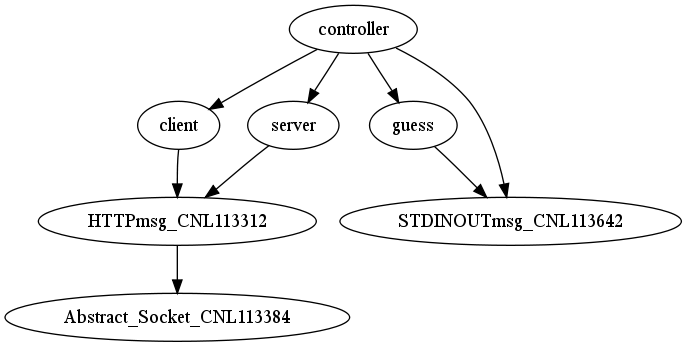
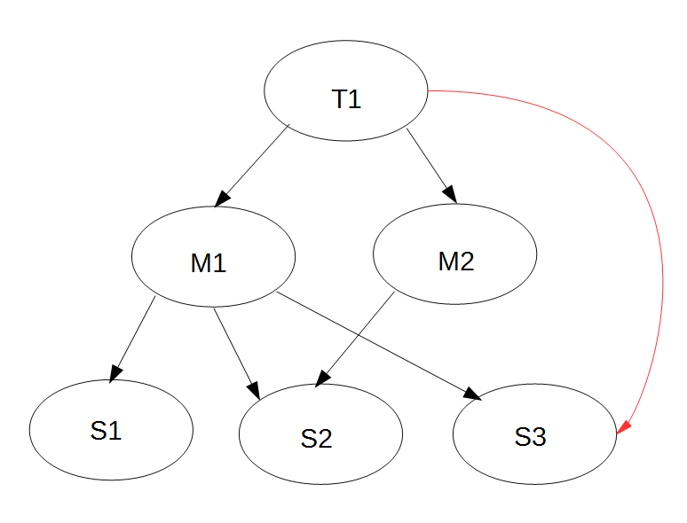

[[compiling-ttcn-3-and-asn-1-modules]]
= Compiling TTCN–3 and ASN.1 Modules
:toc:
:table-number: 11

You can translate your TTCN–3 and ASN.1 modules to {cpp} source code using the program compiler.

[[command-line-syntax]]
== Command Line Syntax

This section describes the options allowed in the command line of the compiler and the Makefile generator.

[[complier]]
=== Compiler

The program compiler resides in the directory `$TTCN3_DIR/bin`.

The command line syntax of the compiler is the following:

[source]
compiler [ -abBcdDeEfgijlLMnNOpqrRstuwxXyY ] [ -J file ] [ -K file ] [ -z file ] [ -N old|new ][ -o dir ] [ -V n ] [ -P toplevel pdu ] [ -Qn ] [ -U none|type|"number" ] …[ -T ] module.ttcn [ -A ] module.asn … [ - module.ttcn module.asn … ]

or

[source]
compiler -v

or

[source]
orcompiler –-ttcn2json [ -jf ] … [ -T ] module.ttcn [ -A ] module.asn … [ - schema.json ]

The compiler takes the name of files containing TTCN–3 and ASN.1 modules as arguments. The usual and recommended suffix is `.ttcn` for TTCN–3 and `.asn` for ASN.1 source files, but it is not stringentfootnote:[Other tool vendors may use .mp, .3mp or .asn1 suffixes as well.]. For TTCN–3 and ASN.1 modules, the names of the output files are the same as the name of the modules, except for the suffixes which are `.hh` and `.cc`.

NOTE: In the ASN.1 module names hyphens are replaced by underscore character.

WARNING: If you have a modular test suite, you have to translate all modules of the test suite in one step, i.e. you have to specify all TTCN–3 and ASN.1 files in the argument list.

The switches denoted by square brackets are optional. More than one option may be merged for abbreviation. For example, `-r` `-u` has exactly the same meaning as `-ru`.

The following command line options are available (listed in alphabetical order):

* `-a`
+
Enables the generation of Basic XML encoder/decoder functions for ASN.1 types. By default, these encoder/decoder functions are omitted because Basic XER has limited practical use.

* `-A file`
+
Forces the interpretation of file as an ASN.1 module.

* `-b`
+
Disables the generation of BER encoder/decoder routines for all ASN.1 types.

* `-B`
+
This is a legacy switch that allows the selected alternative in a `union` value to be unbound. This is only possible when initializing module parameters in the configuration file, and only if the selected alternative in question is a `record` or `set` (since initializing a record or set module parameter with empty braces {}, causes it to remain unbound).
+
A warning is displayed whenever a `union` module parameter is initialized with an unbound selected alternative, and when a `union` with an unbound selected alternative is copied.
+
This is only a temporary switch. It will be removed in future versions.

* `-c`
+
This switch is designed to help identifying compilation failures caused by mismatched versions of TTCN-3 and/or ASN.1 modules. If the compilation fails, the compiler will display the module checksums (and module version information, if available) computed during compilation.

* `-d`
+
This switch changes the way fields of ASN.1 SEQUENCE /SET types with DEFAULT values are handled. Without `-d`, the runtime handles the encoding and decoding of default values in a way that is consistent with DER and CER. With `-"d` in effect, the ETS is responsible for the handling of fields with default values. This makes it possible to send encodings which are valid BER but not valid DER/CER and to verify that the SUT has performed the encoding correctly (note that without `-d`, the cases marked * and ** below cannot be distinguished in TTCN code).
+
[cols=",,",options="header",]
|===
|Sending |Without –d |With –d
|Explicit value |Send value |Send value
|Default value |Do not send (omit) |Send default value
|omit |N/A |Do not send (omit)
|===
+
[cols=",,",options="header",]
|===
|Receiving |Without –d |With –d
|Receive explicit value |TTCN sees value |TTCN sees value
|Receive default value |TTCN sees default value* |TTCN sees default value
|Omitted |TTCN sees default value** |TTCN sees `omit'
|===
+
For more details, see <<13-references.adoc#_14, [14]>>
+
WARNING: Existing tests may behave differently when compiled with `-d`. Every behavior without `-d` can be duplicated when compiled with `-d`.

* `-D`
+
Instructs the compiler to not generate the user and time information into the header of the generated .cc and .hh files.

* `-e`
+
Instructs the compiler to use the legacy method of handling `encode` and `variant` attributes (see section <<4-ttcn3_language_extensions.adoc#legacy-codec-handling, Legacy codec handling>>).

* `-E`
+
Instructs the variant attribute parser to display warnings instead of errors for unrecognized/erroneous encoding variants.

* `-f`
+
Forces the compiler to overwrite (update) the output files even if they exist or the contents of them will be identical. Without this flag the output {cpp} header and source files will be overwritten only if their contents change compared to the previous version.

* `-g`
+
The compiler error/warning messages will contain the starting line number, and the starting column number if available. This option provides compatibility with the GNU compiler and many tools which are able to interpret its output (including Eclipse).
+
If both `–g` and `–i` are specified, `-g` takes precedence.

* `-i`
+
The compiler error/warning messages will contain only the line numbers, the column numbers will remain hidden. This option provides backward compatibility with the error message format of earlier versions.

* `-j`
+
Disables the generation of JSON encoder/decoder routines for all TTCN–3 types.

* `-K file`
+
Enable code coverage for TTCN-3 modules listed in `file`. `file` is an ASCII text file which contains one `file` name per line. The set of files in file needs to be a subset of the TTCN-3 modules listed on the command line.

* `-J file`
+
The compiler will read the input files form `file` which must contain the input files separated by spaces. Every file that is in the `file` is treated as if they were passed to the compiler directly. It is possible to use the -A and -T flags to tell the compiler that a file is an ASN.1 or a TTCN-3 file.
+
Example:
[source]
compiler Myttcn.ttcn Myasn.asn -J files.txt
+
where the contents of the `files.txt` is the following:
+
[source]
First.ttcn Second.asn -T Third.ttcn -A Fourth.asn
+
The command above is equivalent to this command:
+
[source]
compiler Myttcn.ttcn Myasn.asn First.ttcn Second.asn -T Third.ttcn -A Fourth.asn
+
Because of the `-T` flag the `Third.ttcn` will be treated as a TTCN-3 file, and because of the `-A` flag the `Fourth.asn` will be treated as an ASN.1 file.

* `-l`
+
Instructs the compiler to generate source file and line information (that is, #line directives) into the output code so that the error messages of the C\++ compiler refer back to the lines of the original TTCN–3 input module. This makes finding the reason of {cpp} error messages easier. This option has effect only in the equivalent {cpp} code of TTCN–3 functions, test cases and control parts and this feature is not provided in other TTCN–3 definitions such as types, constants or templates.WARNING! This is an experimental feature and the {cpp} compiler may report misleading error messages that refer to totally wrong (e.g. non-existent) TTCN–3 line numbers. In these cases please turn off this flag, repeat the compilation and analyze the generated code manually. Without this flag, the compiler also inserts the source code information for the better understanding of {cpp} error messages, but only as {cpp} comments. This option has no impact on the run-time performance of the generated code. The compiler performs full semantic analysis on its entire input; it normally does not generate erroneous {cpp} code. So this option became obsolete and will be removed in future versions.

* `-L`
+
Instructs the compiler to add source file and line number information into the generated code to be included in the log during execution. This option is only a prerequisite for logging the source code information. The run-time configuration file parameters `OptionsSourceInfoFormat` and `LogEntityName` in <<7-the_run-time_configuration_file.adoc#logging, `[LOGGING]`>> have also to be set appropriately. This feature can be useful for finding the cause of dynamic test case errors in fresh TTCN3 code. Using this option enlarges the size of the generated code a bit and reduces execution speed slightly; therefore it is not recommended when the TTCN3 test suite is used for load generation.

* `-M`
+
Enforces legacy behavior when matching the value `omit`. Allows the use of the value `omit` in template lists and complemented template lists, giving the user another way to declare templates that match omitted fields. If set, an omitted field will match a template list, if the value `omit` appears in the list, and it will match a complemented template list, if `omit` is not in the list (the `ifpresent` attribute can still be used for matching omitted fields). This also affects the `ispresent` operation and the `present` template restriction accordingly.

* `-n`
+
Activates the debugger and generates extra code needed for gathering debug information and for inserting breakpoints into the TTCN-3 program.

* `-N`
+
Ignore `UNTAGGED` encoding instruction applied to top level union types when encoding or decoding with XML. Legacy behavior.

* `-o dir`
+
The output files (including Test Port skeletons) will be placed into the directory specified by `dir`. Otherwise, the current working directory is the default.

* `-O`
+
Disable the generation of OER encoding and decoding functions.

* `-p`
+
Instructs the compiler only to parse the given TTCN–3 and ASN.1 modules. This will detect only the syntax errors in them because semantic checks are not performed. The presence of all imported modules is not necessary, thus, it is allowed (and recommended) to parse the modules one-by-one. All options that influence the code generation are silently ignored when used together with `-p`.
+
NOTE: This option includes complete syntax checks for TTCN–3 modules, but in ASN.1 there are some special constructs (e.g. the user-defined syntaxes) that cannot be parsed without semantic analysis. So there is no guarantee that an ASN.1 module is free of syntax errors if it was analyzed with compiler using the -p flag.

* `-P top level pdu …`
+
Defines a top-level pdu that must have the format `modulename.identifier`. If this switch is used, then only the defined top-level PDU(s) and the referenced assignments are checked and included in code generation, the other ASN.1 assignments are skipped. You can define not only types but any kind of ASN.1 assignments.

* `-q`
+
Quiet mode. Equivalent to the flag `-V 0`.

* `-Q n`
+
Quit after n errors (n must be a positive integer). The compiler will abort after encountering the specified number of errors.
+
NOTE: Errors count is cumulative across all modules. Using this option may cause some modules not to be analyzed at all (if previous modules "used up" all the allowed errors).

* `-r`
+
Disables the generation of RAW encoder/decoder routines for all TTCN–3 types.

* `-R`
+
Instructs the compiler to generate code for use with the function test runtime. The size of the generated code is significantly reduced, much of the functionality was migrated to the runtime. The generated {cpp} code has to be compiled using the TITAN_RUNTIME_2 symbol and has to be linked with the function test version of the runtime library. For example instead of the library file libttcn3.a the alternative libttcn3-rt2.a file must be used. The included c++ header files are the same.

* `-s`
+
Instructs the compiler to parse the given TTCN–3 and ASN.1 modules and perform semantic analysis on them, but not to generate {cpp} output. The list of given modules shall be complete so it is not allowed to import from a module that is not in the list. All options that influence the code generation are silently ignored when used together with `-s`.
+
NOTE: The TTCN–3 semantic analyzer of the compiler is still under development, thus, it is not capable of detecting every kind of semantic error.

* `-S`
+
Suppress context information. When the compiler reports an error or warning, it also reports context information (italic in the example below):
+
[source]
----
quitter3.ttcn: In TTCN-3 module `quitter3':
 quitter3.ttcn:11.3-23.3: In control part:
  quitter3.ttcn:12.11-30: In variable definition `v_r':
   quitter3.ttcn:12.20-28: error: Reference to non-existent field `z' in record value for type `@quitter3.R'
----
+
The `–S` option causes the compiler to output only the error (last line), without the preceding lines of context.

* `-t`
+
Generates Test Port skeleton header and source files for all port types in the input TTCN–3 modules. Existing Test Port files will not be overwritten unless the -f option is used.
+
NOTE: In versions 1.1 and earlier this was the default behavior of the compiler, but if the existing Test Port source files were stored in a different directory, the generated new skeletons could be confusing.

* `-T file`
+
Forces the interpretation of file as a TTCN–3 module.

* `-u`
+
Forces the compiler to insert duplicated underscore characters in all output file names. This option turns on the compatibility mode with versions 1.1 or earlier.

* `-U none|type|"number"`
+
Selects the code splitting mode for the generated code. The option "none" means that the old code generation method will be used. When using the option "type", TITAN will create separate source files for the implementation code of the following types (for each module): sequence, sequence of, set, set of, union. In this case a common header file and a source file holding everything else will also be created. The option can also be a positive number. In that case each file will be split into "`number`" smaller files. The compiler tries to create files which have equal size and empty files may be created. The "number" parameter must be chosen carefully to achieve compilation time decrease. The "`number`" parameter should not be larger than the number of the CPU cores. This splitting mode only provides decreased compilation time, if the compilation is parallelized. For example, this can be achieved using the *make* command’s *-j* flag which needs a number argument that controls how many cores the compilation may use. This number should be equal to the "`number`" parameter. An example can be found <<titan-s-strategy-of-the-code-splitting-mechanism-when-using-a-number-u-number, here>> about TITAN’s strategy when splitting the files using the "`number`" parameter.

* `-v`
+
Prints version and license key information and exits.

* `-V n`
+
Sets the verbosity bit-mask directly to `n` (where n is a decimal value between 0 and 65535). Meaning of the bits:
+
1: "NOT SUPPORTED" messages.
+
2: WARNING messages.
+
4: NOTIFY messages.
+
32 | 16 | 8: DEBUG messages. The debug-bits act like a 3-bit-length number, so the debug level has a value between 0 and 7. It is useful in case of abnormal program termination.
+
NOTE: When only parsing (option –p) DEBUG messages for ASN.1 values will appear in TTCN-3 form (e.x.: booleans will appear as `true` or `false`, instead of `TRUE` or `FALSE`).
+
Example: If you use the option `-V 6`, then all NOTIFY and WARNING messages will be printed, but the "NOT SUPPORTED" messages will be suppressed. To have the most detailed log, use the option `-V 63`. The default is `-V 7`.

* `-w`
+
Suppresses all warning messages. Equivalent to `-V 4`.

* `-x`
+
Disables the generation of TEXT encoder/decoder routines for all TTCN–3 types.

* `-X`
+
Disables the generation of XER encoder/decoder routines for all TTCN–3 types.

* `-y`
+
Disable subtype checking. Subtype information is parsed but ignored, there is no semantic check of the parsed subtype data.

* `-Y`
+
Enforces legacy behaviour for "out" function parameters ("out" parameters will not be set to <unbound> at the start of the function, but will keep their entry value).

* `-z file`
+
Enables code coverage and profiling in the TTCN-3 files listed in the `file` argument. The TTCN-3 files in the list must be separated by new lines and must also appear among the compiler’s arguments.

* `-`
+
The single dash character as command line argument has a special meaning: it controls the selective code generation. After the list of all TTCN–3 and ASN.1 modules a subset of these files can be given separated by a dash. This option instructs the compiler to parse all modules, perform the semantic analysis on the entire module hierarchy, but generate code only for those modules that are listed after the dash again. It is not allowed to specify a file name after the dash that was not present in the list before the dash. If the single dash is not present in the command line the compiler will generate code for all modules.

* `–ttcn2json`
+
Changes the purpose of the compiler to generate a JSON schema from the types defined in the specified TTCN-3 and ASN.1 modules. The parsing and semantic check of the input modules is still executed, but a JSON schema is generated instead of the {cpp} files. This must always be the first compiler option, and the previously listed options don’t apply (apart from options `–A` and `–T`), instead the following options are available:

* `-j`
+
Only types that have JSON coding enabled are included in the generated schema.

* `-f`
+
Only types that have JSON encoding or decoding functions (or both) are validated by the schema.

* `- file`
+
The single dash character as command line argument can be used to specify the name of the generated JSON schema file (it must be followed by exactly one argument, which is the file name). If it is not present, the schema file name is generated from the name of the first input file (the extension "`.ttcn`" or "`.asn`" is replaced by "`.json`", or "`.json`" is appended to the end of the file name if neither extension is present).
+
The meaning of options is also included in the manual page of the compiler. If your TTCN–3 installation is correct, the command `man compiler` will show you this manual page. If not, check the `MANPATH` environment variable.

=== Makefile Generator

You can generate the Makefile skeleton used for building the test suite using the program `ttcn3_makefilegen`, which resides in the directory `$TTCN3_DIR/bin`. See section 2.3.1 of the TITAN User Guide <<13-references.adoc#_13, [13]>> for details. The generated Makefile skeleton will use the parallel mode of the run-time environment by default. This can be overridden by using the option `-s` (see below).

The command line syntax of the makefile generator is the following:

[source]
----
usage: makefilegen [-abcdDEfFgGlLmMnNprRsStTVwWXZ] [-K file] [-P dir]
[-J file] [-U none|type|’number’] [-e ets_name] [-o dir|file] [-z file]
[-t project_descriptor.tpd [-b buildconfig]] [-I path] [-O file]
TTCN3_module[.ttcn] ... ASN1_module[.asn] ... XSD_MODULE.xsd ... Testport_name[.cc] ...
----

or

[source]
makefilegen -v

The ttcn3_makefilegen tool is able to process XSD modules along with TTCN3 or ASN1 modules. The `ttcn3_makefilegen` tool first translates the XSD modules into TTCN3 modules using the `xsd2ttcn` tool. The XSD modules will be parsed and the information which is needed for the Makefile generation will be extracted from them. It is a requirement that the XSD modules MUST be partially syntactically correct (the `schema` tag must be correct).

The command line switches for generating Makefile(s) from Titan Project Descriptor (TPD) file(s) are not listed here, these are described in the next chapter.

The switches denoted by square brackets are optional. More than one option may be merged for abbreviation. For example, `-g` `-p` has exactly the same meaning as `-gp`. The following command line options are available (listed in alphabetical order):

* `-a`
+
The flag refers to files using absolute path names in the generated Makefile. Makefile uses by default relative path names to access files located outside the current working directory of the compiler. Files from the current working directory are always referenced using only the file name without any directory. The flag generates a Makefile that is capable of using pre-compiled {cpp} and object files from central directories in order to save disk space and compilation time. WARNING! This feature works only if the generated files of the central directory is kept up-to-date and all directories use exactly the same environment (platform, TTCN–3 Executor and {cpp} compiler version, etc.).

* `-c`
+
Treat files not in the current directory as being in “central storage“. These files are assumed to be already built in their (separate) location.

* `-d`
+
Dumps the data used for Makefile generation.

* `-e <ETS name>`
+
Sets the name of the target binary program (i.e. the executable test suite) to <ETS name> in the generated Makefile. If this option is omitted, the name of the first TTCN–3 module will be used as default.

* `-E`
+
Instructs the variant attribute parser to display warnings instead of errors for unrecognized/erroneous encoding variants.

* `-f`
+
Forces the makefile generator to overwrite the output Makefile. Without this flag the existing one will not be overwritten.

* `-g`
+
Generates a Makefile that can be used with GNU `make` only. The resulting Makefile will be smaller and less redundant. It exploits the pattern substitution features of GNU `make`, which may cause syntax errors with other versions of make. By default, Makefiles generated for GNU `make` use incrementally updated dependency files instead of `makefilegen`.

* `-G`
+
Instructs the compiler to use the legacy encoding rules for semantic checking and for generating the code (see compiler option "-e" and its description in <<4-ttcn3_language_extensions.adoc#legacy-codec-handling, Legacy codec handling>>).

* `-I path`
+
Add path to the list of search paths which are used to search for referred TPD-s. `path` must be an absolute path and multiple `–I` switches can be used. The search paths are used when the `–t` switch is also present and a referred TPD project cannot be found at the location specified by `projectRelativeURI`. In this case the `makefilegen` tool tries to find the TPD file using the paths provided by `path`. If the `tpdName` attribute of a `ReferencedProject` element is present in the TPD, then the value of the `tpdName` attribute will be used as a TPD filename during the search. However if the `tpdName` attribute is missing, then the name attribute’s value with the `.tpd` suffix will be used. If there are multiple paths specified then the first `.tpd` file with the correct name found in the list of search paths is taken. See 6.1.3.4 for an example.

* `-J file`
+
The `makefilegen` tool will read the input files form `file` which must contain the input files separated by spaces. Every file that is in the `file` is treated as if they were passed to the `makefilegen` tool directly.

* `-K file`
+
Enable code coverage for TTCN-3 modules listed in `file`. `file` is an ASCII text file which contains one file name per line. The set of files in `file` needs to be a subset of the TTCN-3 modules listed on the command line. (This parameter is simply passed to the TTCN-3 compiler through `COMPILER_FLAGS` in the Makefile.)

* `-l`
+
Enable dynamic linking. All files of the project will be compiled with `–fPIC` and for each (static) object, a new shared object will be created. Then, these shared objects will be linked to the final executable instead of the (static) objects. It can be used to speed up the linking phase, in the price of somewhat lower performance and increased memory usage. It’s recommended to use this flag only in the development phase of the project. Please note, that both the project’s working directory (which holds the TITAN generated `.so` files) and the directory of TITAN libraries, most probably `${TTCN3_DIR}/lib`, should be appended to the `LD_LIBRARY_PATH` environment variable. Otherwise, the dynamic linker (or loader) won’t be able to locate the shared objects required by the executable. This option is not supported on Windows (platform string `WIN32`).

* `-L`
+
Create the makefile with library as the default target. The name of the generated library archive is <ETS name>_lib.so if the dynamic linking is enabled and <ETS name>.a otherwise.

* `-m`
+
Always use `makedepend` for dependencies. By default, for makefiles used by GNU `make`, the compiler (usually GCC) is used to generate dependency information in an incremental fashion. This switch reverts to the process for generic make tools, which uses the `makedepend` tool.

* `-M`
+
Enforces legacy behavior when matching the value `omit`. Allows the use of the value `omit` in template lists and complemented template lists, giving the user another way to declare templates that match omitted fields. If set, an omitted field will match a template list, if the value omit appears in the list, and it will match a complemented template list, if `omit` is not in the list (the `ifpresent` attribute can still be used for matching omitted fields). This also affects the `ispresent` operation and the `present` template restriction accordingly.

* `-n`
+
Activates the debugger and generates extra code needed for gathering debug information and for inserting breakpoints into the TTCN-3 program.

* `-N`
+
Ignore UNTAGGED encoding instruction applied to top level union types when encoding or decoding with XML. Legacy behavior.

* `-o <dir> | < file>`
+
Writes the Makefile to the given directory or file. If the given argument is an existing directory, the generated Makefile will be placed into that directory. Otherwise, it is assumed to be the name of the generated Makefile. By default the file name is `Makefile`, placed in the current working directory.

* `-O <file>`
+
Add file to the list of other files in the generated `Makefile` without analyzing the file contents and suffix. This option can be used to temporarily exclude some TTCN-3, ASN.1 modules ASN.1 or {cpp} files from the build process, but add them to the archive created by the command make archive.

* `-p`
+
Generates `Makefile` with TTCN–3 preprocessing. All the TTCN–3 source files with the suffix `.ttcnpp` will be preprocessed using the C preprocessor. For details see <<12-tips_&_troubleshooting.adoc#using-the-ttcn-3-preprocessing-functionality, Using the TTCN-3 Preprocessing Functionality>>.

* `-R`
+
Use function test runtime (TITAN_RUNTIME_2). Generates a Makefile that compiles and links the source code using the function test runtime.

* `-s`
+
Generates a `Makefile` skeleton to be used with the single mode of the run-time environment. The only difference between the Makefiles for single and parallel modes is the setting of variable `$``TTCN3_DIR` within them.

* `-S`
+
Suppresses all warning messages generated by the `makefilegen` tool.

* `-U none|type|"number"`
+
Generates a `Makefile` skeleton to be used with the chosen code splitting option. For details see the compiler options in 6.1.1.

* `-v`
+
Prints version and license key information and exits.

* `-w`
+
Suppresses all warning messages generated by TITAN compiler. This flag overrides the `suppressWarning` option in the `.tpd` file.

* `-Y`
+
Enforces legacy behaviour of the "out" function parameters (the "out" parameter will not be set to <unbound> at the start of the function, but will continue with the entry value).

* `-z file`
+
Enables code coverage and profiling in the TTCN-3 files listed in the `file` argument. The TTCN-3 files in the list must be separated by new lines and must also appear among the makefile generator’s arguments (this switch is ignored if the –t option is present).
+
If any of the source (TTCN-3, ASN.1, user-written {cpp}) files does not exist or cannot be accessed, `ttcn3_makefilegen` exits with an error.
+
Other options are discussed in the next chapters.

[[using-the-makefile-generator-to-generate-makefile-s-from-titan-project-descriptor-file-s]]
=== Using the Makefile Generator to Generate Makefile(s) from Titan Project Descriptor file(s)

It is possible to generate Makefile(s) from command line using the Titan Project Descriptor file(s) (TPD) generated by the Eclipse plugin. The Eclipse plugin generates a TPD file for each project. This file contains all the information needed to generate a Makefile for that project. See reference <<13-references.adoc#_17, [17]>> for details.

The makefile generator validates the TPD file with a schema file which is located at `${TTCN3_DIR}/etc/xsd/TPD.xsd`. If there are validation errors or the xsd file cannot be found some warnings will be displayed, this validation can be disabled with the "-V" option. Validation errors will not prevent the generation of makefiles and symlinks, however if there are such warnings it is strongly recommended to check the TPD files for errors because these errors may cause either other errors during the generation of the makefiles and symlinks or the creation of invalid makefiles and symlinks.

Projects can reference other projects. These dependencies between projects are contained by the generated TPD files. The TPD file is placed in the project root directory. Every project has also a working directory (usually named `bin') which is relative to the project root directory. The working directory will contain symlinks to all the source files contained by the project and the files generated when building the project. The TPD file of the project contains the names and relative paths of all the projects that the project depends on, therefore the relative location of these projects must not be changed or these won’t be found. For large projects the TPD files will describe a project hierarchy that is not necessarily a tree structure, for example:

The command line makefile generator can process the TPD file hierarchy generated by Eclipse and generate one or more Makefiles for these. There are three methods to generate Makefiles:

. Generate a single Makefile that will contain all files from all projects. The following command line options can be used for this: `-t` `–b` `–D` `–P` `–V` `-W`. When using this method the –c switch should not be used because in this case all the files are seen as part of one large project.
. Generate a Makefile hierarchy recursively (-r): for each TPD file generate a Makefile that builds only one project but has a dependency on other projects using the feature called "central storage". This dependency relation in the Makefile means that prior to building a project all the other projects that it depends on must be built. The dependency relation is contained by the top-level project’s Makefile. For that to work the central storage (`-c` switch in the makefile generator) feature is used to avoid compiling the source files also in top level projects that have already been compiled in the sub-projects where they belong to. Using this one Makefile all the projects can be built in the proper order. The following command line options can be used for this: `-t` `–b` `–D` `–P` `–F` `–T` `–X` `–V` `-W` `-Z` `-H`.
. Generate a Makefile hierarchy with improved linking method (`-Z`): for each TPD file generate a Makefile that builds only one project but has a dependency on other projects. It provides highly flexible way of linking static- and/or dynamic libraries together. The following command line options are obligatory `-`t `–Z` `–F` `–r` and these are optional: `–H` `–W`.

When generating multiple Makefiles the working directories of each referenced project are determined by the TPD file of the project. The TPD file can contain more than one build configuration, but there’s always one active configuration. The active configuration is determined by the TPD file itself by the element `<ActiveConfiguration>`. Different build configurations can have different working directories and other settings. This can be overruled by the referencing project’s required configuration setting (via `<requiredConfiguration>` embedded into `<configurationRequirement>`) or in case of a top-level TPD by using the –b command line option. Both the Makefile and the symlinks to source files are generated into the working directory.

If there is no "workingDirectory" specified in the TPD file, default directory will be created with name "bin". If more than one project define the same directory for working directory a collision can happen. This can be avoided by the command line switch –W (see below).

If you want to generate Makefiles from tpd files with incremental dependency (via .d files), you shall apply switch –g and you must not apply –m, in addition to these the top level project descriptor (tpd) file shall contain the element ordering incremental dependency as follows:

[source]
<incrementalDependencyRefresh>
true
</incrementalDependencyRefresh>

The following TPD related command line options are available:

* `-t filename.tpd [-b buildconfig]`
+
Use the supplied Titan Project Descriptor file to generate the Makefile. Information about directories, files and certain options is extracted from the TPD file and used to generate the Makefile(s). Additional files can be specified on the command line. Options from the command line override any option specified in the TPD file. If hierarchical makefilegen is ordered (-Frcg or –FrcgWp) then the immediately referred projects will be generated according to the element <requiredConfiguration> of the ordered top level active configuration. This is applied recursively.

* `-b buildconfig`
+
On top level use the specified build config instead of the default active configuration defined in the TPD.

* `-r`
+
Generate a Makefile hierarchy recursively from TPD hierarchy.

* `-P <dir>`
+
Print out a file list found in a given TPD and optionally in its referenced TPDs to `stdout`, relative to the given directory `<dir>`. It requires the `-t` option and a valid directory as its parameter. If used together with the `-a` option the list will contain absolute paths and the directory parameter will not be taken into account.

* `-V`
+
Disable validation of TPD file with the TPD.xsd schema file

* `-F`
+
Force the makefile generator to overwrite all output Makefiles. Without this flag the existing files in the Makefile hierarchy will not be overwritten.

* `-T`
+
Generate only the top-level Makefile of the hierarchy.

* `-X`
+
Generate an XML file that describes the project hierarchy as seen by the makefile generator.

* `-D`
+
Use current directory as working directory.
+
NOTE: This flag overrides the working directory coming from the TPD. In case of Generate Makefile hierarchy recursively (`-r`) flag, `–D` flag is valid only for top level project.

* `-W`
+
Prefix working directories with project name. This is needed if more than one TPD file is in the same directory, because this directory will then be the root of more than one project. The working directories (usually `bin') will conflict, by using –W the working directory name will be prefixed by the project name, for example `MyProject_bin'.
+
NOTE: In case of incorrect TPD files, the errors are displayed multiple times if the faulty TPD is included more than once in the project structure.

* `-Z`
+
Use the improved linking method. It generates a flexible hierarchy of static and dynamic libraries. Each project can be set to build a static or dynamic library or an executable too.

* `-H`
+
Use hierarchical project generation. Use it with –Z option. It provides makefiles for generating hierarchical binaries without flattening the project hierarchy. make can be called in any working directory, the lower level projects will be handled properly. All project can be regarded as top level project. Execution time of make is higher than in case of applying –Z without –H. (The difference is 50-100% for top level modification, 0-10% for lower level modification.)

Examples:

. Hierarchical makefile file generation from the directory of the top level project:
+
[source]
makefilegen –FrcgWp –t MyTopLevelProj.tpd

. Project hierarchy file generation:
+
[source]
makefilegen -rcX –t MyTopLevelProj.tpd

. Hierarchical makefile file generation from the directory of the top level project:
+
[source]
makefilegen –FWrZH –t MyTopLevelProj.tpd

. Generate list of files of all hierarchical projects: Go to the folder of your top level tpd file (or to the root directory of your projects) then use the following bash command:
+
[source]
makefilegen –V –P $(pwd) –t TopLevelProj.tpd

. Create archive file of all files in all hierarchical projects: Go to the root directory of your projects then use the following bash command:
+
[source]
makefilegen –V –P $(pwd) –t path/to/your/TopLevelProj.tpd | xargs tar cfz YourArchive.tgz

[[using-the-improved-linking-method-z-and-h-option]]
==== Using the improved linking method (-Z and –H option)

Node `<ReferencedProjects>` contains the projects whose `<defaultTarget>` is either a library (static or dynamic) or an executable. See the XML excerpt.

[source]
----
<ReferencedProjects>
    <ReferencedProject name="refProj1" projectLocationURI="../workspace/refProjDir1/refProj1.tpd"/>
    <ReferencedProject name="refProj2" projectLocationURI="../workspace/refProjDir2/refProj2.tpd"/>
</ReferencedProjects>
<MakefileSettings>
  <GNUMake>true</GNUMake>
  <incrementalDependencyRefresh>true</incrementalDependencyRefresh>
  <dynamicLinking>true</dynamicLinking>
  <defaultTarget>library</defaultTarget>
  <targetExecutable>bin/yourexecutable</targetExecutable>
  <linkerLibraries>
        <listItem>externallib1</listItem>
  </linkerLibraries>
  <linkerLibrarySearchPath>
        <listItem>${externallib}/lib</listItem>
  </linkerLibrarySearchPath>
</MakefileSettings>
----

"refProj1" and "refProj2" are subprojects of the actual one. Other info about these subprojects can only be obtained in their own TPD file. `<incrementalDependencyRefresh>` is set to true in the project structure. `<GNUMake>` shall be set to true. In this scope other tools are not supported. The node `<dynamicLinking>` true sets the dynamic linking method for the actual project. The node `<defaultTarget>` indicates whether the output is a library. If it is omitted the output is an executable.

`<linkerLibrarySearchPath>` and `<linkerLibraries>` provide information about third party (not in the project hierarchy) libraries.

The solution is based on the following corner stones:

Static and dynamic libraries can only be linked on `<defaultTarget>` executable build level. This means that a `<defaultTarget>` library cannot be generated by mixing other static and dynamic libraries.

A `<defaultTarget>` library with dynamic linking can be generated only from its own project’s object file(s) and subprojects dynamic libraries.

Static libraries are so called thin archives. This means that a static library is generated from own projects’s object file(s) and contains links to object files of other thin archive(s).

Third party libraries (e.g.: Linux core libs, openssl) can only be linked dynamically.

If the `<defaultTarget>` is library and `<dynamicLinking>` is true, the following aspects are to be considered:

* it can be linked together with another dynamic library
* it cannot be linked together with a static library
* it can be linked together with a third party dynamic library (e.g. openssl)
* it cannot have subproject(s) with `<defaultTarget>` is executable

Position dependent code cannot be linked with position independent code. This is a known limitation of the GNU linker. The third party libraries shall be added to LD_LIBRARY_PATH, or be copied to a directory contained by the LD_LIBRARY_PATH

If the <defaultTarget> is library and <dynamicLinking> is false, the following aspects are to be considered:

* it can be linked together with another static library
* it cannot be linked together with a dynamic library
* it cannot be linked together with a third party static libraryfootnote:[Not supported] (e.g. openssl)
* it can have subproject(s) with `<defaultTarget>` is executable

If the project’s `<defaultTarget`> is an executable, then the static and dynamic libraries can be linked together. If on a lower level project there is reason to link static and dynamic libraries together, then the node `<defaultTarget>` shall be set to executable, too. If –H option is NOT set then NO executable file will be generated for lower level projects. In this case the Makefile will generate only objects. The top-level project’s `<defaultTarget>` shall be set to executable. This is not checked if the -H option is set, since it causes every node to behave as if it were the top-level node.

*Important*: within a Project hierarchy if the real top-level project with `<defaultTarget>` executable is set to `<dynamicLinking>` true, then every sublevel project with `<defaultTarget>` executable shall be set to `<dynamicLinking>` true as well. A top-level project with `<defaultTarget>` executable and `<dynamicLinking>` false has no such constraint. If the above requirements are not fulfilled it results in a linker error. The Project hierarchy cannot contain circular references otherwise an error will be displayed.

The makefile uses the linker flag –rpath, so there is no need to set the environment variable LD_LIBRARY_PATH for the libraries in the project hierarchy.

If option –H is used: There is a new make command in the makefile that is generated by using the H flag. The call of *make clean-all* cleans the whole hierarchy, whereas the behavior of *make clean* changed, it only cleans the actual project.

If option –H is not used: In a cleaned Makefile structure the *make* shall be called in the working directory of the top-level project.

The optimal TPD for hierarchical structure (-H option)

The following picture shows a simple Project structure:

The arrows show the Project references. T1 has two `<ReferencedProjects>` nodes in the TPD: M1 and M2. M1 has three: S1, S2 and S3, and so on. Since the structure is hierarchical S2 will be iterated twice. M1-S2 dependencies make S2 be compiled and linked. The makefile of M2 only knows about the project S2. If the code for M2 is generated, the iteration of S2 is inevitable, even if the make of M1 had generated the code. This cannot be avoided and increases the run time of T1’s make. But relations like T1-S3 (red arrow) should be omitted since they are unnecessary and avoidable. T1 does not need to iterate S3 since M1 did it before and T1 can reach it via M1. Summarized: Try to minimize the loops in the project hierarchy graph. In big hierarchies (50-100 Projects) a well-organized structure can have an overhead of up to 50%-100%. A poorly organized one can run even 5 times longer than the flat hierarchy (without –H option).

Rewriting an existing hierarchy can lead to linker errors. For example: an error message beginning with “_undefined reference to…”_ means that one (or more) project(s) is/are missing from the calling one.

*Usage hints:*

. Hierarchical building can be applied by option –Z.

. Any project can be regarded as top level project if the makefiles are generated with the additional option –H.

. Remove unnecessary references. It can dramatically decrease the hierarchical build time. The Project hierarchy cannot contain circular references.

. To optimize the building time, work only on the highest-level project(s). They should be set for executable, all lower level and all unused branches should be set for library, especially for dynamically linked library. Take into account that it is not the best solution for the the final executable because the dynamically linking libraries can decrease the speed of running.

==== Placing custom rules and new targets into the generated Makefile

Custom rules and new targets can be inserted into the generated Makefile. This feature consists of two parts: calling a script whose output will be inserted into the generated Makefile and specifying new targets in the TPD file which will be inserted into the generated Makefile to the appropriate places. These two parts can be used together to accomplish the desired solution. The script shall print the project’s custom Makefile rules to its standard output.

These rules have targets such as:

[source]
customtarget : dependency1 dependency2
      <command1>
      <command2>

The second part of the feature is to add these custom targets to other specified places of the Makefile. Currently these places are: `PHONY`, `TTCN3_MODULES`, `TTCN3_PP_MODULES`, `TTCN3_INCLUDES`, `ASN1_MODULES`, `USER_SOURCES`, `USER_HEADERS`, `USER_OBJECTS`, `OTHER_FILES`. These places usually contain a list of files which will be used in the build process at different stages. By adding a new custom target to one or more of these places it becomes part of the dependency tree which will be processed by the make program and our new custom rule will be automatically invoked when necessary.

An example of how to print some message when make is done with the "all" target: +
First make a script that prints the rule itself (here a python script): +

[source]
print """
buildwithmessage: all
         @echo 'Here i built the project for you!!!'
"""

Next add the new rule to the appropriate place, in this case to the `PHONY` targets because it’s not a real file to be created. The script invocation and the addition of the new target are specified in the TPD file inside the MakefileSettings element (after the `buildLevel` element):

[source]
<ProjectSpecificRulesGenerator>
  <GeneratorCommand>python MyRulesAdder.py</GeneratorCommand>
  <Targets>
    <Target name=" buildwithmessage" placement="PHONY"/>
  </Targets>
</ProjectSpecificRulesGenerator>

To see the message after the build make shall be invoked with the new target: `make buildwithmessage`

Of course in most cases real files are generated and not phony targets. These can be ttcn files generated from some type descriptions written in other notations or languages. Or cc/hh files generated by lexer and parser generators (flex/bison). In these cases the generated file name shall be the custom target and it shall be added to places like `TTCN3_MODULES` or `USER_SOURCES`. This way when the make program encounters a rule that depends on the new target (for example our new custom ttcn-3 source file) it will use our added custom rule and the <command> part of that rule will create/update the ttcn-3 file before it will be used by the TITAN compiler to generate cc/hh files and then object file and finally the executable.

This method of making changes on the generated Makefile is preferred over the legacy makefile modifier scripts method. The makefile modifier scripts are error prone because these contain many assumptions about the exact content of the Makefile which may not be true for future versions of the makefile generator.

==== External directory usage in tpd

External directory usage is described with OSS_DIR example.

To enable proper OSS usage, some parameters must be set in the tpd file. Lower extractions from tpd file can be seen, details which are useful for setting up OSS usage.
[source]
----
<Files>
    <FileResource projectRelativePath="OSS_H323_MESSAGES.c" relativeURI="src/OSS_H323_MESSAGES.c"/>
    <FileResource projectRelativePath="OSS_H323_MESSAGES.h" relativeURI="src/OSS_H323_MESSAGES.h"/>
    <FileResource projectRelativePath="OSS_H323_MESSAGES_linux.c" relativeURI="src/OSS_H323_MESSAGES_linux.c"/>
 </Files>

<ActiveConfiguration>Default</ActiveConfiguration>
  <Configurations>
    <Configuration name="Default">
      <ProjectProperties>
        <MakefileSettings>
          <preprocessorIncludes>
            <listItem>[OSS_DIR]/include</listItem>
          </preprocessorIncludes>
          <linkerLibrarySearchPath>
            <listItem>[OSS_DIR]/lib</listItem>
          </linkerLibrarySearchPath>
        </MakefileSettings>
----

NOTE: OSS_DIR system variable needs to be set properly in your path.

NOTE: Using makefile updater scripts are obsolete.

==== Referred project usage with –I switch

If there are different TPD projects which often change location, then the –I path switch(es) can be used.

Example TPD structure:
`MainTpd.tpd` is the top level TPD and has several project dependencies. `MainTpd` depends on the following projects: `DepTpd1.tpd`, `DepTpd2.tpd` and `DepTpd3.tpd`.
[source]
----
MainTpd.tpd is located at /home/titan/main_project/MainTpd.tpd
DepTpd1.tpd is located at /home/titan/dep_project1/DepTpd1.tpd
DepTpd2.tpd is located at /home/titan/dep_project2/DepTpd2.tpd
DepTpd3.tpd is located at /home/titan/random_folder/ dep_project3/DepTpd3.tpd
----

The relevant part of the MainTpd.tpd is the following:
[source]
----
<TITAN_Project_File_Information version="1.0">
  <ProjectName>MainTpd</ProjectName>
  <ReferencedProjects>
    <ReferencedProject name="DepTpd1" projectLocationURI="../dep1/DepTpd1.tpd" />
    <ReferencedProject name="DepTpd2X" tpdName="DepTpd2.tpd" projectLocationURI="../incorrect/path/DepTpd2.tpd" />
    <ReferencedProject name="DepTpd3" projectLocationURI="../incorrect/path/DepTpd3.tpd" />
  </ReferencedProjects>
----

When executing the `makefilegen` command
[source]
----
makefilegen –t MainTpd.Tpd –I /home/titan/foo
–I /home/titan/dep_project2
–I /home/titan/random_folder/dep_project3
----

Then the tool’s logic when resolving the paths is the following:

The first referred project’s name is `DepTpd1` and the tool will be able to find the `DepTpd1.tpd` in the relative path provided in the `projectLocationURI` attribute. The next referred project’s name is DepTpd2X and the tool will NOT be able to find the `DepTpd2.tpd` in the relative path provided in the `projectLocationURI` attribute. In this case the tool looks for the `tpdName` attribute which is now present. The tool takes the value of the `tpdName` attribute and in input order tries to find the `DepTpd2.tpd` at the paths in the –I switches. First try is at `/home/titan/foo` which is not correct. Second try is at `/home/titan/dep_project2 which` is correct because the DepTpd2.tpd file is at `/home/titan/dep_project2/DepTpd2.tpd` and the search stops at this point. No further trying will be done.

The last referred project’s name is DepTpd3 and the tool will NOT be able to find the `DepTpd3.tpd` in the relative path provided in the projectLocationURI attribute. In this case the tool looks for the `tpdName` attribute which is NOT present now. In this case the tool takes the value of the name attribute and concatenates it with the `.tpd` suffix and this name will be used during the search. The first and second tries are not successful but the third try is correct because the `DepTpd3.tpd` file is at `/home/titan/random_folder/dep_project3/DepTpd3.tpd`.

NOTE: We strongly advise you to not use this feature. Most projects don’t need this feature.

==== Usage of code splitting when generating makefile from TPD

The `makefilegen` tool allows the usage of code splitting mechanisms when generating makefile(s) from a TPD file using the `codeSplitting` tag in the TPD with a few restrictions:

* In the project hierarchy every project shall have the same `codeSplitting` tag set. The `codeSplitting` tag can have the following values: none, type, a positive number, or an empty string which defaults to none. If the `codeSplitting` tag is missing, then the code splitting strategy will set to none.
* Code splitting is not supported when the H or Z flags are used. (see page 228)

[[titan-s-strategy-of-the-code-splitting-mechanism-when-using-a-number-u-number]]
==== TITAN’s strategy of the code splitting mechanism when using a "number" (-U "number")

Let "number" be equal to 4 for this example. We want to split the files into four pieces.

Firstly, TITAN finds the TTCN3 module whose C\++ generated code will be the largest. In this example, it will be 10000 characters (let’s call it MAX). So the largest generated {cpp} module contains 10000 characters.

Secondly TITAN calculates the splitting threshold by dividing MAX with "number", so it will be 10000 / 4 = 2500 in this case. TITAN will only split the generated c++ files which are larger than 2500 characters.

*BUT* TITAN will always generate "number" pieces for each file. The reason behind this is the following: The makefilegen tool needs to know what c++ files will be generated.

Let’s complete the example.

We have three TTCN3 modules:

* `My_Types.ttcn` (whose generated c++ code contains 10000 characters (MAX))
* `My_Functions.ttcn` (whose generated c++ code contains 6000 characters)
* `My_Constants.ttcn` (whose generated c++ code contains 1000 characters)

If we execute the command: compiler `-U 4 My_Types.ttcn My_Functions.ttcn My_Constants.ttcn` the following c++ source files will be generated:

* `My_Types_part_1.cc` (contains approximately 2500 characters)
* `My_Types_part_2.cc` (contains approximately 2500 characters)
* `My_Types_part_3.cc` (contains approximately 2500 characters)
* `My_Types_part_4.cc` (contains approximately 2500 characters)
* `My_Functions_part_1.cc` (contains approximately 2500 characters)
* `My_Functions_part_2.cc` (contains approximately 2500 characters)
* `My_Functions_part_3.cc` (contains approximately 1000 characters)
* `My_Functions_part_4.cc` (contains approximately 0 effective characters)
* `My_Constants_part_1.cc` (contains approximately 1000 characters)
* `My_Constants_part_2.cc` (contains approximately 0 effective characters)
* `My_Constants_part_3.cc` (contains approximately 0 effective characters)
* `My_Constants_part_4.cc` (contains approximately 0 effective characters)

[[the-compilation-process-for-ttcn-3-and-asn-1-modules]]
== The Compilation Process for TTCN–3 and ASN.1 Modules

Before analyzing the input modules the compiler applies some heuristics for each source file to determine whether it contains a TTCN–3 or ASN.1 module. These so-called pre-parsing algorithms consider only the first few words of the files so it can happen that the compiler is unable to recognize its input and stops immediately with an error message. This is the case, for example, if the beginning of the module is either erroneous or contains strange and misleading comments. In this case using the command-line options `-T` and `-A` you can bypass the pre-parsers and force to interpret the corresponding file as a TTCN–3 or ASN.1 module, respectively.

During its run, the compiler reports its activities on its standard error stream like the following. The level of detail for these messages can be controlled with the flag `-V`.
[source]
----
Notify: Parsing TTCN-3 module ’MyModule.ttcn’...
Notify: Parsing ASN.1 module ’MyAsnModule.asn’...
Notify: Checking modules...
Notify: Generating code...
Notify: File ‘MyModule.hh’ updated.
Notify: File ‘MyModule.cc’ updated.
Notify: File ‘MyAsnModule.hh’ updated.
Notify: File ‘MyAsnModule.cc’ updated.
Notify: 4 files updated.
----

First, the compiler reads the TTCN–3 and ASN.1 input files and performs syntax check according to the BNF of TTCN–3 <<13-references.adoc#_1, [1]>> (including the additions of <<13-references.adoc#_3, [3]>>) or ASN.1 <<13-references.adoc#_4, [4]>>, <<13-references.adoc#_7, [7]>>, <<13-references.adoc#_8, [8]>>, <<13-references.adoc#_9, [9]>>. The syntax errors are reported with the appropriate line number. Whenever it is possible, the compiler tries to recover from syntax errors and continue the analysis in order to detect further errors.

NOTE: Error recovery is not always successful and it might result in additional undesired error messages when the parser gets out of synchronization. Therefore it is recommended to study the first lines on the compiler’s error listings because the error messages at the end are not always relevant.

After the syntax check the compiler performs semantic analysis on TTCN–3 /ASN.1 module(s) and verifies whether the various definitions and language elements are used in the appropriate way according to the static semantics of TTCN–3 and ASN.1 languages. In addition to error messages the compiler reports a warning when the corresponding definition is correct, but it might have unwanted effects.

If both syntax and semantic checks were successful, the compiler generates a {cpp} header and source file that contains the translated module. If the name of the input module is `MyModule` (i.e. it begins with module `MyModule`), the name of the generated header and source file will be `MyModule.hh` and `MyModule.cc`, respectively. Note that the name of the output file does NOT depend on the name of input file. In ASN.1 module names the hyphens are converted to underscore characters (e.g. the {cpp} code for `My-Asn-Module` will be placed into `My_Asn_Module.hh` and `My_Asn_Module.cc`).

By default, the compiler generates the {cpp} code for all input modules. This can be unnecessarily time-consuming when doing incremental builds for large projects. The build process can be significantly speed up if the compiler option - (single dash) is used. In this case the {cpp} code will be generated only for those modules that have changed since last build of the ASN.1 modules. With selective code generation it can be exploited that the make utility can easily tell which source files were changed since the last compilation.

This sophisticated command line syntax is necessary because in general case it is impossible to perform the semantic analysis on a subset of the modules because those may import from modules outside the list. Moreover, to avoid undesirable side-effects of the code optimization techniques implemented in the compiler (e.g. type and value folding) the {cpp} code is generated not only for the modified modules, but for all modules that import definitions (either directly or indirectly) from the modified ones.

When the compiler translates an ASN.1 module, the different ASN.1 types are mapped to TTCN–3 types as described in the table below.

.Mapping of ASN.1 types to TTCN–3 types
[cols=",",options="header",]
|===
|ASN.1 |TTCN–3
|Simple types |
|NULL |– *
|BOOLEAN |boolean
|INTEGER |integer
|ENUMERATED |enumerated
|REAL |float
|BIT STRING |bitstring
|OCTET STRING |octetstring
|OBJECT IDENTIFIER |objid
|RELATIVE-OID |objid
|string † |charstring
|string ‡ |universal charstring
|string § |universal charstring
|*Compound types* |
|CHOICE |union
|SEQUENCE |record
|SET |set
|SEQUENCE OF |record of
|SET OF |set of
|===

\* there is no corresponding TTCN–3 type +
† IA5String, NumericString, PrintableString, VisibleString (ISO646String) +
‡ GeneralString, GraphicString, TeletexString (T61String), VideotexString +
§ BMPString, UniversalString, UTF8String +

[[particularities-of-asn-1-modules]]
== Particularities of ASN.1 Modules

This section describes the checks the complier performs on ASN.1 modules.

=== Type Assignments

In this first phase only basic checks are made: the compiler checks for unresolved and for circular references. The simplest example for circular reference is the following:
[source]
----
T1 ::= T2
T2 ::= T1
----

But there are more complex cases, especially related to non-optional fields of compound types. For example, X.680 clause 47.8.1 contains an illegal type definition:
[source]
----
A ::= SET {
  a A,
  b CHOICE {
    c C,
    d D,
    ...
  }
}
----
It is easy to see that one can not assign a (finite) value to a variable of type A: there is an endless recursion because of the field a, which is the same type as the parent-type. If this field were optional, then the recursion could be broken at any level.

=== Value Assignments

The compiler checks the unresolved/circular references also in case of value assignments.

The value is checked according to the type:

* `NULL`: Only the `NULL` value is accepted.

* `BOOLEAN: TRUE` or `FALSE` value is accepted.

* `BIT STRING:` You can use `hstring`, `bstring` or (even empty) set of named bits. In the latter case, the compiler checks if there are bits with the given names.

* `OCTET STRING:` Only `hstring` or `bstring` form is accepted.

* `character strings`: The `cstring`, `tuple`, `quadruple` form and the combination of these forms (`CharacterStringList`) are accepted.

* `INTEGER`: Number form and named values (defined in the type with which the value is associated) can be used.

* `REAL`: You can use the special values (`0`, `PLUS`-`INFINITY`, `MINUS`-`INFINITY`) as well as the associated `SEQUENCE` type (defined in X.680 clause 20.5) and the real number form (defined in X.680 clause 11.9).

* `OBJECT IDENTIFIER`: All possible notations (i.e.` NameForm`, `NumberForm`, `NameAndNumberForm` and `DefinedValue`) can be used for the components. The predefined names given in Annex A-C of X.660 are recognized for the first two or three components. According to X.680 clause 31 it is checked whether the Number and `DefinedValue` is (a reference to) a non-negative integer or `OBJECT IDENTIFIER/RELATIVE-OID` value, respectively. If `NameAndNumberForm` is used, only the number is considered for the code generation. A warning message is displayed if in the first two components the given name and number is not in accordance with each other.

* `ENUMERATED`: Only the identifiers defined in the corresponding type can be used.

* `CHOICE`: The compiler checks if there is an alternative with the given name, then checks if the value corresponds to the type of the selected alternative.

* `SEQUENCE` OF and `SET OF`: You can use the "empty" value (`{}`) or list of values separated by commas, enclosed in braces. Each value in the list is checked.

* `SEQUENCE`: The values of the fields shall be in the same order as in the corresponding type definition. Components marked with OPTIONAL or DEFAULT can be skipped. The components are checked recursively.

* `SET`: There shall be one and exactly one value definition for each not `OPTIONAL` or * `DEFAULT` component defined in the corresponding type. They can appear in any order.

Named values (in case of `INTEGER` and `ENUMERATED`) have higher priority than defined values.

=== Type Definitions

The compiler makes an exhaustive check of the types defined in the module. For the different types, the following checks are executed:

tagged types: As you can use value references in the tags, the compiler checks if the value is a non-negative integer.

* `BIT STRING`: When using named bits, the bit number must be a non-negative integer. Each bit can have only one identifier (duplications are not permitted).

* `INTEGER`: Value references in named numbers (if any) must reference integer values.

* `ENUMERATED`: Value references (if any) must reference integer values. The compiler assigns a numberfootnote:[According to X.680 clause 19.3] for each item which does not have an associated number. Duplicated values (neither in identifiers, nor in associated number values) are not permitted. Items defined after an ellipsis must have associated numbers that increase monotonously. For details, see X.680 clause 19.

* `CHOICE`: Every alternative must have different tag. Tags in the extension must increase monotonously (X.680 28.4). (The canonical order of tags is defined in X.680 8.4.)

* `SEQUENCE`: The tags in optional groupsfootnote:[Optional group: One or more consecutive occurrences of OPTIONAL or DEFAULT fields, including the first not OPTIONAL or DEFAULT field.] must have different tags (X.680 24.5).All tags in the extension must be distinct from tags used in the first optional group after the second ellipsis (X.680 24.6).

* `SET`: The types used in a SET type shall all have different tags (X.680 26.3).Tags in the extension must increase monotonously.
+
Extension is not always permissible in `CHOICE`, `SEQUENCE` and `SET` (see X.680 47.7). Here is an example:
+
[source]
----
Illegal-type ::= SET {
  a INTEGER,
  b CHOICE {
    c C,
    d D,
    ...,
    ...
  },
  ...,
  e E
}
----
+
The problem is that the (BER) decoder of a version 1 system cannot attribute an unknown element (received from a version 2 system) unambiguously to a specific insertion point.

[[using-component-relation-constraints-from-ttcn-3]]
== Using Component Relation Constraints from TTCN–3

To handle constructs defined in X.681, X.682 and X.683 is not easy from TTCN–3. There is an ETSI technical reportfootnote:[TR 101 295] which describes how to transform these constructs to equivalent X.680 constructs. The clause 4.4 of this document is about transforming information objects.

"The transformation rules presented in this clause cannot reproduce the full semantics of the information objects they replace. The transformation rules cannot preserve component relation constraints. These constraints provide the ability to constrain a type or value with reference to a different field within an information object set."

This is not such a great problem, because BER does not "see" the constraints. But there is a situation when the transformations are unusable: when references to information object type fields are constrained by component relation constraints. Let’s take the example from X.682, clause 10 (with a little bit of modifications, to enlighten the problem):

[source]
----
ERROR-CLASS ::= CLASS
{
  &category PrintableString(SIZE(1)),
  &code INTEGER,
  &Type

}
WITH SYNTAX {&category &code &Type}

ErrorType1 ::= [1] INTEGER

ErrorType2 ::= [1] REAL

ErrorType3 ::= [1] CHARACTER STRING

ErrorType4 ::= [1] GeneralString

ErrorSet ERROR-CLASS ::=

{
  {"A" 1 ErrorType1} |
  {"A" 2 ErrorType2} |
  {"B" 1 ErrorType3} |
  {"B" 2 ErrorType4}

}

ErrorReturn ::= SEQUENCE

{
  errorCategory ERROR-CLASS.&category ({ErrorSet}) OPTIONAL,
  errors SEQUENCE OF SEQUENCE
  {
    errorCode ERROR-CLASS.&code({ErrorSet}{@errorCategory}),
    errorInfo ERROR-CLASS.&Type({ErrorSet}{@errorCategory,@.errorCode})
  } OPTIONAL
}
After applying the transformation rules described in ETSI technical report, the equivalent definitions look like this:

ErrorReturn ::= SEQUENCE
  {
    errorCategory PrintableString(SIZE(1)) OPTIONAL,
    errors SEQUENCE OF SEQUENCE
    {
      errorCode INTEGER,
      errorInfo CHOICE
      {
        errorType1 ErrorType1,
        errorType2 ErrorType2,
        errorType3 ErrorType3,
        errorType4 ErrorType4
      }
    } OPTIONAL
  }
----

It is plainly seen that this is not a legal type definition: the alternatives of a `CHOICE` must have distinct tags. The original definition is unambiguous, because the `errorCode` component "tells" the decoder how to interpret the `errorInfo` component.
