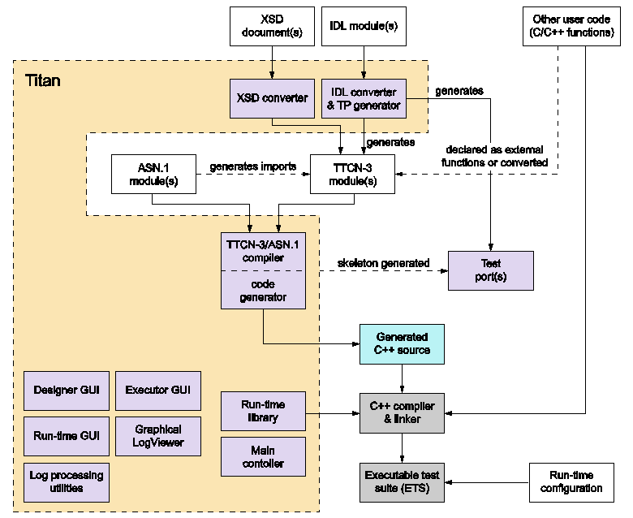

= Overview of TITAN

This Test Executor is an implementation of the TTCN–3 Core Language standard with support of ASN.1. There are limitations to supported TTCN–3 language constructs in the Test Executor. In addition, there are some non-standard extensions to the TTCN–3 language implemented by TITAN. Information on these limitations and extensions and also some clarifications of how the standard has been implemented in TITAN, refer to the
link:https://github.com/eclipse/titan.core/tree/master/usrguide/referenceguide[TITAN Programmer's Technical Reference for TITAN TTCN-3 Test Executor].

== Components

The main components are the following:

* The *Compiler*, which translates TTCN–3 and ASN.1 modulesfootnote:[Compilation of ASN.1 modules is necessary only if the test suite imports type definitions from ASN.1 modules.] into C++ program code.

* The *Base Library*, written in C++ language, which contains important supplementary functions for the generated code.

* The *Test Port(s)*, which facilitate the communication between the TTCN–3 Test System and the System Under Test (SUT).

The generated C\++ modules as well as the Test Ports should be compiled to binary object code and linked together with the Base Library using a traditional C++ compiler.

All parts, except the protocol specific Test Ports, are included in the binary package of the Test Executor. The Test Executor is a protocol and platform independent tool that can be easily adapted to any kind of protocols by writing the appropriate Test Port. The generated C\++ code is exactly the same on all platforms, provided that the pre-compiled Base Library that matches the operating system and C++ compiler is used. The Test Port may use operating system calls or external library functions for sending or receiving messages towards System Under Test so it may become platform dependent.

Writing a Test Port is not an easy task for the first time, but the Compiler alleviates it by generating an empty skeleton for each function to be written. This skeleton is also useful for checking the correctness of an existing test suite because the Executable Test Program can be linked with this empty Test Port. In this case the resulting program actually does nothing, but the successful linking means that no modules or functions are missing from the test suite.

This document describes building and running test suites using the command line.

== General Workflow

* Generating and editing a `Makefile`

* Building the executable

* Executing test suites

* Analyzing the execution log files.

== Building Test Suites

Creating a TTCN–3 test suite involves building an executable from the initial modules (TTCN–3, ASN.1 or both) and test port files. The process basically comprises creating and modifying a `Makefile` and using the `make` command to build the executable.

For detailed information, refer to <<3-creating_executable_test_suites_from_the_command-l.adoc, Creating Executable Test Suites from the Command-line>>.

== Executing Test Suites

After the test suite has been created a suitable configuration file has been built, the executable is ready to run.

The test executor can operate in single or parallel mode. The single mode—also called non-parallel mode—is thought for TTCN–3 test suites built around a single test component. It is forbidden to create parallel test components in single mode: the test suite is not supposed to contain any `create` operation otherwise the test execution will fail. The parallel mode, on the other hand, offers full-featured test execution including distributed and parallel execution. The goal of introducing the single operating mode was to eliminate redundancies and thereby increase the speed of execution. It is possible to execute non-parallel test suites in parallel mode, but doing so results in unnecessary overhead. The C++ code generated by the compiler is suitable for both execution modes, there are no command line switches to select mode. The only difference is that different Base Libraries must be linked in single and parallel modes.

For detailed information on executing test suites in single or parallel mode, refer to <<4-executing_test_suites.adoc, Executing Test Suites>>.
