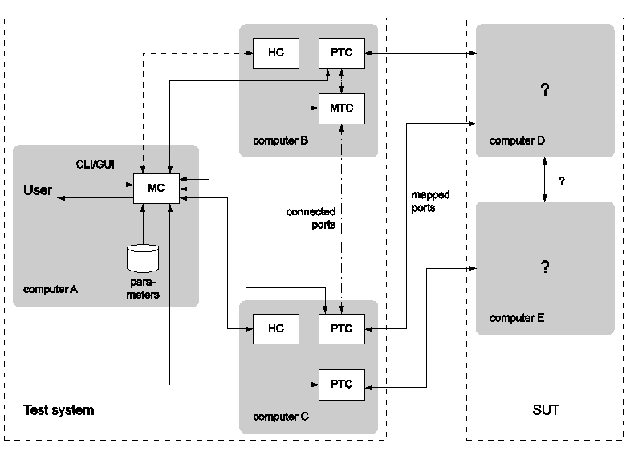

= Executing Test Suites

This chapter describes the modalities of test suite execution.
[[The-Run-time-Configuration-File]]
== The Run-time Configuration File

The behavior of the executable test program is described in the run-time configuration file.

Each section of the configuration file begins with a section name within square brackets. Different sections use different syntax, thus the section name determines the possible syntax of the members.

Refer to the link:https://github.com/eclipse/titan.core/tree/master/usrguide/referenceguide[TITAN Programmer's Technical Reference for TITAN TTCN-3 Test Executor] for details of the runtime configuration file including descriptions of each of its sections and examples.
[[Running-Non-parallel-Test-Suites]]
== Running Non-parallel Test Suites

If an application is built for single operation mode the resulting executable contains the ETS itself.

It takes a single optional parameter (the name and path of its configuration file) and two optional command line switches related to debugging:

* `*-h*`
+
Automatically halts execution at the beginning, when the first test case’s or control part’s execution begins, and displays the debugger’s user interface (debugging must be activated).

* `*-b file*`
Automatically executes the specified batch file (containing debugger commands) at the beginning of the program’s execution.
+
The ETS also accepts the command line options `-l` and `-v` with the following semantics:

* `*-l*`
+
Lists the names of all control parts and individually executable test cases of the ETS to standard output. The list is suitable as the `[EXECUTE]` section of a configuration file. Refer to link:https://github.com/eclipse/titan.core/tree/master/usrguide/referenceguide[TITAN Programmer's Technical Reference for TITAN TTCN-3 Test Executor] for more details.

* `*-v*`
+
Prints the tool version, license information and the name, compilation time, checksum and (if available) the version info of the participating modules.

If the ETS contains exactly one module with a control part, then a configuration file need not be specified. In this case, running the ETS with no parameters will execute the control part. If more than one control part is present (or none at all) then the configuration file is mandatory.

The ETS blocks until all test cases are executed as specified in the section `[EXECUTE]` of its configuration file. Console log messages are displayed on the terminal, while the execution log is written into `LogFile`.

ETSes built for single operation mode are unable to act as HCs thus these cannot be executed in the parallel environment. The test suite should be re-linked with the parallel version of Base Library instead if this was the intention (see <<3-creating_executable_test_suites_from_the_command-l.adoc#Editing-the-Generated-Makefile, Editing the Generated Makefile>> for information on editing the `Makefile`).

== Configuration

The TITAN runtime environment uses configuration files to control execution of the test suites. An ordinary text editor can be used to create and modify configuration files. The configuration file (with the default extension `.cfg`) is a simple text file consisting of the following sections:

* Module parameters
+
This section contains the value of each parameter that is defined in the TTCN-3 or ASN.1 modules of the project.

* Logging
+
This section indicates logging conditions: the name of the log file, category and component based logging filters or the like.

* Testport parameters
+
This section specifies the parameters that are passed to the test ports during the execution of the test suite.

* Define
+
This section contains definitions of macros that can be used in other configuration file sections (except Include) for entry of recurring values.

* Include
+
Paths to additional configuration files may be listed in this section. The host controller takes into account the values listed in those configuration files, too.

* External commands
+
This section contains shell scripts that are called whenever a control part or a test case is started or terminated.

* Execute
+
This section indicates which parts of the test suite will be executed. This section is mandatory in single execution mode. Only test cases without parameters, or test cases where every parameter has a default value, can be started from this section. +
Testcases with parameters can be started from the control part.

The following sections are used only in parallel mode:

* Groups
+
This section specifies a groups of hosts used in the Components section.

* Components
+
This section contains the rules that restrict the location of PTCs.

* Main controller
+
This section controls the behavior of the main controller when executing a test suite.

TITAN processes the configuration file sequentially. If a section occurs several times in the configuration file, all sections will be processed without an error message.

Refer to the corresponding chapter of the link:https://github.com/eclipse/titan.core/tree/master/usrguide/referenceguide[TITAN Programmer's Technical Reference for TITAN TTCN-3 Test Executor] for details of the runtime configuration file including descriptions of each of its sections and examples.

== Running Parallel Test Suites

The test execution in parallel mode comprises the following steps:

1. Start Main Controller. (See <<the-ttcn-3-main-controller, The TTCN-3 Main Controller>>)

2. Start Host Controllers, that is, the executable test suite, on all participating computers. (See <<the-ttcn-3-host-controller,The TTCN–3 Host Controller>>)

3. Create MTC.

4. Start the control part or a selection of test cases of a TTCN–3 module on MTC.

5. View the verdicts of executed test cases on MC.

6. Terminate MTC after the end of execution.

7. Terminate HCs and MC.

8. Analyze the logs of each test component.

[[parallel-ttcn-3-execution-architecture]]
=== Parallel TTCN–3 Execution Architecture

The components of test environment form two main groups: the Test System and the SUT. As TTCN–3 is used for black box testing, that is, the test suite does not assume anything about the internal structure of the SUT, this section describes the internal structure of Test System only. The Test System consists of one or more test components, whose behaviors are entirely described in a TTCN–3 test suite. The test system has other components for special purposes, listed below.

Each component of the test system runs independently, they are different processes of the operating system. Every component executes one single thread of control. The components can be located on different machines and, of course, there can be more than one component running on the same computer. In the latter case scheduling among them is provided by the scheduler of the operating system. Regardless of their roles, all test components execute binary code generated from the same C++ source code. Their code consists of three parts: the code generated from the test suite by the TTCN–3 compiler, the Test Ports and the TTCN–3 Base Library.

The components communicate with each other using TCP connections with proprietary protocols and platform independently encoded abstract messages. The components form three groups according to their functionality.

* *Main Controller (MC)*
+
The Main Controller is a stand-alone application delivered with the distribution (`$TTCN3_DIR/bin/mctr`). It is started manually by the user and runs in one instance during the entire test execution. MC provides the user with CLI to the test executor system. It arranges the creation and termination of Main Test Component on user request and the execution of module control part. It shows the user the verdicts of executed test cases. MC has many hidden tasks that can only be performed in a centralized way, for example component reference assignment, verdict collection, and so on. MC maintains a control connection with all other components.

* *Host Controller (HC)*
+
Host Controllers are instances (processes) of the executable test program, that is, the translated test suite linked with Test Ports and Base Library. Exactly one HC should be run on each computer that participates in (distributed) TTCN–3 test execution. HCs are started by the user manually on all participating computers. They maintain a connection to MC and if MC wants a new test component to be created on that host, HC duplicates itself and its child process will act as the new test component.

* *Test Component (TC)*
+
Can be either the Main Test Component or a Parallel Test Component.

* *Main Test Component (MTC)*
+
The Main Test Component is an instance of the executable test program that is firstly created on a user request. There is exactly one MTC in the Test System. It can execute the control part of a TTCN–3 module if requested by the user. If a test case is executed MTC changes its component type to the type specified in the `runs on` clause of the testcase. Note that MTC is the only one test component that can change its component type. MTC maintains a control connection to MC.

* *Parallel Test Component (PTC)*
+
Parallel Test Components are also instances of the same executable test program. TCs execute TTCN–3 functions written by the user in the same way as in non-parallel mode. They are automatically created by HC when requested from the MTC or other PTCs. PTCs also maintain a connection to MC.

[[the-ttcn-3-main-controller]]
=== The TTCN–3 Main Controller

The binary executable of Main Controller is `$TTCN3_DIR/bin/mctr_cli`. It takes the optional configuration file (<<The-Run-time-Configuration-File, The Run-time Configuration File>>) as its single argument. The variables in the section `[MAIN CONTROLLER]` of the configuration file determine important MC properties, for detailed information refer to the link:https://github.com/eclipse/titan.core/tree/master/usrguide/referenceguide[TITAN Programmer's Technical Reference for TITAN TTCN-3 Test Executor].

The Main Controller has two operation modes: interactive and batch mode. In interactive mode the user can control and monitor the test execution from a CLI. Batch mode is useful for automated and unattended execution of parallel and distributed tests. The actual operation mode depends on the configuration file and is determined at program startup. If the option `NumHCs` is set in the `[MAIN CONTROLLER]` section, the MC starts in batch mode, otherwise interactive mode is selected.

==== Interactive Mode

After starting MC in interactive mode a welcome screen and command prompt appear.
[source]
----
********************************************
* TTCN-3 Test Executor - Main Controller 2 *
* Version: 1.3.pl0 *
********************************************
MC2>
----
The MC command line interface uses the `editline` library which is compatible with the GNU `readline` editing functionality. In addition to its powerful line editing functions it provides command completion, line history and help function.

Command completion is activated using the tabulator key. It presents the list of applicable commands according to the typed prefix. The typing of the command is concluded when a single alternative remains (for example pressing key `c` followed by the tabulator puts the `cmtc` command onto the command line).

The last couple of entered command lines are stored in the history buffer. The implementation is based on GNU `history` library. The buffer elements can be browsed with the cursor keys or an incremental search backward can be performed following a `<CTRL>-r` keystroke and a lot more. History buffer contents are automatically saved and loaded when the `mctr cli` is started or stopped into a file named `.ttcn3 history` located in the home directory. Note that console log messages as well as notifications of HC connection establishments are printed on the MC’s screen and may disrupt its contents.

The following commands are accepted by the MC:

* `help [command]` displays the list of available commands or a short use information about the command submitted as parameter.
* `cmtc [hostname]` creates the MTC on the given host. If the optional hostname is omitted, the MTC will be created on the host whose HC has connected first. Once an MTC is created, this command cannot be used before terminating the MTC via emtc.
* `smtc [module name[.control|.testcase name|.\*]]` is used to start test execution. smtc has a single optional parameter defining the name of the module or test case to start. The MTC must exist and it must be in idle state when using this command. smtc is a non-blocking command, there is a prompt and it is possible to issue other commands while the test case execution is proceeding. When the module name argument is used (with or without the .control suffix) then smtc starts executing the control part of that module. footnote:[TTCN–3 assumes to have a single control part within an ETS. Our Test Executor, however, removed this limitation and permits multiple module control parts within the ETS. The smtc command can be used to select between the available control parts, which one needs to be executed. Moreover, it can be specified to execute a number of different control parts, too.] When it is intended to select a single test case for execution, smtc is told using the format `module name.testcase name`. Only those test cases can be executed individually that have no formal parameters, or every formal parameter has a default value. It is also possible to execute all individually startable test cases defined inside a module by specifying the module `name.*` as smtc parameter. In case the optional parameter is omitted, the contents of the `[EXECUTE]` section of the configuration file are run after each other if that section was specified.
* `emtc` terminates MTC. When using this command MTC must be in idle state, that is, it cannot be killed.
* `info` prints statistics and status information of the currently connected HCs and test components.
* `reconf` instructs MC to re-read and re-distribute its configuration file to the connected HCs. This feature is useful when restarting a test campaign involving multiple HCs, because the tester configuration can be altered eliminating the drawback of restarting and reconnecting all elements of the test set-up manually.
* `stop` terminates test execution. The verdict of the actual test case will not be considered in the statistics of the test suite.
* `pause [on|off]` sets whether to interrupt test execution after each test case. For setting the state of the pause function on or off values can be used. If the state of the pause function is on and the actual test case is finished, the execution is stopped until the continue command is issued. If pause is in off state and the actual test case is finished, the execution is continued with the next test case. Using pause without these options it simply prints the state of the pause function.
* `continue` resumes interrupted test execution.
* `log [on|off]` enables/disables console logging. It can be set using on or off. If log is in off state no log messages will be printed to MC’s console. Using log without these options it simply prints the state of logging.
* `!` prefix is used to execute command line contents in a subshell.
* `exit` terminates all HCs and MC itself. This command can be used when test execution is not in progress. If MTC still exists it will be terminated gracefully, like with emtc.
* `quit` is an alias to exit to provide backward compatibility.

==== Batch Mode

If MC is started in batch mode no command prompt is given. In order to monitor the actual state of execution the console messages are printed to the standard output.

In batch mode, the MC performs the following actions sequentially:

* MC waits until the specified number of HCs, that is given in configuration option `NumHCs`, are connected.
* MTC is created on the host of firstly connected HC. Equivalent command: `cmtc`
* The items of the `[EXECUTE]` section are launched sequentially. Equivalent command: `smtc`
* After all items are finished the MTC is terminated. Equivalent command: `emtc`
* The session and all HCs are shut down and MC exits. Equivalent command: `exit`

If the `[EXECUTE]` section of the configuration file is empty or it is missing the MC stops in batch mode immediately with an error message.

If a fatal error is encountered during initialization, for example due to an error in the configuration file, no MTC is created and the session stops immediately. If an error happens within a test case the normal error recovery routines are activated and the execution continues with the next test case.

==== Performance Hints
NOTE: if performance tests are executed with a large number of test components, MC can be a performance bottleneck in the test executor system. If performance problems occur around the test executor, the first thing that should be checked is the operating environment of MC. Running MC on a dedicated computer with a powerful CPU can help in the most cases.

MC maintains a control TCP connection with all other components (HCs, MTC and PTCs). Each of these connections use an open file descriptor, which is a limited resource in the operating system. If many test components should be run simultaneously, this limitation can be a bottleneck. However, the number of open files per process can be increased up to a so called hard limit (for example 1024 on Solaris and unlimitedfootnote:[The total number of open files can also be a bottleneck on Linux kernel, which can be changed through the /proc file system.] on Linux). The limit can be increased by a built-in shell commandfootnote:[Called limit on tcsh and ulimit on bash. For more details please consult the manual page of the used shell.], of course, before starting MC. On the other hand, the license key also limits the number of simultaneously active PTCs, which is considered in MC when processing TTCN–3 create operations.

==== Displaying ASCII Art on Startup

The command line main controller displays an ASCII art file that is located in the `$TTCN3_DIR/etc/asciiart` directory. There can be any number of ASCII art text files in that directory, a random file will be chosen from those. The file name can contain special filtering instructions, if such instructions are detected in the file name then the file is grouped into the special files group, all other files are in the normal group. If there is at least one file in the special group that was not filtered out by the condition(s) given in the file name then the file to be displayed will be chosen randomly from the list of special files. If there are no such special files or all of these were filtered out by their filtering instructions then a normal file will be displayed. The filtering instructions in the file name are separated by dots, one instruction consists of a name and a value which are separated by a dash. If the value is of numerical type then it can be a single number or an interval, an interval consists of 2 numbers separated by an underscore. Currently the following filtering condition name and value pairs can be used:

[cols=",,",options="header",]
|====================================================
|Filter condition name |Value, type of value |Example
|user |User name, string |user-edmdeli
|weekday |Number/interval, 1-7 |weekday-6_7
|day |Number/interval, 1-31 |day-1
|month |Number/interval, 1-12 |month-12
|year |Number/interval |year-2013
|hour |Number/interval, 0-23 |hour-18_23
|minute |Number/interval, 0-59 |minute-30
|second |Number/interval, 0-61 |second-0_30
|====================================================

Example file names: +
`xmasparty.month-12.day-24_26.txt` +
`weekendwork.weekday-6_7.txt`

Displaying ASCII art can be prevented by deleting all files from the directory. Adding some filtering conditions can be done by renaming the file according to the above described naming rules.

[[the-ttcn-3-host-controller]]
=== The TTCN–3 Host Controller

The ETS built for parallel operation mode will act as Host Controller. After starting up it establishes a TCP connection to MC (which must be started prior to HC) and waits for requests. The executable takes two mandatory arguments, the host name or IP address and the TCP port number that MC listens on footnote:[If MC and HC runs on the same computer and you run Host Controllers on other computers as well, never use localhost or 127.0.0.1 as host name argument to HC. The IP address that the HC’s connection comes from may be transferred by MC to TCs running on other hosts. Giving out the local IP address may result in incorrect behavior.].

The optional command line switch `-s` can be used to specify the source address of control connections towards MC. Either an IP address or a DNS name can be given after the switch. Only such IP address is accepted that is assigned to one of the local network interfaces. This option can be useful on multi-homed hosts, that is, computers with more than one network interfaces, in order to route all traffic of control connections to a separate network path to avoid disturbances in the communication with SUT. If the option is omitted the local IP address is chosen automatically based on MC’s IP address and the kernel routing table. The test components, child processes of HC, will use the same local IP address for their connections as the HC independent if it was set manually or automatically.

The command line synopsis for HC is the following:
[source,subs="specialchars,quotes"]
*<executable_program_name> [-s <local_address>] <MC_host> <MC_port>*

NOTE: In earlier versions, the HCs accepted an optional third command line argument specifying the configuration file name. From version 1.3 (MC version 2), the MC distributes configuration data to all participating HCs. Consequently, the configuration file became a command line argument of the MC.

The ETS linked in parallel mode accepts the command line switches `-l` and `-v` like in single mode (see <<Running-Non-parallel-Test-Suites, Running Non-parallel Test Suites>>). If the test execution is performed in a distributed environment and file synchronization between computers is not automatic (for example you use FTP instead of a shared NFS directory), it is useful to check the module checksums and versions with flag `-v` on each computer before starting the HCs.

From version 1.3.pl0 the MC checks the version of each connected HC automatically in order to ensure the consistency of the distributed test system. If the ETSes used in the same test campaign contain different TTCN–3 modules or different versions of the same TTCN–3 modules the HC connections, except the firstly connected one, will be refused by the MC.

=== Logging in Parallel Mode

During test execution all test components create separate log files. Each log file has the same format as presented in non-parallel mode. Logging into the same, NFS shared directory makes the log analysis easier.

The name of log files can be explicitly set in the configuration file using a metacharacter substitution mechanism. If the file names are not set, the backward compatible default naming convention is used. It is important to ensure that every component has its own unique log file name. Refer to the link:https://github.com/eclipse/titan.core/tree/master/usrguide/referenceguide[TITAN Programmer's Technical Reference for TITAN TTCN-3 Test Executor] for more details.

In parallel mode the log messages sent to the console are transmitted through the network and printed on the user interface of MC in normal cases. Thus it is an unwise thing to log all messages to the console without filtering when the test suite is used for load generation. If the control connection from a TC or HC to MC is broken due to any error, the console log messages are written to the standard error of the ETS locally.

=== Automation of Testing in Parallel Mode

The starting procedure of TTCN–3 tests in parallel mode can be a tiring task if it has to be repeated the tests several times. We have developed a small script that can do this work for you. It is based on the `expect` command, which is an extension of the TCL scripting language. The script is called `ttcn3_start` and is located in `$TTCN3_DIR/bin`. In order to use it a working `expect` interpreter must be in the `$PATH`.

The script itself is very simple, it takes one mandatory and one or more optional arguments. The first mandatory argument is the name of the ETS that is launched. The second argument can be the name of the configuration file that will be passed to MC during execution. If this argument is omitted or the second argument does not resemble to a file name, the script will look for file `<ETS name>.cfg` in its current working directory. If such file exists, it will be used as configuration file. Otherwise MC will be launched without configuration file.

Additionally, the IP address of the interface used for communication between the MC and the ETS can be specified. The syntax is `–ip` followed by the IP address in dotted decimal format, for example 192.168.0.1. If not specified explicitly, the address defaults to the IP address of the local machine.

The rest of arguments are the list of test cases to be executed in format `<modulename>.<testcase name>`. They are passed to MC command `smtc` sequentially, see <<the-ttcn-3-main-controller, The TTCN–3 Main Controller>> for details. If these arguments are missing and a configuration file is present the items of section `[EXECUTE]` will be executed, that is, `smtc` will be called without arguments. If neither configuration file nor test cases are specified the control part of the main TTCN–3 module, that is, the module that has the same name as the ETS, is executed.

The script works the following way: first it launches the MC. If the environment variable `TTCN3_DIR` is set the MC is started from directory `$TTCN3_DIR/bin` (to find the right one multiple versions are present), otherwise the command `mctr cli` is invoked using your search path. If the configuration file is present it is passed to MC as a command line argument. After that `ttcn3_start` launches the ETS, that is, the HC, locally with the appropriate arguments. That is, the script guesses the host name and extracts the TCP port number from the output of MC automatically. Then the script issues the `cmtc` and the appropriate `smtc` commands in the MC command prompt and waits until test execution is finished. Finally it terminates the programs by issuing `emtc` and `quit`. It also takes care of MC’s answers and issues the commands in the right state.

The messages coming from the standard output or standard error of MC, HC and the test components are continuously displayed in the output of `ttcn3_start`.

Note that this script does not support distributed test execution when more than one HC has to be started.

Examples for the invocation of `ttcn3_start`:
[source]
----
$ ttcn3_start Main_Control
$ ttcn3_start Main_Control multi.cfg
$ ttcn3_start Main_Control –ip 10.10.10.10 multi.cfg
$ ttcn3_start Main_Control SNMP_Testcases.tc_110 SNMP_Testcases.tc_113  SNMP_Testcases.tc_114
$ ttcn3_start Main_Control multi.cfg SNMP_Testcases.tc_110 _Testcases.tc_113 SNMP_Testcases.tc_114
----
The script returns different exit codes which can be used by user written software which invokes it. In case of success the return code is 0, in error cases the return codes are the following:

[cols=",",options="header",]
|====================================================================
|*Return code* |*Error description*
|1 |The expect tool was not found.
|2 |Parameters are missing.
|3 |Cannot find the given executable.
|4 |The script cannot be used when MC is run in batch mode.
|5 |The MC has terminated unexpectedly.
|6 |The given executable is not a TTCN-3 executable in parallel mode.
|7 |The executable could not connect to the MC.
|8 |The MTC cannot be created.
|9 |The MTC cannot be created on an unknown host.
|10 |The MTC terminated unexpectedly.
|====================================================================

== Strange Behavior of the Executable

If modular test suites are executed, sometimes the executable test program can do strange things, for example, the execution terminates without any reason or the send functions of the Test Port is not called, and so on. This is because out-of-date C\++ header files are used for translating the C++ modules, that is, there is a wrong `Makefile`.

This may happen when the Test Port files are renamed, so the compiler regenerates them. Thus the C++ source files generated by the compiler see an empty Test Port header file, but the fully functional Test Port object file is linked to the executable. In this case, the linking will be successful, but during the execution strange things can happen. The reason behind this phenomenon is that the modules consider the raw binary structure of the same C++ class different, for example they fetch the virtual function pointer from a wrong place.

Avoid these situations and re-compile all C++ files before reporting such bugs, and the use of `makedepend` utility is strongly recommended.
